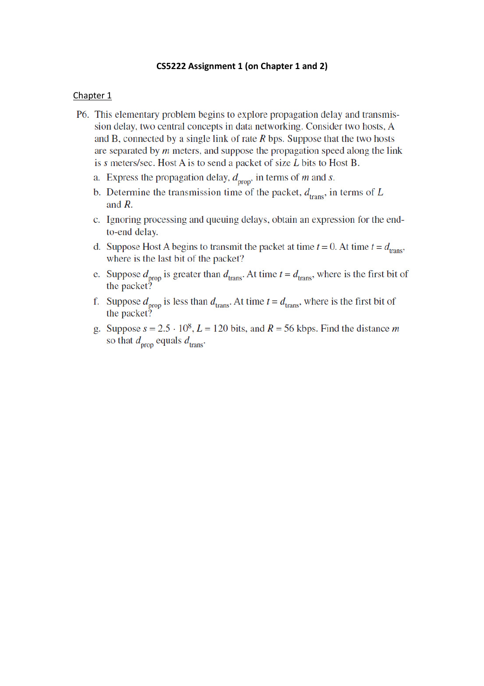
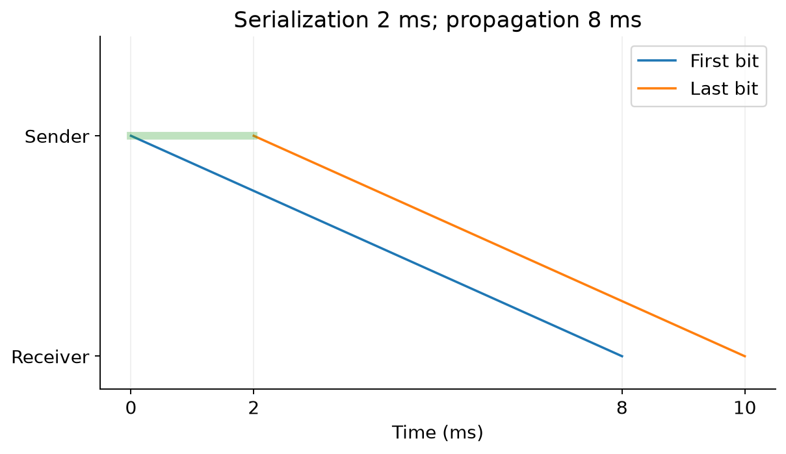
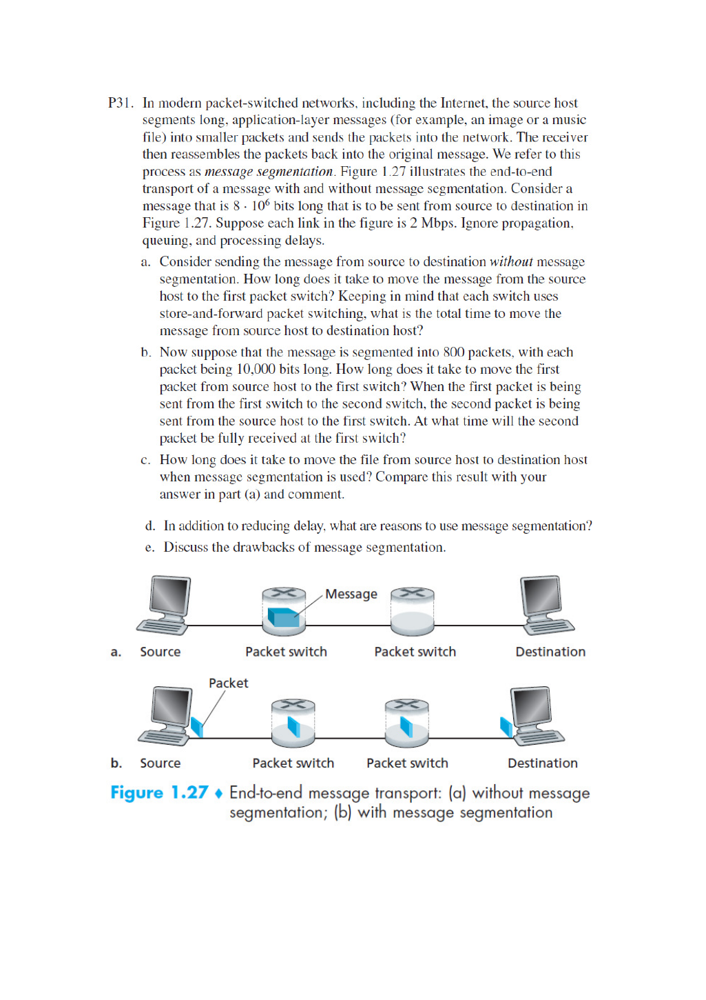
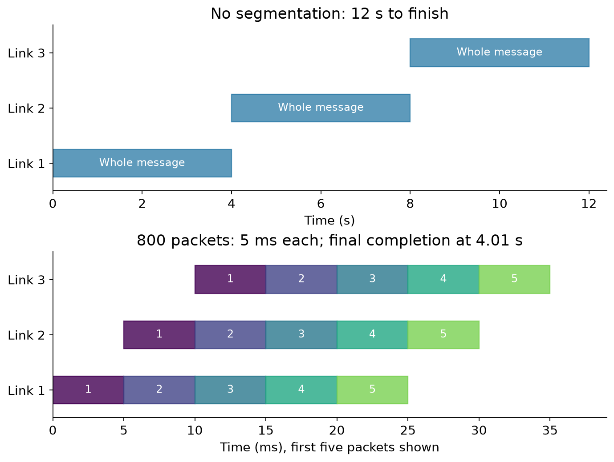
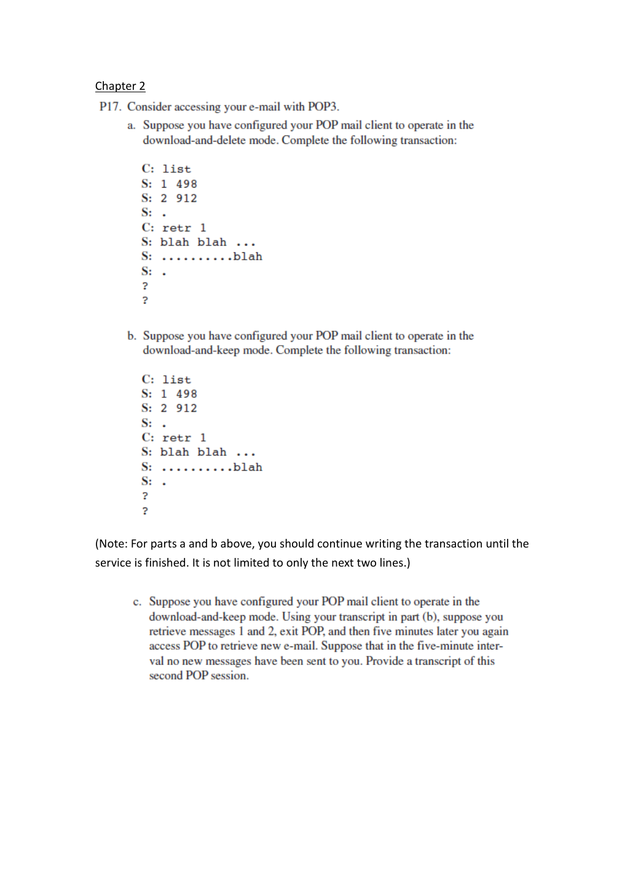
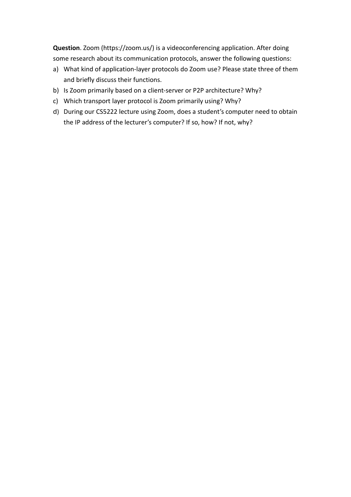

# Assignment 1 · Chapters 1 and 2｜计算、事务与技术证据

[课程目录](README.md) · [Chapter1](Chapter01.md) · [Chapter2](Chapter02.md) · 原任务（4页）

本讲义提供P6、P31、P17的纸笔推导及Zoom资料核查方法。当前未提供教师解答，以下推导与资料分析供学习参考。截止日期、提交格式和手续回查原任务及[课程信息栏](https://crazyshout.github.io/micro-course/notices.html)。

基础可选：[单位与时间轴](../../learning/foundation-notes/NetworkBasics.md)、[报文字段](../../learning/foundation-notes/NetworkBasics.md#messages)。当前四题都属于核心任务；P6难点是首/末位事件，P31是跨链路重叠，P17是跨会话状态，Zoom是产品情境与来源边界。理解难度均为中等。

[TOC]

<a id="p6"></a>
## P6. Transmission and propagation｜最后一位刚出发，第一位可能已经到达



**条件 / Conditions:** 主机A、B相距m米，链路发送速率R bit/s，传播速度s m/s，包长L bit。忽略处理、排队，从A开始发送首位计时t=0。 / Hosts A and B are m metres apart; link rate is R bit/s, propagation speed s m/s, and packet length L bits. Ignore processing and queueing and start timing with the first bit.

| 原小问 | 中文推导与答案 | English answer |
|---|---|---|
| a 传播 | $d_{prop}=m/s$，距离除速度 | Propagation delay is m/s. |
| b 发送 | $d_{trans}=L/R$，数据量除速率 | Serialization time is L/R. |
| c 整包端到端 | $L/R+m/s$，末位先被送入链路再传播 | Complete-packet delay is L/R+m/s. |
| d t=dtrans，末位位置 | 在连续比特模型的边界时刻刚离开A进入链路，还没有走完整条路 | The last bit is just entering the link at A. |
| e dprop>dtrans，首位位置 | 仍在线路内，离A的距离为$sL/R\lt m$ | The first bit remains on the link, sL/R metres from A. |
| f dprop&lt;dtrans，首位位置 | 已到达B；不能继续说还在链路上 | The first bit has already reached B. |
| g 两时延相等 | $m/s=L/R$，故$m=sL/R$ | Set m=sL/R. |

g给s=2.5×10⁸m/s、L=120bit、R=56kbps=56000bit/s：

$$
d_{trans}=120/56000\approx0.002142857\text{ s},\quad m\approx535714.29\text{ m}=535.714\text{ km}.\tag{A1.1}
$$



图是帮助读事件的教学示意（参数2ms/8ms），不是g题的参数图。g的数值单独复算，避免把示意图标注抄进答案。

**变式 / Transfer:** L=240bit、R不变，要保持两时延相等，m如何变化？ / Double packet length while keeping R and s fixed; how must m change?

<details markdown="1"><summary>答案 / Answer</summary>

m翻倍，约1071.429km。 / m doubles to about 1071.429 km. 改变的是等时延所需距离，不是信号速度。

</details>

<a id="p31"></a>
## P31. Message segmentation｜像流水线一样，让不同链路同时工作



**条件 / Conditions:** 原图源→交换机1→交换机2→目的，共3条2Mbps链路；消息8×10⁶bit，存储转发，忽略传播、排队和处理。分段时为800个10000bit包，题目未另加包头。 / An 8-million-bit message crosses three 2-Mbps store-and-forward links. Ignore propagation, queueing and processing. Segmentation creates 800 packets of 10000 bits each, with no additional header overhead specified.

a 不分段，第一链路 $8\times10^6/(2\times10^6)=4$s；交换机必须等整条消息，3跳总**12s**。 / Without segmentation: 4 s to the first switch and 12 s to the destination.

b 单包发送10000/(2×10⁶)=**0.005s=5ms**。第一包到第一交换机t=5ms；它继续去第二交换机时，源发送第二包，第二包在t=**10ms**完全到第一交换机。 / First packet reaches switch1 at 5 ms; packet2 is completely received there at 10 ms.

c 第一包到目的需3×5ms，后续799包每隔5ms到，总 $(800+3-1)\times0.005=\mathbf{4.01s}$。 / Completion time is 4.01 s. 链路本身没变快，减少的是“大消息在每一跳全等完”的串行等待。



图中展开前几个包，末尾标出全部800包的完成时刻。

d 其他好处：较短包给其他流量穿插机会；出现丢失时可只重传受影响部分（若上层协议支持）；较小存储/处理单位便于逐包转发。 / Segmentation enables interleaving, selective retransmission when supported, and manageable forwarding units.

e 代价：每包头部和处理开销，更多调度；可能乱序，需要识别与重组；重传/超时机制增加复杂度。 / Costs include headers, per-packet processing, possible reordering, reassembly and recovery complexity. 不把“越小永远越快”当结论；本题忽略头部是有意简化。

**变式 / Transfer:** 同消息改成400包，每包20000bit，其他不变，总多久？ / Use 400 packets of 20000 bits with the same path.

<details markdown="1"><summary>答案 / Answer</summary>

每包10ms，总(400+3−1)×0.01=4.02s。 / 4.02 s. 仍近似受源端总上传4s约束，只是流水线填充稍慢。

</details>

<a id="pop3"></a>
## P17. POP3｜完成整次事务，不只补两行



**完整条件 / Conditions:** 已认证进入transaction，LIST给两封邮件，编号1/2、大小498/912byte；原片段已经RETR1。a为download-and-delete，b为download-and-keep，均继续到服务完成。c在b后退出，5分钟后再次登录，无新邮件，给出第二会话。 / Two messages of 498 and 912 octets are present. Finish the full download-and-delete and download-and-keep transactions, then show a second keep-mode session five minutes later with no new mail.

原题略去若干`+OK`确认；下面补齐规范响应。`[message ...]`只是未知邮件内容的说明占位，**不是实际发送的协议文本**。每行以CRLF结束，单独`.`结束多行结果。命令字大小写不影响本题含义。

### a. Download and delete / 下载并删除

```text
C: LIST
S: +OK 2 messages (1410 octets)
S: 1 498
S: 2 912
S: .
C: RETR 1
S: +OK 498 octets
S: [message 1 content]
S: .
C: DELE 1
S: +OK message 1 marked for deletion
C: RETR 2
S: +OK 912 octets
S: [message 2 content]
S: .
C: DELE 2
S: +OK message 2 marked for deletion
C: QUIT
S: +OK signing off
```

DELE先标记，成功QUIT使会话进入UPDATE并提交删除；本例假设操作成功且没有异常退出。只写DELE1然后QUIT会漏掉第二封的下载与删除。 / Retrieve both messages, mark both for deletion, then successfully quit to commit the update.

### b. Download and keep / 下载并保留

```text
C: LIST
S: +OK 2 messages (1410 octets)
S: 1 498
S: 2 912
S: .
C: RETR 1
S: +OK 498 octets
S: [message 1 content]
S: .
C: RETR 2
S: +OK 912 octets
S: [message 2 content]
S: .
C: QUIT
S: +OK signing off
```

没有DELE，两封保留。RETR不会自动删除；“keep”不是另加一个名叫KEEP的POP3命令。 / No messages are marked for deletion, so both remain on the server.

### c. Second keep-mode session / 五分钟后的第二次会话

假设没有额外客户端UIDL去重、服务器未改变这两封邮件的编号，重新认证后仍LIST两封；可以再次RETR1/2。原问题仅说“无新邮件”，没有说服务器将已读邮件隐藏。

```text
S: +OK POP3 server ready
C: USER <username>
S: +OK
C: PASS <password>
S: +OK authenticated
C: LIST
S: +OK 2 messages (1410 octets)
S: 1 498
S: 2 912
S: .
C: RETR 1
S: +OK 498 octets
S: [message 1 content]
S: .
C: RETR 2
S: +OK 912 octets
S: [message 2 content]
S: .
C: QUIT
S: +OK signing off
```

尖括号内为用户名和密码的占位。实际客户端可保存UIDL跳过已下载邮件；若采用这种扩展约定，可能LIST/UIDL核对后不RETR旧邮件。应明确这是客户端保存状态的行为，而不是“POP3服务器因为上次读过就删掉”。[RFC1939](https://www.rfc-editor.org/rfc/rfc1939)（查阅于2026-09-23）

**English answer:** With no deletion and no client-side duplicate suppression, both messages are still available and can be downloaded again. State any UIDL-based client behavior explicitly.

**变式 / Transfer:** b中仅DELE1并成功QUIT，之后无新邮件，剩多少总字节？ / Delete only message1 in part b and successfully quit. How many message octets remain?

<details markdown="1"><summary>答案 / Answer</summary>

只剩原邮件2，912byte；新会话编号不应依赖旧编号恒定。 / 912 octets remain; message numbers need not remain identical across sessions.

</details>

<a id="zoom"></a>
## Zoom. Apply protocol ideas with sources｜先说研究的是哪一种Zoom连接



**原问题 / Questions:** a列举三种应用层协议并解释作用；b主要client-server还是P2P；c主要传输协议及原因；d学生是否需要老师电脑IP及原因。 / Identify three application-layer protocols and their roles, explain the main architecture and transport choice, and determine whether a student needs the lecturer's host IP.

**核查情境：2026-09-23，普通多人Zoom Meetings、原生Zoom Workplace客户端、经Zoom云入会的默认讨论范围。** 没有实际抓取本校课堂流量，也未确认本校启用哪些企业功能。因此下述为官方资料支撑的典型架构分析，不是对某一次课堂连接的实测报告。

### a. 应用协议：产品生态的三项，与原生媒体路径分开

题目未限定客户端类型，可用下表列出Zoom产品生态明确支持的三项，并把各自情境写进答案：

| 协议 | 功能（中文） | English explanation | 证据/适用情境 |
|---|---|---|---|
| HTTPS | 网页/客户端与Zoom Web服务的请求、资源获取等 | Secure HTTP access to web services and content | [官方网络配置](https://support.zoom.com/hc/en/article?id=zm_kb&sysparm_article=KB0060548)明确HTTP/HTTPS访问与CDN；不据端口猜全部音视频都经HTTP |
| SIP | 让标准会议室端点进行会话建立/互通 | Session signaling for supported standards-based room endpoints | [Conference Room Connector](https://support.zoom.com/hc/en/article?id=zm_kb&sysparm_article=KB0060661)；不是所有原生客户端必经路径 |
| H.323（协议族） | 另一类标准音视频会议端点经连接器接入 | A conferencing protocol suite for supported room-system interoperability | 同一官方连接器资料；需注明它是协议族而非单一报文协议 |

表中HTTPS用于Web服务，SIP/H.323用于会议室端点互通，作答时分别注明情境。若教师将题意限定为**原生客户端自身的媒体/控制三种协议**，应按该范围补充特定版本的技术资料，而不能把SIP/H.323互通项代替原生客户端路径的说明。公开端口表只能证明传输端口用途，不能单独证明RTP/SRTP等内部封装；作答时应注明所选客户端与部署情境。

### b. 架构 / Architecture

普通多人云会议主要由云服务协调与转发，按课程分类主要是client-server：各客户端向服务基础设施连接，云处理参与者发现、会话与媒体分发。**这是基于官方云连接/回退说明的架构归纳**，具体部署也可能包含下面介绍的P2P或Mesh连接。[Zoom Mesh官方说明](https://library.zoom.com/advanced-enterprise-services/zoom-mesh/zoom-mesh-explainer)

**English:** Ordinary multi-participant cloud meetings are primarily client-server in the course's sense; clients rely on Zoom infrastructure for coordination and media distribution.

明确例外：官方允许同一局域网的两人会议在符合设置条件时用peer-to-peer；加入第三人等情况会使用云。[两人P2P说明](https://support.zoom.com/hc/en/article?id=zm_kb&sysparm_article=KB0067877) 企业启用Zoom Mesh时，局域网内可由parent客户端给child分发视频；这是有云协调的混合机制，不能拿来证明普通多人课堂始终直接连接老师。

### c. 传输 / Transport

实时媒体通常优先UDP，官方DSCP文档说明默认媒体在UDP8801等端口，特定管理设置可拆分音频/视频/共享端口。[官方媒体端口说明](https://library.zoom.com/admin-corner/network-management/quality-of-service-and-network-best-practices-explainer/using-dscp-marking-with-zoom) 控制/Web访问及媒体回退可以使用TCP；“Zoom只用UDP”错误。课程层面的原因是实时音视频更在意及时性，可由应用处理丢失与适应码率，而TCP有序交付可能让后续数据等重传；这解释选择动机，不意味UDP本身自动更可靠或保证低延迟。

**English:** Real-time media commonly prefers UDP, while control/web traffic and fallback paths may use TCP. Low delay and application-level adaptation matter more than waiting indefinitely for every media byte.

### d. 老师电脑的IP / Lecturer's host IP

在普通云课堂情境，学生连接的是Zoom提供的服务端点，不需要自己先解析或输入老师个人电脑的IP。老师和学生各自向基础设施建立通信，服务负责转发；知道meeting ID也不是把它翻译成老师IP。

**English:** In an ordinary cloud meeting, the student does not need to obtain the lecturer's host IP; Zoom infrastructure routes the session. Peer/mesh configurations may use other local endpoints and require separate analysis.

### 怎样整理成自己的作答

每个判断写成“结论 → 明确情境 → 机制 → 官方来源及查阅日期”。区分产品支持、当前默认与本机实测三种证据。原题是应用课程知识的调查题，不应把一段不知年份的博客当软件永久架构。

## 覆盖、复算与验收

原PDF p1的P6(a–g)、p2的P31(a–e)及原拓扑、p3的P17(a–c)及“写到事务结束”要求、p4的Zoom(a–d)全部对应。数值和分包图由 [network_examples.py](tools/network_examples.py) 复算；原题未给邮件正文，事务中使用占位说明。

完成前检查：每个速率/长度有单位，每段延迟不多算漏算；POP3包含两封邮件与成功结束；Zoom区分客户端/部署并注明来源时间。再回到[已有N260–N263](https://crazyshout.github.io/micro-course/cards.html#CS5222-N260)复习对应知识。
