# Chapter 1 · Introduction｜一条消息怎样穿过互联网

[课程目录](README.md) · [Tutorial 1](Tutorial01.md) · [Tutorial 2](Tutorial02.md) · [Assignment 1](Assignment01.md) · [下一章](Chapter02.md)

你在宿舍点开课程网页，屏幕很快显示内容。中间不是一条从电脑直达学校服务器的专属电线，而是许多设备、链路和网络共同协作。本章先建立这幅全景：谁负责收发、数据怎样共享道路、为什么会等待或丢失、复杂系统如何分工。后面每章会放大其中一部分。

依据当前 完整PPT（78页）及课堂Q&A（6页）。保留老师Chapter命名与顺序。原PPT说明其改编自 Kurose/Ross 教材课件、由 Man Hon Cheung 修改；原图版权属于原作者。补充算例在正文中标注。

**基础复习（可跳过）：** 先自查1500 B÷2 Mbps会不会算；若卡住读[单位与时间轴](../../learning/foundation-notes/NetworkBasics.md)。多人同时活跃的概率看[组合概率](../../learning/foundation-notes/MathForML.md#combinations)。

[TOC]

| 主题 | 优先级 | 难度与卡点 | 掌握要求；依据 |
|---|---|---|---|
| Internet、protocol、edge/core | 核心必会 | 低至中；设备和功能 | 用英文解释与举例；Chapter 1完整课件，第4–12张幻灯片、Q&A |
| 交换、复用、流水线 | 核心必会 | 中；容量与时序 | 画图、手算、说明假设；Chapter 1完整课件，第20–32张幻灯片、Tutorial 1、Assignment 1 |
| delay/loss/throughput | 核心必会 | 中；四类时延和瓶颈 | 带单位计算与解释观察；Chapter 1完整课件，第43–55张幻灯片、Tutorial 2、Assignment 1 |
| 协议分层与封装 | 核心必会 | 中；服务方向/数据路径 | 跟踪消息跨层变化；Chapter 1完整课件，第56–65张幻灯片、Q&A |
| 接入、介质、ISP结构 | 常规掌握 | 中；共享与独占 | 比较基本机制；Chapter 1完整课件，第11–19、33–42张幻灯片 |
| 安全概念与历史 | 常规掌握 | 低；定义/时代背景 | 识别威胁、解释演进；Chapter 1完整课件，第66–78张幻灯片；当前课件内容 |

优先级与难度独立。当前Tutorial、Assignment和课堂题是直接依据；历史复习笔记只作辅助，不按单次出现宣称香港本学期高频或QE范围。

## 1. What is the Internet?｜先分清“设备视角”和“服务视角”

先从一条网页请求会经过什么来认识互联网。你的电脑和学校服务器是主机，也叫端系统（host / end system）；铜缆、光纤或无线链路（link）让信号在设备之间传播；交换机和路由器负责把数据转到下一段。互联网服务提供商（Internet Service Provider，ISP）把这些网络连接起来。这就是老师所说的“设备组成视角”（nuts and bolts）。

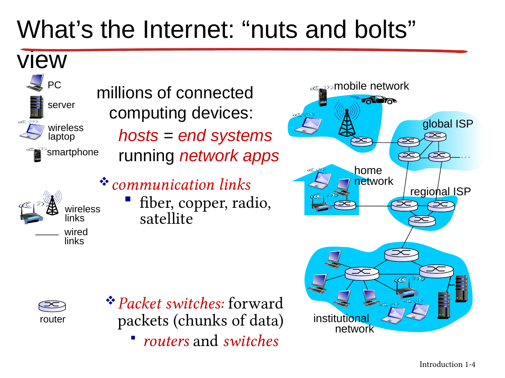

看图从home network沿连接走到regional/global ISP，再到别的网络。手机、PC、服务器属于应用所在端系统；交换机和路由器服务中间转发。原Chapter 1完整课件，第5张幻灯片的联网相框、冰箱等例子说明“host不等于台式电脑”。

服务视角（Chapter 1完整课件，第7张幻灯片）则问应用能获得什么：程序通过接口请求把数据送到远端程序，好比寄件时按规则写地址、交给邮政系统。应用不必亲自安排沿途每一个路口；但选用的传输服务决定它获得哪些保证。RFC（Request for Comments）是互联网技术文档系列；IETF（Internet Engineering Task Force，互联网工程任务组）制定许多互联网标准（Chapter 1完整课件，第6张幻灯片）；并非每一份RFC都是正式标准。

**English takeaway:** The Internet connects networks of hosts and packet switches, and provides communication services to applications through interfaces.

来源：Chapter 1完整课件，第4张幻灯片。

## 2. What is a protocol?｜格式、顺序、动作缺一不可

两个人问时间，要先提出问题，再给出回答；听不清时还可能重问。网络中的协议（protocol）同样需要约定交换消息的**格式、顺序，以及发送/收到消息时的动作**。只有“说英文”不够，还要知道先问还是先答、没收到怎么办。网络协议把这类约定变成机器可执行规则。来源：Chapter 1完整课件，第8–9张幻灯片。

课堂图先TCP连接请求/响应，再HTTP请求/文件。它是教学时序，不意味着所有互联网应用都先用TCP；下一章会比较TCP与UDP。发送方与接收方遵守同一套约定，才能把字节解释成相同的内容。

**自查 / Check:** 协议是否只规定报文长什么样？ / Does a protocol specify only the format of a message?

答案 / Answer

不，还规定消息顺序和在发送/接收等事件发生时执行的动作。 / No; it also specifies message ordering and actions taken on relevant events.

## 3. Network edge and access｜接入网把你带到第一个入口

接入网把家里或学校的端系统连到互联网的第一个入口，常见方式有家庭接入、学校/公司接入、移动接入。每次比较都问两件事：速率多少（bit/s）？资源是共享还是专用？仅看到“带宽很大”还不能推断每个用户都能持续独占它。

以家里的电话线接入为例：打电话和上网共用一根线，却占用不同频段，像在同一条路上划出不同车道。这种方式叫数字用户线路（Digital Subscriber Line，DSL）。运营商一端用DSLAM设备汇集许多用户的线路，再接入ISP网络。家到局端的这一小段可以专用，后面的道路仍可能与别人共享。

家里常见的一只“路由器盒子”也可能同时做几份工作：modem把数据转换为线路上的信号，路由/NAT负责转发和地址转换，防火墙按规则过滤流量，Wi-Fi接入点（access point，AP）提供无线连接。装在同一个盒子里，不等于这些功能相同。

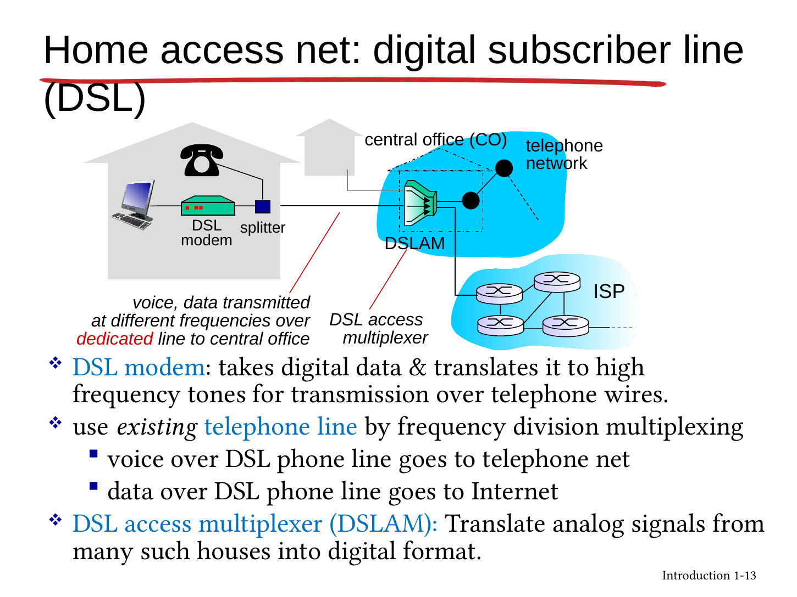

企业以太网把主机连到交换机，再由机构路由器连ISP。无线LAN经AP共享无线介质，蜂窝接入经运营商基站。课件列出的54Mbps、3G/4G等速率是原版本的示例，不作为2026年的产品上限或购买指标；标称速率也不同于应用可得吞吐。

| 介质（Chapter 1完整课件，第17–19张幻灯片） | 信号怎样走 | 要理解的差别 |
|---|---|---|
| Twisted pair 双绞线 | 铜导线中的电信号 | 成本、距离、布线与干扰 |
| Coaxial cable 同轴 | 同轴导体 | 可承载多个频带；HFC结合光纤与同轴 |
| Fiber 光纤 | 光信号 | 高容量、抗电磁干扰；“每个光脉冲一个bit”是入门简化 |
| Radio 无线 | 电磁波传播 | 反射、遮挡、干扰，共享频谱 |
| Satellite 卫星链路 | 经卫星中继 | 传播距离与轨道决定时延；不能将一个示例时延套到所有轨道 |

**English:** Access capacity, sharing, and physical propagation are separate considerations. A dedicated access segment does not imply an end-to-end dedicated path.

来源：Chapter 1完整课件，第11–19张幻灯片。

## 4. Circuit versus packet switching｜预留座位，还是来了再排队

Circuit switching（电路交换）先预留路径上的资源，即使使用者暂时不发送，别人通常也不能借用这份预留。Chapter 1完整课件，第22张幻灯片原图每条边有4条电路，一次连接在经过的每段占一份。频分复用（frequency-division multiplexing，FDM）让各连接使用不同频带；时分复用（time-division multiplexing，TDM）则轮流分配重复出现的时隙。同一用户在不同链路使用哪一个编号电路不必相同。

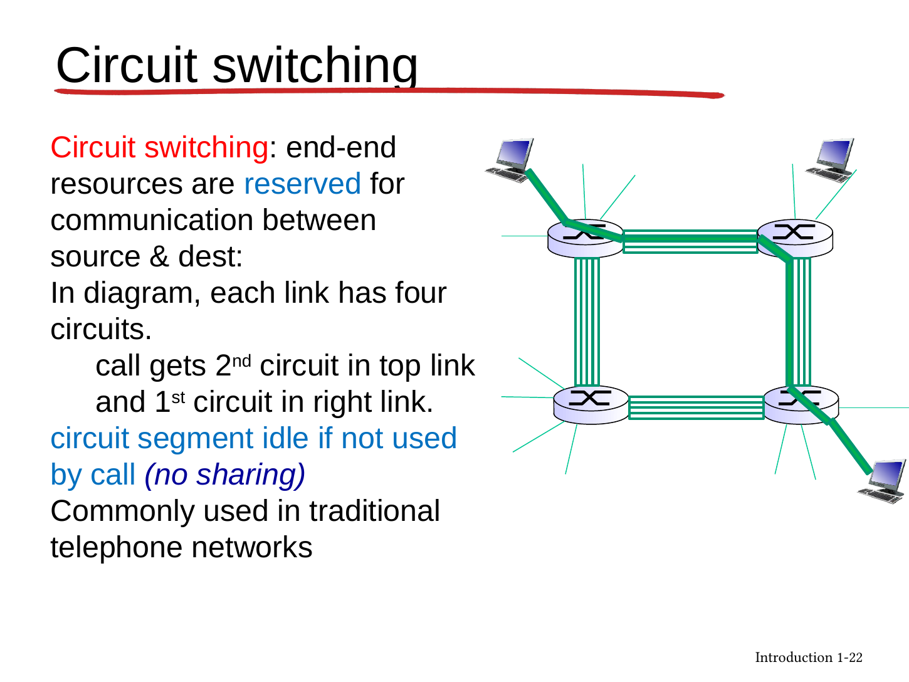
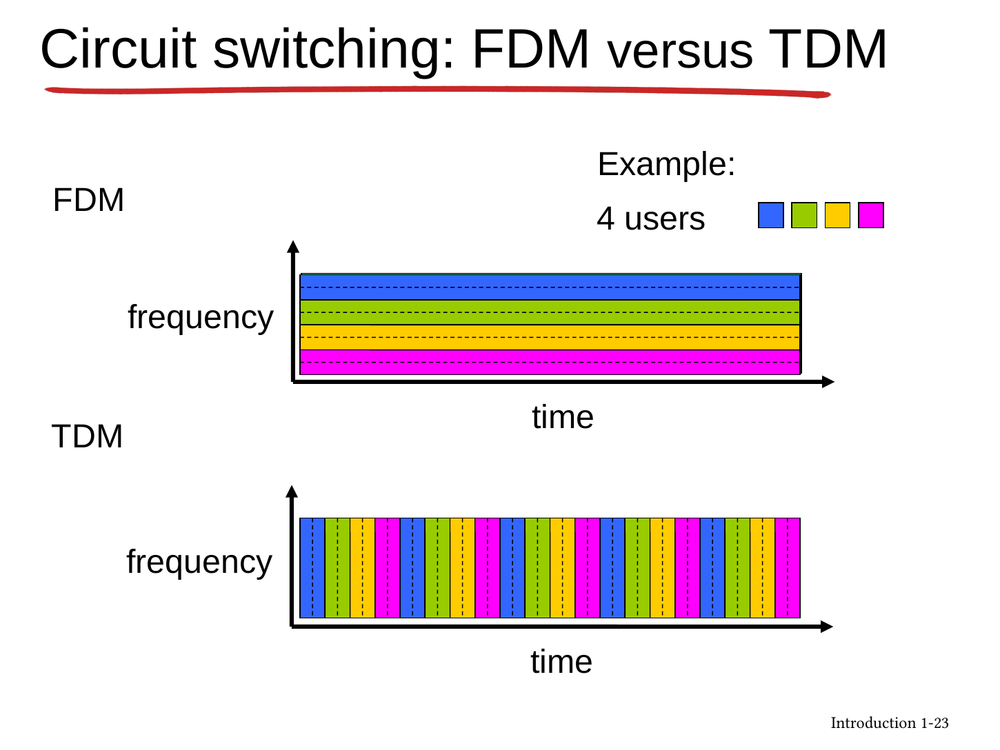

Packet switching（分组交换）把应用消息拆成包，按需使用链路。一包发送时可用链路发送速率R，竞争者可能排队；这不表示每个并发用户都永久获得R。像食堂公共座位提高利用率，但午饭同时来的人多了还是要等，不能只记“共享比较好”。

**Store-and-forward（存储转发）**要求收完整个包再向下一跳发送。包长L bit、速率R bit/s，一跳发送耗时L/R。在忽略传播、排队、处理的Chapter 1完整课件，第26张幻灯片模型中，一个包过两条链路耗时2L/R。注意“一跳”不自动包含整条路径。

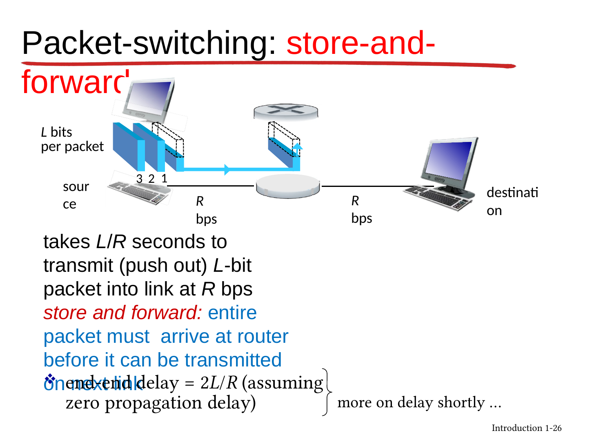

三个包过两跳不是6L/R，因为后一包可在前一包进入第二链路时占用第一链路。完整时序见[基础时间轴](../../learning/foundation-notes/NetworkBasics.md#timeline)与[Tutorial1 Q1](Tutorial01.md#q1)。等长包、等速率、连续发送且没有额外时延时，P个包、N条链路总耗时 $(P+N-1)L/R$。

### 共享带来的容量收益，有什么条件？

原例：1Mbps链路，每用户活跃时100kbps、活跃概率0.1。电路交换最多固定支持10人；35人做分组共享时，假设用户独立，活跃人数K服从Binomial(35,0.1)。

$$
P(K>10)=\sum_{k=11}^{35}\binom{35}{k}0.1^k0.9^{35-k}\approx0.0004243.\tag{1.1}
$$

**原页写“less than .0004”不够精确**；独立模型重算约0.0004243，约0.04243%，是略大于0.0004。Chapter 1完整课件，第30张幻灯片只有Binomial标题，补课给出从列举到公式的台阶。

这说明超额需求较少，不是保证零排队、零丢包或人人始终满速；短时到达突发、包调度和缓冲也影响等待。用户相关性改变时需要重新建模。分组交换适合突发需求，电路预留则提供更可预测资源，选择取决于服务需求。

来源：Chapter 1完整课件，第29张幻灯片。

## 5. Forwarding, routing and a network of networks｜路口动作与整条路线

课堂的forwarding是当前设备查表，把到来的包从合适出口送走；routing是确定路径并形成所需转发信息的过程。导航规划与开到路口选出口的类比有帮助，但真实路由可能分布式更新，不必有一个中央导航员。

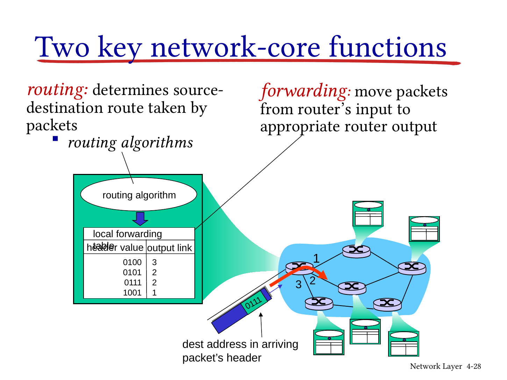

不同网络还需要相互连接。一步步构造互联网：若N个接入ISP两两直连，需N(N−1)/2条连接，扩展困难；接入ISP可以向上游购买传输服务（transit），让上游替它把流量送往更多网络；也可以与另一网络直接互联（peering）。互联网交换点（Internet Exchange Point，IXP）提供集中互联的位置。区域网络（regional network）连接一片地区，内容提供商网络（content-provider network）连接自己的服务节点。内容提供商将服务放近用户、建立自有网络，会减少对某些上游路径的依赖，从而可能缩短传输路径。原公司的例名保留为图中时代背景。

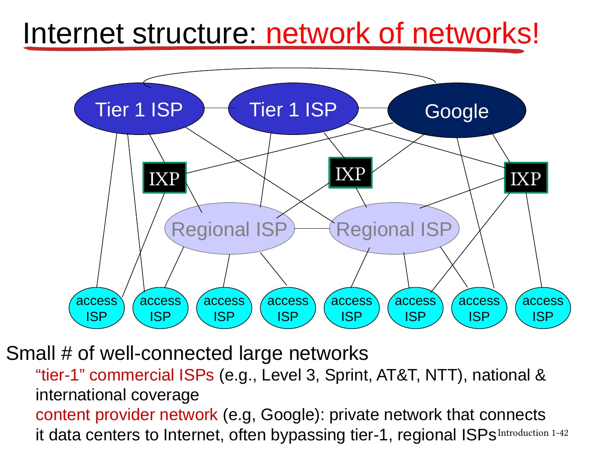

**English:** Forwarding is a local per-packet action; routing determines paths. The Internet consists of interconnected networks with both technical and economic relationships.

来源：Chapter 1完整课件，第28张幻灯片；第33–42张幻灯片。

## 6. Delay and loss｜慢在哪一段，公式才选得对

区分四类时延：

$$
d_{nodal}=d_{proc}+d_{queue}+d_{trans}+d_{prop}.\tag{1.2}
$$

| 项 | 发生什么 | 计算/影响 |
|---|---|---|
| Processing | 检错、读头、决定出口 | 题中给定或忽略 |
| Queueing | 等前面的包使用出口 | 取决于到达与队列状态 |
| Transmission | 将整包推入链路 | $L/R$；L bit、R bit/s |
| Propagation | 已进入介质的信号往前走 | $d/s$；d m、s m/s |

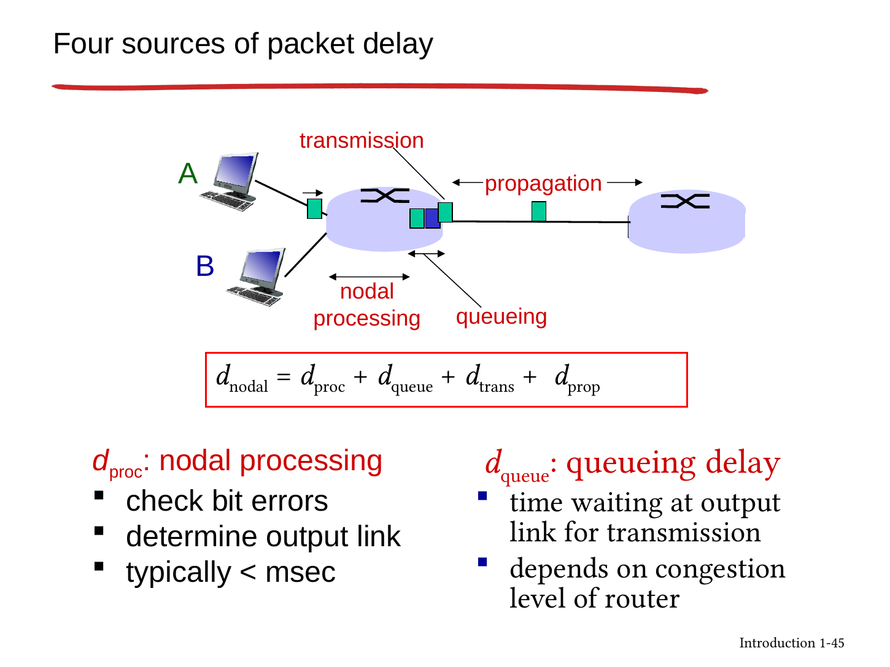

发送时延看一整包需要多久进入链路，传播时延看已经出发的信号多久走到另一端。下面用老师的车队例子，把这两个计时起点分开。

课堂的车队原例：10辆车，每辆收费12秒，最后一辆过第一个收费亭需120秒；100km以100km/h行驶需1小时，全部在第二亭前到齐需62分钟。Chapter 1完整课件，第48张幻灯片改为每车1分钟、车速1000km/h；首车1分钟后出发，再走6分钟，t=7分钟到第二亭，早于第10辆t=10分钟离开第一亭。两题都从第一辆开始服务计时，没让第二亭再处理一遍。

队列的traffic intensity为 $\rho=La/R$，a为平均包到达率（packets/s），L为本模型固定包长。rho接近1时在常见随机排队模型中等待显著增长；rho>1长期输入超过服务能力，无限缓冲理想模型不稳定，现实有限缓冲会丢包。仅平均rho<1不能保证任意流量下没有大突发或所有等待性质都良好，课件曲线是模型直觉。

把四项接成一次完整计时（教学示范）：某节点从开始处理一个500 B的包计时。处理1 ms、排队2 ms，随后以2 Mbps发送；链路长1000 km，传播速度2×10⁸ m/s。忽略其他开销。

发送部分先把500 B换成4000 bit，得到4000/(2×10⁶)=2 ms；传播部分把1000 km换成10⁶ m，得到5 ms。从开始处理到末位到达下一节点，总共1+2+2+5=10 ms。首位到达时包可能还没收齐，所以这里明确计到末位。

**独立变式 / Transfer:** 另一个包1000 B，R=4 Mbps，d=3000 km，s=2×10⁸ m/s，处理1 ms、排队3 ms。从开始处理到整包到达下一节点需多久？ / A 1000-byte packet has a 4-Mbps link, 3000-km distance, propagation speed 2×10⁸ m/s, 1-ms processing and 3-ms queueing. Find the time from processing start to complete reception at the next node.

答案 / Answer

发送2ms、传播15ms，合计1+3+2+15=21ms。 / Transmission is 2 ms, propagation is 15 ms; total delay is 21 ms.

来源：Chapter 1完整课件，第44–49张幻灯片；第47张幻灯片。

## 7. Real delays and throughput｜测得的RTT不是某一条线的长度

用traceroute逐渐增加TTL探查沿途响应，每行列出应答地址与往返时间RTT。后跳比前跳小并不矛盾：探测发生时间、排队、回程路径和应答处理可能不同；不能简单逐行相减当作单条链路时延。星号表示规定时间内未收到响应，不足以单独证明那台路由器坏了或一定被防火墙挡住。带日期的本机观察放在[Tutorial2 Q5](Tutorial02.md#q5)。

课堂的丢包来自缓冲满等机制；包是否重传、由谁重传取决于协议，不是所有丢包都被网络自动恢复。吞吐throughput是单位时间实际交付多少bit，容量capacity是链路能力；应用有效载荷的goodput还会扣去协议与重传等开销。

简单持续流、无竞争时，多链路瓶颈近似 $\min(R_s,R_c)$；10条连接公平分享骨干R且其他条件简化时，每连接为 $\min(R_s,R_c,R/10)$。公平分享是题设，不是每个真实网络自动保证的定理。

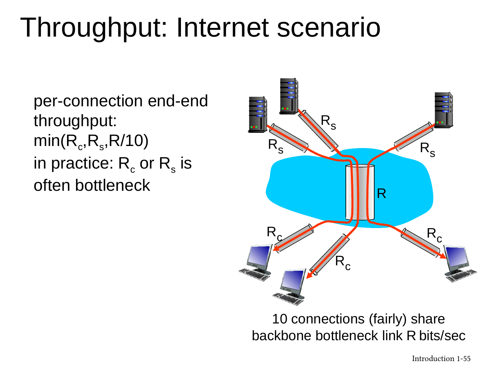

**自测 / Check:** 接入10Mbps、服务器20Mbps、5条流公平共享30Mbps骨干，每流瓶颈吞吐？ / Each flow has 10-Mbps access and a 20-Mbps server link; five flows fairly share a 30-Mbps backbone. Find the per-flow bottleneck rate.

答案 / Answer

min(10,20,30/5)=6Mbps。 / 6 Mbps under the stated sharing model. 容量不要相加成60Mbps。

来源：Chapter 1完整课件，第50–51张幻灯片；第52张幻灯片。

## 8. Layers and encapsulation｜把一件复杂的事拆成清楚的职责

老师用航空旅行解释分工：买票、托运行李、登机、起飞、航线各有职责。某一层使用下层服务，同时向上层提供服务；合理接口让内部变化不必牵动所有部分。网络分层借助清楚的责任和接口组织复杂任务。来源：Chapter 1完整课件，第58–60张幻灯片。

| Internet五层（从上向下） | 核心职责 | 课堂例子 |
|---|---|---|
| Application | 应用间协议与内容含义 | HTTP、SMTP、FTP |
| Transport | 进程到进程传输 | TCP、UDP；保证不同 |
| Network | 主机间数据报与路由 | IP |
| Link | 相邻节点间传输 | Ethernet、Wi-Fi |
| Physical | 介质上的比特信号 | 铜线/光/无线信号 |

从底向上编号时transport是第4层。OSI另列presentation/session，Internet应用仍可能需要编码、加密、会话等功能，只是不独立命名为这两层；“没有这一层”不等于“不需要这个功能”。

封装（encapsulation）将上一层信息作为本层payload，加上本层头部，某些链路协议还加尾部。例如浏览器的HTTP请求先是一段应用消息（message），TCP给它加传输头成为报文段（segment），IP再加网络头成为数据报（datagram），链路层包成帧（frame），最后变成介质上的比特信号。接收端按相反顺序解释并移去各层信息。UDP在传输层通常也称datagram，读这个词时要确认所在层。

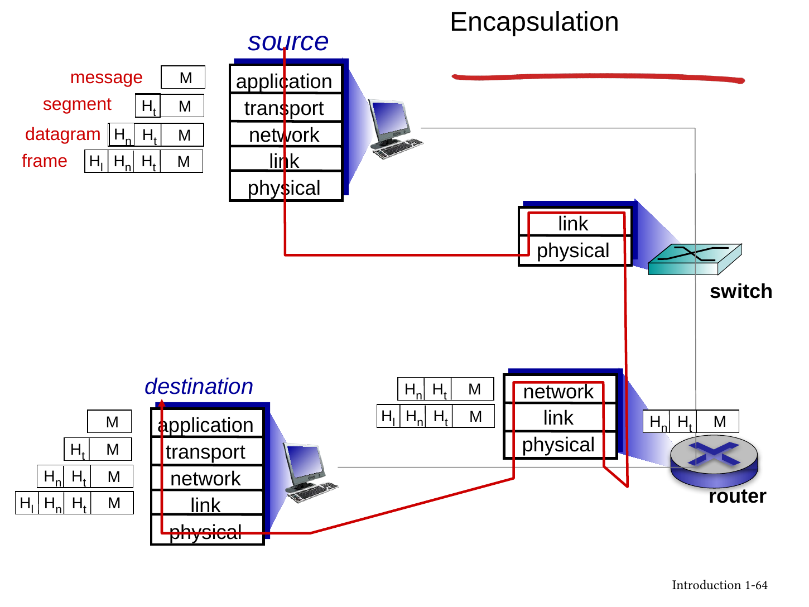

沿原图看：端系统走完整协议栈；典型转发路由器处理到网络层，以太交换机主要处理链路层。不要由这个教学模型推断所有现实设备绝不检查更高层。每跳链路帧可更换，应用消息不因此被每个路由器当成网页程序执行。

**English:** Each layer offers services to the layer above and uses services below. Encapsulation adds the information needed by the current layer.

## 9. Security and history｜知道威胁，也知道哪些数字属于当年

介绍恶意软件、DoS、嗅探与地址伪造。病毒常依附宿主内容并需执行，蠕虫可自动传播；并非“被动收到任意包就必然感染”，通常还需漏洞或执行机制。Botnet由受控设备组成，DDoS是分布式资源耗尽；packet sniffing能看到可访问的流量，但加密与网络结构限制能读到的明文。伪造源IP不等于已经能接收发回那个源地址的响应。

按时间讲分组交换研究、ARPANET、互联思想、TCP/IP与DNS、Web商业化、移动与云。应记住问题如何推动结构演变：让不同网络自治互联、尽力而为、分散控制；“stateless routers”在这里指不为每个端到端连接预留电路状态，不是路由器没有路由表或任何状态。

保留原页历史顺序，同时澄清两处可核查的简写：Chapter 1完整课件，第74张幻灯片将ALOHAnet标为1970卫星网络；夏威夷大学记录其岛际packet-radio服务于1971年6月开始，卫星连接属于后续发展。[UH项目史](https://manoa.hawaii.edu/engineering/about-us/history/alohanet.php) Chapter 1完整课件，第76张幻灯片的Mosaic年份应注意版本语境，NCSA记录其最早普及阶段在1993年。[NCSA历史](https://www.ncsa.illinois.edu/about/history/) 两处查阅于2026-09-23。

课堂的2016设备数量、早期社交网络用户数只作为课件当时背景，不称当前规模；“instantaneous”是宣传式简写，跨网络通信仍有非零时延。

来源：Chapter 1完整课件，第67–71张幻灯片；第73–77张幻灯片；第77张幻灯片。

## 10. Chapter 1 Q&A｜直接对照老师的五道课堂题

以下为原题条件的双语整理，答案为依据本章的推导，原Q&A文件没有附独立教师答案页。原图可在末尾展开。

1. **Which is not an edge device: PC, smartphone, server, router? / 哪个不属于本章端系统意义的网络边缘设备？** 答D，router；这里edge按运行应用的end systems定义，不否认现实术语也有“edge router”。 / D, a router, using the chapter's end-system definition of edge.
2. **Three L-bit packets cross two R-bit/s store-and-forward links. Ignore propagation, queueing and processing. Find completion time. / 3个等长包过2条等速存储转发链路，忽略其他时延，多久？** 答B，4L/R；流水线时间表见§4。 / B, 4L/R, because the links can work on different packets concurrently.
3. **Which delay is affected by congestion in the chapter's model? / 四项时延中哪项随拥塞变化？** 答B，queueing；其他给定包长/速率/距离条件不变。真实设备处理负载也可能变化，但原题考四类简化模型。 / B, queueing delay in the stated model.
4. **A 100Mbps modem connects a phone through a 54Mbps router, upgraded to 1Gbps. What is ideal throughput after upgrading? / 100Mbps外网口，54Mbps路由器换1Gbps后理想瓶颈？** 答A，min(100,1000)=100Mbps；还假设手机及其他段无更低瓶颈。 / A, 100 Mbps under the simplified bottleneck assumptions.
5. **Which transport-layer statements are true? / 传输层哪项正确？** A总可靠：错，UDP不保证；B是第4层：对（底层起数）；C为下方网络层提供服务：错，服务向上；D给segment加头再上送application：错，发送方向给应用消息加传输头后向下。 / Only B is correct under bottom-up layer numbering.

原Q&A页图 / Original question slides

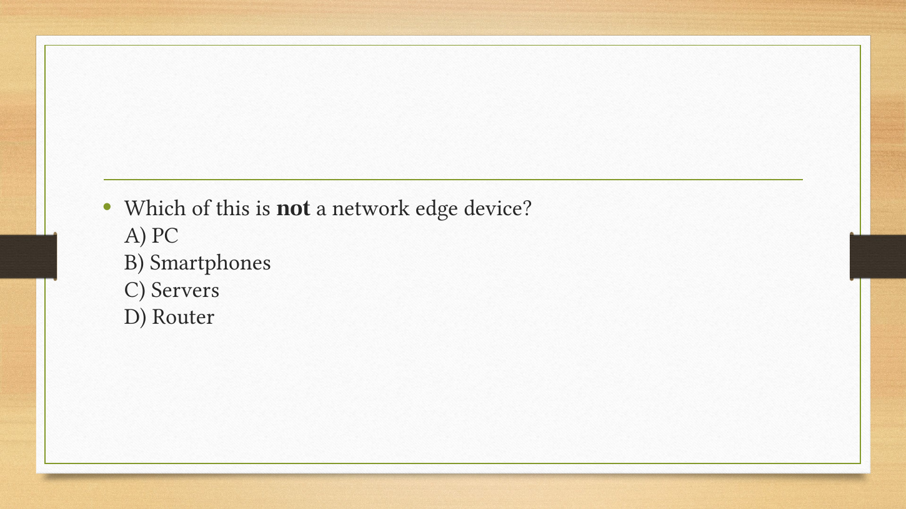
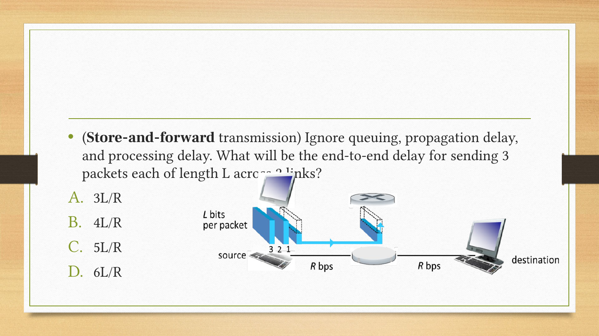
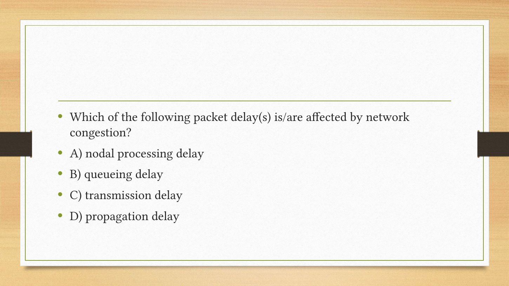
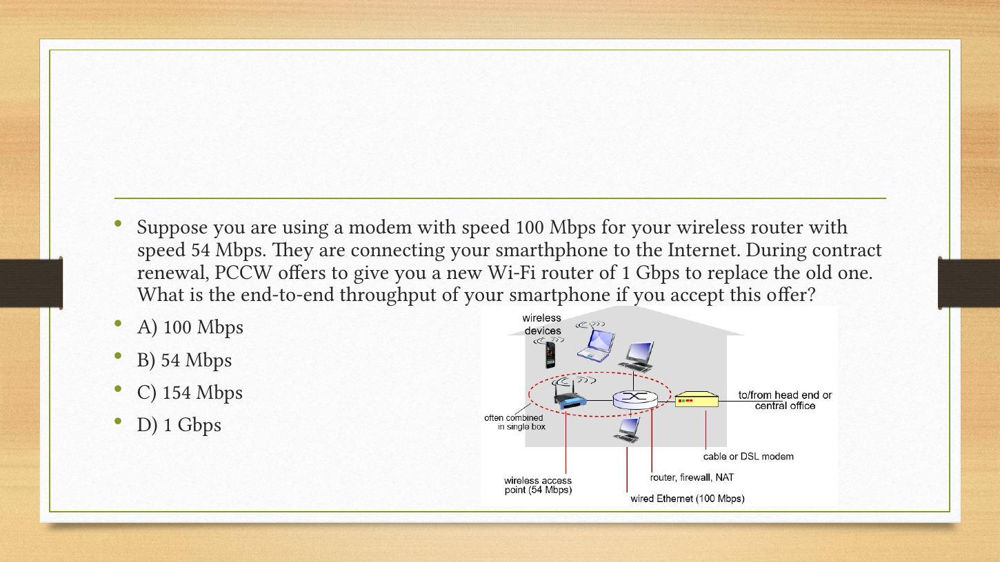
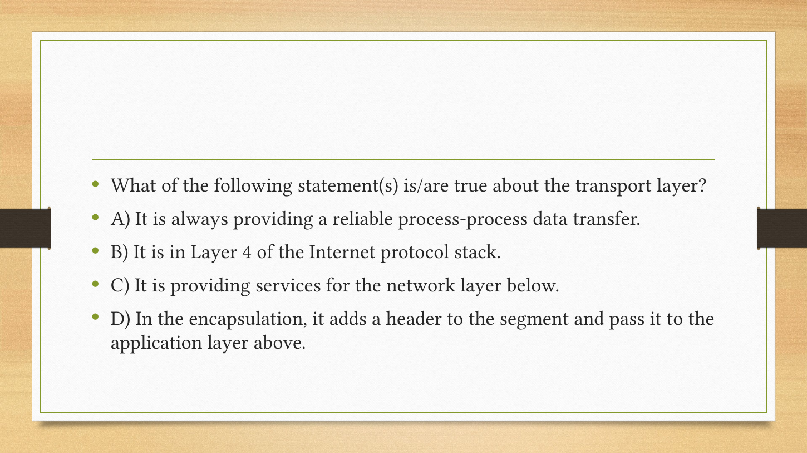

## 11. 回顾、任务与来源索引

顺着主线复述：端系统产生消息 → 接入网进入互联网 → 分组在链路与交换设备间前进 → 共享导致排队/丢失，路径容量决定瓶颈 → 分层协议规定每一部分的格式与动作。接着做[Tutorial1](Tutorial01.md)的交换与容量题、[Tutorial2](Tutorial02.md)的时延与测量，再做[Assignment1 P6/P31](Assignment01.md)。

英文独立表达：**Explain why increasing a link's rate does not reduce its propagation delay. / 解释为什么增加速率不减少传播时延。** 要点：$L/R$改变，$d/s$由距离与传播速度决定。 / Link rate changes transmission time; propagation depends on distance and signal speed.

首轮可选 **[N015（分组交换）](https://crazyshout.github.io/micro-course/cards.html#CS5222-N015)、[N025（四类时延）、N033（流量强度）](https://crazyshout.github.io/micro-course/cards.html#CS5222-N025)、[N072（流水线）](https://crazyshout.github.io/micro-course/cards.html#CS5222-N072)**，再在Markji按卡号复习。微课入口：[NET02](https://crazyshout.github.io/micro-course/?lesson=net02)。

| 原完整PPT页码 | 本文位置 | 覆盖内容 |
|---|---|---|
| 1–3 | 开篇 | 来源、目标、路线；目录页不重复计主题 |
| 4–9 | §1–2 | 设备/服务/API/RFC、协议与原对话 |
| 10–19 | §3 | 接入、DSL、家庭/企业/无线、物理介质 |
| 20–28 | §4–5 | 电路、FDM/TDM、分组、存储转发、转发/路由 |
| 29–32 | §4 | 原35用户例、二项补足、交换比较 |
| 33–42 | §5 | ISP逐步构造、peering/IXP/内容网络 |
| 43–49 | §6 | 四类时延、两道车队题、rho |
| 50–55 | §7 | traceroute、丢包、吞吐、共享瓶颈 |
| 56–65 | §8 | 航空类比、五层/OSI、封装与名称 |
| 66–71 | §9 | 安全目标与四类威胁 |
| 72–78 | §9、§11 | 演进、时代数字、总结 |
| Q&A 1–6 | §10 | 标题及全部5道题 |

part1的49页对应完整1–49；part2的29页对应完整50–78，页码重编不算新增教学内容。原图在相关段落展示，计算步骤见正文。