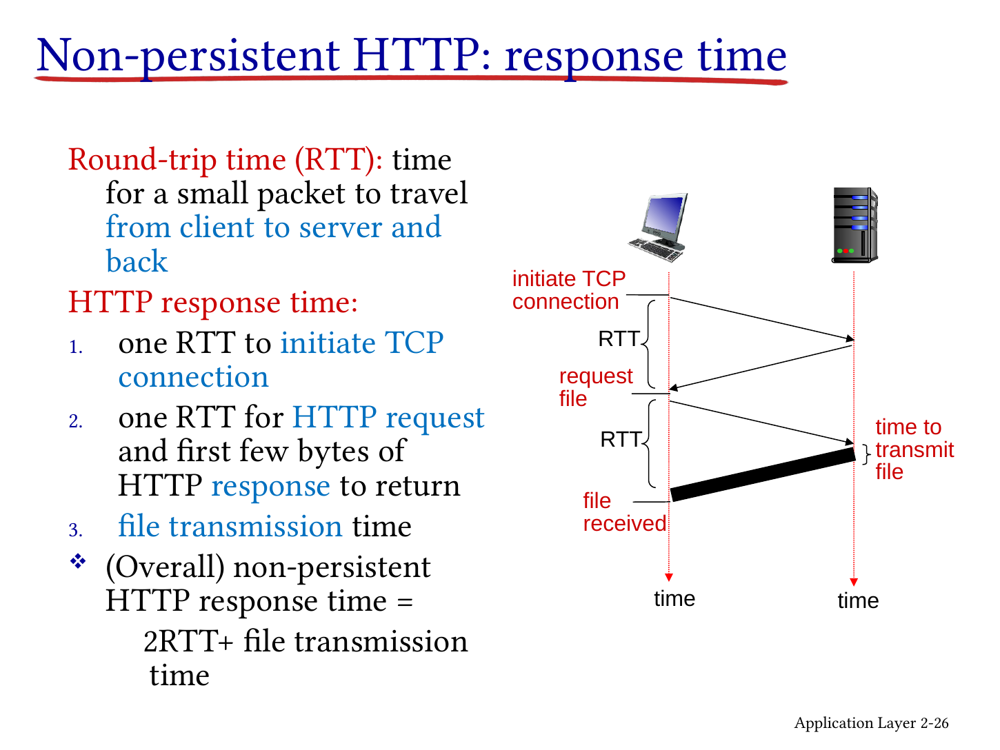
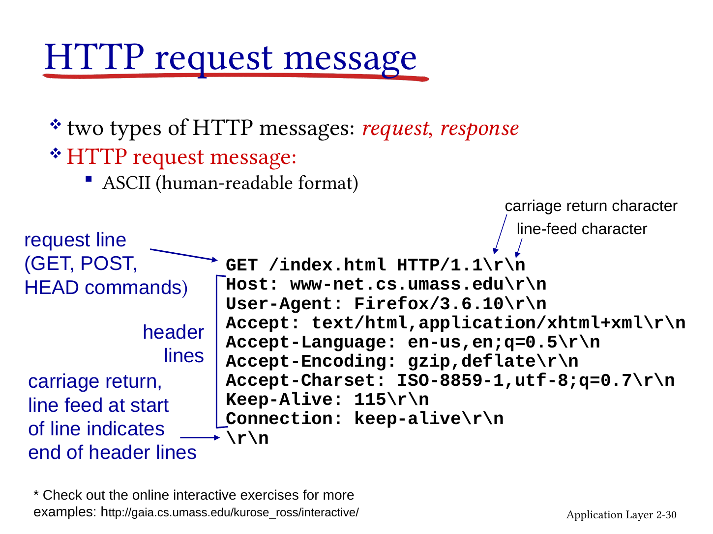
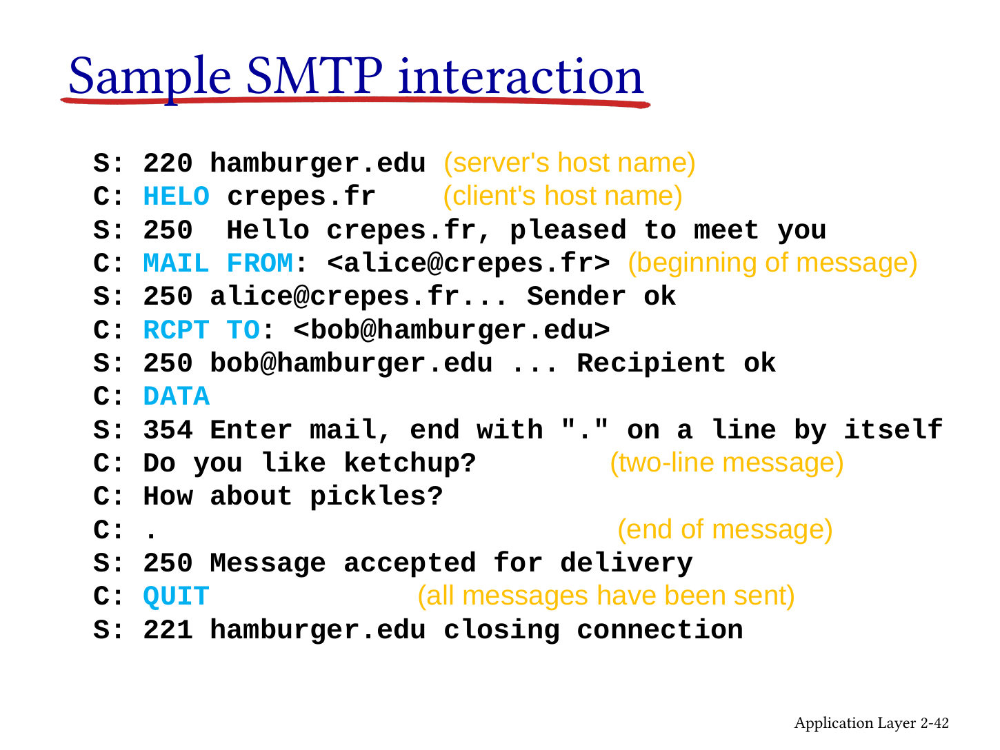
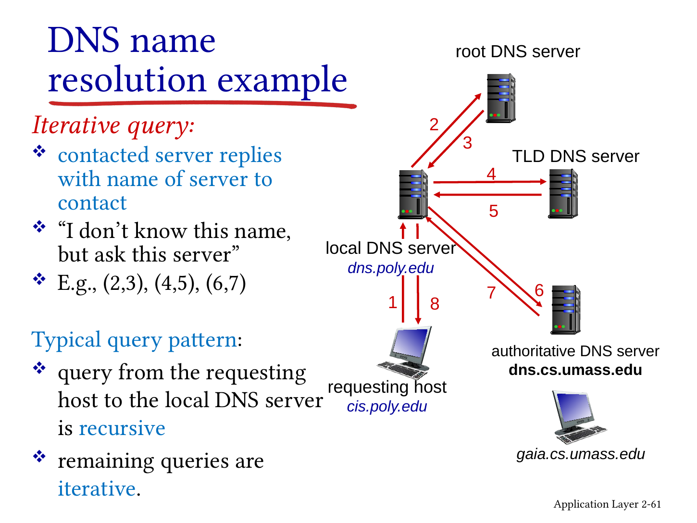
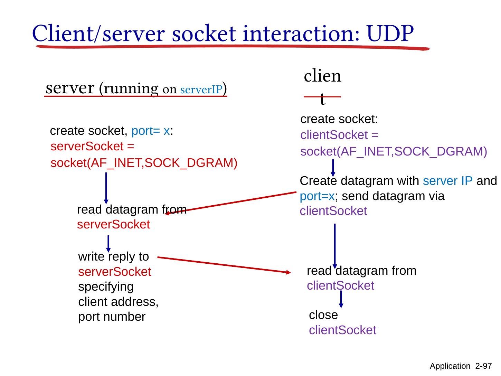

# Chapter 2 · Application Layer｜让两端的程序真正说上话

[课程目录](README.md) · [上一章](Chapter01.md) · [Tutorial 3](Tutorial03.md) · [Assignment 1](Assignment01.md) · [Research Report](ResearchReportGuide.md)

上一章知道消息可以穿过网络，这一章把镜头移到两端：浏览器怎样开口要网页，邮件怎样送到邮箱，名字怎样换成地址，多个用户怎样互相传文件，视频为什么可以边下边播。最后亲手让两个本机程序交换一句话。

依据当前 完整Chapter2（107页），保持 **应用原则 → HTTP → 邮件 → DNS → P2P → 视频/CDN → socket** 的实际正文顺序。早期目录列有FTP，但当前完整文件未提供独立FTP教学段，后半目录为视频/CDN。课件来源为Kurose/Ross、Man Hon Cheung修改，原图版权保留。

**可选基础：** [报文与字节](../../learning/foundation-notes/NetworkBasics.md#messages)、[时间轴](../../learning/foundation-notes/NetworkBasics.md#timeline)。运行Python先读[Lecture1的函数与文件](../../CS5489/course-notes/Lecture01.md#functions-classes)，按需要复习即可。

[TOC]

| 主题 | 优先级 | 难度与卡点 | 掌握要求与依据 |
|---|---|---|---|
| 架构、进程、socket、TCP/UDP | 核心必会 | 中；对象/服务边界 | 解释并运行通信；Chapter 2完整课件，第4–17、94–105张幻灯片 |
| HTTP消息与时延 | 核心必会 | 中；连接、流水线、对象数 | 解读完整请求、画RTT；Chapter 2完整课件，第19–37张幻灯片、Tutorial 3 |
| SMTP、POP3、IMAP | 核心必会 | 中；投递和访问分开 | 写出完整事务与状态；Chapter 2完整课件，第39–51张幻灯片、Assignment 1 |
| DNS、递归/迭代、缓存 | 核心必会 | 中；谁向谁问 | 跟踪消息与算RTT；Chapter 2完整课件，第53–69张幻灯片、Tutorial 3 |
| P2P、BitTorrent | 常规掌握 | 中；资源下界与实际性能 | 推导三项下界，解释分块；Chapter 2完整课件，第71–80张幻灯片 |
| 视频、DASH、CDN | 常规掌握 | 中；码率/吞吐/缓冲 | 解释机制、算小例；Chapter 2完整课件，第82–92张幻灯片 |

优先级依据当前课件与配套任务；考试范围以教师公布的要求为准。

<a id="processes"></a>
## 1. Applications, processes and sockets｜先找到真正对话的双方

浏览器、邮件、游戏、会议和视频程序通常运行在端系统上，开发一个网络应用不需要重新编写沿途每台路由器。进程（process）是运行中的程序；一个主机能同时有多个进程，因此只写主机IP不够，还需端口等传输端点信息。

Client/server架构中，一方提供相对稳定可达的服务，客户端发起请求；P2P中节点既请求也提供资源。纯P2P不依赖永远在线的中心数据服务器，但实际系统可有tracker、登录或协调服务，不能由“使用P2P”推断完全没有服务器。客户端/服务器也可以是某一次交互的角色，不是某台机器终身的职业。

假设浏览器要向服务器索取网页。浏览器把要发出的字节交给操作系统提供的接口，这个接口叫socket（套接字）；操作系统再通过传输协议发送。IP地址帮助找到目标主机，端口号帮助找到主机上的相应服务。这样，访问网页和收邮件就能在同一台电脑上同时进行。

对照课件时留意：32-bit地址指IPv4；第10张幻灯片的 `connect` 是客户端主动连接，附近的“accept incoming”注释与该代码不符。

**自查 / Check:** 同一IP上有Web和邮件服务，只给IP能否指出收消息的进程？ / Can an IP address alone distinguish a web process from a mail process on the same host?

<details markdown="1"><summary>答案 / Answer</summary>

不够，还要传输协议与端口等端点信息。 / No; transport protocol and port information are needed. 课堂HTTP 80、SMTP 25是相应传统服务示例，不是全部现代配置。

</details>

来源：Chapter 2完整课件，第3–4张幻灯片。


## 2. Service requirements｜“可靠”不等于“准时”

应用协议规定消息类型、语法、语义和交互规则。开放标准便于互操作；专有协议由特定实体控制，但不意味着一定没有任何公开文档。选择传输服务前，先问应用需要什么：完整性、及时性、持续吞吐、安全性。

文件少一段不能算完成，实时通话晚到的音节可能已没有价值。TCP提供可靠、有序字节流，并有流控（保护接收端）与拥塞控制（适应网络）；它不承诺固定时限、最小吞吐，也不自动加密。UDP提供数据报接口，没有这些内建可靠性/顺序保证；应用可在其上实现所需机制。TCP可靠性也不是“网络永久断开仍能保证交付”，失败会暴露给应用。

用SSL称呼安全层，是旧术语；今天应区分TLS与旧SSL。教学要点是加密、完整性和端点认证需要额外机制，不能将“用TCP”当作已经安全。服务表里的码率与应用例名是课堂时代背景，核心是需求比较，不是当前产品参数清单。

**English:** Reliability, ordering, latency, throughput and security are different service properties. UDP's minimal service lets applications choose additional mechanisms, but does not remove responsibility for congestion and reliability design.


来源：Chapter 2完整课件，第12张幻灯片；第17张幻灯片。

<a id="http"></a>

## 3. Web and HTTP｜拿到HTML不等于拿齐整页

分base HTML和referenced objects：HTML告诉浏览器还需要哪些图片、脚本等，每个对象有URL。URL不只是主机名，还包含路径、可能的协议方案、端口等。本章和Tutorial使用传统HTTP/1.x over TCP模型；不能把“HTTP必然使用TCP”推广到HTTP/3，后者基于QUIC。[RFC9114](https://www.rfc-editor.org/rfc/rfc9114) 

浏览器是HTTP客户端，Web服务器应请求返回资源（Chapter 2完整课件，第20张幻灯片）。HTTP无状态是说核心请求语义不要求服务器记住先前请求，不等于TCP连接没有状态，也不等于网站不能存购物车；cookie等机制随后会补上会话关联。

### 连接可以复用，请求是否并行还要另问

Non-persistent HTTP：每个对象新建TCP连接。简化为握手1RTT、请求到首个响应1RTT，再加对象发送时间；忽略DNS等其他部分时 $2RTT+L/R$。它不是包含TLS、慢启动、服务处理的全现实上网公式。



Persistent HTTP：复用连接，后续对象省去重新握手。**持久连接不等于流水线（pipelining）**；无流水线时每次等上一请求响应后才发下一次。多个并行TCP连接又是第三个概念，可让不同对象同时等待，但占更多资源，吞吐也受共享瓶颈限制。

补充小例：base HTML加2个小对象，都在同服务器，忽略发送时间和DNS。串行非持久共3×2=6RTT；单个持久无流水线是1握手+3请求=4RTT；拿到HTML后一次发两个后续请求的理想流水线模型为3RTT。先问清协议/浏览器约定，才有唯一算式。原Chapter 2完整课件，第27张幻灯片画的是顺序复用，Tutorial3c据此读。

**变式 / Transfer：** 同一服务器上的HTML还引用4个很小的对象。初始无连接，先收到HTML，忽略DNS、发送、TLS、丢包和处理时延。串行非持久与单条无流水线持久连接各需多少RTT？ / A base HTML file references four small objects on the same server. Start without connections and fetch HTML first. Ignore DNS, transmission, TLS, loss and processing. Compare serial non-persistent HTTP with one non-pipelined persistent connection.

**答 / Answer：** 非持久有5次“握手＋请求”，共10 RTT；持久只握手一次，加5次请求，共6 RTT。 / Ten RTTs versus six RTTs. 复用连接省的是握手，请求本身仍需往返。

### 读报文：把每一行与问题对应

请求行是method、request target、version；头字段包括Host、User-Agent、Accept等；CRLF分行，空行结束头部。GET通常索取表示；HEAD只请求相应响应头；POST提交内容供资源处理，不能仅凭方法名保证请求是否“安全”或是否一定有某种body。



原HTTP/1.1文本适合观察ASCII结构；不要据此认为所有HTTP版本在传输中都用相同明文文本布局。Tutorial3将用真实题干逐项判断，IP地址未出现时应明确说无法仅从这些头字段得到，不能从Host误认浏览器地址。

**English:** A page may require multiple object requests. Connection persistence, pipelining and parallel connections are separate choices; name the timing model before counting RTTs.

来源：Chapter 2完整课件，第19张幻灯片；第30–31张幻灯片。


## 4. Cookies and caches｜识别会话，与复用内容是两件事

课堂的Susan购物例子：网站生成标识，响应`Set-Cookie`交给浏览器，浏览器后续发`Cookie`，服务器用它找到后端会话/购物车。四部分是响应头、浏览器保存、服务端记录、后续请求头。Cookie不是自动等于用户名密码，也不保证一个ID就足以安全认证；它也带来跨请求关联与隐私问题。

课堂的cache对浏览器是服务器，对origin又是客户端。命中且可用时直接回应，未命中向源获取，减少响应时延与接入流量。需要考虑新鲜度、验证及不应共享的个人内容；不是“见到任意响应就永久缓存”。这和cookie保存会话身份作用不同。

**变式 / Transfer:** 一个代理向源服务器请求未命中的对象时，它是client还是server？对原浏览器呢？ / What roles does a proxy play toward the origin and toward the browser?

<details markdown="1"><summary>答案 / Answer</summary>

对源是client，对浏览器是server。 / It is a client to the origin and a server to the browser. 角色按具体交互定义。

</details>


来源：Chapter 2完整课件，第32–35张幻灯片；第36–37张幻灯片。

<a id="mail"></a>

## 5. Electronic mail and SMTP｜把“送到邮箱”和“打开邮箱”拆开

Alice的邮件客户端（user agent）先把信交给发送邮件服务器，放入outgoing queue；服务器经SMTP投递到Bob的邮件服务器，进入mailbox；Bob再用客户端访问。发件/收件服务器可能在不同交互中分别担当client/server。

SMTP通过命令/响应完成greeting、邮件传送、结束。课堂Chapter 2完整课件，第42张幻灯片原对话顺序是 `HELO` → `MAIL FROM` → `RCPT TO` → `DATA` → 邮件内容 → 单独一行`.` → `QUIT`。只有服务器给出354后才发DATA内容；250代表该阶段成功，但不是“Bob已阅读”。同一持久TCP连接可投递多封邮件。



将HTTP称pull、SMTP称push，是典型课堂使用方式；HTTP也支持客户端上传，别把类比读成协议完全禁止别的方向。邮件内容头`From/To/Subject`与SMTP信封命令作用不同；头部与正文之间为空行。Chapter 2完整课件，第41/45张幻灯片的7-bit ASCII是基础历史模型，附件与国际化需编码/扩展，不能说现代电子邮件只能写英文。

**English:** SMTP transfers mail to a receiving server. Message headers are distinct from SMTP envelope commands, and server acceptance does not mean the recipient has read the message.


来源：Chapter 2完整课件，第39–43张幻灯片；第44张幻灯片。

<a id="pop3"></a>

## 6. POP3, IMAP and webmail｜下载之后要不要留在服务器？

邮件到达服务器后，收件人还要访问邮箱。POP3的三阶段是Authorization、Transaction、Update。客户端认证后用LIST看大小、RETR取内容、DELE标记删除，成功QUIT进入Update提交删除。**RETR本身不会自动删除**，DELE也不是立刻不可撤销地移除；在Transaction中RSET可清除删除标记，非正常断开不进入正常Update流程。[RFC1939 §§5–6](https://www.rfc-editor.org/rfc/rfc1939)

Download-and-delete与download-and-keep由客户端是否标记删除并成功结束会话等行为形成，不是“POP3只能删”。跨会话不维护IMAP那样的文件夹/已读同步状态，不等于服务器不保存邮箱或不能提供持久UIDL识别；客户端可记住已下载UID来避免重复下载。

IMAP把邮件和文件夹等状态留在服务器，支持多设备一致访问。Webmail中浏览器与网站通常使用HTTP(S)，而邮件服务器之间仍可SMTP；不要因为你在网页按发送，就断言浏览器直接向所有收件服务器开SMTP连接。完整两封邮件事务见[Assignment1 P17](Assignment01.md#pop3)。

来源：Chapter 2完整课件，第46–51张幻灯片。


## 7. DNS services and hierarchy｜通讯录不是只放在一台电脑上

课堂的Domain Name System既是分布式数据库，也是应用层协议。它解决主机名到地址、别名、邮件服务器定位与负载分布等问题。一个名字可以返回多个地址，同一台服务器也可服务多个名字。

以查询 `www.example.com` 为例，本机通常把问题交给一个递归解析器（recursive resolver，课件称local DNS）。如果没有可用缓存，它先问根服务器（root），得知该向哪些.com顶级域服务器询问；再问顶级域（top-level domain，TLD）服务器，找到负责example.com的权威服务器（authoritative server）；最后向权威服务器取得所需记录。每一步可能只给出“下一站问谁”，这叫委派（delegation）。

root、TLD和权威服务器形成管理层次；本地解析器负责替你沿这条线查询及缓存结果。一个权威服务器负责的一片记录叫区域（zone）。域名树的一部分还可以交给其他服务器管理，因此zone的边界不一定与某个domain的全部下级名称重合。

把root写成“自己联系权威并取回最终映射”不代表通常迭代解析的根服务行为；按随后Chapter 2完整课件，第60–61张幻灯片的常见图，递归解析器接收referral后自己继续查询。[RFC1034 §4.3](https://www.rfc-editor.org/rfc/rfc1034) 原页根服务器实例数量是当时快照，不作为当前数量。不要把根服务标识数、实例数、物理机器数混成同一个概念。


来源：Chapter 2完整课件，第53–59张幻灯片；第57张幻灯片。

<a id="dns"></a>

## 8. Recursive versus iterative DNS｜是“替我办完”，还是“告诉我下一站”

请求主机向本地resolver发递归请求：“请给最终答案或错误”。resolver向root、TLD、权威发迭代请求：“若不知道，告诉我下一站”。收到最终答案再返还主机。Chapter 2完整课件，第62张幻灯片展示全递归作为另一种可能模式，不能默认每一层都替下一层递归。



看图先跟数字1–8，不要把每根箭头当一个RTT：一次往返有去和回。无缓存、顺序访问root/TLD/权威时，若host↔local为RTT_L，每个local↔远端为RTT_r，总RTT_L+3RTT_r。命中local缓存、无需再验证且忽略处理时，只RTT_L。原图也用于Tutorial3。若RTT_L=2 ms、RTT_r=10 ms，无缓存时为2+3×10=32 ms；本地命中时为2 ms。

**独立题 / Check：** 仍按图中顺序，忽略处理与发送时延。RTT_L改为3 ms、RTT_r为15 ms，无缓存与本地有效缓存命中分别多久？ / Under the same sequential DNS flow and negligible processing/serialization, use RTT_L=3 ms and RTT_r=15 ms. Find the uncached and valid local-cache-hit times.

**答 / Answer：** 3+3×15=48 ms与3 ms。 / 48 ms and 3 ms.

缓存有TTL（time to live，有效存活时间），回答可以非权威但仍来自缓存的权威资料链。过期需要重新查询；记录变化不会自动让所有旧缓存同时消失。DNS TTL是缓存时间概念，和IP TTL的跳数控制不是同一字段。

## 9. DNS records and messages｜名字、值、类型、有效时间要一起读

| 类型 | name→value | 用途 |
|---|---|---|
| A | 主机名→IPv4地址 | 地址映射；IPv6另用AAAA（补充区分） |
| NS | 区域/域名→权威服务器主机名 | 委派；不是直接给全部终端IP |
| CNAME | 别名→规范名 | 后续仍需得到地址记录 |
| MX | 邮件域→邮件交换服务器名 | 实际还含优先级字段；不是发往Web服务器的A记录 |

课堂的查询/响应共用结构：ID匹配事务；flags说明请求/回答、是否希望递归、是否支持递归、是否权威等；counts说明后续questions、answers、authority、additional的数量。附加区可以携带相关地址，减少后续查询，但不是任意附加记录都自动可信。

新公司例子：向注册商登记域和权威服务器，父区设置委派NS，必要时有glue地址；在自己权威区添加www的地址记录。课件同页混用`networkuptopia`/`networkutopia`且www与apex不一致，是拼写/名称示意问题；真正配置时它们是不同DNS名字，必须统一，不能指望解析器猜出来。

课堂的DDoS、缓存投毒与反射放大用来理解可靠性/信任边界。原“Not successful to date”描述的是旧课件编写时的情况。缓存降低某些上游访问压力，但不能证明DNS不可能遭攻击。

**English:** Recursive resolution delegates completion; iterative resolution returns referrals. DNS records have distinct types and TTLs; a non-authoritative cached answer is not automatically an incorrect answer.

来源：Chapter 2完整课件，第66–67张幻灯片；第68张幻灯片；第69张幻灯片。


## 10. P2P file distribution｜新加入的人也可以带来上传能力

给理想模型：服务器有F bit文件，需分发到N个peer，服务器上传u_s bit/s，peer i上传uᵢ、下载dᵢ，核心网络不额外限速，$d_{min}=\min_i d_i$。

Client-server的服务器共需上传NF bit，最慢客户端下载F bit：

$$
D_{cs}\ge\max\left(\frac{NF}{u_s},\frac F{d_{min}}\right).\tag{2.1}
$$

服务器不必物理“顺序开完一个连接才开下一个”，NF/u_s来自总上传工作量，哪怕并行也绕不过这个容量下界。

P2P中的节点可以互助上传，但最初至少要有一份文件从源头出去；每个节点仍须下载F，所有节点总共需NF的接收量：

$$
D_{p2p}\ge\max\left(\frac F{u_s},\frac F{d_{min}},\frac{NF}{u_s+\sum_i u_i}\right).\tag{2.2}
$$

图和公式是理想容量下界，实际调度、块稀缺、离线、协议开销会增加耗时。Chapter 2完整课件，第75张幻灯片“always less”应读为在理想能力比较中不劣且有时更好，可能相等，不能保证任意实际P2P更快。

**回到Chapter 2完整课件，第75张幻灯片原例：** 每个peer上传u，F/u=1小时，服务器u_s=10u，所有下载速率至少u_s。于是CS下界为N/10小时；P2P下界为max(0.1,N/(10+N))小时。N=10时为1小时对0.5小时，N=100时为10小时对约0.909小时；N=1时两者均0.1小时。用户增加也带来上传资源，这解释了原图的扩展性趋势。

**完整补算：** F=100Mbit、N=4、u_s=10Mbps、每个dᵢ=5Mbps、uᵢ=2Mbps。CS下界max(40,20)=40s；P2P下界max(10,20,400/18)=22.22s。分母总上传18Mbps，不把下载速率也当上传资源加进去。

**变式 / Transfer:** 同条件但各peer上传0，P2P下界？ / Set every peer upload rate to zero; keep all other parameters.

<details markdown="1"><summary>答案 / Answer</summary>

max(10,20,40)=40s，与CS相同。 / 40 s, equal to the client-server bound. 这是“P2P一定严格更快”的反例。

</details>

来源：Chapter 2完整课件，第71–75张幻灯片。


## 11. BitTorrent｜先找邻居，再交换稀缺块

一个torrent是交换同一文件分块的节点集合，tracker帮助发现参与者，不必亲自发送全部文件。peer加入时无块，逐渐下载并向别人上传；成员离开/加入称churn。

请求块采用rarest-first，优先扩散目前邻居中少见的块，降低最后只缺同一块的风险。发送方面，课堂用“偏向近期给自己较高上传速率的四个伙伴，每10秒重评、每30秒随机尝试一个新伙伴”的tit-for-tat/optimistic unchoking例子。这里的4/10/30属于课件所述算法版本，客户端实现可能采用不同参数。随机试新伙伴避免只锁在既有关系里。

原图中的 `256Kb chunks` 表示一个分块大小的示例（Chapter 2完整课件，第76张幻灯片）；实际分块长度随torrent选择，b/B也需辨别；理解单位见基础页，不要求把这个旧示例当标准固定块长。

来源：Chapter 2完整课件，第76–80张幻灯片。


## 12. Video, DASH and CDN｜边下边播，需要的不只是平均带宽

解释视频由连续图像组成；空间冗余可压缩同一帧重复信息，时间冗余利用帧间变化。不同编码码率对应不同质量/数据量，但码率不是用户网络吞吐。“4Mbps视频”指播放每秒需要约4Mbit编码数据，而不是网络必然提供4Mbps。

从单个HTTP文件到Dynamic Adaptive Streaming over HTTP（DASH）：服务器把视频切成时间块，同一块有多个码率版本，manifest给出访问位置；客户端估计吞吐与缓冲状况，决定何时请求、用哪档、从哪里取。不能只用刚测到的瞬时峰值去选最高清，否则可能很快耗尽缓冲。

补算：4秒片段、编码2Mbps，块大小8Mbit；可用吞吐4Mbps时下载2秒，若同时正常播放，缓冲时长净增加约2秒。若只有1Mbps则下载8秒，需要足够初始缓冲，否则会停顿。这里忽略请求/变码率等开销，按固定编码率计算；实际块大小可以变化。

**自己算 / Try：** 一个6秒视频块按3 Mbps编码，可用吞吐6 Mbps，初始缓冲充足且边下边播。求大小、下载时间和缓冲时长净增量。 / A six-second chunk is encoded at 3 Mbps and downloaded at 6 Mbps. With enough initial buffer and simultaneous playback, find its size, download time and net buffer gain.

**答 / Answer：** 18 Mbit、3秒、净增6−3=3秒，忽略请求和解码开销。 / 18 Mbit, 3 seconds to download, and 3 seconds of net buffer gain, ignoring request and decoding overhead.

内容分发网络（content delivery network，CDN）把副本放在多个地理/网络位置，降低单站压力与长路径问题。Enter deep靠近接入网络、地点多；bring home集中于较少大型IXP附近集群。选择“近”往往看网络路径/负载，不只地图公里数。DASH控制表示与请求，CDN提供分发位置，二者可配合但不是同义词。原用户数、流量占比和部署地点数均为原页时期的案例。

**English:** Encoding rate describes media demand, while throughput describes delivery capacity. DASH adapts chunk requests; CDNs distribute replicas across serving locations.


来源：Chapter 2完整课件，第82–84张幻灯片；第85–88张幻灯片；第89–92张幻灯片。

<a id="sockets"></a>

## 13. Socket programming｜把课堂的大写转换例子真正跑通

课堂的原任务：client读一句文字 → server转大写 → 回给client。当前原代码含Python2 `raw_input`/print写法，以及`from socket import *`与`socket.AF_INET`混用。配套 [socket_demo.py](labs/socket_demo.py) 使用Python3、模块导入、显式UTF-8编码和超时，只绑定本机127.0.0.1。

UDP路径：`socket(AF_INET,SOCK_DGRAM)` → 服务端bind → client.sendto(data,address) → server.recvfrom得到bytes和client地址 → sendto回复 → client.recvfrom。它不做连接握手；收到回包不证明所有未来数据报都可靠。



TCP路径：server创建监听socket、bind、listen；client创建socket再connect；server.accept返回**新的连接socket**；双方用该连接收发；结束关闭连接socket，监听socket可继续接新连接。Chapter 2完整课件，第102张幻灯片用源端口帮助区分连接，完整连接识别还涉及双方地址/端口与协议，不能只看一个源端口。

```sh
# 在本目录运行。两个终端；服务端只处理一次请求便退出。
python labs/socket_demo.py --transport udp --role server --port 12000
python labs/socket_demo.py --transport udp --role client --port 12000 --message 'hello network'
# TCP只需把两边的udp同时改成tcp。
python labs/socket_demo.py --self-test
```

TCP没有消息边界：本例规定每条文本以换行结束，`sendall`发送全部bytes，接收循环直到换行，不能假设一次recv(1024)一定收到整句。UDP保留报文边界，但要保证例题报文在接收缓冲范围内。

本机通信示范的执行记录见 socket-self-test.json，包括UDP、TCP和超过一次读取大小的TCP消息。它验证本机接口与消息分帧，不测量跨互联网可靠性或时延。

**独立任务 / Try:** 将客户端文字改成`course practice`，两种协议各运行一次；再解释TCP为什么有监听与连接两个socket。 / Run both transports with this message, then explain the two server-side TCP sockets.

<details markdown="1"><summary>预期与解释 / Expected result</summary>

输出`COURSE PRACTICE`。监听socket接受新连接，连接socket处理当前客户端的数据，职责不同。 / The reply is COURSE PRACTICE; the listening socket accepts connections while the connected socket exchanges this client's data.

</details>

来源：Chapter 2完整课件，第94–105张幻灯片。


## 14. Back to the course｜用一条请求链把本章连起来

打开网页时：DNS得到服务地址 → socket取得所选传输服务 → HTTP表达所需资源 → 响应中的cookie可关联状态、cache可复用内容。邮件用SMTP投递、POP3/IMAP/HTTP访问；大文件与视频则进一步考虑peer上传能力、分块、编码与分发位置。共同的问题始终是：**双方是谁、消息怎么写、何时发送、需要哪些服务、状态由谁保存。**

接着做[Tutorial3](Tutorial03.md)的报文/DNS/HTTP题和[Assignment1](Assignment01.md#pop3)的POP3与Zoom分析。首轮可选 **[N100（连接复用）](https://crazyshout.github.io/micro-course/cards.html#CS5222-N100)、[N118（Webmail路径）](https://crazyshout.github.io/micro-course/cards.html#CS5222-N118)、[N124（DNS查询模式）](https://crazyshout.github.io/micro-course/cards.html#CS5222-N124)、[N233（HTTP时序）](https://crazyshout.github.io/micro-course/cards.html#CS5222-N233)**，在Markji按卡号定位。相关[微课NET05](https://crazyshout.github.io/micro-course/?lesson=net05)继续可用。

英文自测：**Explain why persistent HTTP does not necessarily imply pipelining. / 为什么持久HTTP不等于流水线？** 关键答：复用的是连接，流水线另决定是否在上一响应完成前发后续请求。 / Persistence reuses a connection; pipelining additionally overlaps outstanding requests.

<a id="class-qa"></a>
## 课堂 Q&A：按原题判断并说明条件

Q&A_cha2学生版第2–7张幻灯片有六题，未附教师解答。下面保留完整选项，答案根据本章机制整理。

### 1. Transport service｜为应用选择传输服务

**EN:** Which services should use UDP? A) File transfer. B) Video streaming. C) Email. D) Online games.

**中文：** 哪些服务适合使用UDP？A文件传输；B视频流；C邮件；D在线游戏。

**答 / Answer：** 课堂对时延敏感服务的简化模型选B、D；实际协议还要结合应用设计，例如视频也可能使用HTTP/TCP。 / B and D under the classroom model of latency-sensitive services; real applications may choose other transports, including HTTP/TCP for video.

### 2. HTTP timing｜从HTML到两张图片

**EN:** A browser obtains an HTML page and two very small JPEG images from the same server using non-persistent HTTP. What is the total response time? A) 2 RTTs. B) 3 RTTs. C) 6 RTTs. D) 8 RTTs.

**中文：** 浏览器从同一服务器获取HTML和两张很小的JPEG，采用非持久HTTP，总响应时间是A 2、B 3、C 6还是D 8个RTT？

**答 / Answer：** 按课件顺序获取、忽略DNS与对象传输时延的约定，三个对象各需2RTT，共6RTT，选C。原题未明确并行性；并行连接时答案要重算。 / C: six RTTs for serial requests, ignoring DNS and object transmission time. Parallel connections would change the timing.

### 3. Mail addressing｜目标主机与服务端口

**EN:** What addressing information does a client process need to communicate with the mail server at abc.com? A) Its IP address, usually obtained through DNS. B) Its IP address, which the client usually already knows. C) Its port number, usually obtained through DNS. D) Port number 25.

**中文：** 客户进程联系abc.com的邮件服务器，需要哪些地址信息？A通常经DNS得到IP；B客户端通常已知道IP；C通常经DNS得到端口；D端口25。

**答 / Answer：** 按本题SMTP投递情境选A、D：IP通过DNS确定，端口25来自协议与配置。它不代表所有邮件客户端操作都用25；提交、收信另有服务。 / A and D for SMTP delivery: resolve the server's IP address and use port 25. Submission and mailbox access are different services.

### 4. DNS records｜一个名字怎样对应多台服务器

**EN:** Which DNS record type can enable load balancing in this question? A) A. B) NS. C) CNAME. D) MX.

**中文：** 哪类DNS记录可实现本题所指的负载分配？A A记录；B NS；C CNAME；D MX。

**答 / Answer：** 选A。同一名字可返回多个IPv4地址，由客户端或返回顺序影响选择；它本身不保证各服务器负载精确相同。 / A: multiple addresses can be returned for one name, although this alone does not ensure perfectly balanced load.

### 5. BitTorrent｜找到谁、向谁下载

**EN:** Which statement about BitTorrent is true? A) It uses a client-server architecture. B) A user needs the IP addresses of peers. C) Missing chunks with the largest size are requested first. D) A user always communicates with the same peers throughout the download.

**中文：** 哪句正确？A采用client-server架构；B需要peer的IP地址；C优先请求最大的缺失块；D下载全程始终联系同一批peer。

**答 / Answer：** 选B。BitTorrent的数据分发是P2P，常用稀缺块优先，连接的peer可以变化；发现peer可以借助tracker等机制。 / B. Data distribution is peer-to-peer, chunk selection commonly uses rarest-first, and peers may change during a download.

### 6. Socket services｜接口提供了什么

**EN:** Which statements are true? A) TCP guarantees that bytes arrive in order. B) UDP performs a handshake before sending data. C) With UDP, the sender explicitly supplies the destination IP address and port for each packet. D) Socket programming selects the network-layer protocol.

**中文：** 哪些说法正确？A TCP提供可靠且有序的字节传输；B UDP发数据前握手；C UDP发送时逐包给目的IP和端口；D socket编程选择网络层协议。

**答 / Answer：** 课件基本服务与`sendto`接口模型选A、C。TCP向应用交付有序字节，但连接失败时不能保证最终成功；C描述本章未连接UDP的发送接口。D不能理解为应用通过本章接口任意指定沿途网络协议。 / A and C in the taught service/API model. TCP delivers ordered bytes but can report connection failure; C describes the unconnected UDP sendto interface used here.

来源：Chapter 2课堂Q&A，第2–7张幻灯片，英文按原题整理。

**迁移 / Transfer：** 把Chapter 2课堂Q&A，第3张幻灯片改为HTML后可并行取两张图，非持久连接且理想无竞争，总需几RTT？ / After receiving the HTML, fetch its two small images through parallel non-persistent connections. Ignore DNS and transmission time, assume no contention, and express the total in RTTs.

<details markdown="1"><summary>答案 / Answer</summary>

HTML两RTT，图片同一批两RTT，共4RTT；这是补充变式，不替换原题顺序获取约定。 / Four RTTs under the stated idealized parallel model.

</details>

[Tutorial4](Tutorial04.md)继续练本章P2P/DASH；[Tutorial5](Tutorial05.md)属于下一章传输层。Q&A页面并入本章覆盖索引：Chapter 2课堂Q&A，第1张幻灯片为封面，Chapter 2课堂Q&A，第2–7张幻灯片对应以上六题。

## 15. Source coverage and cautions｜每一页有去处

| 完整PPT页 | 对应正文 | 核对重点 |
|---|---|---|
| 1–3 | 开篇 | 来源、目标、应用例 |
| 4–12 | §1–2 | 架构、进程、socket、寻址、语法语义 |
| 13–17 | §2 | 服务需求、TCP/UDP、旧SSL表述 |
| 18–22 | §3 | 目录、对象、HTTP/TCP和无状态 |
| 23–29 | §3 | 非持久/持久/并行、RTT约定 |
| 30–31 | §3 | 完整请求与字段 |
| 32–37 | §4 | cookie四部件、proxy/cache |
| 38–45 | §5 | 目录、邮件结构、SMTP原事务、信封/内容 |
| 46–51 | §6 | POP3三阶段、keep/delete、IMAP、webmail |
| 52–59 | §7 | 目录、DNS服务、层级与local resolver |
| 60–63 | §8 | 递归/迭代的两种图、TTL/cache |
| 64–69 | §9 | RR、消息、注册/委派、攻击概念 |
| 70–75 | §10 | 目录、P2P架构、分发下界与原例 |
| 76–80 | §11 | tracker、块、churn、rarest-first、tit-for-tat |
| 81–88 | §12 | 目录、视频编码、HTTP流媒体、DASH |
| 89–92 | §12 | CDN两种布局、ISP/IXP回接 |
| 93–105 | §13 | 目录、任务、UDP/TCP流程与全部原代码含义 |
| 106–107 | §14–15 | 协议共同主题、控制/数据、状态、可靠性、边缘复杂性 |

part1对应完整1–22，part2对应23–65，part3对应66–107；内容核对忽略明确的页脚重编号。课件中的旧RFC、客户端与数字按原例保留；协议版本差异在正文就近说明。FTP独立正文和后续未下载章节列为待补材料。