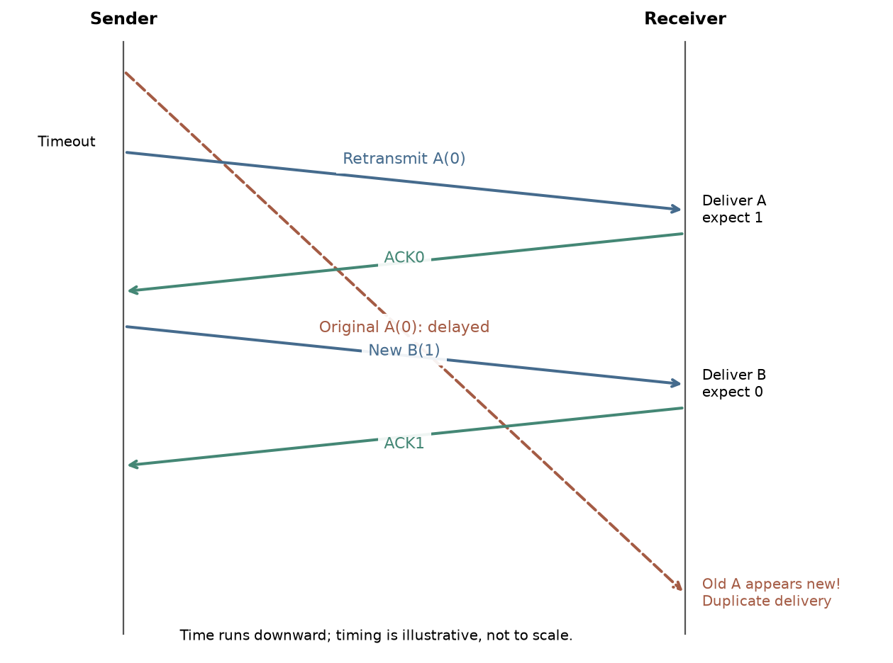
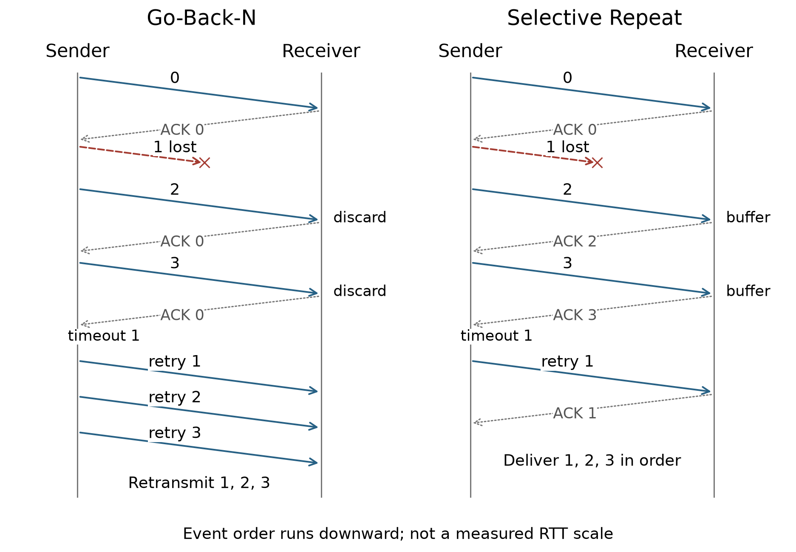

# Chapter 3 · Transport Layer（当前 part 1–2）
## 数据到了电脑，还要交对进程、补齐缺口

[课程目录](README.md) · [上一章：应用层](Chapter02.md) · [Tutorial 5](Tutorial05.md)

同一台电脑可以同时开浏览器、邮件和游戏。网络把数据送到这台电脑之后，还要知道交给哪一个程序。即使地址写对，途中也可能损坏、丢失或重复；收到半段文件不能直接说“差不多齐了”。这一章从进程寻址开始，逐步增加可靠传输需要的机制。

依据当前part1的44页和part2的26页。两份课件的幻灯片序号各自从1开始。目前整理至TCP的RTT与超时；流控、连接管理及拥塞控制待后续材料补充。

**基础补课（可跳过）：** [bit、byte与速率](../../learning/foundation-notes/NetworkBasics.md#units)、[二进制](../../learning/foundation-notes/NetworkBasics.md#binary)、[时间轴](../../learning/foundation-notes/NetworkBasics.md#timeline)。阅读时留意“第几个包”和“第几个字节”的区别，§9会具体比较。

| 主题 | 优先级 | 难度与卡点 | 掌握要求及依据 |
|---|---|---|---|
| 传输服务、复用/解复用 | 核心必会 | 中，主机/进程与端点 | 读UDP/TCP标识与回程端口；Chapter 3 part 1，第4–15张幻灯片、Tutorial 5 Q1–2 |
| UDP与校验和 | 核心必会 | 中，回卷进位 | 手算、解释检测边界；Chapter 3 part 1，第17–20张幻灯片、Tutorial 5 Q3 |
| rdt1.0–3.0 | 核心必会 | 高，双方状态与坏ACK | 逐事件解释、画乱序反例；Chapter 3 part 1，第22–44张幻灯片、Tutorial 5 Q4 |
| 停等与流水线 | 核心必会 | 中，忙碌时间/周期 | 计算利用率与吞吐；Chapter 3 part 2，第1–6张幻灯片 |
| GBN与SR | 核心必会 | 高，ACK与窗口 | 画一次丢包后的行为；Chapter 3 part 2，第7–15张幻灯片 |
| TCP序号与RTO | 核心必会 | 中，字节与估计量 | 算下一序号、累计ACK、超时；Chapter 3 part 2，第17–26张幻灯片 |
| 完整握手/流控/拥塞控制 | 后续待当前材料 | 不以“尚缺”推断不考 | 暂留历史预习，不补成教师已讲 |

[TOC]

## 1. Transport service｜IP找到主机，传输层找到应用端点

先区分网络层的主机间逻辑通信与传输层的进程间逻辑通信。以发送一段应用数据为例：应用层称它为message（消息）；传输层封装后常称segment（报文段）；再封装进网络层的datagram（数据报），通过链路层frame（帧）送到下一站。各层名称强调不同的封装，日常说packet时则需要看上下文。

TCP提供连接上的可靠有序字节流以及流控、拥塞控制；UDP提供较简单的数据报服务。可靠不表示网络永久中断也能永远交付，不表示有固定到达期限，也不等于加密。

**自测 / Check：** 一段数据已经到达正确IP地址，是否已确定交给哪一个浏览器连接？ / Does arrival at the correct host IP identify a specific browser connection?

答案 / Answer

没有。还需传输协议与端口等信息；TCP连接区分还涉及双方IP和端口。 / No. Transport endpoint information is still needed; established TCP connections use both address-port pairs.

来源：Chapter 3 part 1，第4–7张幻灯片。

## 2. Multiplexing and demultiplexing｜同一栋楼有许多门

发送端复用，把多个socket的数据交给网络；接收端解复用，看首部把数据送到相应socket。端口是传输端点标识的一部分，要与IP地址和协议一起理解。

先看一个普通、未连接的UDP接收socket：目的IP与目的端口标识接收socket，不同来源的数据报可以到同一个UDP socket。Chapter 3 part 1，第13张幻灯片的已建立TCP连接按四元组区分：源IP、源端口、目的IP、目的端口。因此服务器端同一个80端口可同时服务多个连接，只要四元组不同。

**跟做 / Worked：** C:7532→B:80、C:26145→B:80、A:26145→B:80是三条不同TCP连接。回程分别B:80→C:7532、B:80→C:26145、B:80→A:26145。后两者客户端端口相同，客户端IP仍区分连接。 / Reverse both address-port pairs for the return direction.

**实现补注：** 这里比较的是课堂的普通UDP接收与已建立TCP连接。监听socket、已接受连接及connected UDP的接口细节，可在实际编程时进一步区分。

**变式 / Transfer：** 两客户端在不同IP上都使用端口50000，连接同一个服务器443端口，是否冲突？ / Two clients with different IP addresses both use source port 50000 to connect to the same server IP and port 443. Do the established TCP connections conflict?

答案 / Answer

四元组不同，不因客户端端口数值相同而冲突。 / No: their source IP addresses distinguish the four-tuples.

来源：Chapter 3 part 1，第11张幻灯片。

## 3. UDP｜少做承诺，也少保存状态

UDP不先进行TCP式握手，也不内建重传、排序和拥塞控制。应用可以在其上增加所需功能。需要及时性的应用可能愿意舍弃过时数据，但“视频”这个标签不能唯一确定它使用UDP，HTTP自适应视频就是不同情境。

UDP首部四个16bit字段为source port、destination port、length、checksum，合计8byte。length包含UDP首部与载荷，不包含外层IP首部。100byte数据的UDP length是108byte。

**English takeaway:** UDP preserves datagram boundaries but does not provide TCP's built-in reliable ordered byte-stream service. Its length field counts the UDP header and payload.

来源：Chapter 3 part 1，第17–18张幻灯片。

## 4. Internet checksum｜算得对不等于能发现一切错误

校验和采用16bit反码加法。先把校验字段置0，把保护的数据组成定长字，逐字相加；超出16bit的进位卷回最低位，再按位取反。接收端把含checksum的字也相加，正确结果应为全1。

**跟做 / Worked：** `0xFFFF+0x0001=0x10000`。保留低16位0，最高进位1卷回，得到1；取反得到`0xFFFE`。接收端相加卷回后为`0xFFFF`。普通“溢出直接丢掉”会得到另一个错误答案。

[Tutorial5](Tutorial05.md#checksum)改用8bit以便手算，这是题目简化，不能把真实UDP首部缩成8bit。单比特翻转可被此校验发现；两个适当位置的变化可能相互抵消。检验通过不证明数据来源可信，也不等于密码学完整性认证。

**自测 / Check：** 8bit简化模型中，`11111111+00000001`的反码校验和是多少？ / In a toy 8-bit model, compute the one’s-complement checksum for words 11111111 and 00000001, including end-around carry.

答案 / Answer

回卷后00000001，再取反11111110。 / End-around carry yields 00000001, then complement to 11111110.

来源：Chapter 3 part 1，第19–20张幻灯片。

## 5. rdt1.0到rdt2.2｜每多一种故障，就多一项必要机制

先看发送和接收各自负责的动作：应用通过rdt_send把数据交给发送协议；协议调用底层不可靠通道；接收方在合适时机deliver_data。有限状态机（FSM）记录“现在等什么”，箭头上方是触发事件/条件，下方是执行动作。不能把“没有动作”的转移理解为“这个事件不存在”。

rdt1.0假设底层不损坏、不丢失。发送就交下去，接收就交上来，不需要凭空增加ACK。随着信道假设变化，机制才有理由出现。

rdt2.0加入比特损坏：checksum检测，ACK表示收到正确数据，NAK表示重发请求。但ACK/NAK本身也可能损坏。此时发送者不知道数据到底是否已交给应用；直接重发可能导致同一条数据交付两次。

rdt2.1给数据加0/1序号。接收方记录期望编号，重复包仍可回复反馈，但不能重复交付。双方状态增加，是因为必须记住这一轮在等哪个序号；“看到包”与“向上交付新数据”是两件事。

rdt2.2去掉NAK，用带编号的ACK表达接收进度：遇到损坏/非期望包，重发最近正确包的ACK。发送方据ACK的编号判断是否完成当前发送。这不等于接收方对坏数据作成功确认。

**English takeaway:** Checksums detect certain damage, acknowledgments report receiver state, and sequence numbers distinguish new data from retransmissions. Each mechanism addresses a different ambiguity.

来源：Chapter 3 part 1，第22–27张幻灯片。

## 6. rdt3.0｜坏消息会来，丢掉的消息可能一直不来

现在让模型再面对一种故障：数据或ACK可能丢失。没有反馈时不能永远等，因此发送方启动timer，超时重发当前包。收到当前包的正确ACK后停timer并进入下一编号；损坏或错误编号的ACK不能错误推进。

| 发生什么 | 发送者看见什么 | 必要行为 |
|---|---|---|
| 数据包丢失 | 没有对应ACK | 超时重传 |
| ACK丢失 | 也没有对应ACK | 超时重传；接收端辨重复，不重复交付 |
| ACK只是很慢 | 可能提前超时 | 正确处理重复包和旧ACK |

一次只允许一个未确认包在途，称stop-and-wait（停等）。例如数据0已交付、ACK0丢了：发送者超时重发0；接收者此时期待1，认出它是重复包，只补发ACK0，不再次交付。这把定时器、序号和ACK三项连成了一次恢复过程。0/1足以在原可靠性模型中区分相邻轮次，但若旧副本可任意延迟到编号重用之后，接收方可能把它当新包。这个边界正是Tutorial5 Q4要求画图说明的，不能把“序号只有两种就够”背成无条件结论。

图为补充推导，时间向下。原0包被延迟，其重传先到；随后1包也完成。接收方又等0时，最早那份旧0才到。内容已经过期，但编号恰好符合期望，因此可能被重复交付。

来源：Chapter 3 part 1，第40–44张幻灯片。

## 7. Stop-and-wait performance｜忙了8微秒，等了30毫秒

看课堂的停等传输例子：R=1Gbps，L=8000bit，单程传播15ms，RTT=30ms，忽略ACK传输和处理。发送时间$L/R=8\mu s=0.008ms$。一轮从开始发包到ACK返回，耗$RTT+L/R$。

$$
U=\frac{L/R}{RTT+L/R}=\frac{0.008}{30.008}\approx0.000266596.\tag{3.1}
$$

发送端忙碌比例约0.02666%，有效吞吐$RU\approx266596$bit/s，即0.2666Mbps。链路名义上1Gbps，却大部分时间在等。这是利用率，不是丢包率。

流水线允许ACK回来前连续发N个包。理想无损模型的利用率为

$$
U_N=\min\left(1,\frac{N L/R}{RTT+L/R}\right).\tag{3.2}
$$

窗口越大，可填补等待；但不能超过100%。本例达到满利用需$N\ge3751$。这是忽略其他瓶颈与ACK成本的模型结果，不是给真实TCP直接配置3751就必然满速。

**迁移 / Transfer：** 同样RTT与包长，R改为100Mbps，停等吞吐是否变为原来的十分之一？ / Recompute after reducing R to 100 Mbps.

答案 / Answer

$L/R=0.08ms$，$U=0.08/30.08$，吞吐约0.2660Mbps，仍主要受等待限制。 / About 0.2660 Mbps; stop-and-wait remains dominated by the RTT.

来源：Chapter 3 part 2，第1–4张幻灯片。

## 8. GBN与Selective Repeat｜后面的包到了，要不要先收好？

流水线传输有两种值得比较的做法。Go-Back-N（GBN，回退N步）发送者可有N个未确认包，base表示最早未确认序号，nextseqnum表示下一新包序号。累计ACK(n)表示直到n都已收齐。基本模型只给最早未确认包设timer，超时从base重传所有已发未确认包；接收方丢弃乱序包，重复确认最后连续收到的包。

Selective Repeat（SR，选择重传）分别确认正确收到的包，缓存窗口内乱序包，每个未确认包有自己的超时逻辑。某包超时只重传该包；应用仍需按序交付，不能因为缓存里有后段就跳过前段缺口。

**同一场景 / Worked：** 窗口足以容纳四包，序号不回绕；依次发0、1、2、3，只丢数据1，没有其他丢失或重排。 / Both protocols have sufficient window space, with no sequence-number wraparound. Send packets 0–3; only packet 1 is lost, and all other data and ACKs arrive without reordering. GBN收到0后ACK0，收到2和3均丢弃并ACK0，超时通常重传1、2、3。SR可缓存2和3并分别ACK2/ACK3，等1补上后连续交付1、2、3。这是包序号，尚不是TCP字节ACK。

*教学时序图：两边都只发送0–3这一批，窗口足够大，只有数据1丢失，ACK均成功，未发生序号回绕。纵向表示事件顺序，不按真实RTT比例。GBN丢弃2和3后重传1–3；SR先存好2和3，只补1。图中省略了GBN重传后的正常累计ACK。*

**独立题 / Check：** 第一批发0–7，只有数据6丢失，无重排、ACK无丢失，窗口足够发完这批，序号不回绕。在任何重传开始前，GBN与SR接收端分别发哪些ACK？ / In the first batch, send packets 0–7 with a sufficiently large window and no sequence-number wrap. Only data packet 6 is lost; there is no reordering or ACK loss. List each receiver's ACKs before any retransmission.

答案 / Answer

GBN：0,1,2,3,4,5,5。SR：0,1,2,3,4,5,7。总共7个，因为丢失包没到达，不产生ACK。 / Seven ACKs in each case; their final value differs.

序号空间必须足够，避免旧包与新包混淆；一般SR窗口限制的完整论证属于补充，可回现有微课。当前Chapter 3 part 2，第13–15张幻灯片侧重窗口、缓存与逐包确认。

来源：Chapter 3 part 2，第5–15张幻灯片。

## 9. TCP序号｜从“第几个包”切换到“下一个字节”

TCP首部记录了通信和控制所需的信息：源/目的端口、序号、确认号、接收窗口、校验和、控制标志等。MSS是每段可携带的数据上限，不包含所有协议首部。

TCP segment序号是该段第一个数据字节的位置；累计ACK是下一期望字节。收到0–535后，ACK为536，而不是535。后一段先到不能让连续前缀跨过缺口；基本讨论也不能把“是否缓存乱序”与“是否交给应用”混为一谈。

**跟做 / Worked：** seq=1000且含500byte，覆盖1000–1499；若此前均收齐，ACK1500。收到的不是“1000号包”，不能简单加1。

在课堂的Telnet回显例子中，两端各有自己的字节序列；回显字符属于反方向的数据，一个段可以同时携带本方向数据和对反方向的ACK。不要用一个共享计数器给整个双向连接编号。

**English takeaway:** A TCP sequence number locates the first payload byte; a cumulative ACK identifies the next expected byte. Each direction has its own byte sequence.

来源：Chapter 3 part 2，第17–23张幻灯片。

## 10. RTT与重传超时｜等多久才有理由怀疑包丢了？

超时设置需要权衡：过短会误重传，过长会拖慢真正丢包的恢复。SampleRTT是一次测得的往返时间，EstimatedRTT是平滑估计：

$$
E_{new}=(1-\alpha)E_{old}+\alpha S,\quad\alpha=0.125\text{为课件常用值}.\tag{3.3}
$$

S是本次样本，E与S都以相同时间单位计。历史样本的影响指数衰减。波动用DevRTT近似：$D_{new}=(1-\beta)D_{old}+\beta|S-E|$，课件常用β=0.25；超时$RTO=E+4D$。D不是“又一份平均RTT”，而是安全余量相关的波动量。

把两项都算一次（教学例）：旧E=100 ms、旧D=10 ms，本次S=140 ms，取alpha=0.125、beta=0.25。**本例约定先更新E，再把新E代入D的式子。** / Start with E=100 ms, D=10 ms and S=140 ms, with alpha=0.125 and beta=0.25. In this teaching calculation, update E first and use the new E in the deviation update.

| 步骤 | 代入 | 结果 |
|---|---|---:|
| 平滑RTT | 0.875×100+0.125×140 | 105 ms |
| 与新估计的偏差 | abs(140−105) | 35 ms |
| 平滑波动 | 0.75×10+0.25×35 | 16.25 ms |
| 本例超时 | 105+4×16.25 | 170 ms |

如果题目规定D固定为10 ms，则是105+40=145 ms；若用旧E更新D，又会得到另一值。做题时要把采用的更新顺序写明，不能把不同约定的结果直接比较。

**变式 / Transfer：** 从同样的旧E=100 ms、旧D=10 ms重新开始，S改为80 ms，仍先更新E再更新D。求E、D、RTO。 / Restart from E=100 ms and D=10 ms, but use S=80 ms. Keep the same coefficients and update order. Find the new E, D and RTO.

**答 / Answer：** E=97.5 ms；偏差17.5 ms，D=11.875 ms；RTO=145 ms。 / E=97.5 ms, D=11.875 ms, RTO=145 ms.

超时样本还涉及重传后无法确定ACK对应哪次发送的歧义，原Chapter 3 part 2，第24张幻灯片因此强调不把重传段直接用于SampleRTT。真实TCP的最小超时与退避规则需另参协议规范；本节只做课件给定模型，不把本例算出的毫秒数当所有系统应采用的配置值。

来源：Chapter 3 part 2，第24–26张幻灯片。

## 11. 回到老师的题目

[Tutorial5](Tutorial05.md)前两题检查端点、方向和解复用；Q3检查反码加法及漏检；Q4要求你给可靠性结论找模型反例。先完成这些，再复习[N150](https://crazyshout.github.io/micro-course/cards.html#CS5222-N150)、[N154](https://crazyshout.github.io/micro-course/cards.html#CS5222-N154)、[N158](https://crazyshout.github.io/micro-course/cards.html#CS5222-N158)、[N167](https://crazyshout.github.io/micro-course/cards.html#CS5222-N167)。

英文自测：Why can different clients share server port 80? What ambiguity do sequence numbers solve? Why is a timer needed? Why can a delayed duplicate defeat alternating-bit assumptions? How do packet ACKs differ from TCP ACKs?

最低要点 / Key points：完整端点不同；分清新数据与重传；丢失时无反馈；旧编号可能被重用；TCP确认下一个字节。 / Different endpoint tuples; distinguish new data from retransmissions; loss may produce no feedback; old numbers can be reused; TCP acknowledges the next byte.

## 来源覆盖索引

| 原页 | 讲义位置 |
|---|---|
| Chapter 3 part 1，第1–3、8、16、21张幻灯片 章节范围与目录 | 开头、各节顺序；后续目录不计为已下载正文 |
| Chapter 3 part 1，第4–7张幻灯片 传输服务、层间关系 | §1 |
| Chapter 3 part 1，第9–15张幻灯片 复用、UDP/TCP解复用与图例 | §2 |
| Chapter 3 part 1，第17–20张幻灯片 UDP与checksum | §3–4 |
| Chapter 3 part 1，第22–27张幻灯片 可靠传输接口与FSM | §5 |
| Chapter 3 part 1，第28–39张幻灯片 rdt1.0、2.0、2.1、2.2 | §5 |
| Chapter 3 part 1，第40–44张幻灯片 rdt3.0与四种时序情境 | §6 |
| Chapter 3 part 2，第1–4张幻灯片 停等与流水线利用率 | §7 |
| Chapter 3 part 2，第5–15张幻灯片 GBN/SR、窗口、状态与丢包 | §8 |
| Chapter 3 part 2，第16张幻灯片 目录 | 当前范围提示 |
| Chapter 3 part 2，第17–23张幻灯片 TCP概览、首部、seq/ACK、Telnet | §9 |
| Chapter 3 part 2，第24–26张幻灯片 RTT与timeout | §10 |

原页序保留，示意图与数值算例标为补充；后续part未提供的内容可在历史预习中选读。当前范围见开头说明。