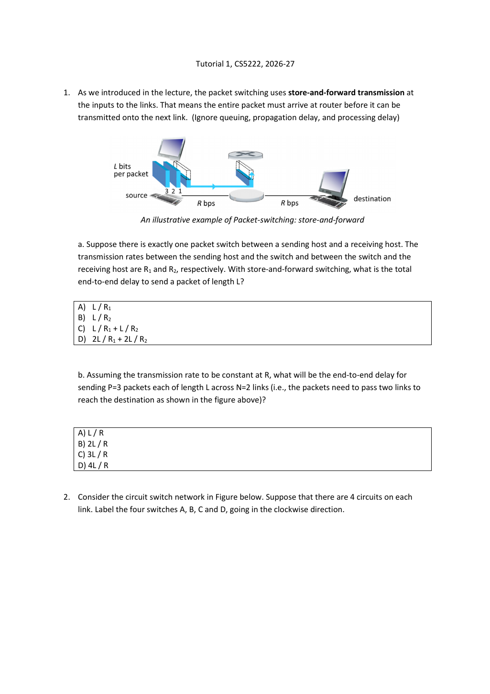
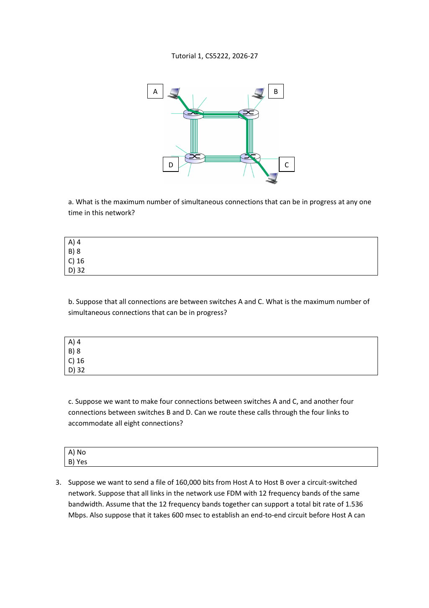
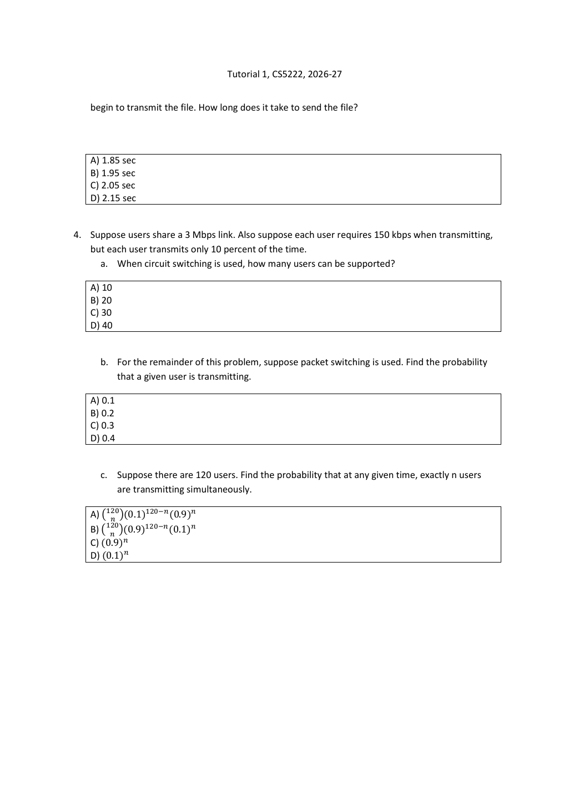

# Tutorial 1 · Switching, circuits and sharing｜把链路模型算清楚

[Chapter 1](Chapter01.md#switching) · [课程目录](README.md) · [下一份Tutorial](Tutorial02.md)

按当前 原题PDF（3页） 的Q1–4逐题讲解，并对照 教师解答PPT（10页）。下文“教师结论”指该文件；推演、时间表和变式由整理者补充。所有选择题的原选项在原页图中，正文给出推理步骤。

**可选先修：** [bit/byte与速率](../../learning/foundation-notes/NetworkBasics.md#units)、[流水线时间轴](../../learning/foundation-notes/NetworkBasics.md#timeline)、[组合概率](../../learning/foundation-notes/MathForML.md#combinations)。

| 原题 | 优先级 | 难度/卡点 | 本题检验；依据 |
|---|---|---|---|
| Q1 | 核心必会 | 中；不同包可以重叠 | 画存储转发时间轴；Tutorial 1教师解答，第3–4张幻灯片 |
| Q2 | 核心必会 | 中；每次连接占用哪些边 | 给出可行路由与容量上界；Tutorial 1教师解答，第6–7张幻灯片 |
| Q3 | 核心必会 | 低；单电路速率 | 单位换算与建立时延；Tutorial 1教师解答，第9张幻灯片 |
| Q4 | 核心必会 | 中；独立与组合数 | 容量和人数分布；Tutorial 1教师解答，第10张幻灯片 |

学习优先级依据当前原题与教师解答。

## Q1. Store-and-forward｜先等整包到，再转发

**完整条件 / Conditions:** 一个源主机、一个分组交换机、一个目的主机；两条链路速率为R₁、R₂，包长L bit。存储转发，忽略排队、传播和处理时延。b问改为相同速率R，P=3个L-bit包跨N=2条链路。 / One switch connects a sender and receiver through links R₁ and R₂. Packets contain L bits. Use store-and-forward and ignore queueing, propagation and processing. In part b, three equal packets cross two equal-rate R links.

**a的推演：** t=0开始发送；t=L/R₁时整包抵达交换机；交换机此时才开始第二段，又花L/R₂。因此教师结论为

$$d=L/R_1+L/R_2\quad\text{（选C）}.$$

不是 $L/(R_1+R_2)$，因为这两条链路是先后经过，不是并行拼成一条更快链路。

**b的推演：** 令T=L/R，把每段链路当成一次只能发送一包的工位：

| 时段 | 源→交换机 | 交换机→目的 |
|---|---|---|
| 0到T | 包1 | 等待整包1 |
| T到2T | 包2 | 包1 |
| 2T到3T | 包3 | 包2 |
| 3T到4T | 无 | 包3 |

最后整包到达时间4T=4L/R，选D；与教师解答第4页 $(P+1)L/R$ 一致。一般等速N跳为 $(P+N-1)L/R$，但必须保留本题全部简化条件。

**English answer:** (a) L/R₁+L/R₂. (b) 4L/R. Store-and-forward constrains each packet, but separate links can transmit different packets simultaneously.

**变式 / Transfer:** 5个包、3条同速链路，同样忽略其他时延，多久？ / Five packets cross three equal-rate links under the same assumptions. Find completion time.

答案 / Answer

7L/R。第一包3L/R，之后4个每隔L/R到。 / 7L/R: three intervals for the first packet, then four further intervals.

## Q2. Circuit capacity｜数连接，也要数它消耗了几条边

**条件 / Conditions:** A、B、C、D顺时针围成四边环，每条边4条电路，一次连接在路径每条边占一条电路。 / Four switches A,B,C,D form a clockwise ring; each link supports four circuits. A connection uses one circuit on every traversed link.

**a 最大任意连接数 / Maximum arbitrary simultaneous connections:** 让每条边只承载相邻两点之间的连接，每边4个、4条边，总16，选C。上界也为16，因为全网总共16份“边电路”且每连接至少占一份，所以这个构造达到上界。

**b 全部A到C / All connections from A to C:** 每个至少两跳，可分别走A–B–C与A–D–C，各4，总8，选B。A出发仅8份电路，给出同样的上界；不是16÷4，因为每连接没有绕完整一圈。

**c 四个A–C加四个B–D / Four A–C plus four B–D:** 可行，选B（Yes）。按教师方案：A–C中2个经B、2个经D；B–D中2个经A、2个经C。

| 路径 | 连接数 | 占用的边 |
|---|---|---|
| A–B–C | 2 | AB、BC |
| A–D–C | 2 | AD、DC |
| B–A–D | 2 | BA、AD |
| B–C–D | 2 | BC、CD |

逐边相加AB=4、BC=4、CD=4、DA=4，不超过容量。不要只说“总共8小于16，所以可以”，那忽略了路径可能挤在同一条边。

**English answer:** (a)16; (b)8; (c)Yes, split each opposite-pair demand evenly between its two two-hop paths. Every link then carries exactly four circuits.

**变式 / Transfer:** 每边只有3条电路，全部A–C最多多少？ / With three circuits per link, what is the maximum for A–C connections only?

答案 / Answer

6，两条边不重叠路径各3。 / Six, with three on each disjoint two-hop path.

## Q3. FDM and setup｜总速率不等于你的那一份

**条件 / Conditions:** 文件160000 bit；电路网络用12个等宽频带，总速率1.536 Mbps，建立端到端电路需600 ms，随后才发文件。求总时间。 / A 160000-bit file uses one of twelve equal-rate FDM circuits sharing 1.536 Mbps. Circuit setup takes 600 ms before transmission. Find total time.

每电路速率 $1.536\times10^6/12=128000$bit/s。发送用 $160000/128000=1.25$s，加setup0.6s，共**1.85s，选A**。教师解答第9页相同。题目仅计建立和发送时延。

**English answer:** Each circuit supplies 128 kbps; 1.25 s transmission plus 0.60 s setup gives 1.85 s.

常见错法：直接除总速率1.536Mbps；把600ms当600s；把160000bit再乘8（本来就已经是bit）。

**变式 / Transfer:** 同电路发送320000bit、setup不变，总时间？ / Double the file size to 320000 bits without changing setup or circuit rate.

答案 / Answer

2.5+0.6=3.1s。 / 3.1 s. 文件翻倍只让发送部分翻倍，不把建立时延翻倍。

## Q4. Statistical multiplexing｜算人数前，先说是否独立

**条件 / Conditions:** 共享3Mbps；每人活跃时需150kbps，每人10%时间活跃。a用电路交换；b/c用分组交换，c共有120用户。 / Users share 3 Mbps, each requiring 150 kbps when active, with activity fraction 10%. Part a uses circuits; parts b/c use packet switching, with 120 users in c.

a 每用户预留150kbps，可容纳 $3\times10^6/(150\times10^3)=20$人，选B。不把它再除活跃比例，电路资源已经预留。

b 随机时刻某用户活跃概率0.1，选A。把长期活跃比例作为该随机时刻概率，是题目的稳态抽样约定。

c 在**用户独立、每人同为p=0.1**的模型下，K~Binomial(120,0.1)，恰n人活跃概率

$$P(K=n)=\binom{120}{n}(0.1)^n(0.9)^{120-n},\quad n=0,1,\ldots,120.$$

对应原选项B（其因子顺序先写0.9）。组合数选出哪些人在发；0.1乘n次、0.9乘其余120−n次。原题没有清楚写独立，教师二项解答隐含这个假设，不能遗漏。

**English answer:** (a)20 users; (b)0.1; (c)choose(120,n)·0.1ⁿ·0.9¹²⁰⁻ⁿ, assuming independent user activity.

平均活跃人数Np=12并不意味着始终12人；容量20也不保证任何时刻都够用。补充：超额事件为K>20，应该求从21起的尾概率，不是只算K=20或K=21。超额需求可用同一个人数分布继续计算。

**变式 / Transfer:** 3个独立用户、p=0.1，容量可同时容纳2人，超额概率？ / Three independent users have p=0.1 each; capacity supports two. Find excess-demand probability.

答案 / Answer

三人全活跃，0.1³=0.001。 / All three must be active, giving 0.001.

## 回查与巩固

所有数值与环路逐边占用由 [network_examples.py](tools/network_examples.py) 复算。原题PDF p1=Q1/Q2引入，p2=Q2/Q3引入，p3=Q3继续/Q4；Tutorial 1教师解答，第1–2张幻灯片背景、3–4Q1、5电路图、6–7Q2、8FDM/TDM、9Q3、10Q4均已对应。

复习使用[现有Tutorial1卡](https://crazyshout.github.io/micro-course/cards.html#CS5222-N071)，首选N071/N072（存储转发）、N076（FDM）、N077（人数与容量），以及[Chapter1](Chapter01.md#qa)相关题。学习完应能用英文解释 *why*，不只记住C/D/B这些选项字母。
