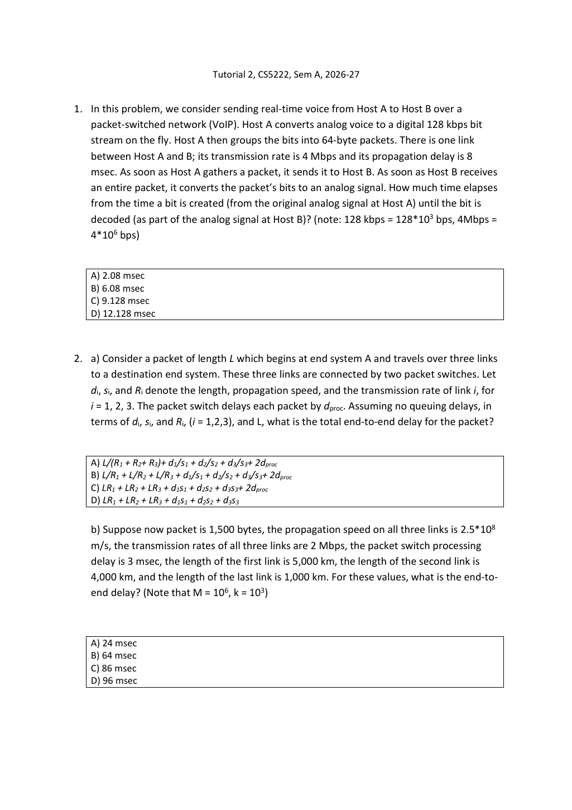
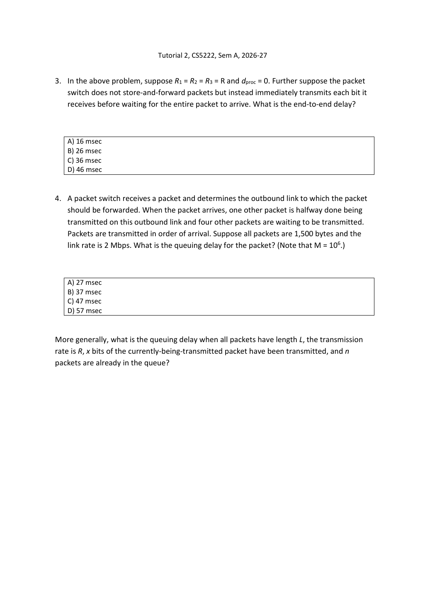

# Tutorial 2 · Delay and traceroute｜先定义计时事件，再按顺序相加

[Chapter 1](Chapter01.md#delay) · [课程目录](README.md) · [Tutorial 1](Tutorial01.md) · [Assignment 1](Assignment01.md)

依据当前 原题PDF（3页） 与 教师解答PPT（13页），按Q1–5讲解。难点是计时边界与转发模型；优先级均为核心必会，Q1/Q3中等偏难，Q2/Q4中等，Q5需实际观察与解释。优先级依据当前Tutorial。

**基础复习（可跳过）：** [单位](../../learning/foundation-notes/NetworkBasics.md#units)、[首位与末位时间轴](../../learning/foundation-notes/NetworkBasics.md#timeline)。所有计算约定Mbps=10⁶bit/s、kbps=10³bit/s。

<a id="q1"></a>
## Q1. VoIP｜语音先攒成一包，还要算这段等待



**完整条件 / Conditions:** A以128kbps实时生成语音比特，每64byte成一包，收集完成立即发送；链路4Mbps、传播8ms，B收完整包后还原模拟语音。问生成一个bit到它被解码的时延。 / A generates voice at 128 kbps, groups it into 64-byte packets and immediately transmits each completed packet over a 4-Mbps link with 8-ms propagation. B decodes after receiving the complete packet. Find generation-to-decoding delay.

先按包首位及连续流体近似计算：包长512bit；收集一包 $512/128000=4$ms；把包送上链路 $512/4000000=0.128$ms；传播8ms。首位从生成到可开始播放的延迟为 **12.128ms，选D**，与Tutorial 2教师解答，第5张幻灯片结论一致。

这里“任意一位”还要区分读取与播放这两个时刻。一个包内越晚产生的bit等待成包越短；若问“该bit到达整包缓冲、可被读取”的延迟，数值随位次变化，约从12.128ms降到8.128ms。若接收端在包到齐后，**按与源相同128kbps的节奏顺序恢复/播放语音**，后面的bit在接收端也会多等相同位次时间，因此每个bit的生成到播放时延相同，都是12.128ms。教师“all bits”的说法应连着这个播放约定读。

设第j位相对首位晚产生 $\tau_j$，包到达时刻T=12.128ms；可读取延迟为T−τⱼ，顺序播放时刻为T+τⱼ，播放延迟则(T+τⱼ)−τⱼ=T。因此，答题前要确定问的是可读取时刻还是播放时刻。

**English answer:** Under the instructor's packetization and source-rate sequential playout model, the delay is 4+0.128+8=12.128 ms for every bit. Complete-packet availability alone gives a position-dependent delay.

**变式 / Transfer:** 包改128byte，其他条件不变，首位/同速播放时延？ / Double packet size to 128 bytes, keeping all rates and propagation unchanged.

<details markdown="1"><summary>答案 / Answer</summary>

8+0.256+8=16.256ms。 / 16.256 ms. 较大包减少每份数据的头部比例，但收集等待变长；本题没有给头长，不计算额外百分比。

</details>

<a id="q2"></a>
## Q2. Three store-and-forward links｜每一跳的发送与传播都要数

**条件 / Conditions:** 长L的包经三条链路，两台存储转发交换机；第i链路长dᵢ m、传播速度sᵢ m/s、发送速率Rᵢ bit/s，每台交换机处理时延dproc，无排队。 / A length-L packet crosses three store-and-forward links and two switches. Link i has length dᵢ, propagation speed sᵢ and rate Rᵢ; each switch adds dproc and there is no queueing.

a 把事件从左到右排：链路1发送/传播 → 交换机1处理 → 链路2发送/传播 → 交换机2处理 → 链路3发送/传播。

$$d_{end}=\sum_{i=1}^3\frac L{R_i}+\sum_{i=1}^3\frac{d_i}{s_i}+2d_{proc}\quad\text{（选B）}.$$

b 给定L=1500byte=12000bit，各R=2Mbps，各s=2.5×10⁸m/s，距离5000/4000/1000km，每交换机3ms：

| 部分 | 计算 | 结果 |
|---|---|---|
| 三段发送 | 每段12000/(2×10⁶) | 6+6+6ms |
| 三段传播 | 每段先km→m再除s | 20+16+4ms |
| 两次处理 | 2×3ms | 6ms |
| 总计 | 18+40+6 | **64ms，选B** |

**English answer:** Sum the three serialization times, three propagation times and two processing times. The numerical total is 64 ms.

这里包长L在公式中必须是bit；若直接使用1500需在分子明确乘8。处理是两台交换机，不是三条链路所以乘3。

<a id="q3"></a>
## Q3. Immediate bit forwarding｜不用每个中间节点再等整包



**条件 / Conditions:** 沿用Q2，R₁=R₂=R₃=R、dproc=0，无排队，中间节点每收到一bit立即转发，不等整包。 / Use the Q2 path, equal rates and zero processing; each bit is forwarded immediately with no whole-packet waiting or queueing.

首位经过各传播段，末位相对首位只落后源端一次L/R。故总为 $L/R+\sum_i d_i/s_i$。带Q2数字为6+20+16+4=**46ms，选D**，Tutorial 2教师解答，第8张幻灯片相同。

这不表示物理链路“传输时间消失”，而是各段的发送过程可以流水重叠，末位到达总时间只额外保留一次包序列长度。不同速率、实际cut-through启动/头部检查有其他限制；不要把这个理想模型直接当所有交换机行为。

**English answer:** Equal-rate immediate bit forwarding gives L/R plus all propagation delays, hence 46 ms. Serialization on successive links overlaps.

**变式 / Transfer:** 四条相同速率链路，每条传播2ms，源包发送3ms，即时转发和整包存储转发分别多久？ / Four equal-rate links each propagate for 2 ms; serialization takes 3 ms. Compare immediate bit forwarding with store-and-forward for one packet.

<details markdown="1"><summary>答案 / Answer</summary>

即时3+4×2=11ms；存储转发4×3+4×2=20ms，忽略排队/处理。 / 11 ms versus 20 ms, with no queueing or processing.

</details>

<a id="q4"></a>
## Q4. Queueing｜只算轮到你之前的等待

**条件 / Conditions:** 新包到达时，出口上一个1500byte包已发一半，还有4包等待，均1500byte，FIFO，R=2Mbps。求新包排队时延，再推广为包长L bit、当前包已发送x bit、另有n包排队。 / A new packet finds one equal packet half transmitted and four equal packets queued, FIFO, L=1500 bytes and R=2 Mbps. Find queueing delay, then generalize to x bits already transmitted and n waiting packets.

前面剩4.5包，$4.5\times12000/(2\times10^6)=0.027$s=**27ms，选A**。一般式为

$$d_{queue}=\frac{(L-x)+nL}R.$$

**English answer:** Queueing delay is 27 ms, or ((L−x)+nL)/R. It excludes transmission of the arriving packet itself.

若问它**完成发送**的时间，则另加L/R；若問到目的地还要加传播及后续节点条件。若出口本来空闲，就不是这条“有一个正在发送包”的场景，等待为0。

**变式 / Transfer:** 同速同包长，当前包已发75%，队列前面还有2包，新包排队多久？ / The current packet is 75% transmitted and two packets are queued ahead. Find the new packet's queueing delay.

<details markdown="1"><summary>答案 / Answer</summary>

2.25×6=13.5ms。 / 13.5 ms. 不是加上新包自己的6ms变成19.5ms。

</details>

<a id="q5"></a>
## Q5. Traceroute｜把真实测量和推断分开写

**原任务 / Task:** 对cityu.edu.hk运行traceroute，解释每列、星号和后跳RTT较小的原因。 / Run traceroute to cityu.edu.hk and explain its columns, asterisks, and non-monotonic RTTs.

macOS可运行原命令 `traceroute cityu.edu.hk`。下方2026-09-23的观测使用：

```sh
traceroute -n -m 12 -q 3 -w 1 cityu.edu.hk
```

`-n`保留数值IP，`-m 12`最多12跳，`-q 3`每跳3次探测，`-w 1`每次最多等1秒。这些参数用于限制本次探测的长度与等待时间，并非题目指定值。输出与时间见2026-09-23观察，采集脚本为observe_network.py。

每行第一项为TTL/hop编号，随后为响应地址和三次RTT（ms）；某次无及时响应显示`*`。地址识别的是响应接口，复杂网络里不保证完整暴露每一台中间设备。macOS常用UDP探测和ICMP响应；Windows `tracert`的实现细节不同，不应机械照搬命令选项。

星号可以来自过滤、应答限速、探测/响应丢失、超时等。Tutorial 2教师解答，第12张幻灯片强调防火墙是常见原因，但仅凭星号不能确定具体根因。后跳RTT小于前跳，可能因为不同时刻队列变化、回程路由不同、路由器处理探测优先级不同；RTT也不是沿途正向传播的逐段累加测量。

**English answer:** Columns identify probe hop, responding address and round-trip times. An asterisk means no response within the timeout. Different probes and return paths can produce non-monotonic RTTs.

**本轮实际观察（2026-09-23 01:19，UTC+8）：** 域名解析有两个地址，traceroute选用45.60.199.218；第1跳三个RTT约4.352/3.957/4.301ms，第7跳有星号，第11跳第三次升到192.365ms。在最多12跳内没有看到目的地址响应，故这不是完整路径。进程正常结束也不表示探测已到终点。同一跳有不同地址响应，不足以断言一条固定唯一线路。

你自己的观测应另记时间、探测参数和实际输出；换时间或网络，路径和RTT可能变化。

## 回查与巩固

原题p1=Q1/Q2，p2=Q3/Q4，p3=Q5。Tutorial 2教师解答，第1–4张幻灯片为四类时延/车队背景（见Chapter1），5=Q1，6–7=Q2，8=Q3，9=Q4，10–11=traceroute课堂示例，12–13=Q5解释。全部已对应，原教师结论与本文补充条件分开。

计算复核：[network-example-results.json](network-example-results.json)。复习可用[现有时延卡N025](https://crazyshout.github.io/micro-course/cards.html#CS5222-N025)与[原题卡N080](https://crazyshout.github.io/micro-course/cards.html#CS5222-N071)，根据本题错误位置，复习单位、时序、转发或排队的相关概念。
