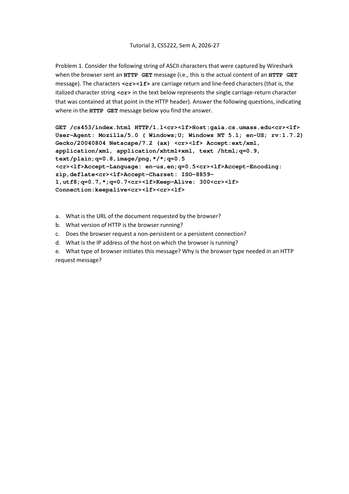
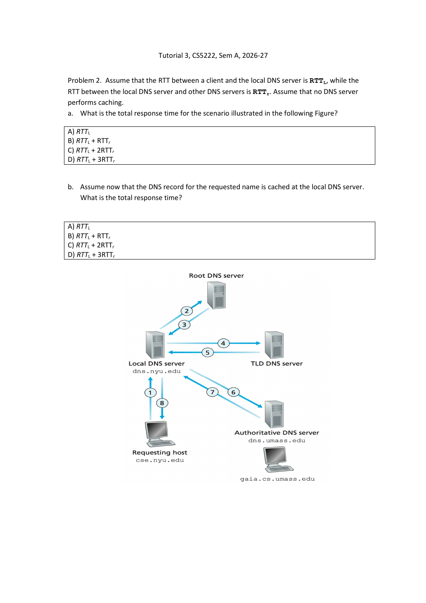
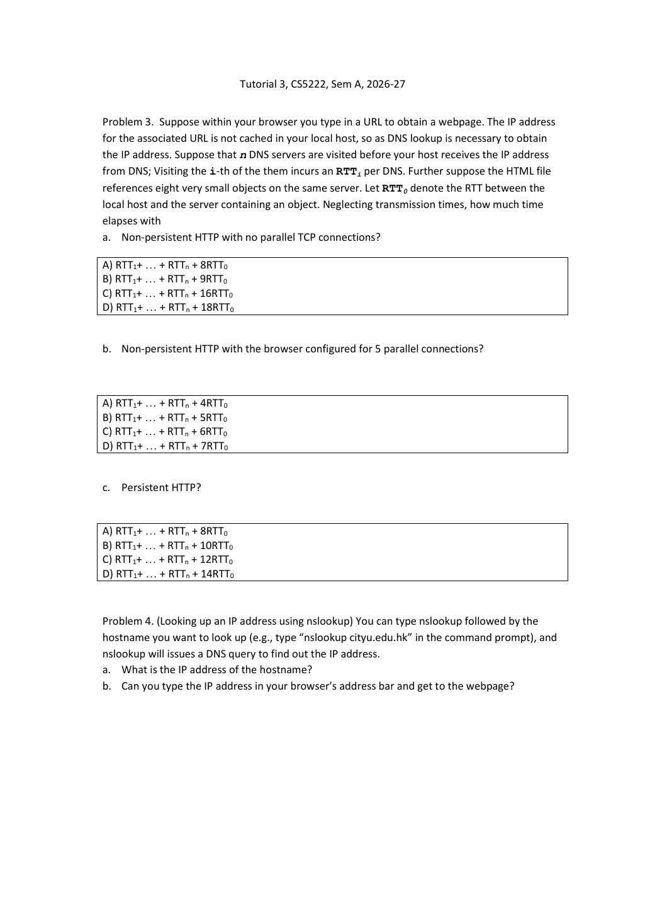
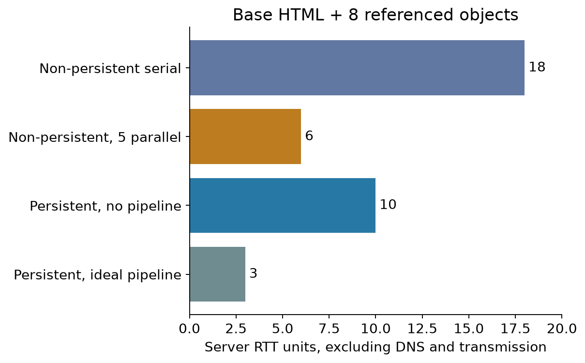

# Tutorial 3 · HTTP and DNS｜从报文证据走到时间计算

[Chapter 2](Chapter02.md) · [课程目录](README.md) · [Assignment 1](Assignment01.md)

依据当前 原题PDF（3页），按Problem1–4展开。已补充对照Tutorial 3教师解答，第13张幻灯片页：Tutorial 3教师解答，第3–4张幻灯片对应Q1，Tutorial 3教师解答，第8张幻灯片对应Q2，Tutorial 3教师解答，第11–13张幻灯片对应Q3；Q4未给当前测量答案。以下保留教师结论与整理补充的区别。Q1/Q2/Q3为核心必会（中等难度，卡在字段证据与RTT条件），Q4为常规掌握的实际操作任务（需区别观察和推断）。

可选先修：[ASCII、CRLF与报文](../../learning/foundation-notes/NetworkBasics.md#messages)、[时间轴](../../learning/foundation-notes/NetworkBasics.md#timeline)。

<a id="q1"></a>
## Problem 1. Read an HTTP request｜不知道的就明确说不知道



**任务 / Task:** 原题给出Wireshark看到的一段HTTP GET的ASCII内容，`<cr><lf>`代表实际单字节CR、LF。指出URL、HTTP版本、是否持久、浏览器主机IP、浏览器类型及该字段的用途。 / From the supplied HTTP GET bytes, identify the URL, version, connection preference, client IP, and user-agent type and purpose, citing the relevant fields.

为便于定位，下面仅摘录与答案直接相关的原字段；完整报文（包括Accept各项及原拼写）见上图：

```text
GET /cs453/index.html HTTP/1.1<cr><lf>
Host:gaia.cs.umass.edu<cr><lf>
User-Agent: Mozilla/5.0 ( Windows;U; Windows NT 5.1; en-US; rv:1.7.2)
Gecko/20040804 Netscape/7.2 (ax) <cr><lf>
Keep-Alive: 300<cr><lf>
Connection:keepalive<cr><lf><cr><lf>
```

a. **URL / 请求地址：** 按题目传统明文HTTP情境，`http://gaia.cs.umass.edu/cs453/index.html`；Host给主机，GET行给路径。若孤立看这些应用字节，并不能独立证明外层是否经过TLS，方案http来自题目情境。 / Under the exercise's plain-HTTP context, combine Host and the request target to obtain this URL.

b. **Version / 版本：** 请求行明确`HTTP/1.1`。 / The request line states HTTP/1.1.

c. **Connection / 连接：** 题意为持久连接。原`keepalive`不是规范常见的`keep-alive`拼写，但HTTP/1.1默认可持久，且这里未见`Connection: close`；不要把拼写错误当新标准token。头表达客户端意图，不单独证明服务器实际维持了多久。[RFC9112 §9.3](https://www.rfc-editor.org/rfc/rfc9112) / The intended answer is persistent HTTP, consistent with HTTP/1.1 defaults; the header alone does not prove the connection's observed lifetime.

d. **Client IP / 浏览器主机IP：** 给出的HTTP头没有源IP，无法仅据此确定。`gaia.cs.umass.edu`是请求目标，不能当客户端。需原IP包头/捕获上下文。 / The client IP cannot be determined from these HTTP fields; inspect the enclosing IP header or capture metadata.

e. **Browser / 浏览器：** Tutorial 3教师解答，第4张幻灯片简答写Mozilla/5.0；完整User-Agent还自称Netscape/7.2，并带Mozilla/Gecko兼容信息。课堂作答可以指出教师采用的token，同时说明完整字段不只一个产品名。服务器可能据此作兼容处理、统计或内容选择；不要求每种浏览器都必须得到不同页面，也不是身份认证证据。 / The field claims Netscape 7.2 with Mozilla/Gecko compatibility tokens. It can support compatibility handling or analytics, but is self-reported and spoofable.

**独立变式 / Transfer:** `GET /a.png HTTP/1.1`、`Host: example.com`、`Connection: close`，能判断路径、连接意图及客户端IP吗？ / Identify the path and connection preference, and determine whether these fields reveal the client IP.

<details markdown="1"><summary>答案 / Answer</summary>

路径/a.png；请求关闭连接；不能确定客户端IP。 / Path /a.png, requested connection closure, client IP unavailable from these fields.

</details>

<a id="q2"></a>
## Problem 2. DNS resolution｜一对箭头才是一次往返



**条件 / Conditions:** client到local DNS的RTT为RTT_L，local到其他DNS每次RTT为RTT_r。a无任何缓存，按图依次访问root、TLD、authoritative；b所需记录已在local缓存。忽略额外处理与传输大小。 / The client-local RTT is RTT_L; each local-remote DNS RTT is RTT_r. Follow the figure's sequential root, TLD and authoritative queries without caches, then consider a local cache hit.

a 1/8合成一次client-local往返，2/3、4/5、6/7分别三次local-remote往返。总 **RTT_L+3RTT_r，选D**。不是8RTT，因为图上8条单向消息不能各算一次来回。

b local直接回答，有效缓存无需再查询上级，所以 **RTT_L，选A**。本题缓存只在local；若题设改为客户端本身已有可用缓存，网络DNS往返又不同。

**English answer:** (a)RTT_L+3RTT_r; (b)RTT_L. Count round trips, not individual arrows, and locate the cache precisely.

**变式 / Transfer:** RTT_L=4ms、RTT_r=20ms，无缓存与local命中分别多久？ / Compute both cases for these RTTs.

<details markdown="1"><summary>答案 / Answer</summary>

64ms与4ms。 / 64 ms and 4 ms. 缓存减少的是后续查询，不让client到local的往返也凭空消失。

</details>

<a id="q3"></a>
## Problem 3. A page with eight objects｜先取目录，再知道要取哪八件东西



**条件 / Conditions:** 域名未缓存，顺序DNS查找代价 $D=\sum_{i=1}^n RTT_i$。base HTML引用同一服务器的8个很小对象；client-server RTT为RTT₀，忽略发送时间。先得到HTML才能知道对象地址。 / Sequential DNS costs D=ΣRTTᵢ. One base HTML file references eight small objects on the same server; server RTT is RTT₀ and transmission times are negligible. Object requests start after the base HTML is received.

a **Non-persistent, serial / 非持久且无并行：** 共9个对象，每个1RTT握手+1RTT请求返回，所以 **D+18RTT₀，选D**。

b **Non-persistent, five parallel connections / 非持久最多5并行：** HTML先用2RTT；8对象分两批（5+3），每批各2RTT，合计 **D+6RTT₀，选C**。不能把HTML也塞入尚未解析出来的8对象同一批。

c **Persistent / 持久：** 原题未明说是否pipelining；新到Tutorial 3教师解答，第13张幻灯片明确按逐个请求计算，确认采用单连接**无流水线**。结合给出的选项，一次握手+HTML一次往返+8对象各一次，共 **D+10RTT₀，选B**。若另加“拿到HTML后流水线一次发完8请求”的理想条件，则D+3RTT₀；这不在原选项中。因此，答案需注明采用单连接、无流水线的约定。

**English answer:** (a)D+18RTT₀; (b)D+6RTT₀; (c)D+10RTT₀ for non-pipelined persistent HTTP. Pipelining would change part c to D+3RTT₀ under the idealized model.



图按握手/请求轮次计算，仅表示题目简化模型；不包括TLS、服务器思考时间、连接拥塞控制与大文件传输。

**变式 / Transfer:** 改为base HTML+6对象，非持久且最多4并行、其他条件不变，结果？ / Use six referenced objects and at most four parallel non-persistent connections.

<details markdown="1"><summary>答案 / Answer</summary>

D+2RTT₀+2×ceil(6/4)RTT₀=D+6RTT₀。 / D+6RTT₀. 物件少两个仍需两批，所以本模型总时间没有减少。

</details>

<a id="q4"></a>
## Problem 4. Nslookup and direct-IP browsing｜解析成功，不保证IP网址等于原站

**原任务 / Task:** 用`nslookup cityu.edu.hk`找地址，再判断把IP直接输入浏览器能否得到网页。 / Resolve cityu.edu.hk and investigate whether navigating directly to its IP retrieves the site.

本机macOS于 **2026-09-23 01:19（UTC+8）** 实际查询，解析器223.5.5.5返回non-authoritative answer，两个A地址为 **45.60.199.218、45.60.197.218**。完整输出 非权威表示答案来自递归/缓存服务器，不等于错误；多地址也不是异常。地点、时间、DNS策略变化可返回不同集合，不能把这两个IP当永久常量背下来。

直接输入IP可能打开默认页面、错误页、重定向，也可能某些服务可用；**不保证与域名访问相同**。HTTP虚拟主机依赖Host，HTTPS还涉及TLS服务器名SNI和证书名称，CDN/WAF可能按域名路由。不能从“DNS返回IP”推断“浏览器写这个IP必定显示该站”。本次直接IP访问的浏览器检查未完成，记录见浏览观察记录。

**English answer:** The dated lookup returned two A records. Direct-IP navigation is not guaranteed to reproduce the hostname-based website because virtual hosting, TLS name validation and routing can depend on the hostname.

## 来源与复习

原题p1=Problem1全部五问，p2=Problem2原图及两问，p3=Problem3三种连接模型与Problem4实际查询。理论对应Chapter2 p19–31（HTTP）、p53–67（DNS）；教师解答与本稿DNS/HTTP时间计算一致；未给出的实际网络测量与协议边界仍标为整理补充。HTTP补充标准查阅于2026-09-23。

复算脚本见[network_examples.py](tools/network_examples.py)。关联[现有原题卡N231、N232、N233](https://crazyshout.github.io/micro-course/cards.html#CS5222-N231)时，先能解释字段证据和计时条件，再用Markji巩固。