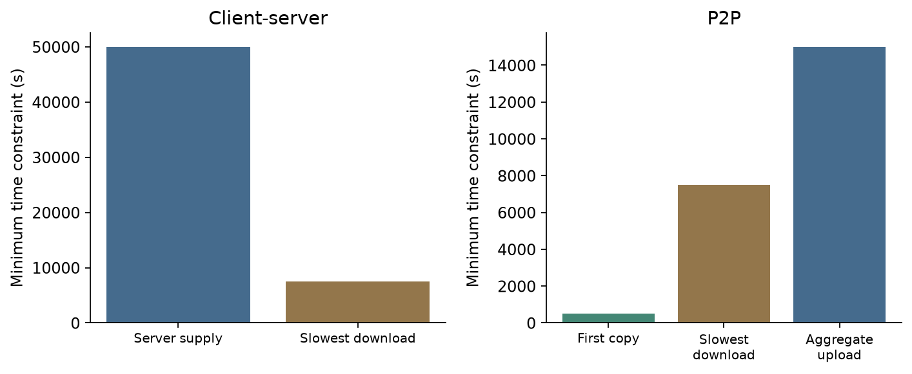

# Tutorial 4 · File Distribution, BitTorrent and DASH
## 先找谁供不动，再算怎样分得完

[Chapter 2](Chapter02.md) · [课程目录](README.md) · [下一份：Tutorial 5](Tutorial05.md)

依据原题2页和教师解答v2共15页，按Problem1–4。本Tutorial配套Chapter2应用层。题目单位用十进制Gbit/Mbit/kbit。

**按需基础：** [单位换算](../../learning/foundation-notes/NetworkBasics.md#units)、[速率与完成时间](../../learning/foundation-notes/NetworkBasics.md#timeline)。先会用“任务量÷每秒处理量”算时间。

| 题目 | 优先级 | 难度与卡点 | 掌握要求／依据 |
|---|---|---|---|
| Q1 分配方案 | 核心必会 | 中，下界还需构造达到它的方案 | 按两种瓶颈给实际速率；Tutorial 4教师解答 v2，第1–5张幻灯片 |
| Q2 时间计算 | 核心必会 | 中，总供给与最慢下载 | 统一单位、比较每个约束；Tutorial 4教师解答 v2，第6–8张幻灯片 |
| Q3 free-riding | 常规掌握 | 中，可能与保证不同 | 解释optimistic unchoking条件；Tutorial 4教师解答 v2，第9–11张幻灯片 |
| Q4 DASH | 核心必会 | 中，配对假设 | 区分N、N²与2N；Tutorial 4教师解答 v2，第12–15张幻灯片 |

优先级依据当前原题；额外练习标为变式。

## Problem 1. Construct a distribution scheme

**原条件 / Conditions：** 服务器初始持有F bit文件，分给N个客户端，服务器总上传率$u_s$，客户端下载率$d_i$，$d_{min}=\min_i d_i$。流体模型允许同时以不同速率发送，总发送率不超过$u_s$，忽略其他瓶颈。 / The server simultaneously allocates divisible traffic to N clients, subject to its total upload and each client's download limit.

服务器必须上传NF bit，所以时间至少NF/$u_s$；最慢客户端必须收F bit，所以至少F/$d_{min}$。但“至少这么久”还不是“确实做得到”，题目要求给方案。

**a. $u_s/N\lt d_{min}$：** 平均给每个客户端$u_s/N$。总速率正好$u_s$，每人都不超过其下载上限；每人同时在$F/(u_s/N)=NF/u_s$完成。瓶颈是服务器供给。

**b. $u_s/N>d_{min}$：** 每人按$d_{min}$发送。总量$Nd_{min}\lt u_s$，所有客户端都收得下；同在$F/d_{min}$完成。快客户端没有跑满也不妨碍整体最优，因为慢客户端仍决定结束时刻。

合起来，每人分配$\min(u_s/N,d_{min})$，达到两项下界的最大值。等号边界两种表达相同。Tutorial 4教师解答 v2，第2张幻灯片/Tutorial 4教师解答 v2，第4张幻灯片的反证是在同一流体约束下说明方案，不是现实TCP性能保证。

**English answer:** Allocate min(us/N,dmin) to every client. The aggregate rate is feasible and every client completes in max(NF/us,F/dmin).

**独立题 / Transfer：** F=100Mbit、N=4、$u_s$=20Mbps、每人下载8Mbps，多久？ / Find a feasible allocation and completion time.

答案 / Answer

每人5Mbps，20秒。最慢下载约束12.5秒不是最终答案，要与总上传约束20秒取最大。 / 5 Mbps each, finishing in 20 seconds.

## Problem 2. 15 Gbit分给100人

**完整条件 / Conditions：** F=15Gbit，N=100，服务器30Mbps，每人下载2Mbps、上传700kbps=0.7Mbps。问client-server与P2P理想最短分发时间。 / Use decimal units and compare both architectures.

先把文件写成15000Mbit。Client-server两项为100×15000/30=50000秒，以及15000/2=7500秒，因此选**50000秒，C**。

P2P仍需要服务器发出至少一份文件，至少500秒；每人下载至少7500秒；全体上传总能力30+100×0.7=100Mbps，供给NF需要15000秒。三项取最大，得**15000秒，B**。

图中每根柱都是一个必要时间约束，最大者决定该理想模型下的瓶颈。不是把三根柱相加，因为不同资源可同时工作。原教师页的下界符号视觉上写成“>”，最短时间公式应理解为“至少”，流体理想条件下可以达到；严格大于会排除等号而与Q1的构造冲突。

**English answer:** Client-server: max(50000,7500)=50000 s. P2P: max(500,7500,15000)=15000 s. Upload assistance reduces the aggregate bottleneck but does not remove the other constraints.

**变式 / Transfer：** N改为10，其他条件不变，P2P会比client-server快吗？ / Recompute both bounds for ten clients.

答案 / Answer

client-server=max(5000,7500)=7500秒；P2P=max(500,7500,150000/37)=7500秒。此时每人的2Mbps下载是瓶颈，增加上传互助不会突破它。 / Both are 7500 s, limited by the slowest download rate.

## Problem 3. 不上传的人，是否仍可能下载完成？

**原题 / Task：** Bob加入BitTorrent但不上传；a能否完整下载？b多台不同IP电脑是否可能让这种free-riding更高效？ / Can a non-uploading participant finish, and can multiple hosts improve that possibility?

Tutorial 4教师解答 v2，第9–11张幻灯片答两个问题均**可能，B**。除了优先服务回馈较好的peer，课堂BitTorrent模型还有optimistic unchoking：周期性试着给某个新peer机会。如果有足够peer停留足够久，Bob可能逐渐收齐。Bob能否最终收齐，取决于其他peer是否提供足够片段并停留足够久。

多主机可各自获得机会并收集不同片段后合并，教师称为一种Sybil式行为。这是机制分析；实际速率还受peer数量、停留时间、网络资源等影响，不能把主机数量乘上去就断言下载速度同比增加。

**English answer:** Both claims are possible under the stated classroom assumptions. Optimistic unchoking can supply a free-rider; multiple identities may collect complementary chunks. Neither completion nor proportional speedup is guaranteed.

**自测 / Check：** 如果所有peer在Bob收齐之前离开，前面的结论是否矛盾？ / Does early peer departure contradict the possibility claim?

答案 / Answer

不矛盾，原答案有停留时间和供给条件。“可能”不等于“必然”。 / No; the sufficient opportunity may not exist in that swarm.

## Problem 4. DASH到底存N份，还是N²份？

原题有N个视频质量版本和N个音频质量版本。开头说任意选择音视频，a的括号又明确要求按质量一一配对；教师v2的Tutorial 4教师解答 v2，第14张幻灯片按**一一配对**作答，因此本题a为**N，A**。b分离保存音频和视频，需**2N，B**，客户端负责同步。

以N=3看清：固定高配高、中配中、低配低，预合并文件只有3份。若真正允许任意组合，要把3×3种配对都提前合并，则是9份。若分轨，保存3视频+3音频共6份，播放时组合即可。这三种情境不是互相推翻，差别在配对约束。

**English answer:** Under part a's explicit one-to-one matching assumption, N combined files are needed. Separate audio and video require 2N files. N² applies only when every pair is precombined. These counts concern representations, ignoring segment multiplication.

**独立题 / Transfer：** 视频4种、音频2种，全部预组合与分轨分别几份？ / Four video versions and two audio versions: all pairs versus separate tracks.

答案 / Answer

8与6。不是4²，因为两边版本数量不同。 / Eight combined files or six separate tracks.

## 复习与来源索引

原题p1含Q1–3，p2含Q4。Tutorial 4教师解答 v2，第1–5张幻灯片对应Q1，Tutorial 4教师解答 v2，第6–8张幻灯片对应Q2，Tutorial 4教师解答 v2，第9–11张幻灯片对应Q3，Tutorial 4教师解答 v2，第12–15张幻灯片对应Q4。原题数值、单位及括号条件均保留；图为按原数值生成的教学图。

复习沿用[N234](https://crazyshout.github.io/micro-course/cards.html#CS5222-N234)、[N235](https://crazyshout.github.io/micro-course/cards.html#CS5222-N235)、[N236](https://crazyshout.github.io/micro-course/cards.html#CS5222-N236)。Q3可结合optimistic unchoking，复述为什么答案是“可能”。