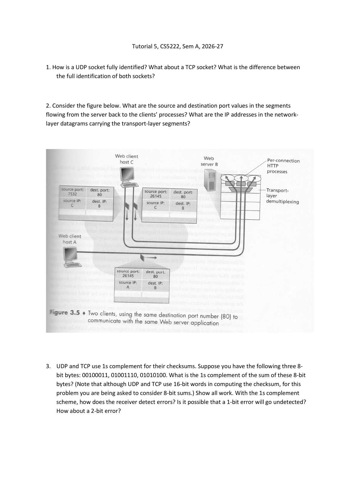

# Tutorial 5 · Demultiplexing, Checksums and Reliable Transfer
## 写清端点，算清位，再用反例检查协议假设

[Chapter 3（已下载部分）](Chapter03.md) · [课程目录](README.md) · [上一份：Tutorial 4](Tutorial04.md)

依据当前原题2页，共四题；当前未下载教师解答。以下答案根据Chapter3推导，并对照历史同题核查。

基础薄弱时先补[二进制与字节](../../learning/foundation-notes/NetworkBasics.md#binary)、[时间轴](../../learning/foundation-notes/NetworkBasics.md#timeline)。Q1–3为核心必会、中等难度，检查端点方向与反码；Q4也是核心必会，但难度较高，需要构造“旧包被当新包”的具体事件顺序。优先级直接来自当前原题。

<a id="endpoints"></a>
## Q1. How is a socket identified?

**题目 / Question：** UDP socket怎样完整标识？TCP呢？区别是什么？ / Compare identification in the instructor's UDP and established-TCP demultiplexing models.

按Chapter3 Chapter 3 part 1，第11张幻灯片/Chapter 3 part 1，第13张幻灯片的普通模型：UDP接收socket看目的IP、目的端口；已建立TCP连接看源IP、源端口、目的IP、目的端口。同一个UDP接收socket可以接收多个来源的数据报，TCP按不同四元组区分连接。

术语“完整标识”这里按课件抽象回答；监听socket和已建立连接不同，真实系统也允许connected UDP。本题按上述课堂模型作答。

**English answer:** The classroom UDP model uses the destination IP and destination port. An established TCP connection is identified by a four-tuple containing both endpoints. Different TCP clients can therefore share the same server port without sharing a connection.

<a id="ports"></a>
## Q2. Server replies｜回程要把两端一起交换



**完整条件 / Conditions：** 原图有服务器B:80；客户端C两条连接分别从7532和26145发起，客户端A一条连接从26145发起。问服务器回程segment的源/目的端口及外层IP源/目的地址。 / Read all three return paths from the server to the client processes.

| 对应请求 | 回程源端口 | 回程目的端口 | IP源→目的 |
|---|---:|---:|---|
| C:7532→B:80 | 80 | 7532 | B→C |
| C:26145→B:80 | 80 | 26145 | B→C |
| A:26145→B:80 | 80 | 26145 | B→A |

端口写在传输层首部，IP地址写在网络层首部。图中的A/B/C代表主机IP，答案沿用这些符号。

**English answer:** The server's source port is 80 on all three replies. Destination ports are 7532, 26145 and 26145, with IP destinations C, C and A. The last two connections differ in client IP.

**变式 / Transfer：** 服务器改为8443，客户端C的7532仍不变，回程端口怎样写？ / Change only the server port to 8443.

<details markdown="1"><summary>答案 / Answer</summary>

8443→7532；IP仍B→C。 / Source 8443, destination 7532; IP endpoints remain B and C.

</details>

<a id="checksum"></a>
## Q3. One's-complement checksum｜八位是题目的简化

原题给三个8bit字节：00100011、01001110、01010100，要求逐步求和、取反，说明接收端检查及1bit/2bit错误检测。真实UDP/TCP使用16bit字；此处按8bit演算。

```text
  00100011   = 35
+ 01001110   = 78
-----------
  01110001   = 113
+ 01010100   = 84
-----------
  11000101   = 197
```

没有最高位进位，按位取反得到checksum **00111010**（58）。接收端对数据与checksum采用同样反码加法：197+58=255，即11111111。若有超出8bit的进位，必须先卷回低位，再继续检查；本题恰好没有，不代表一般情况下可以省略。

一个bit翻转会改变加权和而被检测。两个bit可能相消：把第一个字的最低位从1改0（35变34），第二个字的最低位从0改1（78变79），总和仍197，checksum不变，错误可能漏检。这是具体反例，不是“两个bit一定漏检”。

**English answer:** Sum 35+78+84=197 (11000101), then complement to 00111010. The receiver expects an all-one one's-complement sum including the checksum. Single-bit corruption is detected; two compensating changes can be missed.

**独立题 / Transfer：** 数据只有11111111和00000010，8bit校验和是什么？ / Include the end-around carry.

<details markdown="1"><summary>答案 / Answer</summary>

普通和257=1 00000001，卷回后00000010，再取反11111101。 / Fold the carry to get 2, then complement to 253.

</details>

<a id="reordering"></a>
## Q4. Alternating bit｜编号又回到0，旧包也可能叫0

**原任务 / Task：** rdt3.0的信道允许消息重排时，只有0/1序号的交替比特协议是否总能正确？若不能，画发送者左、接收者右、时间向下的数据/ACK交换，标明序号。 / Give a reordering counterexample with explicit packet and ACK numbers.

只说“乱序会出错”不够，需要让接收端在错误时刻恰好期待旧包的编号。构造如下：

1. 发送数据A，编号0；它在网络中很慢，暂未到。
2. 发送端超时，重传A(0)。重传先到，接收端交付A并回ACK0。
3. 发送端收到ACK0，发送B(1)。接收端交付B、回ACK1，重新等待0。
4. 最早那份A(0)此时才到。接收方期望0且校验通过，于是误把A当下一条新数据，再次交付。


此例只用超时造成的重传和允许的重排，不要求把随机损坏伪装成有效包。收到第三个数据时接收方没法仅凭“0”知道它是老A还是新C。说明可靠性结论依赖对信道和旧副本寿命的假设。

**English answer:** A delayed original packet 0 can arrive after its retransmission and packet 1 have already been accepted. The receiver expects 0 again and can deliver the stale data as new. Thus alternating-bit correctness does not extend to arbitrary reordering and delayed duplicates without additional assumptions.

**迁移 / Transfer：** 只把序号从2种改为4种，是否能无条件解决“任意长延迟”？ / Does a larger finite sequence space eliminate arbitrarily delayed old duplicates?

<details markdown="1"><summary>答案 / Answer</summary>

不能无条件保证；编号最终仍会重用，还需要寿命、窗口或其他协议约束。更多序号可以扩大安全范围，但不替代假设。 / No finite sequence space alone prevents a sufficiently old duplicate from surviving until number reuse.

</details>

## 来源与复习

原题p1为Q1–3及完整端点图，p2为Q4。Chapter3 Chapter 3 part 1，第9–15张幻灯片对应端点，Chapter 3 part 1，第19–20张幻灯片对应校验，Chapter 3 part 1，第35–44张幻灯片对应编号、超时与重复处理；Q4反例为按原条件整理的推导。

沿用[N150](https://crazyshout.github.io/micro-course/cards.html#CS5222-N150)、[N237](https://crazyshout.github.io/micro-course/cards.html#CS5222-N237)、[N238](https://crazyshout.github.io/micro-course/cards.html#CS5222-N238)。Q2可在表格里换一组端口，自行写出回程。