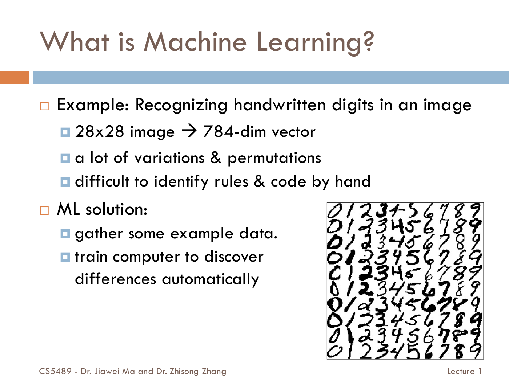
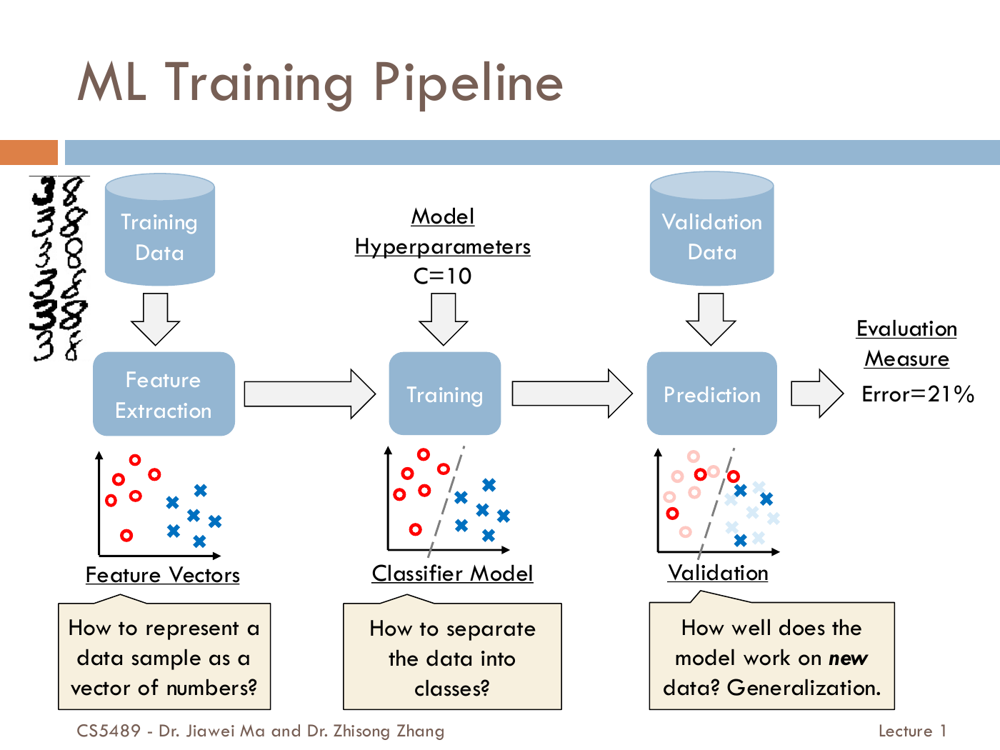
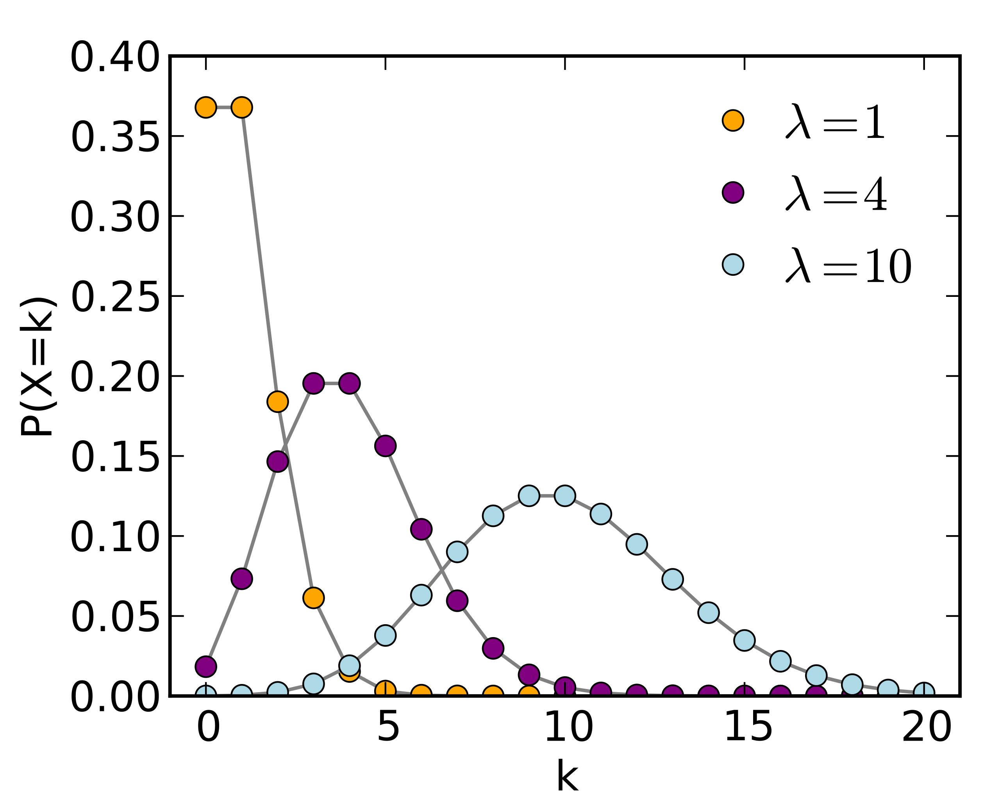
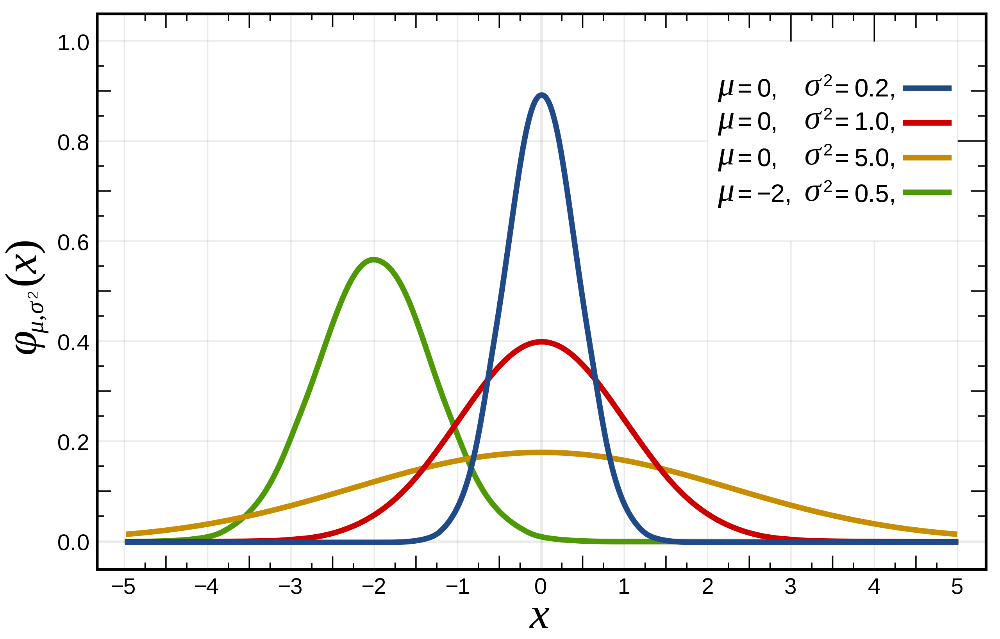

# Lecture 1 · Introduction / Python / NumPy / Probability
# 从“让机器学会认数字”，走到能读懂下一讲的代码

[课程目录](README.md) · [Tutorial 1动手笔记](Tutorial01.ipynb) · [下一讲：概率分类](Lecture02.md)

**可选基础：** [函数、下标与图像](../../learning/foundation-notes/MathForML.md#symbols-functions) · [概率与密度](../../learning/foundation-notes/MathForML.md#probability-density) · [向量与矩阵](../../learning/foundation-notes/MathForML.md#vectors-covariance)。只在卡住时补，不必先通读一遍数学。

这一讲先建立整门课的任务语言，再准备实际工具。你要能说清输入、目标与评价，能逐行读Python，知道数组的哪根轴是样本，并能把条件概率的方向读对。原课的安装界面和部分语法说明较旧，本文给出差异说明；日期、评分、提交手续仍查[课程信息](https://crazyshout.github.io/micro-course/notices.html?course=CS5489)与当前Canvas。

| 主题 | 优先级 | 难度与卡点 | 掌握要求、依据 |
|---|---|---|---|
| 学习任务、训练/验证/测试 | 核心必会 | 中，目标与流程不同 | 解释并画出数据流；Lecture 1 Intro，第9–26页 |
| Python变量、容器与流程 | 核心必会 | 中，代码执行顺序 | 跟踪值、独立写小程序；Lecture1a，第15–123个单元、Tutorial1 |
| 函数与类 | 常规掌握 | 中，返回值、对象状态 | 会调用、读懂fit/predict式接口；Lecture1a，第125–153个单元 |
| 文件与表格 | 常规掌握 | 中，路径与数据类型 | 能读输入并核对；Lecture1a，第155–179个单元 |
| 数组形状、索引、广播与复制 | 核心必会 | 中至高，轴和共享数据 | 能预测输出形状与修改影响；Lecture1b，第3–120个单元 |
| 图与概率复习 | 核心必会 | 中，纵轴含义、条件方向 | 画对图、手算边缘/条件概率；Lecture1b，第122–139个单元 |

这些是基于当前目标与任务的学习建议，不是教师公布的必考清单；Python底层机制并不因难就自动成为本课重点。

## 1. What is Machine Learning?｜先把“学会了”说得可检验

老师用手写数字举例：一张28×28图像可以排成784个像素值，但同一个数字有很多写法。靠手工为每种笔迹写规则很困难，于是收集已知答案的例子，用算法估计从输入到输出的规律。

*原课整页图。看图像→向量→类别这条线：784是输入特征数，不是数字类别数；像素展开保持固定顺序，不能每张图换一种排法。*

Mitchell的任务表述可以拆成三个问题：**task T**做什么，**experience E**从什么经验学，**performance P**怎样衡量。识别数字时，T是分类，E是带标签的训练图，P可以是未参与训练的数据上的错误率。仅仅“看过更多数据”不保证有效学习：数据质量、采样偏差和评价方式都影响结论。

机器学习是AI中的一类方法，也吸收统计等领域的工具。AI中的搜索、规划、知识表示不都等于机器学习；深度学习是多层神经网络方法，可用于多种学习设定，不能把它和“监督／无监督”并列成互斥的数据类型。

**English takeaway:** Define the task, experience and performance measure before choosing an algorithm. Learning from data must be evaluated on an appropriate task and population.

**来源与掌握要求：** Lecture 1 Intro，第9–16页。

## 2. Topics in Machine Learning｜训练资料告诉了我们什么？

监督学习给出输入和目标：分类输出类别，回归输出数值。老师的数字“3还是8”是分类，给定条件预测寿命是回归；类别编码为0/1，不会因此自动成为回归。

无监督学习没有为每个样本提供同样形式的目标标签。聚类找相似群组，降维把高维结构投影到较低维空间供观察。评价时需要先确定目标，例如分组是否稳定、降维后保留了多少信息。

强化学习让智能体在状态中采取行动，获得可能延迟的奖励，行动还会影响未来状态。把一张图片分类对错反馈一次，不自动等于完整的强化学习问题。

学习理论关心模型表达能力、样本量和泛化的关系。Intro中训练误差与测试误差的曲线帮助理解过拟合，不是任何数据都必然具有相同形状的定律。深度学习与应用列表预告了后续主题，本讲先掌握这些学习设定的区别。

**Q 中文：** 按聊天内容分组、预测房价、让机器人学习一连串动作，分别对应什么典型设定？  
**Q English:** What typical settings match grouping messages, predicting house prices, and learning a sequence of robot actions?  
**答／Answer：** 无监督聚类、监督回归、强化学习；具体还需确认标签与反馈。 / Unsupervised clustering, supervised regression and reinforcement learning, subject to the actual labels and feedback.

**来源与掌握要求：** Lecture 1 Intro，第16–22页。

## 3. ML Training Pipeline｜先练习，再选方法，最后才验收

一份数据先经过特征表示，再进入模型训练。参数是从训练数据学到的数，例如一条分界线的系数；超参数是你选择的配置，例如正则化强度C。验证集帮助选择配置，测试集用于方案固定后的评价。

*原课示意图中的Error=21%用于展示评价流程。特征提取也可能学习参数：词表、均值和缩放量应由训练数据确定。*

课堂举例比较C=0.1、1、10，对应验证错误率25%、10%、21%；按这个指标选择C=1。不能随后反复看测试集、挑另一个C，再把那个测试结果称为独立验收。**Inference（推断）**是固定模型对输入作预测；“评估预测是否正确”还需要对应答案，两件事有区别。

**独立变式 / Transfer：** 三个模型训练错误率为0%、4%、8%，验证错误率为20%、9%、11%。以验证错误率选谁？ / Training errors are 0%,4%,8% and validation errors are 20%,9%,11%. Which model is selected by validation error?  
**答／Answer：** 第二个；训练集最低错误不保证验证最好。 / The second model. Minimum training error does not guarantee best validation performance.

原课CILO要求解释、实现、应用和评价。Lecture负责方法，Tutorial把方法写成代码，Assignment练更完整的实验；本讲的Python与数学正是后面这些工作的工具。

**来源与掌握要求：** Lecture 1 Intro，第23–28页。
来源：Lecture 1 Intro，第24页。

## 4. Python and Jupyter｜一本有记忆的实验笔记

Python用简洁的语句组织工作，NumPy/SciPy承担数值计算，scikit-learn提供模型，Matplotlib画图。数值计算常交给NumPy等库的高效实现；先读懂数组操作，再逐步练习完整实验。

Notebook有Markdown与code两种单元；内核保存当前变量状态。单元从上到下摆放，不保证你刚才按这个顺序运行。因此复现时用“Restart Kernel and Run All”。输出仍在文件里而变量已经被清空，这并不矛盾。

当前本地运行方法见[README](README.md)。Lecture1a，第7个单元截图是旧版本示例，Lecture1a，第13个单元的locale排错针对旧环境，不作为今天无条件修改系统设置的操作。`help(x)`查询Python帮助；`x?`、`%history`等是IPython交互功能，不是普通`.py`文件语法。

**English takeaway:** Notebook state belongs to the running kernel. A clean top-to-bottom run tests whether the document is reproducible rather than dependent on earlier hidden actions.

**来源与掌握要求：** Lecture1a，第1–14个单元、Lecture 1 Intro，第6页。

## 5. Identifiers, variables and types｜变量像标签，先看贴在哪里

Python区分大小写，用缩进表示代码块。`x=3`把名字x绑定到对象；`x=x+1`先算右边再重新绑定，不能当成数学等式化简。

~~~python
x = 3
x = x + 1       # now 4
if x == 4:      # comparison, not assignment
    print("four")
~~~

`int`是整数，`float`是有限精度浮点数，`bool`是True/False，`str`是文本。`6/4`为1.5，`6//4`向下取整为1，`-3//2`为−2；`%`取余，`**`做幂。浮点计算不保证每个十进制小数都精确存储。

`and/or/not`组合判断；`in`检查成员；`==`比较值，`is`比较是不是同一个对象。`a=[1,2]; b=a; c=a[:]`中，b与a同一对象，c是另一个列表；a==c可以为真，而a is c为假。

**Q / 题：** x=2，先执行x+=3再执行x*=2，结果是什么？ / Starting with x=2, apply x+=3 and then x*=2.  
**答／Answer：** 10，按顺序先变5再变10。 / 10: first 5, then 10.

**来源与掌握要求：** Lecture1a，第15–28、76–88个单元。

## 6. Lists, tuples, strings, dictionaries, sets｜先选对装东西的方式

列表可按顺序存记录并修改，元组中的各个位置不能重新赋值；字符串保存字符序列；字典把键映射到值；集合去除重复并做集合运算。

| 类型/操作 | 小例子与结果 | 容易踩的坑 |
|---|---|---|
| list / range | list(range(2,8,2)) → [2,4,6] | 右端点8不包含，range本身不是已展开列表 |
| append / pop | a.append(7)加末尾；a.pop()移除并返回末项 | 一些原地修改方法返回None |
| insert / del / sort / reverse | 指定位置插入、删除、排序、反转 | 注意它们可能改变原对象；混合不可比较类型不能任意排序 |
| tuple | (1,)是一元素元组 | 逗号关键；元组不可变不代表内部引用的列表也不可变 |
| str | "hello"[1:4] → "ell"；[-1] → "o" | 字符串不能原地改一个字符 |
| dict | {"name":"john"}["name"] → "john" | 键需要可哈希；keys()/items()是视图，不是可随意索引的列表 |
| set | set([1,1,2]) → {1,2} | 用−、\|、&表示差、并、交，不把集合当固定位置数组 |

切片`start:stop:step`先确定位置，stop不包括。`"hello"[0:5:2]`取位置0、2、4，得到"hlo"。序列`+`可以拼接，字符串`*3`是重复三次，不是数值乘法。

字符串处理沿原课依次认识：`count`计数，`startswith/endswith`查前后缀，`find`找位置，`split`拆分，`join`连接，`replace`替换，`strip`移除首尾指定字符（默认空白）。`"a,b,c".split(',')`与`','.join(['a','b','c'])`把两种形式连接起来。`.format(...)`把数填进文本；例如`"{:.2f}".format(1.234)`得到"1.23"，这只改变显示，不修改原浮点值。

**English takeaway:** Choose containers by their purpose, and distinguish value equality, object identity and in-place mutation. Slices exclude the stop position.

**来源与掌握要求：** Lecture1a，第29–75、89–94个单元。

## 7. Conditional statements and loops｜把每轮变量变化写出来

`if/elif/else`选择分支；`for`按元素迭代，`while`在条件成立时重复。缩进决定某句执行一次还是每轮都执行。

~~~python
total = 0
for n in range(1, 6, 2):   # 1, 3, 5
    total += n
print(total)              # 9, after the loop
~~~

三轮total依次是1、4、9。`enumerate`同时给索引与值，`zip`把多个序列逐项配对，默认在最短序列结束时停止；遍历字典可用`for key, value in d.items()`。`break`退出循环，`continue`跳过本轮剩余部分；循环的`else`在正常结束、没有break时执行。

先会写多行，再读列表推导式：`[4*x for x in values if x>2]`表示遍历、筛选、变换并收集。Lecture1a，第123个单元实际代码为`4*item*4`，所以是16倍，不要把它按前一页4倍解释。可以把推导式展开成循环，逐步核对每个值。

**变式 / Transfer：** 对[1,2,3,4]只收集偶数的平方，结果是什么？ / Collect squares of the even values in [1,2,3,4].  
**答／Answer：** [4,16]，例如`[x*x for x in values if x%2==0]`。 / [4,16], by testing evenness before collecting the square.

**来源与掌握要求：** Lecture1a，第96–123个单元。

## 8. Functions and classes｜把动作封装，把状态放在对象里

原函数`sum3(a,b=1,c=2)`有一个必需参数和两个默认参数。`sum3(0)`返回3，`sum3(b=1,a=5,c=2)`返回8。`print`让屏幕显示内容，`return`把结果交给调用者；只print而没有return，调用结果通常是None。

~~~python
def sum3(a, b=1, c=2):
    """Return the sum of three values."""
    return a + b + c
result = sum3(*[1, 5, 2])          # positional unpacking: 8
same = sum3(**{"a":5,"b":1,"c":2}) # keyword unpacking: 8
~~~

类把状态和动作组织在一起。原`MyList`的`self.x`每个实例各有一份，`MyList.num`是类共享的计数；`__init__`初始化对象，`self`是正在操作的实例。原`appendx`虽然注释写“class method”，实际是普通实例方法，并不是`@classmethod`。

`MyListAll(MyList)`继承并重写部分方法，父类初始化仍需正确调用。`_name`约定为内部使用，`__name`触发名字改写；它们都不提供严格的访问控制。`__str__`决定友好文本显示；`__dict__`、`__doc__`、`__module__`、`__name__`、`__bases__`帮助查看对象与类。原属性查找说明针对普通例子，更完整的描述符与继承细节留作语言学习，不要求本课先背完。

**English takeaway:** A function returns a result; an object can retain state across method calls. This prepares you to understand an estimator that is fitted first and used for prediction later.

**来源与掌握要求：** Lecture1a，第125–153个单元。

## 9. File I/O, Pickle, exceptions and pandas｜读进来的是什么？

`with open(...) as f`在代码块退出时关闭文件。`read`读剩余全部文本，`readline`读一行，`readlines`读剩余行列表；读取位置会移动。写模式`w`会覆盖已有文件，所以本地练习只写自己的输出目录。

Pickle以二进制保存Python对象结构，`wb/rb`分别写/读字节；它不是随便编辑的文本格式，加载可能执行对象重建操作，只用于可信输入。Python3的`pickle`已有加速实现，Lecture1a，第168个单元的独立cPickle说法和“1000倍”不作为当前保证。

`try/except/else/finally`分别负责尝试、处理匹配异常、无异常时执行、退出前清理。原示例裸`except`会把各种失败都叫“No file”，实际学习时应区分文件缺失、格式错误和程序错误，避免把坏数据悄悄吞掉。

pandas的DataFrame是一张带列名的表，各列可以有不同类型。原例`df['Name']`取列，`df[df.Age>30]`取符合条件的行，`df.Age.mean()`算Age均值。读CSV前确认首行是不是列名，否则可能把第一条样本当成表头。

**来源与掌握要求：** Lecture1a，第155–179个单元。

## 10. NumPy arrays｜先说清每根轴，再做计算

`np.arange(15).reshape(3,5)`按默认顺序把0…14排成3行5列。`shape`是(3,5)，`ndim`是2，`size`是15，`dtype`是元素类型。这四个量回答不同的问题。

`zeros/ones/full`生成明确初值；`empty`分配未初始化存储，里面可能是旧内存内容，**不是随机数采样器**。`arange`按步长、通常不含右端点，浮点步长需留意舍入；`linspace`按点数取等距点，默认包含两端；`logspace`在指数上等距。

~~~python
import numpy as np
A = np.array([[1,2,3],[4,5,6],[7,8,9]])
A[0,1]        # 2: row 0, column 1
A[:,1]        # [2,5,8]: one whole feature column
A[:2,1:3]     # [[2,3],[5,6]]
mask = A[:,1] > 4
A[mask]       # rows 1 and 2
~~~

三维`np.arange(24).reshape(3,2,4)`可以看成3个2×4小表；`B[2,0,1]`得到17。`B[:,1,:]`保留所有组的第1行，结果3×4；循环默认沿第0轴走。数组的轴含义由数据定义，不能仅凭“二维”就猜行是特征。

**Q / 题：** A.shape=(20,4)，每行一条样本。A[:5,2]是什么形状？ / A has 20 row-wise samples and four features. What is the shape of A[:5,2]?  
**答／Answer：** (5,)，一个整数列索引移除了列轴；A[:5,2:3]则是(5,1)。 / (5,); a slice 2:3 would preserve a size-one second axis.

**来源与掌握要求：** Lecture1b，第3–43个单元。

## 11. Shape manipulation and broadcasting｜形状对齐不靠猜

`reshape`按元素顺序重新组织形状，总元素数必须匹配；`transpose`交换轴；`ravel`展开；`ndarray.resize`会原地改形状，不能与返回新形状视图的reshape混为一谈。`concatenate`沿指定既有轴拼接，`vstack/hstack`堆叠；`c_`、`r_`是原课的便捷写法。

NumPy数组的`+,-,*,**`通常逐元素执行，矩阵乘法用`@`。`A.sum(axis=0)`把行方向合并，剩下各列的和；`axis=1`则得到各行的和。`argmax`返回位置，`max`返回数值。

Broadcasting从最右侧逐轴比较：两边相等或其中一边为1才兼容，缺少的左侧轴视为1。一个(2,3)数组加(3,)向量，相当于给每行加同一组特征偏移；加(2,1)则给每行加各自的一个数。

~~~python
A = np.array([[1,2,3],[4,5,6]])
b = np.array([1,2,3])
c = np.array([[1],[2]])
A + b   # [[2,4,6],[5,7,9]]
A + c   # [[2,3,4],[6,7,8]]
b + c   # [[2,3,4],[3,4,5]]
~~~

`b[:,None]`把(3,)变成(3,1)，所以`b+b[:,None]`会得到3×3，而不是继续得到一条长度3的向量。因此，相减前要核对两个数组的形状，确认每个样本只和自己的对应值运算。

**变式 / Transfer：** (5,3)加(5,)是否合法？若想每行加一个数，应怎样改？ / Can shapes (5,3) and (5,) broadcast? How do you add one number per row?  
**答／Answer：** 不兼容；把后者变成(5,1)。 / They are incompatible; reshape the second array to (5,1).

**来源与掌握要求：** Lecture1b，第44–83个单元。

## 12. Brief linear algebra review｜同一个乘号前后可能是不同东西

向量x、y的内积xᵀy把对应元素相乘再求和；长度为√(xᵀx)，距离为‖x−y‖₂。内积同时受长度与方向影响，不是无条件归一化的相似度。外积xyᵀ得到一个矩阵。

矩阵乘法必须内维度相同：(m×d)乘(d×n)得到(m×n)，每格是左行与右列的点积：

$$c_{ij}=\sum_{k=1}^{d}a_{ik}b_{kj}.$$

**原课勘误：** Lecture1b，第98个单元求和符号使用k，但项中写成固定d；应如上按k遍历。Lecture1b，第102个单元的列向量个数也应跟矩阵的列数m对应，形状检查比死记图里的下标可靠。

Ax可以看作A各列的线性组合；Aᵀx是x与A各列的内积；AB逐列形成Abⱼ；AᵀB是两组列之间的内积表；ABᵀ也可写成对应列外积之和。先数行列，再决定这里要的是一个数、一条向量还是一张表。

原例x=(1,2,3)、y=(2,1,1)，内积7，长度√14，距离√6。[需要逐格演算时补这里](../../learning/foundation-notes/MathForML.md#matrix-products)。Tutorial1再把投影与正交化实现出来。

**来源与掌握要求：** Lecture1b，第84–109个单元。

## 13. Copies and views｜你改的是原件，还是副本？

`b=a`只多一个名字，没有复制。基础切片通常给共享底层数据的view，`a.copy()`才分配独立数据；布尔/高级索引通常会复制。reshape有时能返回view，有时需要复制，不能只凭外观判断。

~~~python
a = np.array([1,2,3,4])
b = a
c = a[1:3]
d = a.copy()
c[0] = 99
print(a)        # [1,99,3,4]
print(d)        # [1,2,3,4]
~~~

不同数组对象可以共享数据，所以`c is a`为假并不保证互不影响。必要时用`np.shares_memory`检查。模型实验里把视图误当副本，可能在预处理时把原训练数据改掉，导致后一个实验接收到不同输入。

**来源与掌握要求：** Lecture1b，第110–120个单元。

## 14. Visualizing data and probability｜图像和数字说同一句话

`plt.plot`绘制横纵值的对应，原`'bo-'`是蓝色圆点实线；颜色、点形和线型承担不同角色。图必须标轴和单位；因子计数图与直方图的区别将在Tutorial1实际画出来。

随机变量X从一组可能值中取值。离散变量用PMF给各值概率，非负且和为1。Bernoulli只有0/1两个结果，p(1)=π、p(0)=1−π。Poisson描述给定观察区间内的非负整数次数：

$$p(x)=e^{-\lambda}\frac{\lambda^x}{x!},\qquad x=0,1,2,\ldots.$$

x!表示x×(x−1)×…×1，0!=1。这里λ是这个指定区间里的期望计数；若给的是每秒到达率r，观察t秒时应使用λ=rt，不能把不同区间的率与总数混用。模型假设是否合适要结合过程判断。

连续变量用PDF，概率是区间面积，不是单点高度。原课用高斯说明均值μ与方差σ²；“p(x)叫likelihood”须看固定的是数据还是参数，单纯讲随机变量分布时更明确的词是density。

*两幅原课示意图：上图给整数取值的概率质量，下图给连续密度。*

用下面的联合概率表练习完整计算（来源：Lecture1b，第134个单元）：

| p(x,y) | Y=0 | Y=1 | p(x) |
|---|---:|---:|---:|
| X=0 | 0.08 | 0.12 | 0.20 |
| X=1 | 0.32 | 0.48 | 0.80 |
| p(y) | 0.40 | 0.60 | 1 |

**原例题意 / Worked question：** 求P(X=0|Y=0)，再求P(Y=0|X=0)。 / Find P(X=0|Y=0) and P(Y=0|X=0).

**答／Answer：** 分别0.08/0.4=0.2与0.08/0.2=0.4。分母由竖线后面的条件决定，调换条件不是同一问。 / The values are 0.2 and 0.4; the conditioning event determines the denominator.

边缘概率通过对另一变量求和；连续情形改用积分。把联合概率写成两种乘法顺序，可得Bayes规则：

$$p(y\mid x)=\frac{p(x\mid y)p(y)}{\sum_k p(x\mid k)p(k)}.$$

这里类别离散，因此分母求和；若y连续则应积分。分母必须为正。下一讲会用这个反转条件方向的工具，从“已知花种时花多长”走到“已知测量时更像哪种花”。

**English takeaway:** PMFs assign mass to discrete values; PDFs assign density whose interval integral is a probability. Marginalization removes a variable, while conditioning fixes one. Bayes' rule reverses the conditioning direction.

**来源与掌握要求：** Lecture1b，第122–140个单元。

## 15. 合上讲义，检查自己能否讲明白

本讲关系是：任务与评价决定实验流程 → Python表达算法 → NumPy表达数据和矩阵 → 图检查实际结果 → 概率表达不确定性。接下来先做[Tutorial1](Tutorial01.ipynb)，再进入[Lecture2](Lecture02.md)。

**Q1 / 题：** Why should preprocessing be considered part of training? / 为什么预处理也属于训练流程？  
**A / 答：** A vocabulary or scaling rule can learn from data; fit it on the appropriate training split and reuse it elsewhere. / 词表或缩放规则也学习数据信息，要在对应训练部分拟合。

**Q2 / 题：** What do shape, axis and view mean in an array operation? / shape、axis、view各说明什么？  
**A / 答：** Shape gives dimension sizes, an axis identifies the direction being indexed/reduced, and a view can share underlying data. / 分别是维度大小、操作方向和可能共享底层数据的数组。

**Q3 / 题：** In the original probability table, find P(X=1|Y=1). / 用原表求P(X=1|Y=1)。  
**A / 答：** 0.48/0.60=0.8. / 分母是Y=1整列的0.60。

已有微课：[Python ML02](https://crazyshout.github.io/micro-course/?lesson=ml02)、[数组 ML03](https://crazyshout.github.io/micro-course/?lesson=ml03)、[投影 ML04](https://crazyshout.github.io/micro-course/?lesson=ml04)、[概率 ML05](https://crazyshout.github.io/micro-course/?lesson=ml05)。已有卡优先复习[M023](https://crazyshout.github.io/micro-course/cards.html#CS5489-M023)、[M028](https://crazyshout.github.io/micro-course/cards.html#CS5489-M028)、[M035](https://crazyshout.github.io/micro-course/cards.html#CS5489-M035)；算法与调试能力需要实际运行检验。

## 原材料覆盖索引

原文件依次为Lecture 1 Intro PDF、Lecture1a.ipynb、Lecture1b.ipynb。Notebook单元按原文件从1计数，包含文字和代码；PDF按页数计。重复演示合并讲解，位置见下表。

| 原位置 | 讲义位置／处理 |
|---|---|
| Lecture 1 Intro，第1–8页 | 开头与§3–4；身份、时间、评分等查原件/课程信息，不转为知识卡 |
| Lecture 1 Intro，第9–15页 | §1 目标、数字任务、T/E/P与AI关系 |
| Lecture 1 Intro，第16–22页 | §2 学习设定、理论、深度学习与应用 |
| Lecture 1 Intro，第23–28页 | §3 训练、选参、推断、工具与课程定位；Lecture 1 Intro，第27页漫画为辅助，不增知识点 |
| Lecture 1 Intro，第29–36页 | 课程信息与参考书入口；后续计划不等于已下载课程；Lecture 1 Intro，第35–36页结束页 |
| Lecture1a，第1–14个单元 | §4语言与Notebook、旧环境说明、目录 |
| Lecture1a，第15–28个单元 | §5语句、变量和基本类型 |
| Lecture1a，第29–75个单元 | §6容器、序列、字符串与字典 |
| Lecture1a，第76–94个单元 | §5–6运算、身份、解包与集合 |
| Lecture1a，第95–123个单元 | §7分支、循环、列表推导；Lecture1a，第95个单元目录 |
| Lecture1a，第124–153个单元 | §8函数、参数解包、类与继承；Lecture1a，第124个单元目录 |
| Lecture1a，第154–179个单元 | §9文件、pickle、异常、pandas；Lecture1a，第154个单元目录 |
| Lecture1b，第1–43个单元 | §10数组创建、属性、索引与张量；Lecture1b，第1–2个单元导言 |
| Lecture1b，第44–83个单元 | §11形状、拼接、逐元素运算、轴与广播 |
| Lecture1b，第84–109个单元 | §12向量、矩阵与五种乘法解释 |
| Lecture1b，第110–121个单元 | §13别名、view、copy；Lecture1b，第121个单元目录 |
| Lecture1b，第122–127个单元 | §14作图与样式；Lecture1b，第127个单元目录 |
| Lecture1b，第128–139个单元 | §14概率、分布、联合/边缘/条件与Bayes |
| Lecture1b，第140个单元 | 官方语言/库学习入口；运行版本见本地README |

原Intro中的“More data is better”需结合数据质量、采样和评价方式理解。软件版本差异在对应段落说明；学习优先级的依据见开头表格。