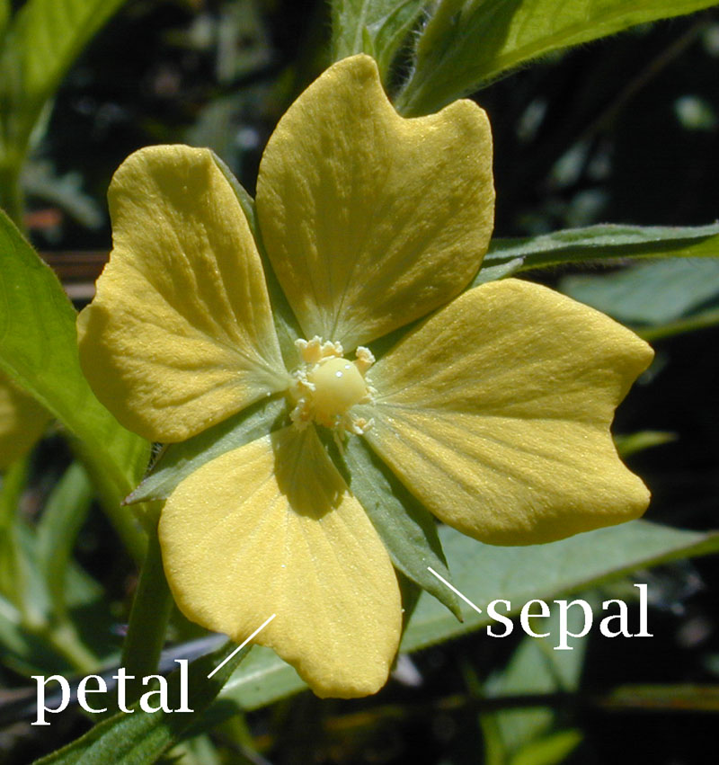
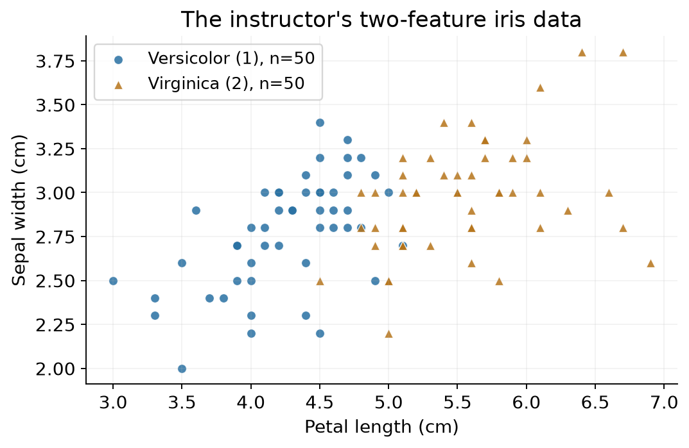
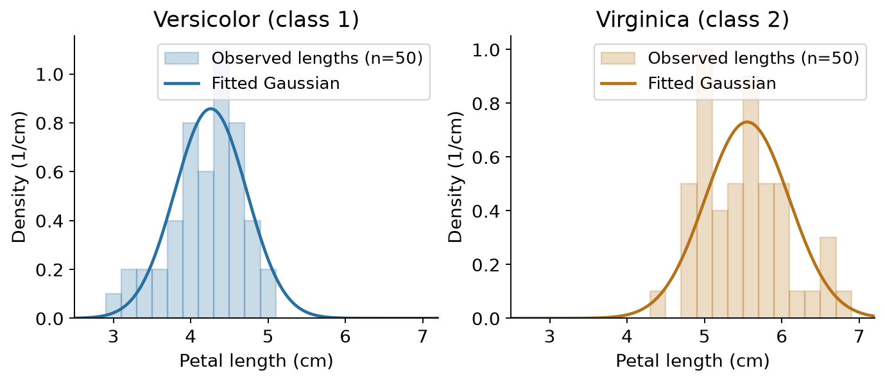
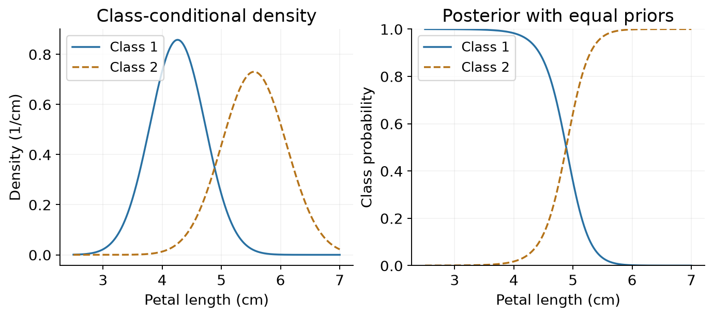
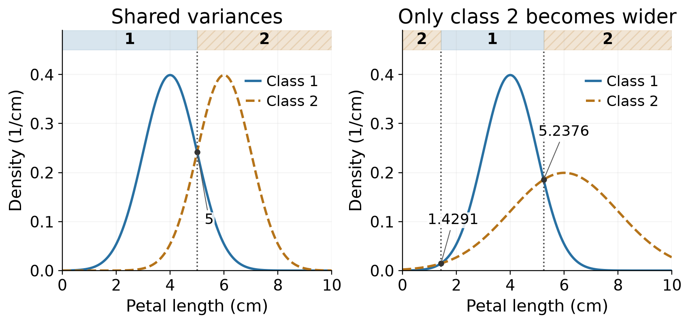
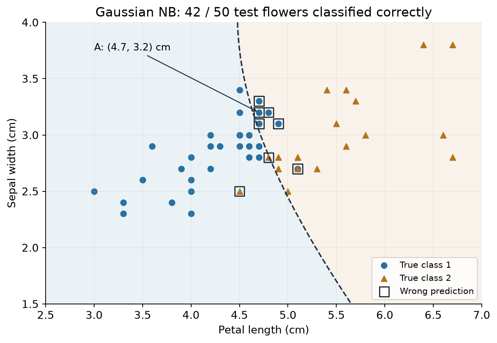
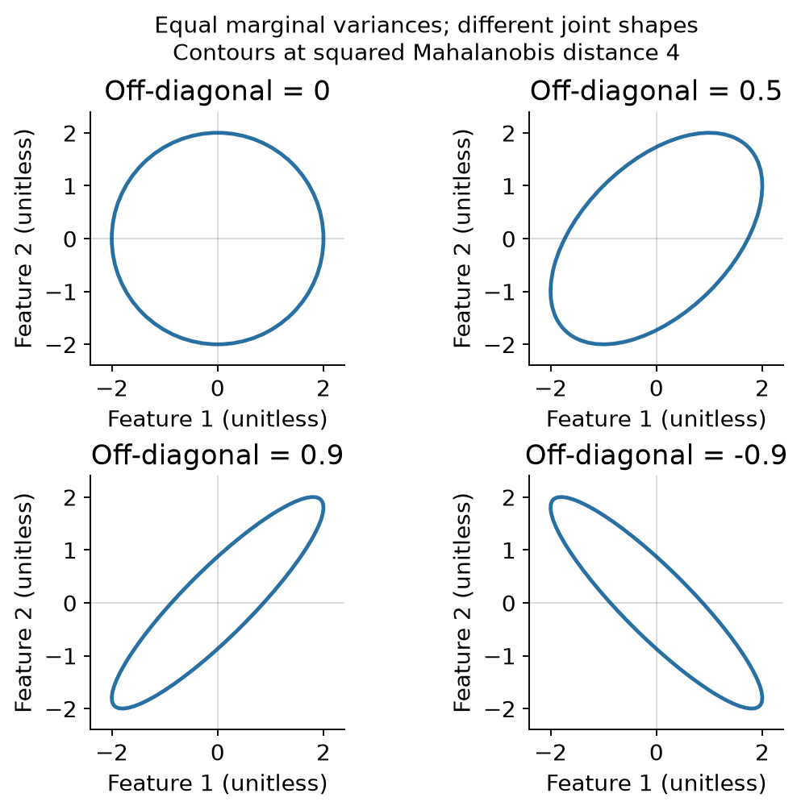
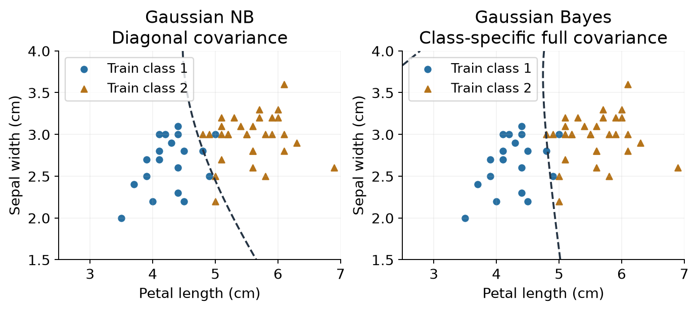

# Lecture 2 · Bayes Classifier & Naive Bayes Classifier

**从花朵测量到邮件分类**

<!-- EXAM:overview:START -->

## Exam focus｜这一讲怎样安排复习

先把生成式模型、Bayes决策和Gaussian NB讲清楚，再练分布假设、边界与模型局限。下面的卷数用于安排练习顺序；它描述手头历史材料，不预测本学期考题。

| 考点 | 本轮复习重点 | 期中 | 期末：直接／关联 | QE记录 | 学习入口 |
|---|---|---|---|---|---|
| 生成式模型与概率分工 | 反复考查：先分清三个概率 | 6套 | 未见／未见 | 现有材料未见 | [讲解](#generative) |
| Bayes决策与先验作用 | 反复考查：先验与最优性的条件 | 6套 | 未见／未见 | 现有材料未见 | [讲解](#bayes-rule) |
| 条件独立与Gaussian NB | 反复考查：能完整写出模型 | 5套 | 未见／未见 | 现有材料未见 | [讲解](#gaussian-nb) |
| MLE学习思想 | 学习思想有直接题；推导也是基础 | 2套 | 未见／未见 | 题段；卷次待定 | [讲解](#prior-mle) |
| 线性与非线性边界 | 反复比较：共享方差是否成立 | 4套 | 未见／1套 | 现有材料未见 | [讲解](#decision-boundaries) |
| 协方差与高斯形状 | 基础与后续聚类迁移都要懂 | 4套 | 未见／3套 | 现有材料未见 | [讲解](#full-gaussian) |
| 平滑与正则化 | 能解释零概率与如何调节 | 2套 | 未见／未见 | 现有材料未见 | [讲解](#smoothing) |
| 文本表示与NB改进 | 结合设备条件提出具体改进 | 1套 | 未见／未见 | 现有材料未见 | [讲解](#bow) |
| 误差、不确定性与模型局限 | 用假设与反例判断模型局限 | 4套 | 未见／未见 | 现有材料未见 | [讲解](#model-limits) |
| 参数后验与MAP（QE延伸） | QE延伸；补齐题面后再练完整推导 | 未见 | 未见／未见 | 题段；卷次待定 | [相关MLE基础](#prior-mle) · [QE残题说明](#qe-parameter-posterior-note) |

**统计口径：** 已辨识6套期中、3套期末；同一考点同卷只计一次。同卷答案、扫描件和压缩包副本不另计；模拟题另列，2021B*保留封面年份冲突说明。“未见”只表示现有材料未找到对应题。QE年份未载、原卷身份不完整，显示卷次待定。

标记：期中期末QE颜色区分考试类别；卷数与考查关系直接见标签文字。

题号与出处见[讲末考点索引](#exam-topic-index)；按试卷查阅见[全册附录](ExamIndex.md)。期末聚类是关联选做；QE参数后验不等于本讲的类别后验。

<!-- EXAM:overview:END -->

老师给出两个任务：根据花瓣长度和萼片宽度辨认鸢尾花；根据邮件内容判断是不是垃圾邮件。它们的输入不同，却可以用同一条思路处理：**先从已知类别的记录中学出各类的特征，再判断新记录更符合哪一类。**

我们先跟着一朵花走完这个过程，随后把测量值换成文字。前三部分对应Lecture2a，后三部分对应Lecture2b。上一讲的数组用于保存记录，概率用于表达判断的不确定性，Python负责估参数和计算预测。

**基础复习（可跳过）：** [按卡点选读符号、概率、对数、导数与矩阵](../../learning/foundation-notes/MathForML.md#foundation-nav)。正文仍会解释当前步骤，较长的基础推导可从这里补起。[Tutorial 2](Tutorial02.ipynb)继续练文本分类和Poisson NB；[Assignment 1](Assignment01.md)用于综合练习分类流程。

**本讲路线：** [记录与先验](#classification) → [高斯与估计](#observation) → [Bayes决策](#bayes-rule) → [两项测量](#gaussian-nb) → [邮件证据](#bow) → [词次数与权重](#tfidf)。最后是[自测](#self-check)和[实现选读](#implementation-notes)。

## 1. From records to models｜从花朵记录到概率模型

### Features and labels｜先认清一条记录

植物园已经记录了一批花的种类，以及每朵花的 petal length（花瓣长度）和 sepal width（萼片宽度）。现在来了一朵未知种类的花：两个长度可以测量，种类需要预测。

| Versicolor，标签1 | Virginica，标签2 |
|---|---|
|  |  |

图源：Lecture2a，第5个单元引用的原图片。

例如，原数据的一条记录是“花瓣长4.7 cm、萼片宽3.2 cm、类别1”。前两项是 **features（特征）**，最后一项是 **class label（类别标签）**。训练时三项都知道；预测新花时，输入只包含前两项。

数学上把测量写成列向量

$$
\mathbf{x}=(x_1,x_2)^T\in\mathbb R^2,\qquad y\in\{1,2\}.
\tag{2.1}
$$

$x_1$、$x_2$依次表示上述两个长度，单位都是厘米；上标$T$表示转置，使两个数竖着排列。1和2只是类别的名字。代码把100朵花按行堆起来，所以`X.shape=(100,2)`，标签数组`y.shape=(100,)`。单条数学向量写成列，程序按行保存多条记录，两者说的是同一批数据。

两类花集中在不同位置，但有些点混在一起。用一条线分开两类可能已经有用；当两边都很像时，我们还希望知道：这个判断有多大把握？于是引入概率模型。

### Prior and class-conditional distribution｜分别描述类别和测量

<!-- EXAM:focus-generative:START -->

考点：生成式模型与概率分工

期中 · 6 套

<!-- EXAM:focus-generative:END -->

设想从植物园随机挑一朵花。在尚未测量时，我们可以先问“哪种花本来更多”；知道种类后，则可以问“这种花通常有多长”。这正好是模型的两部分：

- **Prior probability（先验概率）** $p(y=c)$：还没看当前测量，类别$c$出现的比例。
- **Class-conditional distribution，CCD（类条件分布）** $p(\mathbf{x}\mid y=c)$：已知种类是$c$，测量值怎样分布。

两者合起来描述“种类与测量一起出现”的情况：

$$
p(\mathbf{x},y)=p(y)\,p(\mathbf{x}\mid y).
\tag{2.2}
$$

这叫 **generative model（生成式模型）**：先描述类别，再描述该类的特征。预测时方向相反：看见测量后，判断种类。这时需要 **posterior probability（后验概率）** $p(y=c\mid\mathbf{x})$，第三部分会把它算出来。

老师先用40%与60%的类别比例举例。令$\pi=p(y=1)$，则$p(y=2)=1-\pi$。把两个情况合成一行，就是

$$
p(y)=\pi^{\mathbb 1(y=1)}(1-\pi)^{\mathbb 1(y=2)}.
\tag{2.3}
$$

**Indicator function（指示函数）**在括号里的条件成立时取1，否则取0。$y=1$时公式留下$\pi$；$y=2$时留下$1-\pi$。这里$\pi$是类别比例；后面高斯公式中的$2\pi$使用圆周率。

### Maximum likelihood estimation｜从记录估计类别比例

<!-- EXAM:focus-prior-mle:START -->

考点：MLE学习思想

期中 · 2 套QE题段 · 年份未载／卷次待定

QE另问参数后验和MAP，不能当作类别决策题。

<!-- EXAM:focus-prior-mle:END -->

假设10条已知标签中，4条是类1、6条是类2，直觉上会估计类1比例为0.4。**Maximum likelihood estimation，MLE（最大似然估计）**说明这个直觉怎样变成一个优化问题。

把已经收集到的标签固定下来，尝试不同的$\pi$。如果这些标签独立来自同一个类别分布，整串标签的概率是各项相乘。记总数为$N$、两类数量为$N_1,N_2$，则

$$
L(\pi)=\prod_{i=1}^{N}p(y_i;\pi)=\pi^{N_1}(1-\pi)^{N_2},\qquad N=N_1+N_2.
\tag{2.4}
$$

把这个式子看成关于参数$\pi$的函数，就叫 **likelihood（似然）**。我们比较的是“哪一个参数更能解释同一批观测”，并没有给参数本身赋予概率。

取自然对数能把乘积变成和；对数单调递增，最大值的位置保持：

$$
\ell(\pi)=\log L(\pi)=N_1\log\pi+N_2\log(1-\pi).
\tag{2.5}
$$

两类都出现时，令导数为0：

$$
\begin{gathered}
\frac{d\ell}{d\pi}=\frac{N_1}{\pi}-\frac{N_2}{1-\pi}=0,\\[0.4em]
N_1(1-\pi)=N_2\pi,\\[0.4em]
\hat\pi=\frac{N_1}{N_1+N_2}.
\end{gathered}
\tag{2.6}
$$

二阶导数为$-N_1/\pi^2-N_2/(1-\pi)^2\lt0$，因此这是最大值。若只观察到一种类别，最大值在0或1的边界。多类的结果同样是$\hat p(y=c)=N_c/N$。

教学例子的结果是$4/10=0.4$。实际`iris2.csv`中两类各50条，估出来则是$[0.5,0.5]$。样本若经过人为按类抽取，这个比例首先描述的是训练样本，不一定代表将来遇到的花。

**English takeaway:** A generative classifier learns class priors and class-conditional distributions. MLE compares parameter values using the same observed data; the estimated class prior is the sample's class proportion.

来源：Lecture2a，第4–17个单元。需要补课时可读[对数](../../learning/foundation-notes/MathForML.md#log-products)和[导数与最大值](../../learning/foundation-notes/MathForML.md#maxima-mle)。

## 2. Gaussian observations｜用高斯描述一类花的测量

### From histograms to a density｜先看数据集中在哪里

先只使用花瓣长度$x$。把每一种花单独取出，将相近长度分到同一个区间里，就得到直方图。柱子越高，说明该区间里的观测越集中。

图中柱子按**密度**归一化：柱子的面积相加为1。曲线用每类数据估计参数后画出。先看两幅图的峰在什么位置，再看柱子是否大致围绕曲线分布。曲线给出一个简洁的近似，并不要求每根柱子都与它吻合。

老师选择 **Gaussian distribution / normal distribution（高斯分布／正态分布）**来建模。这样只要两个参数，就能描述中心位置和展开宽度：

$$
p(x\mid y=c)=\frac{1}{\sqrt{2\pi\sigma_c^2}}
\exp\!\left[-\frac{(x-\mu_c)^2}{2\sigma_c^2}\right].
\tag{2.7}
$$

其中$c$是类别，$\mu_c$是平均长度，$\sigma_c$是标准差，两者单位均为厘米；$\sigma_c^2$是方差，单位为平方厘米。每个类别都有自己的这组参数。

固定这条高斯曲线后，离均值越远，指数里的数越负，密度越低。方差较大时，同样的偏离只占较少的标准差，曲线展开得更宽；前面的归一化系数也随方差变化，使曲线下面积保持为1。

连续变量的曲线高度是 **density（密度）**，单位为cm⁻¹。某个长度区间的概率等于区间下的面积；“恰好5 cm”的点概率与“5 cm附近比较常见”是两件事。密度高度可以超过1，只要总面积仍为1。详见[密度与面积](../../learning/foundation-notes/MathForML.md#density-area)。

来源：Lecture2a，第18–25个单元。上图按原数据重绘；原课早期的计数直方图与后来的密度图的区别，见文末实现说明。

### Estimating mean and variance｜把高斯参数从数据里算出来

下面只处理**某一个类别**，$x_1,\ldots,x_N$都是该类的长度，$N$也是该类样本数。先假设这些观测独立同分布、方差为正。

每个样本有一个高斯密度。把它们相乘，就得到这一组参数对全体观测的似然：

$$
L(\mu,\sigma^2)=\prod_{i=1}^N
\frac{1}{\sqrt{2\pi\sigma^2}}
\exp\!\left[-\frac{(x_i-\mu)^2}{2\sigma^2}\right].
\tag{2.8}
$$

现在取对数。每个样本的归一化系数都贡献$-\tfrac12\log(2\pi\sigma^2)$，共出现$N$次；指数中的项则相加。于是

$$
\ell(\mu,\sigma^2)=-\frac N2\log(2\pi\sigma^2)
-\frac{1}{2\sigma^2}\sum_{i=1}^N(x_i-\mu)^2.
\tag{2.9}
$$

固定方差，对均值求导。$(x_i-\mu)^2$的导数是$-2(x_i-\mu)$，与外面的负号抵消：

$$
\begin{aligned}
\frac{\partial\ell}{\partial\mu}&=\frac1{\sigma^2}\sum_i(x_i-\mu)=0,\\
\hat\mu&=\frac1N\sum_i x_i.
\end{aligned}
\tag{2.10}
$$

方差也能这样求。以下补齐原课省略的中间步骤：令$v=\sigma^2$，明确我们对**方差**求导；$v^{-1}$的导数为$-v^{-2}$：

$$
\begin{aligned}
\frac{\partial\ell}{\partial v}&=-\frac N{2v}+\frac{\sum_i(x_i-\mu)^2}{2v^2}=0,\\
\hat\sigma^2&=\frac1N\sum_i(x_i-\hat\mu)^2.
\end{aligned}
\tag{2.11}
$$

**教学算例 / Worked example.** 某类长度为2、4、6 cm，求高斯MLE的均值、方差和标准差。 / For lengths 2, 4 and 6 cm from one class, find the Gaussian MLE mean, variance and standard deviation.

均值为4 cm，三个偏差为−2、0、2 cm，平方偏差和为8 cm²。因此方差是$8/3$ cm²，标准差是$\sqrt{8/3}\approx1.633$ cm。这里的分母是$N$。若计算无偏样本方差，会改除以$N-1$并得到4 cm²；那是另一种估计要求。

**Answer:** Mean = 4 cm; MLE variance = 8/3 cm²; standard deviation ≈ 1.633 cm. The unbiased sample variance is 4 cm².

上述求解要求数据并非全部相同。若所有观测都等于4 cm，方差趋近0时似然不断增大，普通的正方差高斯密度没有可直接代入的有限最优解。需要时可从[偏导与链式法则](../../learning/foundation-notes/MathForML.md#partial-derivatives)补习推导。

对原花瓣长度数据按同样方法估计：

| 类别 | 样本数 | 均值μ（cm） | MLE标准差σ（cm） |
|---|---:|---:|---:|
| Versicolor（1） | 50 | 4.2600 | 0.4652 |
| Virginica（2） | 50 | 5.5520 | 0.5463 |

`stats.norm.fit`返回均值和**标准差**，`stats.norm(..., scale=...)`也接收标准差。检查这两个位置的单位，就能避免把方差误传给程序。

**English takeaway:** Multiply the class's sample densities, take logs, and maximize. Gaussian MLE gives the sample mean and variance with denominator N. Standard deviation is the square root of variance.

来源：Lecture2a，第26–31个单元。表中用全部100条记录演示分布估计；第四部分重新用训练集估参数，进行独立测试。

## 3. Bayesian decision｜给一朵新花作判断

<!-- EXAM:focus-bayes-rule:START -->

考点：Bayes决策与先验作用

期中 · 6 套

<!-- EXAM:focus-bayes-rule:END -->

### From a measurement to a posterior｜把5厘米代进模型

现在假设来了一朵花瓣长5 cm的新花。这是教学输入，先不使用第二项测量。上一部分已经给出两类的参数和相等先验，我们可以直接计算。

**任务 / Task：** 用上述两类高斯和先验0.5／0.5，求$x=5$ cm时的后验，在错分代价相同时选择类别。 / Using the two fitted Gaussians above and priors 0.5/0.5, calculate the posteriors at x = 5 cm and classify under equal error costs.

先算类1的密度：

$$
p(5\mid1)=\frac{\exp[-(5-4.26)^2/(2\times0.4652^2)]}
{\sqrt{2\pi}\times0.4652}\approx0.2420\ \mathrm{cm}^{-1}.
\tag{2.12}
$$

类2同样代入$\mu_2=5.5520,\sigma_2=0.5463$，得到约$0.4383$ cm⁻¹。参数和结果在正文中四舍五入，计算记录使用未舍入值。

这里参数已经固定，我们在比较**各类模型对同一个测量值给出的密度**。课堂也把它叫作该观测在各类下的likelihood；它与前面MLE中“固定数据、改变参数”的使用角度不同。

密度还需要结合类别先验。把两者相乘得到$s_c$，再除以全部类别分数之和：

$$
s_c=p(x\mid y=c)p(y=c),\qquad
p(y=c\mid x)=\frac{s_c}{\sum_{k\in\mathcal Y}s_k}.
\tag{2.13}
$$

这里$\mathcal Y$是所有候选类别组成的集合，本例为$\{1,2\}$。

| 计算步骤 | 类1 | 类2 |
|---|---:|---:|
| 密度$p(5\mid c)$（cm⁻¹） | 0.241986 | 0.438306 |
| 乘先验0.5得到$s_c$（cm⁻¹） | 0.120993 | 0.219153 |
| 除以总和0.340146，得到后验 | 0.3557 | 0.6443 |

**答案 / Answer：** 选类2。 / Select class 2; the posteriors are approximately 0.3557 and 0.6443.

分母$p(x)=\sum_kp(x\mid k)p(k)$使后验加起来为1。它对同一个输入的各候选类别相同，但换一朵花时会变化。只有总分数为正，才能这样归一化。分子是密度乘概率，归一化后的后验才是类别概率。

左图看“各类通常有哪些长度”，右图看“已知这个长度后，种类如何分配”。在右图找到横轴5 cm，两条曲线的高度就是刚算出的后验。两类后验相等处是 **decision boundary（决策边界）**；二类等代价时，两边都为0.5。

### Why the prior matters｜更常见的类别也会影响判断

再做一个短算例，把先验的作用单独看清楚。

**题 / Question：** 同一测量在两类下的密度为0.4、0.2，先验为0.25、0.75。错分代价相同，预测哪类，后验各多少？ / At one measurement, the two class densities are 0.4 and 0.2 in the same units, with priors 0.25 and 0.75. Find the class and posteriors under equal error costs.

**答 / Answer：** 两个分数为$0.4\times0.25=0.10$、$0.2\times0.75=0.15$；后验为0.4、0.6，选类2。 / The scores are 0.10 and 0.15; normalized posteriors are 0.4 and 0.6, so select class 2.

选类别$c$时，当前输入处的出错概率是$1-p(c\mid x)$。因此在所有错分代价相同的 **0–1 loss** 下，选最大后验就能最小化这个错误概率。模型估计不准确时，预测也会受影响；若漏报与误报的代价不同，应改为比较期望损失。

### Comparing log scores｜很多小数相乘时怎样算得稳

只想选类别时，可以省掉共同分母；再对正分数取log，大小顺序也不变：

$$
\hat y=\arg\max_c p(x\mid c)p(c)
=\arg\max_c\{\log p(x\mid c)+\log p(c)\}.
\tag{2.14}
$$

`argmax`返回让分数最大的类别。多项很小的数连乘，计算机可能把结果舍入成0，这叫 **underflow（下溢）**。把乘法转成对数的加法，能避免许多这样的数值问题。零分数的log可视为$-\infty$；所有类别都不可能时则需要处理模型或输入。

要报告后验，还要归一化。设$z_c=\log p(x\mid c)+\log p(c)$，先减去最大的$z_c$，再做指数和归一化即可。例如$z=(-1001,-1000)$，平移后是$(-1,0)$；指数变成$(e^{-1},1)$，归一化得到$(0.2689,0.7311)$。这就是文末`logsumexp`实现的思路。

**English takeaway:** Evaluate each class's density at the new input, multiply by its prior, and normalize. Equal error costs lead to the largest-posterior rule. Log scores preserve the winning class while improving numerical stability.

来源：Lecture2a，第32–49个单元。5 cm的逐步演算和log平移算例为教学补充。

### Where the boundary comes from｜两个类别在哪里打平

<!-- EXAM:focus-decision-boundaries:START -->

考点：线性与非线性边界

期中 · 4 套期末关联 · 1 套

<!-- EXAM:focus-decision-boundaries:END -->

前面给定一朵花的测量值，算出两类分数，再选分数较大的类别。现在把花瓣长度$x$看成可以变化的量：**它变到什么位置，判断会从一类转向另一类？** 这就需要找出两类分数相等的位置。

继续使用相同错分代价下的Bayes规则。为看清计算过程，下面采用一组**教学简化参数**：两类均值分别为4、6 cm，先验各为0.5，开始时方差都为1 cm²。公式中的$x$与均值都取按cm计的数值，方差取按cm²计的数值。

先把每一类的分数写清楚。前面的规则使用$g_c(x)=\log p(x\mid c)+\log p(c)$，即“这个测量值在该类中的log密度，加上该类的log先验”。对高斯密度取log后，归一化因子变成$-\tfrac12\log(2\pi\sigma_c^2)$，指数部分变成$-\tfrac{(x-\mu_c)^2}{2\sigma_c^2}$；再加上$\log p(c)$，就是该类的完整分数。这里$\mu_c$是第$c$类的均值，$\sigma_c^2$是方差。

将两类参数分别代入，可以逐项对照：

| 类别 | 代入参数后的log分数 |
|---|---|
| 第一类：均值4，方差1 | $g_1(x)=-\tfrac12\log(2\pi)-\tfrac{(x-4)^2}{2}+\log0.5$ |
| 第二类：均值6，方差1 | $g_2(x)=-\tfrac12\log(2\pi)-\tfrac{(x-6)^2}{2}+\log0.5$ |

两行只有中间的距离项不同：第一类看$x$离4有多远，第二类看它离6有多远。为了比较大小，用**第二类的完整分数减去第一类的完整分数**，记作$\Delta(x)=g_2(x)-g_1(x)$。差值为正就选第二类，为负就选第一类；等于0时两类打平。这些打平的位置就是**决策边界（decision boundary）**。恰好打平时，按一个固定规则选择类别即可。

**方差相同：哪些项抵消，为什么会剩下一次式？** 两行都有$-\tfrac12\log(2\pi)$，相减后为0；两行也都有$\log0.5$，同样抵消。剩下的是两个负的距离项相减。注意，减去第一类的负项，会把它变成正项：

$$
\begin{aligned}
\Delta(x)&=-\frac{(x-6)^2}{2}-\left[-\frac{(x-4)^2}{2}\right]\\
&=\frac{(x-4)^2-(x-6)^2}{2}\\
&=\frac{(x^2-8x+16)-(x^2-12x+36)}{2}\\
&=\frac{x^2-8x+16-x^2+12x-36}{2}\\
&=\frac{4x-20}{2}=2x-10.
\end{aligned}
\tag{2.14a}
$$

两个$x^2$项抵消后，分数差对$x$只剩一次项。

令差值为0，解$2x-10=0$，得到分界点$x=5$ cm。小于5时选第一类，大于5时选第二类。代入4和6可核对方向：差值分别为$-2$和2，也符合按均值远近判断的直觉。

若只改变两类的正先验比例，相减后会多出一个常数$\log[p(2)/p(1)]$。它会移动分界点，却不会产生新的$x^2$项。

**只改变第二类方差：为什么这次不能照样抵消？** 现在把第二类方差改成4 cm²，其余参数保持不变。第二类的标准差从1变成2 cm，曲线变宽、峰值变低。它的分数也有两处变化：归一化项变成$-\tfrac12\log(8\pi)$，距离项的分母变成$2\times4=8$。

第二类的新分数是$g_2(x)=-\tfrac12\log(8\pi)-\tfrac{(x-6)^2}{8}+\log0.5$；第一类仍用表中的分数。

两类先验依然相等，先验项可以抵消；归一化项却不再相同。用第二类减第一类，归一化项之差为$-\tfrac12[\log(8\pi)-\log(2\pi)]$。利用$\log a-\log b=\log(a/b)$，它等于$-\tfrac12\log4=-\log2$。连同两个距离项一起相减，再展开平方、通分：

$$
\begin{aligned}
\Delta(x)&=-\log2-\frac{(x-6)^2}{8}+\frac{(x-4)^2}{2}\\
&=-\log2-\frac{x^2-12x+36}{8}+\frac{x^2-8x+16}{2}\\
&=-\log2+\frac{-(x^2-12x+36)+4(x^2-8x+16)}{8}\\
&=-\log2+\frac{3x^2-20x+28}{8}\\
&=\frac38x^2-\frac52x+\frac72-\log2.
\end{aligned}
\tag{2.14b}
$$

这次两个$x^2$项的系数分别为$-1/8$和$1/2$，相加得到$3/8$，不再是0。求分界仍然只做同一件事：令$\Delta(x)=0$。将上式乘以24，得到$9x^2-60x+84-24\log2=0$。

把二次项和一次项配成平方：$(3x-10)^2=9x^2-60x+100$。将常数移到右边，两边同时加100，便得到：

$$
\begin{aligned}
(3x-10)^2&=16+24\log2,\\
3x-10&=\pm\sqrt{16+24\log2},\\
x&=\frac{10\pm\sqrt{16+24\log2}}{3}\\
&\approx1.4291\ \text{cm}\quad\text{or}\quad5.2376\ \text{cm}.
\end{aligned}
\tag{2.14c}
$$

因为二次项系数$3/8$为正，$\Delta(x)$是一条开口向上的抛物线：两个根之间差值为负，选第一类；两侧差值为正，选第二类。较宽的第二类分布在远离均值时下降得较慢，因而在很短和很长的测量处都可能占优。这里比较的是两类的相对证据；两类密度本身都很小时，仍可能得到明确的类别选择。

把两个计算结果放回密度图中看：左图的两条曲线一样宽，只有5 cm处一个交点；右图第二类变宽后出现两个交点，预测区域也从“左1右2”变成“2、1、2”。先验相同，所以图中密度相等的位置也就是分数与后验相等的位置。

*图源：本节教学高斯模型。两幅图保持均值4／6 cm和先验0.5／0.5；右图只把第二类方差从1改为4 cm²。上方窄条的数字表示预测类别，竖直点线标出交点；实线表示第一类，虚线表示第二类。*

在这一维例子中，边界是一个或两个**分界点**，不是一条弯曲的线。到了二维，分数中的二次项才可能形成曲线；多维情形下一般对应二次曲面，具体形状还取决于其他系数。

**English takeaway:** Write out both Gaussian log scores before subtracting them. With equal variances and priors, the normalization and prior terms cancel; subtracting the negative squared-distance terms gives $\Delta(x)=2x-10$, with a threshold at 5 cm. When only class 2's variance increases to 4 cm², the normalization difference is $-\log2$ and a quadratic term remains, giving two thresholds.

来源：对Lecture2a高斯模型与Bayes分数的补充推导；教学参数与前面的原数据拟合值分开。[2021A期中Q4、2023B期中Q8的考查位置](ExamIndex.md)见按卷索引。计算与绘图依据见[本轮计算记录](../../docs/reviews/lecture02-teaching-2026-10-09/calculations.json)。

## 4. Multiple features｜同时使用两项测量

<!-- EXAM:focus-gaussian-nb:START -->

考点：条件独立与Gaussian NB

期中 · 5 套

<!-- EXAM:focus-gaussian-nb:END -->

### Gaussian Naive Bayes｜先分别看两项测量

一维模型没有使用萼片宽度。现在输入恢复为$\mathbf x=(x_1,x_2)^T$，我们要描述两项测量的联合分布。**Naive Bayes（朴素贝叶斯，NB）**先作一个简化：给定花的种类之后，两项测量条件独立，于是

$$
p(x_1,x_2\mid c)=p(x_1\mid c)p(x_2\mid c),\qquad
p(\mathbf x\mid c)=\prod_{j=1}^d p(x_j\mid c).
\tag{2.15}
$$

这里$d$是特征数，本例为2。这个假设意味着：已经知道种类时，再知道花瓣长度，不会改变模型对萼片宽度的分布判断。它没有要求把不同种类混在一起后，两项测量也独立。稍后我们会看，原数据为什么需要比这个假设更灵活的模型。

**Gaussian NB**把每一项测量分别建成一元高斯。类别$c$、特征$j$各有均值$\mu_{c,j}$和方差$\sigma_{c,j}^2$：

$$
\log p(\mathbf x\mid c)=\sum_{j=1}^d
\left[-\frac12\log(2\pi\sigma_{c,j}^2)
-\frac{(x_j-\mu_{c,j})^2}{2\sigma_{c,j}^2}\right].
\tag{2.16}
$$

课堂把100朵花分成50朵训练、50朵测试，划分种子为4487。模型只从训练集估参数。这次训练集中类1有19朵、类2有31朵，所以先验变成0.38、0.62；它与前面全数据演示的0.5、0.5不同。

~~~python
model = naive_bayes.GaussianNB()
model.fit(trainX, trainY)
model.class_prior_  # 每类先验
model.theta_        # 类别数 × 特征数：均值
model.var_          # 同样形状：方差
~~~

用这个训练模型看一个教学输入：花瓣5 cm、萼片3 cm。

**任务 / Task：** 分别计算两项测量的密度，按NB假设合并，再计算类别后验。 / For a petal length of 5 cm and a sepal width of 3 cm, combine the two Gaussian densities per class and calculate the posteriors.

| 参数或中间值 | 类1 | 类2 |
|---|---:|---:|
| 均值$(\mu_{c,1},\mu_{c,2})$，cm | (4.2684, 2.6579) | (5.5774, 2.9645) |
| 方差$(\sigma^2_{c,1},\sigma^2_{c,2})$，cm² | (0.1443, 0.0993) | (0.2205, 0.0778) |
| 花瓣密度$p(5\mid c)$，cm⁻¹ | 0.16434 | 0.39888 |
| 萼片密度$p(3\mid c)$，cm⁻¹ | 0.70226 | 1.41899 |

类1的未归一化分数为$0.16434\times0.70226\times0.38\approx0.04386$，类2为$0.39888\times1.41899\times0.62\approx0.35092$。两者的单位都是cm⁻²；归一化后单位消去。

**答案 / Answer：** 后验约为$(0.1111,0.8889)$，选类2。 / The posteriors are approximately (0.1111, 0.8889); select class 2. The density 1.41899 is valid because density height is not a probability.

### Shared variances and boundary shape｜两项测量的边界怎样连起来

刚才算出了一个输入的类别。若把所有可能的输入都代入，哪些位置会使两类打平？继续用第二类分数减第一类，先只看第$j$项测量。记$\delta_j$为该项的两类log密度之差；方差都大于0。完整分数还要在各特征相加后，加上两类的log先验之差。

计算方法与[一维边界](#decision-boundaries)相同：减去第一类的负距离项会变成加号，展开两个平方，再把含$x_j^2$、含$x_j$和不含$x_j$的部分分别合并：

$$
\begin{aligned}
\delta_j(x_j)
&=-\frac12\log\frac{\sigma_{2,j}^2}{\sigma_{1,j}^2}
 +\frac{(x_j-\mu_{1,j})^2}{2\sigma_{1,j}^2}
 -\frac{(x_j-\mu_{2,j})^2}{2\sigma_{2,j}^2}\\[3pt]
&=\left(\frac1{2\sigma_{1,j}^2}-\frac1{2\sigma_{2,j}^2}\right)x_j^2
 +\left(\frac{\mu_{2,j}}{\sigma_{2,j}^2}-\frac{\mu_{1,j}}{\sigma_{1,j}^2}\right)x_j\\[3pt]
&\quad+\frac{\mu_{1,j}^2}{2\sigma_{1,j}^2}
 -\frac{\mu_{2,j}^2}{2\sigma_{2,j}^2}
 -\frac12\log\frac{\sigma_{2,j}^2}{\sigma_{1,j}^2}.
\end{aligned}\tag{2.16a}
$$

例如一次项来自$-2\mu_{1,j}x_j/(2\sigma_{1,j}^2)$与$+2\mu_{2,j}x_j/(2\sigma_{2,j}^2)$。将平方项系数记为$a_j$、一次项系数记为$b_j$，把所有不含输入的项合成$C$，得到完整分数差：

$$
\begin{aligned}
\Delta(\mathbf x)&=\sum_{j=1}^d\bigl(a_jx_j^2+b_jx_j\bigr)+C,\\[3pt]
C&=\log\frac{p(2)}{p(1)}
 +\sum_{j=1}^d\left[
 \frac{\mu_{1,j}^2}{2\sigma_{1,j}^2}
 -\frac{\mu_{2,j}^2}{2\sigma_{2,j}^2}
 -\frac12\log\frac{\sigma_{2,j}^2}{\sigma_{1,j}^2}\right].
\end{aligned}\tag{2.16b}
$$

先验项只加一次；每项测量贡献自己的均值平方项和方差归一化项。$C$虽不随新输入变化，仍决定两类在哪里打平，解$\Delta(\mathbf x)=0$时需要保留。这里假定两类先验均为正，才能使用log先验。

如果**每一维的方差在两个类别之间相同**，那么每个$a_j$都为0，剩下的是$\sum_j b_jx_j+C$。若两类均值不同，这个等分数边界在二维是直线，在更高维是超平面。特征1的共享方差可以是1，特征2的共享方差可以是4；“共享”要求的是同一特征在不同类别之间相同，并不要求不同特征的方差也相同。

NB的条件独立假设让各维密度可以相乘，却没有要求两个类别使用相同的方差。因此，**条件独立不保证线性边界**。有二次项时也要看完整方程，不能仅凭“方差不同”就断言每一种设置都产生弯曲边界。

**边界判断 / Boundary check（教学变式）：** 两项特征均无量纲。Gaussian NB的两类均值为$(0,0)$和$(1,2)$，先验各0.5。设置I中，两类的方差向量均为$(1,4)$；设置II只把第二类的方差向量改为$(1,9)$。两种设置分别会不会留下二次项，边界是否为直线？ / The two features are dimensionless. A Gaussian NB model has class means (0,0) and (1,2), with equal priors. In setting I, both variance vectors are (1,4). In setting II, only the second class changes to (1,9). Do quadratic terms remain, and is each boundary a straight line?

**答 / Answer：** I中两类每一维的方差相同，$a_1=a_2=0$；一次项系数为$(1,1/2)$，常数为$-1/2-1/2=-1$。II中$a_1=0$、$a_2=1/8-1/18=5/72$，一次项系数变为$(1,2/9)$，常数为$-1/2-2/9-\tfrac12\log(9/4)$。因此：

$$
\begin{aligned}
\text{I:}\quad &x_1+\tfrac12x_2-1=0,\\[3pt]
\text{II:}\quad &x_1+\tfrac5{72}x_2^2+\tfrac29x_2
 -\tfrac{13}{18}-\tfrac12\log\tfrac94=0.
\end{aligned}\tag{2.16c}
$$

I是直线；II可写成$x_1$关于$x_2$的二次函数，是一条抛物线。 / In I, the quadratic coefficients vanish, the linear coefficients are (1,1/2), and C=−1, giving the straight line above. In II, the quadratic coefficients are (0,5/72), the linear coefficients are (1,2/9), and C=−13/18−(1/2)log(9/4), giving a parabola.

**English takeaway:** Expand one feature’s log-density difference, then sum over features and add the log-prior ratio once. The constant term shifts the boundary and must be retained. Conditional independence permits the product of densities; shared variances across classes cancel the quadratic terms.

来源：对Lecture2b Gaussian NB分数的补充展开；变式为教学设计，与课堂鸢尾花拟合参数分开。

### Test results｜用没参与拟合的花检查模型

`predict_proba(testX)`返回每朵花对各类的后验，`predict(testX)`返回预测类别；`classes_`说明概率列对应什么标签。**Accuracy（准确率）**是预测与真实标签相同的比例。

圆点是真实类1，三角是真实类2；虚线是后验0.5的分界，空心方框表示预测错误。标注A是原数据中的$(4.7,3.2)$ cm，真实类1。模型在此给类1约0.3959、类2约0.6041，因此选错了类2。这一划分共分对42/50朵，即84%。

这里的后验描述的是**模型**的判断。读图时要将它与真实标签比较；即使模型很有把握，也可能出错。边界附近，两类后验接近0.5，表示难分；并不是两个后验都接近0。

来源：Lecture2b，第1–32个单元；上述参数、算例与测试图按原数据和划分重算。

### Full covariance｜两项测量会一起变化时

<!-- EXAM:focus-full-gaussian:START -->

考点：协方差与高斯形状

期中 · 4 套期末关联 · 3 套

<!-- EXAM:focus-full-gaussian:END -->

再看同一种花的记录。若花瓣较长的花往往也有较宽的萼片，仅仅分别描述“花瓣通常多长”“萼片通常多宽”还不够；我们需要描述它们**怎样搭配**。

二维 **covariance matrix（协方差矩阵）**把信息放在四个格子中：

$$
\boldsymbol\Sigma_c=
\begin{pmatrix}
\sigma_{c,1}^2 & \sigma_{c,12}\\
\sigma_{c,12} & \sigma_{c,2}^2
\end{pmatrix}.
\tag{2.17}
$$

对角线上是两项测量各自的方差；另两个格子是协方差。协方差为正表示相对各自均值，两项常一起变大或变小；为负则表示一项变大时另一项常变小。独立且方差存在会得到零协方差；一般而言零协方差不保证独立，联合高斯是可以推出独立的特例。

四幅图的均值都是零，两项方差都是1，输入无量纲。左上图没有倾斜；右上到左下的正相关逐渐增强，两个坐标接近相等的组合更常见；右下图的负相关让常见组合沿反方向展开。每条曲线上各点的密度相同。绘图统一使用马氏距离平方为4的轮廓，便于比较形状。

Gaussian NB对应**对角协方差**：没有倾斜的等密度椭圆。完整高斯允许非对角项，以记录这种搭配关系。它的均值向量有$d$项，协方差矩阵大小为$d\times d$；当协方差正定、各方向都保留非零波动时，密度为

$$
p(\mathbf x\mid c)=
\frac{\exp[-\frac12(\mathbf x-\boldsymbol\mu_c)^T
\boldsymbol\Sigma_c^{-1}(\mathbf x-\boldsymbol\mu_c)]}
{(2\pi)^{d/2}|\boldsymbol\Sigma_c|^{1/2}}.
\tag{2.18}
$$

先看指数内：$\mathbf x-\boldsymbol\mu_c$是偏离均值的向量；转置、逆矩阵和乘法把它变成一个数，叫 **squared Mahalanobis distance（马氏距离平方）**。在本来波动大的方向，偏离一点不太意外；在波动很小的方向，同样偏离就更显眼。

再看分母：$|\Sigma_c|$表示**行列式**，这里不是绝对值。相同距离轮廓围成的体积与$\sqrt{|\Sigma_c|}$成比例。分布摊得更宽时，要让总概率仍为1，密度的高度就需要相应降低。需要复习可读[矩阵、逆与行列式](../../learning/foundation-notes/MathForML.md#inverse-determinant)。

分类时取log，省掉各类共有的$-\tfrac d2\log(2\pi)$，留下三项：

$$
\begin{aligned}
g_c(\mathbf x)&=\underbrace{-\tfrac12(\mathbf x-\boldsymbol\mu_c)^T\Sigma_c^{-1}(\mathbf x-\boldsymbol\mu_c)}_{\text{distance}}\\
&\quad\underbrace{-\tfrac12\log|\Sigma_c|}_{\text{spread}}+\underbrace{\log\pi_c}_{\text{prior}},\\
\pi_c&=p(y=c).
\end{aligned}
\tag{2.19}
$$

### A complete Gaussian decision｜三项一起算完

**教学题 / Worked problem：** 两类均值为零，先验均为0.5。给定无量纲点$\mathbf x=(1,1)^T$和

$$
\Sigma_A=I=\begin{pmatrix}1&0\\0&1\end{pmatrix},\qquad
\Sigma_B=\begin{pmatrix}1&0.5\\0.5&1\end{pmatrix},
\tag{2.20}
$$

求两类分数与后验，在相同错分代价下分类。 / Both classes have zero means and priors 0.5. Using the point and covariances above, compute scores and posteriors and classify under equal error costs.

$I$是单位矩阵：乘它不改变向量。A的距离平方为$1^2+1^2=2$。B的逆矩阵为

$$
\Sigma_B^{-1}=\frac1{0.75}\begin{pmatrix}1&-0.5\\-0.5&1\end{pmatrix}.
\tag{2.21a}
$$

将这个逆矩阵代入点$(1,1)^T$的距离平方，得到：

$$
(1,1)\Sigma_B^{-1}(1,1)^T=\frac43.
\tag{2.21b}
$$

这个点沿两个坐标一起增大的方向移动，符合B的正相关趋势，因此B给出的校正距离更小。用$D^2$表示马氏距离平方，把距离项、宽度项和先验项相加：

| 项目 | A | B |
|---|---:|---:|
| 距离项$-D^2/2$ | −1.0000 | −0.6667 |
| 行列式 | 1 | 0.75 |
| 宽度项$-\tfrac12\log\det\Sigma$ | 0 | +0.1438 |
| 先验项$\log0.5$ | −0.6931 | −0.6931 |
| 总分$g$ | −1.6931 | −1.2160 |

**答案 / Answer：** B分数更大。将$(e^{g_A},e^{g_B})$归一化，得到后验约$(0.3829,0.6171)$，选B。 / B has the higher score; normalized posteriors are approximately (0.3829, 0.6171), so choose B. The shared Gaussian constant cancels during normalization.

文末自测会只改变先验，让你检查距离优势是否仍足以决定类别。

### Learning and implementing the full model｜回到老师的GaussianBayes

对类别$c$的$N_c$条训练记录，理论MLE为

$$
\begin{aligned}
\hat{\boldsymbol\mu}_c&=\frac1{N_c}\sum_{i:y_i=c}\mathbf x_i,\\
\hat{\boldsymbol\Sigma}_c&=\frac1{N_c}\sum_{i:y_i=c}
(\mathbf x_i-\hat{\boldsymbol\mu}_c)(\mathbf x_i-\hat{\boldsymbol\mu}_c)^T.
\end{aligned}
\tag{2.22}
$$

每个偏差向量与自己的转置相乘，得到$d\times d$表格，再取平均：对角格积累平方偏差，非对角格积累两项偏差的乘积。这就把“各自波动”和“一起变化”算进同一矩阵。

若所有记录的某项测量完全相同，或者两项测量始终完全成比例，协方差可能无法求逆。老师用$\Sigma_c+\alpha I$作 **regularization（正则化）**，其中$\alpha>0$。它给每个方向补上小的方差，使原本可能为零的方向方差也变成正数，因此可以求逆。以一维为例，方差0加上0.01 cm²后，就能使用普通高斯密度。

$\alpha$与方差有相同单位。厘米换成毫米，方差会放大100倍；因此同一个数值的$\alpha$在不同单位下作用不同。这是估计方式的调整，没有增加新的观测。

老师的类实现依次完成：`fit`估参数，`compute_logccd`算各类密度的log，`compute_logjoint`加先验，`predict_proba`归一化，`predict`选择最大分数。每一类都独立估自己的完整协方差。

图中的点为训练记录。用另外50朵测试花评价，Gaussian NB分对42朵，完整高斯分对45朵。这说明完整协方差在这个划分中更适合；多估参数也更依赖样本量，结果不能直接推广到所有数据。

实现细节见文末：原`numpy.cov`采用$N_c-1$分母，而上式MLE采用$N_c$；自定义类还需要将标签1／2映射成0／1。上图和90%的结果沿用原代码的$N_c-1$约定。

**English takeaway:** Gaussian NB multiplies feature densities conditional on the class. Full Gaussian Bayes also models within-class covariance. Its decision combines a covariance-adjusted distance, distribution spread and the class prior; test data reveal whether the extra flexibility helps.

来源：Lecture2b，第33–54个单元。四个协方差形状来自原课，三项得分演算为教学补充。[协方差基础](../../learning/foundation-notes/MathForML.md#covariance)。

## 5. Evidence from words｜把邮件变成分类证据

<!-- EXAM:focus-bow:START -->

考点：文本表示与NB改进

期中 · 1 套

<!-- EXAM:focus-bow:END -->

### Bag-of-words｜给文字安排固定的位置

现在回到垃圾邮件任务。花朵可以直接测量，邮件却是一串文字。**Bag-of-words，BoW（词袋）**先固定词表，每一列对应一个词，然后数它在文档里出现多少次。

原课词表依次是`[this, test, spam, foo]`。“This is a test document”转换成`[1,1,0,0]`；不在词表里的词被忽略。“this is spam”和“is this spam”都会变成`[1,0,1,0]`，因此这种表示保留词及其计数，丢掉词序。

图源：Lecture2b，第57个单元引用的原图。词表一旦确定，每一列的含义就固定了，训练与预测必须使用同一个顺序。

构造词表时，常将文字转为小写，并考虑删除 **stop words（停用词）**，例如the、a、on等常见词。但“常见”不等于在每个任务里都无用：把not删掉，可能让“not good”与“good”失去关键区别。预处理应服务当前任务。

### Fit and transform｜训练资料决定词表

老师从`email`文件夹读取邮件，子文件夹对应ham（正常邮件）和spam（垃圾邮件），再按种子11作50/50划分。代码用`CountVectorizer`建立词表：

~~~python
cntvect = feature_extraction.text.CountVectorizer(
    stop_words="english", max_features=100
)
trainX = cntvect.fit_transform(traintext)
testX = cntvect.transform(testtext)
~~~

`fit`从训练邮件确定词表；`transform`按这个词表编码文字。测试集不重新拟合词表：这样既保持列的含义，也避免让测试信息参与训练。

输出形状为“文档数×实际词表大小”。大多数邮件只用词表中的一小部分词，因此矩阵有很多零。**Sparse matrix（稀疏矩阵）**只保存非零项及其位置，以节省空间。未存储的项仍然表示0；小例子可以用`toarray()`查看，大规模数据则不宜全部转成稠密数组。

### Bernoulli NB｜一个词没出现，也是一条证据

**Bernoulli NB**只问一个词有没有出现。固定词$j$、类别$c$，设

$$
\pi_{j,c}=P(x_j=1\mid y=c),\qquad x_j\in\{0,1\}.
\tag{2.23}
$$

若该类有$N_c$篇文档，其中$N_{j,c}$篇含词$j$，无平滑MLE就是$N_{j,c}/N_c$。一封邮件写五遍free，在这里仍只计一篇“含有free的邮件”。

先用两个词理解分类。如果词表是`[free, meeting]`，新邮件只出现free，那么在类别$c$下，它的概率为

$$
P([1,0]\mid c)=\pi_{\mathrm{free},c}(1-\pi_{\mathrm{meeting},c}).
\tag{2.24}
$$

乘法来自给定类别后的条件独立假设。第一个因子表示free出现，第二个因子表示meeting未出现。推广到大小为$V$的词表，每个词都要考虑出现或未出现；再加先验并取log：

$$
\log p(c)+\sum_{j=1}^{V}
\left[x_j\log\pi_{j,c}+(1-x_j)\log(1-\pi_{j,c})\right].
\tag{2.25}
$$

课堂的`BernoulliNB`默认会把正计数转成1，因此可以接收计数向量。若某个估计恰好为0或1，取log可能产生无穷值；小样本里“没见过”的词尤其容易造成这个问题。

### Additive smoothing｜没有见过，不等于绝不可能

<!-- EXAM:focus-smoothing:START -->

考点：平滑与正则化

期中 · 2 套

<!-- EXAM:focus-smoothing:END -->

训练集中某类没有出现过free，只能说明有限记录里没见到。加法平滑给“出现”和“未出现”各加$\alpha$份虚拟计数：

$$
\tilde\pi_{j,c}=\frac{N_{j,c}+\alpha}{N_c+2\alpha},\qquad\alpha>0.
\tag{2.26}
$$

分母加$2\alpha$是因为每个词只有出现／未出现两种结果，与类别数和词表大小无关。$\alpha=1$通常叫 **Laplace smoothing（拉普拉斯平滑）**。

**独立教学题 / Worked problem：** 两类各3篇文档，词表为`[free, meeting]`。Spam中两个词分别出现在2、1篇；Ham中分别出现在0、2篇。取$\alpha=1$、相等先验，新邮件布尔向量为`[1,0]`。求类条件概率与Spam后验。 / Each class has three documents. Presence counts for [free, meeting] are [2,1] in Spam and [0,2] in Ham. With alpha=1 and equal priors, find both conditional probabilities and the Spam posterior for [1,0].

平滑后Spam参数为$[3/5,2/5]$，Ham为$[1/5,3/5]$。因此

$$
\begin{aligned}
P([1,0]\mid S)&=\frac35\left(1-\frac25\right)=\frac9{25},\\
P([1,0]\mid H)&=\frac15\left(1-\frac35\right)=\frac2{25}.
\end{aligned}
\tag{2.27}
$$

相等先验消去后，Spam后验为$9/(9+2)=9/11\approx0.8182$。这次“meeting未出现”确实参与了判断。

**Answer:** The conditional probabilities are 9/25 and 2/25. With equal priors, the Spam posterior is 9/11 ≈ 0.8182.

### Frequent and informative words｜常见与能区分，是两件事

假设today在90%的Spam和90%的Ham中出现；free在60%的Spam和10%的Ham中出现。这是只为说明概念的概率例子。today虽然更常见，但出现时的概率比是$0.9/0.9=1$；free的概率比是$0.6/0.1=6$，出现free更支持Spam。

老师用对数差表达同一个比较：

$$
\log P(x_j=1\mid S)-\log P(x_j=1\mid H).
\tag{2.28}
$$

两词的差分别为0和$\log6\approx1.792$。按某一类的`feature_log_prob_`排名只能找出该类的高出现率词；要找区分性，还要比较另一类。完整Bernoulli分类仍需汇总其他词的出现／未出现证据和先验。

### A real misclassified message｜为什么手表广告被当成正常邮件

原课错分列表中有一封以“Get Up to 75% OFF at Online WatchesStore”开头的手表广告。数据标签为spam，老师保存的平滑模型预测却是ham。

对照原划分和100词词表，这封邮件中的词经过预处理后，**没有一个命中词表**，所以输入是100维全零向量。原文读起来像广告，模型却只得到“一百个词都未出现”这个表示。

用原设置$\alpha=0.1$重算这一个样本，Spam相对Ham的log分数差为

$$
\underbrace{0.2412}_{\text{prior}}
+\underbrace{0}_{\text{present words}}
\quad\underbrace{-11.5231}_{\text{absent words}}
=-11.2819.
\tag{2.29}
$$

因此模型选Ham；其模型后验约为0.999987。这个高数值并不使标签变正确。错分说明：词表先决定模型看到了哪些信息，之后的分类器无法利用已经丢掉的广告词。

这里只重算这一封原课错分邮件；老师保存的整体结果见第六部分。课程中尝试扩大词表或改变表示时，应通过训练内部的验证来判断是否有帮助。

**English takeaway:** BoW fixes the vocabulary; Bernoulli NB models word presence and absence. Smoothing avoids automatic zero estimates. A message can be misclassified when its useful words disappear during vectorization, even if the resulting model probability is high.

来源：Lecture2b，第55–88个单元。真实邮件见第79个单元的错分列表；平滑模型保存结果见第82个单元。教学概率与free/meeting数据为独立补充例子。

## 6. Counts and weights｜从词次数到文本权重

### TF and IDF｜先把一个向量完整算出来

Boolean只问是否出现，计数记录出现次数。可是，一封长邮件里出现两次free，与一封只有三个词的邮件里出现两次free，比例不同。本课的 **term frequency，TF（词频）**用词次数除以文档词数。另一项 **inverse document frequency，IDF（逆文档频率）**观察一个词在多少训练文档里出现。

先固定下面四篇教学短文，词表顺序为`[free, offer, meeting, today]`。这个小例子不删停用词，便于逐项检查；它与上一部分的三篇/类平滑例题是不同数据。

| 文档 | 类别 | 内容 | 计数向量 |
|---|---|---|---|
| D1 | Spam | free free offer today | [2,1,0,1] |
| D2 | Spam | free today | [1,0,0,1] |
| D3 | Ham | meeting meeting today | [0,0,2,1] |
| D4 | Ham | meeting today | [0,0,1,1] |

一共有$N=4$篇文档。free出现在2篇，offer出现在1篇，meeting出现在2篇，today出现在全部4篇。因此文档频数$N_j$为$[2,1,2,4]$；free虽然总共出现3次，其文档频数仍是2。

老师的简式是

$$
\begin{aligned}
\mathrm{TF}_{j,D}&=\frac{w_j}{|D|},\qquad \mathrm{IDF}(j)=\log\frac N{N_j},\\
x_j&=\mathrm{TF}_{j,D}\mathrm{IDF}(j).
\end{aligned}
\tag{2.30}
$$

$w_j$是当前文档中的词计数，$|D|$是文档词数。以D1为例，长度为4：

| 步骤 | free | offer | meeting | today |
|---|---:|---:|---:|---:|
| 计数 | 2 | 1 | 0 | 1 |
| TF | 0.5 | 0.25 | 0 | 0.25 |
| IDF | log2≈0.6931 | log4≈1.3863 | log2≈0.6931 | 0 |
| TF×IDF | 0.3466 | 0.3466 | 0 | 0 |

free出现更多，offer却在整个训练集里更稀少；在这个例子中，两者乘出的权重相同。today处处出现，按这套简式得到零权重。IDF是在衡量词跨文档的常见程度，没有使用类别标签，因此也不直接等于上一部分的类别区分性。

### The classroom transformer｜把同一例子接到老师的代码

老师实际使用的是

~~~python
tf_trans = feature_extraction.text.TfidfTransformer(
    use_idf=True, norm="l1"
)
trainXtf = tf_trans.fit_transform(trainX)
testXtf = tf_trans.transform(testX)
~~~

这个库的默认设置从**原始计数**出发，采用平滑IDF

$$
\mathrm{IDF}_{\rm lib}(j)=\log\frac{1+N}{1+N_j}+1.
\tag{2.31}
$$

然后做 **L1 normalization（L1归一化）**：对这些非负权重除以一行的总和，使非零向量加起来为1。全零行保持为零。

D1的完整转换为：

| 步骤 | free | offer | meeting | today |
|---|---:|---:|---:|---:|
| 库IDF | 1.5108 | 1.9163 | 1.5108 | 1.0000 |
| 原始计数×库IDF | 3.0217 | 1.9163 | 0 | 1.0000 |
| 除以总和5.9379 | 0.5089 | 0.3227 | 0 | 0.1684 |

因此老师代码里today并未被完全消除。如果先把每行计数除以文长，再乘同一套IDF，最后仍做L1归一化，文长因子会消去；但前面的**课堂简式没有这次最终归一化，IDF也不同**，不能直接混用数值。

用同样的方法算另外三篇，得到：

| 文档 | free | offer | meeting | today |
|---|---:|---:|---:|---:|
| D1 | 0.5089 | 0.3227 | 0 | 0.1684 |
| D2 | 0.6017 | 0 | 0 | 0.3983 |
| D3 | 0 | 0 | 0.7513 | 0.2487 |
| D4 | 0 | 0 | 0.6017 | 0.3983 |

这些权重仍保留“哪些词占多大份量”，但已不是整数词次数。词表和IDF都只从训练集确定，预测时沿用。来源：Lecture2b，第89–92个单元；[库的公式与参数](https://scikit-learn.org/stable/modules/generated/sklearn.feature_extraction.text.TfidfTransformer.html)。

### Multinomial NB｜先理解词计数模型

在Bernoulli中，词参数回答“一篇邮件含不含这个词”。**Multinomial NB（多项式朴素贝叶斯）**的词参数则回答“从这类邮件的词中抽取一个词，它是哪一个”。令$\pi_{j,c}$表示词$j$的概率，同一类中所有词的概率相加为1。

给定类别和文长，可以想象独立抽取$L$个词，再把顺序丢掉，保留每词次数$x_j$。于是$L=\sum_jx_j$，多项式概率为

$$
p(\mathbf x\mid c,L)=\frac{L!}{\prod_jx_j!}\prod_{j=1}^V\pi_{j,c}^{x_j},\qquad
\sum_j\pi_{j,c}=1.
\tag{2.32}
$$

阶乘项数出同样词次数对应多少种排列。例如两次free、一次meeting可以有三种顺序，因此系数为$3!/(2!1!)=3$。独立假设针对抽词过程；固定总词数之后，各词计数会受到总和约束。

比较同一封邮件的类别时，阶乘项相同；在不另建类别文长模型的常用设定下，分类得分为

$$
\log p(c)+\sum_jx_j\log\pi_{j,c}.
\tag{2.33}
$$

若$T_{j,c}$是类别$c$中词$j$的总次数，加法平滑给出

$$
\tilde\pi_{j,c}=\frac{T_{j,c}+\alpha}{\sum_{k=1}^VT_{k,c}+V\alpha}.
\tag{2.34}
$$

分母由“全部词次数”和“每个词各加一次$\alpha$”组成，与Bernoulli中的文档数加$2\alpha$不同。

**独立教学题 / Worked problem：** 词表`[free, meeting]`，Spam/Ham总词计数分别为`[6,2]`、`[1,7]`。取$\alpha=1$、相等先验，新邮件计数`[2,0]`，求Spam后验。 / With vocabulary [free, meeting], class token counts are [6,2] for Spam and [1,7] for Ham. Use alpha=1 and equal priors. Find the Spam posterior for [2,0].

**答 / Answer：** 平滑参数分别为$[0.7,0.3]$、$[0.2,0.8]$。分数中与类别有关的部分为$0.7^2=0.49$、$0.2^2=0.04$，后验为$49/53\approx0.9245$。 / The parameter vectors are [0.7,0.3] and [0.2,0.8]; the class-dependent factors are 0.49 and 0.04, giving Spam posterior 49/53 ≈ 0.9245.

重复free增加了计数证据。meeting的指数为0，因此没有Bernoulli那种“未出现”的补概率项。

### Weighted features in the same classifier｜小数权重怎样进入模型

回到四篇短文。TF-IDF权重不是整数，不能代入阶乘公式解释为严格的词计数生成概率；`MultinomialNB`仍可以使用它们来估计词参数并计算加权log分数。

具体做法是：把同一类别各文档的**特征权重逐列相加**，再平滑和归一化。以下采用$\alpha=1$，两类先验都为0.5；这是教学设置，老师实际邮件实验用$\alpha=0.05$。

| 类别与步骤 | free | offer | meeting | today |
|---|---:|---:|---:|---:|
| Spam：D1+D2权重和 | 1.1106 | 0.3227 | 0 | 0.5667 |
| Spam：每项加1，再除以6 | 0.3518 | 0.2205 | 0.1667 | 0.2611 |
| Ham：D3+D4权重和 | 0 | 0 | 1.3531 | 0.6469 |
| Ham：每项加1，再除以6 | 0.1667 | 0.1667 | 0.3922 | 0.2745 |

每类两篇非零文档，各自权重和为1，所以类别总权重为2；四个词各加1之后，分母为$2+4=6$。这里汇总的是**权重**，不是实际出现了“小数个词”。

**任务 / Task：** 新邮件“free free today”，用上述固定IDF、L1规则、词参数和先验计算预测。 / Classify “free free today” using the fixed IDF, L1 normalization, class parameters and priors above.

计数为$[2,0,0,1]$，按训练IDF转换后得到$[0.7513,0,0,0.2487]$。两类得分为

$$
\begin{aligned}
g_S&=\log0.5+0.7513\log0.3518+0.2487\log0.2611\\
&\approx-1.8120,\\
g_H&=\log0.5+0.7513\log0.1667+0.2487\log0.2745\\
&\approx-2.3608.
\end{aligned}
\tag{2.35}
$$

**答案 / Answer：** Spam分数更大。先对两类log分数取指数，再除以两项之和，得到Spam约0.6339、Ham约0.3661。 / Select Spam. The normalized model scores are approximately 0.6339 for Spam and 0.3661 for Ham.

这是分类器对加权特征给出的模型概率输出；其计算可以使用，特征的小数值却不应解释为整数多项式模型中的词次数。来源：Lecture2b，第93–97个单元；[Multinomial NB实现说明](https://scikit-learn.org/stable/modules/naive_bayes.html)。

### Return to the classroom experiment｜老师的邮件比较说明什么

老师先建立100词词表，再分别试Bernoulli、平滑Bernoulli和TF-IDF Multinomial。原Notebook保存了以下结果：

| 原课模型 | 关键设置 | 原课保存的测试准确率 |
|---|---|---:|
| Bernoulli NB | alpha=0 | 64%（16/25） |
| Bernoulli NB | alpha=0.1 | 72%（18/25） |
| TF-IDF + Multinomial NB | 平滑IDF、L1；alpha=0.05 | 68%（17/25） |

来源：Lecture2b，第78、82、95个单元的**保存输出**；这张表不是本轮重跑成绩。alpha=0的数值行为还与库版本有关，运行说明见文末。

在这次小测试中，平滑Bernoulli比无平滑版本分对更多；换成TF-IDF Multinomial并没有进一步提高。可见“表示更复杂”本身不是改进的证据。每个模型实际丢掉和保留了什么、词表是否覆盖输入，以及训练样本够不够，都要一起看。反复根据同一测试集挑方法后，这组结果只能作课堂探索，最终评价应留出未参与选择的数据。

### Other representations｜词袋之外还有哪些改法

| 老师的英文名称 | 用途与简短例子 |
|---|---|
| Stemming | 按规则截词干，例如testing、tests→test；可能产生不自然的词干。 |
| Lemmatisation | 结合词形和词性归并，例如went、going→go。 |
| Removing numbers / punctuation | 减少某些表面差异；短信金额和链接符号也可能有用，需要按任务选择。 |
| N-grams | 把相邻词组也作为特征，例如not good，保留部分局部词序；词表会变大。 |
| Word vectors | 用实向量表达词在上下文中的统计关系，让不同词也能比较相近程度。 |

生成式分类与NB的吸引力在于模型简单、训练高效，并且容易扩展到多类。效果仍取决于分布假设、表示和样本。模型输出80%的把握，也不自动意味着这类预测中恰好有80%正确；是否 **calibrated（校准）**需要另行评价。

**English takeaway:** TF describes within-document frequency; IDF downweights words common across training documents. Multinomial NB uses token counts or nonnegative feature weights. Keep the representation and parameter meaning explicit when connecting the classroom formulas to code.

来源：Lecture2b，第98–100个单元。

## Review｜把整讲串起来

整讲不断重复同一个过程：**按类估计特征分布 → 对新输入计算各类分数 → 结合先验 → 比较类别或报告归一化结果。**

| 模型 | 输入 | 各类学什么 | 对特征的主要假设 |
|---|---|---|---|
| 一维Gaussian Bayes | 一个连续测量 | 均值、方差、先验 | 每类一元高斯 |
| Gaussian NB | 多个连续测量 | 每维均值/方差、先验 | 给定类别后，各维独立 |
| 完整Gaussian Bayes | 连续向量 | 均值向量、每类协方差、先验 | 每类多元高斯，允许相关性 |
| Bernoulli NB | 每词是否出现 | 每词在该类文档中的出现率 | 给定类别后，词出现指示独立 |
| Multinomial NB | 词计数；实现也接受非负权重 | 每类各词的参数 | 计数模型按类别分布抽词；权重输入是实用扩展 |

Poisson NB在[Tutorial 2](Tutorial02.ipynb)继续练习：更换类条件分布，仍要完成估参数、算log分数和归一化。

### When more data still leaves errors｜为什么学得更准，仍会分错

<!-- EXAM:focus-model-limits:START -->

考点：误差、不确定性与模型局限

期中 · 4 套

<!-- EXAM:focus-model-limits:END -->

设想两种花在**我们记录的全部测量上，分布完全相同**，而且两类各占一半。无论量到什么，测量结果都没有提供区分类别的证据。用$f(\mathbf x)$表示这份共同的类条件密度，用$\pi_c$表示类别$c$的先验，Bayes公式给出

$$
p(c\mid\mathbf x)
=\frac{f(\mathbf x)\pi_c}{f(\mathbf x)(\pi_1+\pi_2)}
=\pi_c,\qquad f(\mathbf x)>0.
\tag{2.35a}
$$

因此每个可能输入处的后验都是0.5／0.5。选任何一类，另一类仍有50%的条件概率；在错分代价相同、只使用这些特征时，**最低预期错误率为50%**。这是模型下的长期平均比例：测试10朵花，实际错几朵仍会波动。

即使训练数据无限多，把两个分布估计得完全准确，这个重叠仍然存在。要进一步区分类别，需要找到新的、有区分信息的特征。记住有限训练集的标签可能让训练误差变成0，但没有改变新样本所包含的信息。

实际学习中，还要分清另外两种情况。**有限样本估计误差**是数据太少，均值、方差或词概率容易受偶然样本影响；NB也可能因此过拟合，平滑能缓和极端估计。**假设失配**是模型没有表达真实规律的能力，例如NB忽略了能帮助分类的类内相关关系；增加数据不一定能修好这个结构限制。上面的**分布重叠**例子则说明，模型和参数都正确时，错误也可能无法完全消除。

**English takeaway:** More data can improve parameter estimates without eliminating Bayes error. Identical class-conditional distributions provide no class information; under equal error costs, the minimum expected error is one minus the largest prior. Estimation error, model misspecification and distributional overlap have different causes.

来源：Bayes决策规则的补充解释；对应历史题中“无限数据是否保证零错误”的考查。下方Q3改变先验，检验同一种推理。

### Explain in English｜五个短自测

**Q1 中文：** 先验、类条件分布、后验各以什么为已知信息？  
**Q1 English:** What information is given in a prior, a class-conditional distribution and a posterior?  
**答 / Answer：** 先验未给定当前特征；类条件已知类别看特征；后验已知特征看类别。 / The prior is before observing the current features; the class-conditional describes features given a class; the posterior describes classes given the observed features.

**Q2 中文：** 某类观测为1、2、3，求高斯MLE均值、方差，并与无偏样本方差比较。  
**Q2 English:** A class has observations 1, 2 and 3. Find the Gaussian MLE mean and variance, and compare with the unbiased sample variance.  
**答 / Answer：** 均值2，MLE方差2/3，无偏方差1。 / The mean is 2, the MLE variance is 2/3, and the unbiased variance is 1.

**Q3 中文：** 两类在全部现有特征上的分布完全相同，先验为0.2／0.8，错分代价相同。应选哪类？最低预期错误率是多少？无限训练数据能否让它变为0？  
**Q3 English:** The two classes have identical distributions of all available features, priors 0.2/0.8 and equal misclassification costs. Which class should be selected? What is the minimum expected error rate, and can unlimited training data make it zero?  
**答 / Answer：** 选第二类；后验等于先验，所以最低预期错误率为$1-0.8=20\%$。更多训练数据可以改进参数估计，但现有特征仍无法区分类别。 / Select the second class. The posterior equals the prior, giving a minimum expected error rate of 20%. Unlimited training data cannot remove this overlap when only these features are available.

**Q4 中文：** 类内非零协方差为何与Gaussian NB假设冲突？完整高斯是否一定更好？  
**Q4 English:** Why does nonzero within-class covariance conflict with Gaussian NB, and must full covariance perform better?  
**答 / Answer：** NB假定类内独立，因此其高斯协方差为对角矩阵；完整模型估计更多参数，有限样本时不保证更好。 / Gaussian NB assumes conditional independence and uses diagonal covariance; full covariance estimates more parameters and need not perform better with finite data.

**Q5 中文：** free出现三次，Bernoulli与计数Multinomial怎样表示？  
**Q5 English:** How do Bernoulli and count-based multinomial NB represent three occurrences of “free”?  
**答 / Answer：** Bernoulli为1，计数Multinomial为3。 / Bernoulli uses presence 1; count-based multinomial uses count 3.

### Try a changed condition｜三个独立变式

先遮住答案，写出中间值。

**Q6：新花与新先验 / A flower with new priors。** 仍用第二部分的花瓣高斯参数，输入5 cm，将类1／类2先验改成0.2／0.8，错分代价相同。求两个密度、乘先验后的分数和后验。 / Use the petal-length Gaussians from Part 2 at 5 cm, with class priors 0.2/0.8 and equal error costs. Calculate densities, unnormalized scores and posteriors.

Q6答案 / Answer

密度不因先验变化：约0.241986与0.438306 cm⁻¹。分数为0.048397与0.350645，后验约为0.1213／0.8787，选类2。 / The densities stay approximately 0.241986 and 0.438306 cm⁻¹. Scores become 0.048397 and 0.350645; posteriors are about 0.1213/0.8787, selecting class 2.

**Q7：距离不变、先验改变 / Same distances, new priors。** 使用第四部分的无量纲点$\mathbf x=(1,1)^T$、零均值、$\Sigma_A=I$与$\Sigma_B=\bigl(\begin{smallmatrix}1&0.5\\0.5&1\end{smallmatrix}\bigr)$，将A／B先验改成0.8／0.2。错分代价相同，按式（2.19）求分类分数（略去共有高斯常数）、后验和类别。 / With dimensionless $\mathbf x=(1,1)^T$, zero means, the above covariances and A/B priors 0.8/0.2, compute scores with the common Gaussian constant omitted, posteriors and class under equal error costs.

Q7答案 / Answer

距离和宽度两项之和仍为A的$-1$、B的$-2/3-\tfrac12\log(3/4)\approx-0.5228$。分别加上新的先验：

$$
\begin{aligned}
g_A&=-1+\log0.8\approx-1.2231,\\
g_B&=-\frac23-\frac12\log\frac34+\log0.2\approx-2.1323.
\end{aligned}
\tag{2.35b}
$$

归一化得到后验约为$(0.7128,0.2872)$，这次选A。 / Distance and spread terms are unchanged. Adding the new log priors gives scores approximately −1.2231 and −2.1323. Normalization yields posteriors (0.7128,0.2872), so select A.

**Q8：换一封短邮件 / A different short message。** 使用第六部分固定词表、已拟合的平滑IDF、L1规则、alpha=1的词参数和相等先验，处理“meeting today today”。求计数、归一化权重、两类log分数与预测。 / Using Part 6's fixed vocabulary, fitted smoothed IDF, L1 rule, alpha=1 class parameters and equal priors, classify “meeting today today”. Show counts, weights and log scores.

Q8答案 / Answer

计数为$[0,0,1,2]$，乘IDF后为$[0,0,1.5108,2]$；除以总和3.5108，得到$[0,0,0.4303,0.5697]$。把这两项分别乘以两类词参数的log，再加$\log0.5$：Ham与Spam分数约为 **-1.8324** 和 **-2.2291**，归一化后Ham约 **0.5979**，因此选Ham。

**Answer:** Counts are [0,0,1,2]; L1-normalized TF-IDF is approximately [0,0,0.4303,0.5697]. Ham/Spam log scores are **-1.8324**/**-2.2291**; the normalized Ham score is approximately **0.5979**. Select Ham.

学完可用[先验MLE M052](https://crazyshout.github.io/micro-course/cards.html#CS5489-M052)、[Bayes决策 M058](https://crazyshout.github.io/micro-course/cards.html#CS5489-M058)、[Gaussian NB M061](https://crazyshout.github.io/micro-course/cards.html#CS5489-M061)、[文本平滑 M081](https://crazyshout.github.io/micro-course/cards.html#CS5489-M081)先复习主线；长计算仍需自己动笔。

## Implementation details｜原代码使用说明（选读）

复现原Notebook时，注意以下设置和实现差异。

### Density plots and boundaries｜直方图与边界代码

Lecture2a第20个单元未设置`density=True`，虽然纵轴标为$p(x\mid y)$，柱高实际是计数；第30个单元才按密度归一化。本文直方图统一使用密度，并注明单位。

原课用均值2.3、标准差1.5展示高斯形状，这是参数示例。均值两侧两个标准差内，一维高斯面积约95.45%；本文二维协方差图的轮廓不能直接当作同样的95%区域。

Lecture2a第39个单元用“类1后验较大的网格点数”估计分界，适用于所画区间中的那种按序交叉。一般情况应寻找差值变号或解等分方程；不同方差和先验可使边界数量改变。

### Log-sum-exp｜从log分数恢复概率

令$z_c$为各类log分数，$m=\max_c z_c$，则

$$
\begin{aligned}
\operatorname{logsumexp}(z)&=m+\log\sum_c e^{z_c-m},\\
\log p(c\mid x)&=z_c-\operatorname{logsumexp}(z).
\end{aligned}
\tag{2.36}
$$

减$m$后指数不超过1，再补回$m$，数学结果不变。该写法要求至少一个类别有有限分数；全部为$-\infty$时不能恢复后验。来源：Lecture2b第44个单元的`predict_logproba`；数值解释为补充。

### Split, covariance and labels｜划分、估计器与标签

- 原`train_test_split`使用4487，没有传`stratify`，所以50条训练数据不保证两类各25条。全局种子100与这里的显式种子作用不同。
- `GaussianNB.var_`是方差，库会加入微小的方差平滑项。本讲二维手算表沿用实际模型参数。
- Lecture2b第39个单元的MLE协方差除以$N_c$；第44个单元的`numpy.cov(...,rowvar=False)`默认除以$N_c-1$。复现代码时保留后者；严格实现该MLE公式时设置`ddof=0`。[NumPy说明](https://numpy.org/doc/stable/reference/generated/numpy.cov.html)
- 原`GaussianBayes`以`K=max(y)+1`确定类别数，假定标签连续且从0开始。因此拟合用`trainY-1`，预测结果再加1；`compute_logjoint`输出形状是“样本数×类别数”。
- 每类分别估完整协方差，与历史LDA中各类共享协方差的设定不同。本文没有将它们合成同一模型。
- 绘图网格是用来查询模型的坐标，不是额外训练数据；椭圆函数用特征值计算方向与轴长，第一遍理解图义即可。

### Text code details｜文本读取、显示和模型对象

`load_files`的`target_names`给出标签对应关系；原资料为ham、spam。`decode_error="replace"`用于处理解码错误，不是分类规则。原`showVocab`按词字符串排序，再显示真实索引；其成对`next`写法需要处理奇数个待显示词。这些是显示辅助，不需要照背。

平滑模型名为`bmodels`，但第86、88个单元读取的是之前的`bmodel`。要分析平滑后的词排名，需读取对应对象；旧输出中的无穷log比值与零估计有关。alpha=0时，不同版本库的数值保护行为可能不同；不要将未定义的后验当作可解释概率。

TF-IDF的平滑IDF与NB的alpha作用不同：前者调整跨文档的词权重，后者平滑类别内的词参数。本文四文档演算与单个错分邮件的版本、输入哈希和交叉检查见[计算记录](../../docs/reviews/lecture02-2026-10-08/calculations.json)，重算方式见[本轮说明](../../docs/reviews/lecture02-2026-10-08/README.md)。

## Priorities and sources｜重难点与依据

学习优先级依据当前Lecture、Tutorial与Assignment，不是教师公布的必考清单。“难”与“重要”分开判断：

| 主题 | 优先级 | 难度与主要卡点 | 学完应能做什么 |
|---|---|---|---|
| 类别模型、先验MLE | 核心必会 | 中：固定数据、改变参数 | 解释条件方向，推导类别比例 |
| 高斯密度与MLE | 核心必会 | 高：密度面积、log与求导 | 算均值/方差，解释估计过程 |
| Bayes决策 | 核心必会 | 中：结合先验、归一化 | 独立算后验和预测 |
| Gaussian NB与完整高斯 | 核心必会 | 高：条件独立、协方差、三项得分 | 解释假设并算一个新点，读懂实现 |
| 文本表示、NB和平滑 | 核心必会 | 中：文档数、词次数、权重的区别 | 从文字算到特征与分类分数 |
| 词排名与其他表示 | 常规掌握 | 中：常见不等于能区分 | 解读词参数，分析表示损失 |
| 条件高斯证明、共享协方差LDA推导 | 二读拓展 | 高：矩阵代数 | 当前先认出假设区别 |

当前Tutorial 2要求文本模型比较与另一类条件分布实现，Assignment 1要求运用分类流程。历史作业`Home_Assignments_1.pdf`涉及换分布推MLE、LDA和条件高斯证明；2024/25东莞的`sample_final_questions.docx`是样题，可辅助练英文解释，不能作为香港本学期高频题统计。年份、身份和去重说明集中在[共用来源说明](../../learning/foundation-notes/SourceEvidence.md)。

<!-- EXAM:topics:START -->

## Historical exam map｜按考点查题源

各行保留原题号与原材料页码。同一卷在本表不同考点下出现，不会让该考点的卷数重复增加。材料文件、配套答案与版本差异见[按卷附录](ExamIndex.md)。

### 生成式模型与概率分工

解释先验、类条件与后验各自描述什么。

| 考试类型与学期 | 原题号 | 原材料页 | 要求 |
|---|---|---|---|
| 2020B期中Quiz · 直接 | Q5 | 3 | 解释／辨错 |
| 2021A期中 · 直接 | Q1、Q2、Q8 | 2、3 | 比较／辨错、解释／辨错、比较 |
| 2021B*期中 · 直接 | Q6、Q7 | 3 | 解释／辨错、比较／解释 |
| 2023A期中 · 直接 | Q1、Q7(a–c) | 2、4 | 解释／辨错、解释／写模型 |
| 2023B期中 · 直接 | Q1、Q2、Q8 | 2、5 | 解释／辨错、辨错、比较／计数 |
| 2025A期中 · 直接 | Q1、Q11(a–c) | 2、8 | 解释／辨错、解释／写模型 |
| Mock Exam（复用2023A题面） · 模拟 | Q1、Q7(a–c) | 1、3 | 解释／辨错、解释／写模型 |
| Question Samples（年份未载） · 模拟 | Q1 | 2 | 解释／辨错 |

### Bayes决策与先验作用

说明为何比较后验，何时可省共同分母。

| 考试类型与学期 | 原题号 | 原材料页 | 要求 |
|---|---|---|---|
| 2020B期中Quiz · 直接 | Q5 | 3 | 解释／辨错 |
| 2021A期中 · 直接 | Q2 | 2 | 解释／辨错 |
| 2021B*期中 · 直接 | Q6、Q8 | 3 | 解释／辨错、解释／反例 |
| 2023A期中 · 直接 | Q1、Q7(a–c) | 2、4 | 解释／辨错、解释／写模型 |
| 2023B期中 · 直接 | Q1 | 2 | 解释／辨错 |
| 2025A期中 · 直接 | Q1、Q11(a–c) | 2、8 | 解释／辨错、解释／写模型 |
| Mock Exam（复用2023A题面） · 模拟 | Q1、Q7(a–c) | 1、3 | 解释／辨错、解释／写模型 |

### 条件独立与Gaussian NB

用英文讲出假设、分布形式和预测步骤。

| 考试类型与学期 | 原题号 | 原材料页 | 要求 |
|---|---|---|---|
| 2021A期中 · 直接 | Q2 | 2 | 解释／辨错 |
| 2021B*期中 · 直接 | Q1 | 2 | 辨错 |
| 2023A期中 · 直接 | Q1、Q7(a–c) | 2、4 | 解释／辨错、解释／写模型 |
| 2023B期中 · 直接 | Q8 | 5 | 比较／计数 |
| 2025A期中 · 直接 | Q1、Q11(a–c) | 2、8 | 解释／辨错、解释／写模型 |
| Mock Exam（复用2023A题面） · 模拟 | Q1、Q7(a–c) | 1、3 | 解释／辨错、解释／写模型 |
| Question Samples（年份未载） · 模拟 | Q1 | 2 | 解释／辨错 |

### MLE学习思想

区分拟合类条件模型与拟合标签条件概率。

| 考试类型与学期 | 原题号 | 原材料页 | 要求 |
|---|---|---|---|
| 2020B期中Quiz · 直接 | Q5 | 3 | 解释／辨错 |
| 2023B期中 · 直接 | Q8 | 5 | 比较／计数 |
| CS5489 QE整理片段（年份未载） · 残题 | (a.1)–(a.7) | PDF9（原印6/9） | 推导（条件未齐） |

### 线性与非线性边界

根据分布和共享方差条件判断边界。

| 考试类型与学期 | 原题号 | 原材料页 | 要求 |
|---|---|---|---|
| 2020B期中Quiz · 直接 | Q5 | 3 | 解释／辨错 |
| 2021A期中 · 直接 | Q2、Q4、Q8 | 2、3 | 解释／辨错、比较／辨错、比较 |
| 2021B*期中 · 直接 | Q6 | 3 | 解释／辨错 |
| 2023B期中 · 直接 | Q8 | 5 | 比较／计数 |
| 2020B期末 · 关联选做 | Q8 | 3 | 读图／解释 |

### 协方差与高斯形状

从矩阵解释椭圆方向、宽度与距离。

| 考试类型与学期 | 原题号 | 原材料页 | 要求 |
|---|---|---|---|
| 2021A期中 · 直接 | Q2 | 2 | 解释／辨错 |
| 2023A期中 · 直接 | Q7(a–c) | 4 | 解释／写模型 |
| 2023B期中 · 直接 | Q8 | 5 | 比较／计数 |
| 2025A期中 · 直接 | Q11(a–c) | 8 | 解释／写模型 |
| 2020B期末 · 关联选做 | Q2、Q8 | 2、3 | 解释／辨错、读图／解释 |
| 2021A期末 · 关联选做 | Q1、Q7 | 2、3 | 解释／辨错、解释／反例 |
| 2021B期末 · 关联选做 | Q3、Q8 | 2、3 | 解释／辨错、读图／方法选择 |
| Mock Exam（复用2023A题面） · 模拟 | Q7(a–c) | 3 | 解释／写模型 |

### 平滑与正则化

解释虚拟计数、零概率和调参。

| 考试类型与学期 | 原题号 | 原材料页 | 要求 |
|---|---|---|---|
| 2020B期中Quiz · 直接 | Q5 | 3 | 解释／辨错 |
| 2023B期中 · 直接 | Q7 | 4 | 应用／方案选择 |
| Question Samples（年份未载） · 模拟 | Q7 | 3 | 应用／方案选择 |

### 文本表示与NB改进

说明词袋、分布、词表与TF-IDF的取舍。

| 考试类型与学期 | 原题号 | 原材料页 | 要求 |
|---|---|---|---|
| 2023B期中 · 直接 | Q7 | 4 | 应用／方案选择 |
| Question Samples（年份未载） · 模拟 | Q7 | 3 | 应用／方案选择 |

### 误差、不确定性与模型局限

解释分布重叠、假设失配与过拟合。

| 考试类型与学期 | 原题号 | 原材料页 | 要求 |
|---|---|---|---|
| 2020B期中Quiz · 直接 | Q5 | 3 | 解释／辨错 |
| 2021A期中 · 直接 | Q2 | 2 | 解释／辨错 |
| 2021B*期中 · 直接 | Q6、Q8 | 3 | 解释／辨错、解释／反例 |
| 2023B期中 · 直接 | Q1 | 2 | 解释／辨错 |
| Question Samples（年份未载） · 模拟 | Q1 | 2 | 解释／辨错 |

### 参数后验与MAP（QE延伸）

分清参数后验和类别后验；残题只练方法。

| 考试类型与学期 | 原题号 | 原材料页 | 要求 |
|---|---|---|---|
| CS5489 QE整理片段（年份未载） · 残题 | (a.1)–(a.7) | PDF9（原印6/9） | 推导（条件未齐） |

此题问的是参数后验与MAP，缺少前页模型和先验。当前只能核对通用步骤，不能据此登记某一分布的完整MLE推导已考过。

<!-- EXAM:topics:END -->

## Source coverage｜回到老师的原课

Notebook单元从文件第一个开始计数，包括Markdown和代码，不是`In[n]`执行次数；PDF页码从第一页计数。原文件版本见[材料清单](../../docs/source-materials.json)。下表映射全部149个单元；重复展示与设置按用途合并，不逐行复制辅助代码。明确区分原课保存输出和本文新算例。

| 原材料与单元 | PDF页 | 本讲义对应内容 |
|---|---|---|
| Lecture2a，第1–3个单元 | 1 | 开头与六个主题；导入设置见原件 |
| Lecture2a，第4–8个单元 | 1–3 | 第一部分：邮件/花朵任务、原图、数据与标签 |
| Lecture2a，第9–12个单元 | 3–4 | 第一部分：生成模型、先验、指示函数 |
| Lecture2a，第13–17个单元 | 4–5 | 第一部分：先验MLE与原数据比例 |
| Lecture2a，第18–25个单元 | 5–7 | 第二部分：直方图、密度、高斯；形状示例见选读 |
| Lecture2a，第26–31个单元 | 7–9 | 第二部分：均值/方差MLE及拟合；第三部分沿用参数 |
| Lecture2a，第32–40个单元 | 9–11 | 第三部分：Bayes、后验、边界；边界代码见选读 |
| Lecture2a，第41–47个单元 | 11–13 | 第三部分：joint/log分数与稳定计算 |
| Lecture2a，第48–49个单元 | 13 | 第三部分及整讲回顾；末单元为空 |
| Lecture2b，第1–5个单元 | 1–2 | 第四部分：NB假设；运行种子见选读 |
| Lecture2b，第6–13个单元 | 2–4 | 第四部分：两维数据、训练/测试划分 |
| Lecture2b，第14–24个单元 | 4–7 | 第四部分：每维参数、等密度形状；二维/三维绘图辅助见选读 |
| Lecture2b，第25–32个单元 | 7–9 | 第四部分：测试图、错分点A和84%结果 |
| Lecture2b，第33–38个单元 | 9–10 | 第四部分：协方差、四个矩阵形状与多元高斯 |
| Lecture2b，第39–42个单元 | 10–11 | 第四部分：协方差估计与alpha I；估计器差异见选读 |
| Lecture2b，第43–54个单元 | 11–14 | 第四部分：类实现、边界和90%结果；标签映射见选读 |
| Lecture2b，第55–58个单元 | 14–15 | 第五部分：邮件任务、词袋图、词序和停用词 |
| Lecture2b，第59–71个单元 | 15–20 | 第五部分：读取、划分、fit/transform与稀疏矩阵；显示代码见选读 |
| Lecture2b，第72–79个单元 | 20–25 | 第五部分：Bernoulli词参数、出现/未出现、原错分邮件 |
| Lecture2b，第80–84个单元 | 25–26 | 第五部分：平滑及词概率含义；第六部分保存结果表 |
| Lecture2b，第85–88个单元 | 26–27 | 第五部分：高频/区分性词；模型对象见选读 |
| Lecture2b，第89–92个单元 | 27–28 | 第六部分：TF-IDF公式、逐行向量及库转换 |
| Lecture2b，第93–97个单元 | 29–30 | 第六部分：Multinomial参数、预测、词权重和保存结果 |
| Lecture2b，第98–100个单元 | 30–31 | 第六部分：模型取舍、预处理、n-gram和词向量 |
