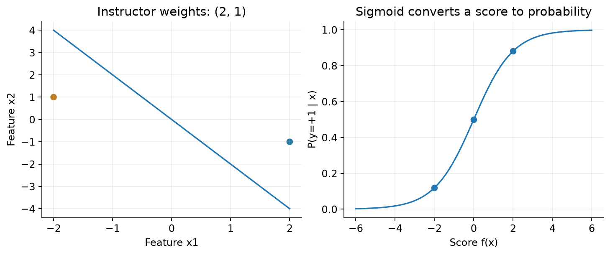
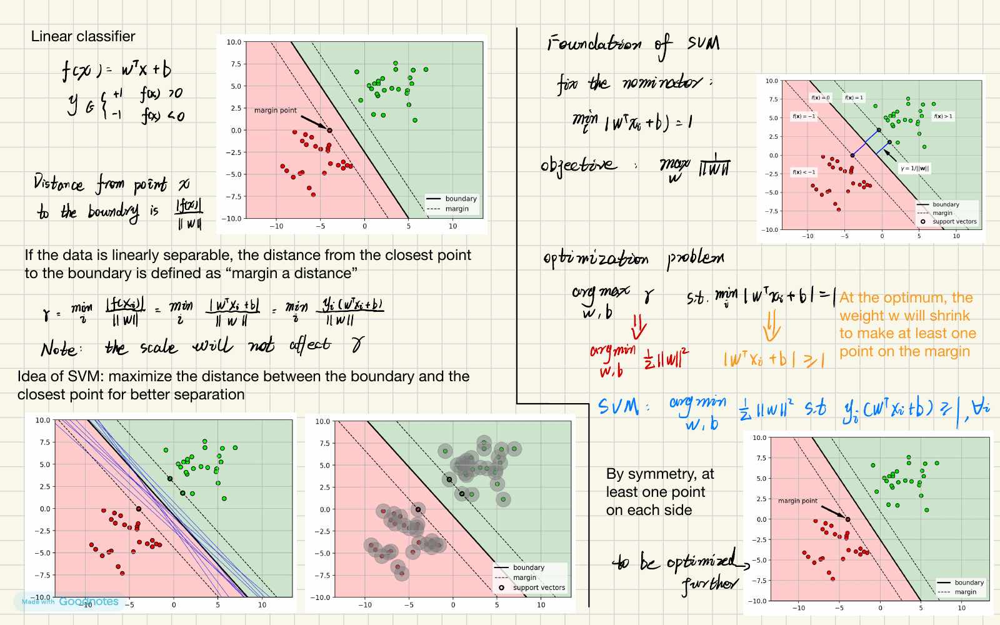
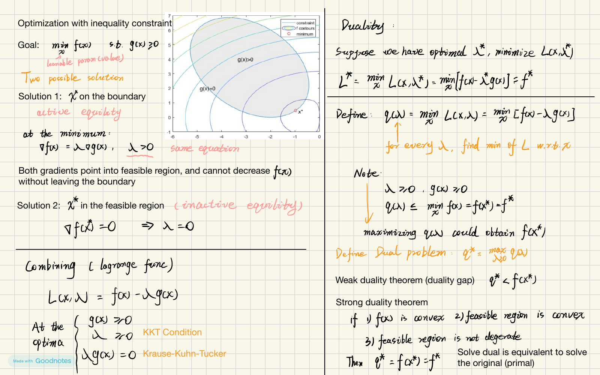
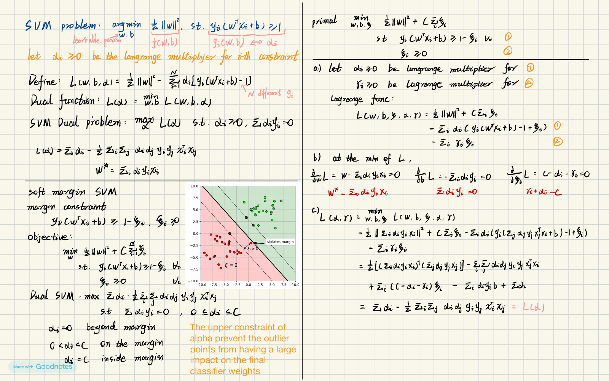
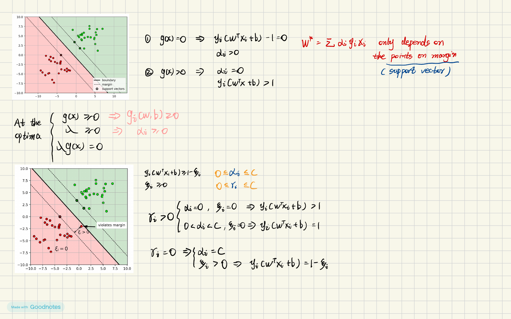

# Lecture 3 · Discriminative Classifiers｜从概率分布走向分类边界

[课程目录](README.md) · [上一讲：Bayes](Lecture02.md) · [Tutorial 3](Tutorial03.ipynb) · [下一讲：回归](Lecture04.md)

植物园仍然要辨认鸢尾花。上一讲先为每种花建立测量值的分布，再用 Bayes 规则判断新花。这一讲换个问题：如果最后只需要判断类别，能不能直接学习“什么测量结果应该分在哪边”？老师按 **线性分类 → Logistic Regression → SVM → Kernel SVM → 特征与模型比较** 展开，本讲义保持这个顺序。

**基础复习（可跳过）**：看不懂点积、距离时先读[长度与投影](../../learning/foundation-notes/MathForML.md#projection)；求梯度、约束和乘子卡住时读[梯度与约束](../../learning/foundation-notes/MathForML.md#optimization)。Python 数组操作回到 [Lecture 1](Lecture01.md#arrays)。先修页解释工具，本讲仍会完整解释分类方法。

[TOC]

| 主题 | 优先级 | 理解难度与卡点 | 应达到的能力；判断依据 |
|---|---|---|---|
| 线性分数、sigmoid、logistic loss | 核心必会 | 中；标签编码、概率方向 | 手算分数、概率和损失；Lecture3a，第24–52个单元 |
| 正则化、CV、预处理 | 核心必会 | 中；训练/验证边界 | 能设计无泄漏实验；Lecture3a，第65–73个单元、Lecture3c，第7–15个单元、Tutorial 3 |
| margin、hard/soft SVM | 核心必会 | 中至高；距离与函数值 | 解释并计算间隔、slack；Lecture3b，第11–60个单元、SVM手写补充，第1–4页 |
| SVM dual、KKT | 核心必会 | 高；对谁求导、约束符号 | 跟完关键求导并解释乘子；Lecture3b，第37–44个单元、SVM手写补充，第2–4页 |
| 核、特征映射及参数 | 核心必会 | 中至高；隐式内积 | 手算小核矩阵、实现原任务；Lecture3b，第83–123个单元、Tutorial 3 |
| 多分类、编码、不平衡 | 常规掌握 | 中；机制与实现区分 | 选择表示与评估方法；Lecture3a，第74–99个单元、Lecture3c，第16–42个单元 |
| 强对偶的一般证明、核的一般谱理论 | 二读拓展 | 高；数学条件 | 当前只需理解适用边界；整理者建议，未据此宣称“不考” |

优先级首先来自当前课件和 Tutorial 的实际要求。历史复习资料能帮助复习，不能把一个旧样题的出现次数叫作“高频”，也不能代替本学期或 QE 范围确认。

<a id="linear"></a>
## 1. Generative versus discriminative｜先弄懂我们换了什么目标

生成式分类器学 $p(\mathbf x\mid y)$ 和 $p(y)$，再得到后验 $p(y\mid\mathbf x)$。判别式分类器直接学后验或分类分数。两者都使用带标签的训练数据；“判别式”不等于“不需要概率”，SVM 和 Logistic Regression 也不是同一种训练目标。

老师先从上一讲搭桥（Lecture3a，第8–23个单元）。假设两个类别各维条件独立，**所有类别、所有维度共享同一个方差 $\sigma^2>0$**，均值分别为 $\boldsymbol\mu,\boldsymbol\nu$，先验为 $\pi_1,\pi_2>0$。比较两个后验的对数比：

$$\log\frac{p(y=1\mid\mathbf x)}{p(y=2\mid\mathbf x)}
=\sum_{j=1}^d\frac{\mu_j-\nu_j}{\sigma^2}x_j
+\frac{\|\boldsymbol\nu\|^2-\|\boldsymbol\mu\|^2}{2\sigma^2}
+\log\frac{\pi_1}{\pi_2}.$$

为什么突然变成直线？把 $(x_j-\mu_j)^2$ 和 $(x_j-\nu_j)^2$ 展开，两边的 $x_j^2$ 抵消，只剩一次项和常数。这个抵消依赖共享方差；不要套回 Lecture 2 的逐类完整协方差模型。

将各个一次项系数记成 $w_j$，所有常数合成 $b$，得到 $f(\mathbf x)=\mathbf w^T\mathbf x+b$。接下来不必先估计均值和方差，可以直接从数据学习 $\mathbf w,b$。

**English takeaway (整理表达):** A shared-variance Gaussian model yields a linear log-posterior ratio. Discriminative learning estimates a decision rule or a posterior directly.

## 2. Linear classifier and separating hyperplane｜一张有方向的分界线

从 Lecture3a，第24个单元 开始，理论标签改成 $y\in\{-1,+1\}$，不再是前面的 1、2。输入 $\mathbf x\in\mathbb R^d$、权重 $\mathbf w\in\mathbb R^d$，偏置 $b$ 是一个数。$f>0$ 判 +1，$f<0$ 判 −1；$f=0$ 要约定平局处理。分数本身不是概率。

老师原例 $\mathbf w=(2,1)^T,b=0$：看见 $(2,-1)$ 就算 $2\times2-1=3$，判 +1；看见 $(-2,1)$ 得 −3，判 −1。边界 $2x_1+x_2=0$ 垂直于 $\mathbf w$。二维是线，三维是平面，$d$ 维叫超平面（hyperplane），维度为 $d-1$，要求 $\mathbf w\ne0$。



图左按原例重绘分类边界，右边显示同一分数经sigmoid转换后的概率。生成代码见 `tools/verify_lecture_examples.py`。

**自测 / Check:** 若 $\mathbf w=(2,1)^T,b=-1,\mathbf x=(1,2)^T$，分数和预测是什么？ / Find the score and class for these values.

<details markdown="1"><summary>答案 / Answer</summary>

$f=2+2-1=3>0$，预测 +1。 / The score is 3; predict +1. 偏置移动边界，不增加一个观测维度。

</details>

<a id="logistic"></a>
## 3. Logistic regression｜把分数翻译成概率

“分数为 3”不直接告诉我们有多确定。Logistic Regression 用 sigmoid：

$$\sigma(z)=\frac1{1+e^{-z}},\qquad p(y=+1\mid\mathbf x)=\sigma(f(\mathbf x)),\quad p(y=-1\mid\mathbf x)=1-\sigma(f(\mathbf x)).$$

分数 0 对应 0.5；分数 2 对应约 0.8808；−2 对应约 0.1192。概率相加为 1。名称里虽然有 regression，这里做的是分类。Lecture3a，第36个单元 的一维原例 $f(x)=2x-4$，所以边界在 $x=2$，不是在 $x=0$。

现在反过来：给出训练数据，怎样找权重？每个样本希望模型给它的**真实类别**较高概率。利用 $1-\sigma(z)=\sigma(-z)$，两种标签合并为 $p(y\mid\mathbf x)=\sigma(yf(\mathbf x))$。这个写法只适用于 $y=\pm1$；不能直接把 0/1 标签代进去。

令 $z_i=y_i f(\mathbf x_i)$。它为正说明分对，负说明分错，零在边界。独立样本的条件似然相乘，取对数后相加；最大化对数似然等价于最小化负对数：

$$E(\mathbf w,b)=\sum_{i=1}^N\ell(z_i),\qquad \ell(z)=\log(1+e^{-z}).$$

若真实标签 −1，分数却为 2，那么 $z=-2$、损失约 2.1269；同样标签配分数 −2，损失约 0.1269。损失是“对真实答案有多不买账”，不是错误样本的简单计数。即使分对但信心不足，损失仍不为零。

**English:** Logistic regression minimizes the negative conditional log-likelihood. The signed score $yf(x)$ distinguishes correct from incorrect predictions.

## 4. Regularization and optimization｜限制大权重，减少过拟合

模型可能靠很大的权重把训练点分得极其自信，但新数据稍有变化就出错。Lecture3a，第49–51个单元 给权重零均值高斯先验，协方差 $(C/2)I$，得到课堂目标：

$$E=\frac1C\|\mathbf w\|^2+\sum_i\log(1+e^{-y_i(\mathbf w^T\mathbf x_i+b)}),\qquad C>0.$$

第一项惩罚大权重，第二项拟合数据。**小 $C$：更强正则；大 $C$：更弱正则。** 这是一种 MAP 解释，偏置在这份公式里未被惩罚。库中的 $1/2$、求和/平均及 solver 约定可能不同，不应从同一个数值 C 推断不同软件必然输出同一模型。

老师说用迭代优化（Lecture3a，第52个单元）。补足最关键一步：对一个样本，

$$\frac{d\ell}{dz}=-\frac1{1+e^z}=-\sigma(-z),\qquad
\nabla_{\mathbf w}\ell=-y\sigma(-yf)\mathbf x.$$

第一式来自先求 $\log u$ 的导数再乘 $u=1+e^{-z}$ 的导数；第二式再乘 $z=y(\mathbf w^T\mathbf x+b)$ 对权重的导数。加上正则得到

$$\nabla_{\mathbf w}E=\frac2C\mathbf w-\sum_i y_i\sigma(-y_if_i)\mathbf x_i,\quad
\frac{\partial E}{\partial b}=-\sum_i y_i\sigma(-y_if_i).$$

梯度下降把参数更新为 $\mathbf w\leftarrow\mathbf w-\eta\nabla E$，$\eta>0$ 是学习率。减号表示向局部下降方向走；步子过大仍会跨过谷底。

**补一步题 / Fill a step:** 单个样本 $x=2,y=+1,w=b=0$，无正则，$\eta=0.1$。一次同时更新得到什么？ / Compute one simultaneous gradient step with these values.

<details markdown="1"><summary>答案 / Answer</summary>

$f=0,\sigma(-yf)=0.5$，$\partial E/\partial w=-1$、$\partial E/\partial b=-0.5$。新 $w=0.1,b=0.05$，新分数 0.25，正确类别概率增加到约 0.5622。 / The updated parameters are w=0.1, b=0.05; the positive-class probability becomes about 0.5622.

</details>

## 5. Iris example and cross-validation｜让验证集帮我们选 C

课堂用 iris2.csv 的两项测量，固定 `random_state=4487`，各一半训练与测试；`C=100` 学到一条边界。原 Lecture3a，第59个单元 的系数是老师保存的输出，依赖版本/求解器，不能当成永不变化的常量。本轮关键计算另行重算，见配套运行报告。

课堂画几个 C 的测试表现属于课堂探索。正式选参应该在训练集内部做 K-fold cross-validation（CV）：将训练数据分 K 份，每次留一份验证，其他份训练；每个 C 得 K 个验证分数，取平均；选好后用**整个原训练集**重新拟合，最后才评估保留测试集。Lecture3a，第69个单元 的“all data”在这里应理解为所有训练数据，不包括用于最终评价的测试集。

如果还要标准化，`StandardScaler` 必须放在 `Pipeline` 里面，让每一折只用本折训练部分拟合均值与标准差。提前用整个训练集缩放再 CV，会把验证折的信息带进去。固定减 0.5 不依赖数据估计，性质不同。

```python
from sklearn.pipeline import make_pipeline
from sklearn.preprocessing import StandardScaler
from sklearn.linear_model import LogisticRegression
from sklearn.model_selection import GridSearchCV
model = make_pipeline(StandardScaler(), LogisticRegression(max_iter=3000))
search = GridSearchCV(model, {'logisticregression__C':[0.1,1,10]}, cv=5)
search.fit(trainX, trainY)
# Only now evaluate search on the untouched testX, testY.
```

当前接口使用 `model_selection`；原文提到的 `cross_validation` 是旧模块名。`mean_test_score` 在 GridSearchCV 中指每折的验证分数，不是你保留的外部测试集成绩。

来源：Lecture3a，第54–64个单元。
来源：Lecture3a，第66个单元。


## 6. Multiclass classification｜三类不是多加一个 if 就结束

One-vs-rest（OvR）为每一类训练“它 versus 其他类”分类器，然后比较各类分数/概率。三类要三个分类器。它们分别训练，原始 sigmoid 输出不必相加为 1；实现可进一步归一化。

Softmax 则一起训练 K 组权重，$f_c(\mathbf x)=\mathbf w_c^T\mathbf x$（偏置可加入或吸收到常数特征）：

$$p_c=\frac{e^{f_c}}{\sum_{j=1}^K e^{f_j}},\qquad \ell=-\sum_{c=1}^K y_c\log p_c.$$

$\mathbf y$ 是 one-hot 真实标签，仅真实类别的分量为 1，所以损失就是该类概率的负对数。分数 $(0,\log2,\log3)$ 对应概率 $(1/6,2/6,3/6)$；若真实类别为第 2 类，损失 $\log3\approx1.0986$。数值实现先减最大分数再指数，概率不变且更稳定。

原 `multi_class='ovr'` / `'multinomial'` 是旧接口写法。需要明确 OvR 时用 `OneVsRestClassifier(LogisticRegression(...))`；不要靠新版默认值猜老师在示范哪一种模型。


来源：Lecture3a，第74–85个单元。
来源：Lecture3a，第86–99个单元。

<a id="svm"></a>

## 7. Maximum margin｜不仅分开，还想留出余地

从两团可分数据开始。有很多条线能分对训练数据，SVM 优先选离最近点也尽量远的线。这就像在两排桌子中间留通道：只要没碰桌子不代表通道已经够宽。

点到超平面距离为 $|\mathbf w^T\mathbf x+b|/\|\mathbf w\|$。分母不能省：同时把 $\mathbf w,b$ 乘 10，分界线没动，分数放大 10 倍，距离不能跟着放大。

线性可分、标签正确侧的前提下，选择归一化使最近点 $y_if_i=1$。一侧 margin 为 $1/\|\mathbf w\|$，两条支持平面间的**总宽度**为 $2/\|\mathbf w\|$。于是 hard-margin SVM：

$$\min_{\mathbf w,b}\frac12\|\mathbf w\|^2\quad\text{s.t. } y_i(\mathbf w^T\mathbf x_i+b)\ge1\quad\forall i.$$

目标让间隔大，约束保证所有点都在正确侧且不侵入间隔。单写 $|f_i|\ge1$ 不够，它也容许把标签全部分反；SVM手写补充，第1页 中绝对值中间式必须连着“正确分类”的前提读。

**完整小算例（补充）**：一维两点 $x_1=-1,y_1=-1$，$x_2=1,y_2=1$。约束为 $w-b\ge1$ 和 $w+b\ge1$，相加得 $w\ge1$。最小 $w^2/2$ 在 $w=1,b=0$，两点都是支持向量，一侧距离 1，总宽度 2。


来源：Lecture3b，第4–26个单元。

<a id="dual"></a>

## 8. Lagrangian and duality｜换一组未知数，不是凭空变公式

上一节直接求出了一条最大间隔分界线。接下来把每个样本与边界的关系写进求解过程：给第i条约束配一个非负数 $\alpha_i$，称为拉格朗日乘子（Lagrange multiplier）。最终哪些乘子非零，就能看出哪些样本直接参与了边界的表示。

先固定一种符号约定：把要求写成 $g_i\ge0$，拉格朗日函数写作 $L=f-\sum_i\alpha_i g_i$。当约束满足时，减去的是非负数，因此L不会超过原目标f。这一点会让我们得到原问题最优值的下界。若改写为 $h_i=-g_i\le0$，同一个式子便成为 $L=f+\sum_i\alpha_i h_i$；正负号来自约束的写法。

对 hard SVM，$g_i=y_i(\mathbf w^T\mathbf x_i+b)-1$：

$$L(\mathbf w,b,\boldsymbol\alpha)=\frac12\mathbf w^T\mathbf w-\sum_i\alpha_i[y_i(\mathbf w^T\mathbf x_i+b)-1].$$

先固定 $\alpha$，对原变量 $\mathbf w,b$ 取最小值。展开与求导：

$$L=\frac12\mathbf w^T\mathbf w-\mathbf w^T\sum_i\alpha_iy_i\mathbf x_i-b\sum_i\alpha_i y_i+\sum_i\alpha_i,$$

$$\nabla_{\mathbf w}L=\mathbf w-\sum_i\alpha_iy_i\mathbf x_i=0,
\qquad \partial L/\partial b=-\sum_i\alpha_i y_i=0.$$

所以 $\mathbf w=\sum_i\alpha_i y_i\mathbf x_i$ 且 $\sum_i\alpha_i y_i=0$。若后一项不为零，$b$ 可让 L 向负无穷走，不能形成有限对偶函数。将两式代回，二次项一正一负相减，得到

$$\max_{\boldsymbol\alpha}\sum_i\alpha_i-\frac12\sum_{i,j}\alpha_i\alpha_jy_iy_j\mathbf x_i^T\mathbf x_j,
\quad\sum_i\alpha_iy_i=0,\quad\alpha_i\ge0.$$

原来未知数是 d 个权重和 b；现在每个训练点对应一个 $\alpha_i$。**对偶（dual）**不是换了数据，只是用“各样本怎样共同支撑边界”表示同一问题。

对前面的 $(-1,-1),(1,+1)$ 小例，两乘子相等为 a，目标 $2a-2a^2$。导数 $2-4a=0$ 得 $a=1/2$，恢复 $w=(1/2)(-1)(-1)+(1/2)(1)(1)=1$，与直接解一致。

刚才的小例中，对偶问题与原问题得到相同答案。这需要成立条件支持。

<details markdown="1"><summary>二读：为什么这道SVM问题能通过对偶求解？</summary>

固定任意非负乘子时，对偶函数给出原最小值的一个下界，称为弱对偶（weak duality）；最大化这个下界，就是寻找尽可能紧的下界。当最好的下界恰好等于原最小值时，称为强对偶（strong duality）。

这里的目标是凸函数，约束是线性的。对于线性可分的hard-margin SVM，可以把一组正确分离的权重与偏置放大，使所有 $y_if_i>1$，即每条不等式都留有余量。这满足本题所需的严格可行条件。Soft-margin SVM也可以构造严格可行点。因此本讲可用对偶求解；一般凸优化的完整条件见进一步的优化课程。

</details>

## 9. KKT and support vectors｜乘子告诉我们哪条约束在起作用

回看两类样本：有些点远离分界线，约束已经留足余量；有些点恰好压在间隔边缘。我们希望区分这两种情况。Karush–Kuhn–Tucker（KKT）条件把它们与乘子联系起来：

1. 分界线满足原约束：$y_if_i\ge1$。
2. 每个乘子 $\alpha_i\ge0$。
3. 对权重和偏置求导为0，得到上一节的两条等式。
4. **互补松弛（complementary slackness）：** $\alpha_i(y_if_i-1)=0$。

最后一条最值得单独看。$y_if_i-1$是这条约束剩余的量：大于0表示点在间隔外，为0表示点恰好在间隔边缘。

若一个点满足 $y_if_i=2$，剩余量为1，乘积要为0便只能有 $\alpha_i=0$。反过来，若 $\alpha_i>0$，剩余量必须为0，即 $y_if_i=1$。

这两条推理不能任意倒过来：当剩余量为0时，乘积已经是0，乘子也可以为0。因而“点在间隔边缘”并不保证它有非零乘子；这种情况会在退化数据中出现。原课和手写补充中的简略箭头应按上述方向理解。

预测可写成 $\operatorname{sign}(\sum_i\alpha_i y_i\mathbf x_i^T\mathbf x_*+b)$，零乘子的点没有直接贡献。用一个合适的边界支持向量恢复 $b=y_i-\mathbf w^T\mathbf x_i$，数值程序常对多个合适点综合处理。

**变式 / Transfer:** 把两点移到 $x=\pm2$，标签仍为两侧 −1/+1。求 w、b、一侧 margin 和两个乘子。 / Move the two points to ±2 and find the hard-margin solution and multipliers.

<details markdown="1"><summary>答案 / Answer</summary>

$w=1/2,b=0$，margin=2。设两个乘子均 a，$w=4a$，所以 $a=1/8$。 / w=0.5, b=0; the one-sided margin is 2 and both multipliers are 0.125. 不能因为坐标加倍就说权重也加倍。

</details>

## 10. Soft-margin SVM｜允许有代价的违规

有重叠/噪声时，强求所有点正确且留出间隔可能无解。为每点引入无量纲 slack $\xi_i\ge0$：

$$\min_{\mathbf w,b,\boldsymbol\xi}\frac12\|\mathbf w\|^2+C\sum_i\xi_i,
\quad y_if_i\ge1-\xi_i,\quad\xi_i\ge0,\quad C>0.$$

在最优解，对给定分数取最小允许 slack：$\xi_i=\max(0,1-y_if_i)$，即 hinge loss。$y_if_i=1.4$ 时 slack=0；0.4 时 slack=0.6，**仍分类正确**；−0.2 时 slack=1.2，才是错分。slack 是分数上的缺口，几何长度还要除 $\|w\|$。

消去 slack 后为 $\frac12\|w\|^2+C\sum_i\max(0,1-y_if_i)$。整体除 C 得正则系数 $1/(2C)$。Lecture3b，第58个单元 写成 $1/C$ 时相当于重新定义了 C，不能在数值比较时无声跳过因子 2。

对 $\xi_i\ge0$ 引入另一个乘子 $\gamma_i$，$\partial L/\partial\xi_i=C-\alpha_i-\gamma_i=0$，故 $0\le\alpha_i\le C$。对偶目标形式不变，增加上界。

| 最优乘子情形 | 可以可靠推出什么 |
|---|---|
| $\alpha_i=0$ | slack=0，$y_if_i\ge1$；不保证严格大于 |
| $0<\alpha_i<C$ | slack=0，$y_if_i=1$；适合恢复 b |
| $\alpha_i=C$ | $y_if_i\le1$；可以在边界、间隔内或错分 |

大 C 让违规更贵，小 C 更愿意牺牲部分训练拟合。不是“大 C 永远更好”。原 `C=inf` 是概念性硬间隔示范，新接口要求有限 C；大有限 C 也只是近似，并需核查可分性与间隔。

来源：SVM手写补充，第3页。


## 11. Multiclass SVM and kernel trick｜直线不够，就改变表示

课堂将多类SVM用于Iris，并通过交叉验证比较模型。原 `SVC` 多类内部为 one-vs-one，K 类训练 $K(K-1)/2$ 个二分类器，再投票。输出分数呈 OvR 形状不意味着内部改成了 OvR 训练；需要 OvR 模型时显式使用包装器，其网格参数名为 `estimator__C`。

当两类数据呈XOR、中心与两侧或双月形分布时，直线可能不够用。XOR 的 $(1,1),(-1,-1)$ 一组，$(1,-1),(-1,1)$ 另一组，原平面没有一条直线能分开；补一个 $x_1x_2$ 特征，前组 +1、后组 −1，就能分。这个特征捕捉了两项输入是否同号。换特征应有这样的具体理由；来源：Lecture3b，第83–88个单元。

对偶里只用内积，所以可用 $k(\mathbf x,\mathbf x')=\Phi(\mathbf x)^T\Phi(\mathbf x')$ 直接算映射后的内积，省去显式构造巨大的 $\Phi$。这是 kernel trick。

老师二次多项式原例采用重复交叉项：$\Phi(x_1,x_2)=(x_1^2,x_1x_2,x_2x_1,x_2^2)$，于是内积等于 $(\mathbf x^T\mathbf x')^2$。如果只保留一个交叉项，就要写 $\sqrt2x_1x_2$ 才等价。取 x=(1,2)、x′=(3,4)，核为 $11^2=121$；映射内积为 $1\times9+2\times12+2\times12+4\times16=121$。

核 SVM 用 $k(x_i,x_j)$ 替代内积；软间隔仍须保留 $0\le\alpha_i\le C$。非线性是在原输入空间说的，映射空间里的分类器仍然线性。

来源：Lecture3b，第61–82个单元。


## 12. RBF and custom kernels｜相似度也有尺度

RBF 核 $k(x,x')=\exp(-\gamma\|x-x'\|^2)$，$\gamma>0$。小 gamma 的相似度随距离下降较慢；大 gamma 更局部，可形成复杂边界，但实际效果还取决于 C 和数据。gamma 的单位要与平方距离相抵；改变特征尺度等于改变距离含义。

课堂用20×20组参数、5折交叉验证比较RBF模型，共2000次候选拟合，再对选定方案重拟合。参数比较使用训练内部的验证分数。

**核的成立条件：** 一种相似度若要作为这里的实值核，必须对称，且由任意有限样本集合组成的核矩阵K都为半正定，即 $z^TKz\ge0$ 对所有实向量z成立。它保证K能表示某个特征空间里的内积。只检查手头的一张矩阵，可以发现当前实现错误，但不能证明这个函数对所有输入都成立。

来源：Lecture3b，第114个单元为参数搜索，第118个单元为核条件；其中positive definite应读作positive semidefinite。

课堂的自定义核示例实际用 **Euclidean** 距离 $\exp(-\alpha\|x-x'\|_2)$；Tutorial3 明确改为 **L1** 距离 $\exp(-\alpha\sum_j|x_j-x'_j|)$。两者不能因为都叫 Laplacian 就混用。函数输入为 $(N_1,d),(N_2,d)$，输出必须为 $(N_1,N_2)$；预测时比较的是测试与训练，不是测试与测试。

**English:** A kernel represents an inner product in a feature space. Tune kernel parameters using training-only validation, and state the exact distance convention.


来源：Lecture3b，第119–123个单元。

<a id="preprocessing"></a>

## 13. Features, scaling and imbalance｜同一模型也会被表示方式影响

先看特征尺度。标准化 $\tilde x_j=(x_j-m_j)/s_j$，每个特征分别用训练均值与标准差；常数特征需要实现中的特殊处理，不能除零。Min-max 为 $2(x-\min)/(\max-\min)-1$，新样本超出训练范围时可以落到 [−1,1] 之外。这不是程序必然出错。

接着看特征的表示方式。把 cat/dog/horse 编成 0/1/2 会强加虚假的次序和距离，one-hot 避免这个问题，但不自动表达动物相似性。原 Lecture3c，第17个单元 的 cat×horse=2 是算术笔误，0×2=0；真正的问题是数字的内积没有所需语义。Binning 将连续值分箱再 one-hot，会丢掉箱内细节；PolynomialFeatures 增加一次、平方和交互项；log 变换压缩正数跨度，需说明定义域，不能对零或负数直接 log。

课堂的类别不平衡例子有 200 对 20 个样本。`class_weight='balanced'` 使用 $w_c=N/(K N_c)$，两权重为 0.55、5.5，让两类总权重相等；它改变损失，不会凭空生成新数据。Lecture3c，第35–42个单元 的垃圾邮件例子讨论的是**错误代价不同**：合法邮件被扔掉更严重。人为设权重 {0:0.2,1:5} 让 class1 的单个样本权重是另一类的 25 倍，需要先说清哪个标签代表什么。

**自测 / Check:** 1000封合法邮件、10封垃圾邮件，全部预测合法，accuracy 是否足以说明成功？ / Is always predicting legitimate mail successful on this imbalanced set?

<details markdown="1"><summary>答案 / Answer</summary>

accuracy=1000/1010≈99.01%，但垃圾邮件召回率为0；两类 balanced accuracy=(1+0)/2=0.5。 / Accuracy is about 99.01%, spam recall is zero, and balanced accuracy is 0.5. 应按任务代价同时看各类表现。

</details>

来源：Lecture3c，第7–15个单元。
来源：Lecture3c，第16–24个单元。
来源：Lecture3c，第25–34个单元。


## 14. Classification summary｜把不同方法放在同一张地图

| 方法 | 训练在做什么 | 输出/优势 | 条件与代价 |
|---|---|---|---|
| Bayes / NB | 估计先验与类条件分布 | 可多类；结构假设降低估计负担 | 依赖分布/独立假设；边界未必非线性 |
| Logistic regression | 正则化条件似然 | 概率与线性分数 | 概率校准仍需检查，不是名称保证 |
| Linear SVM | 权衡间隔与 hinge 违规 | 高维线性判别 | 原始分数非概率；尺度/C有影响 |
| Kernel SVM | 在核特征空间做 SVM | 非线性与自定义相似度 | 核条件、调参、Gram矩阵开销 |

把这些模型的训练目标放在一起，可统一写为 $\sum_i L(y_i,f(x_i))+\lambda\Omega(f)$：数据拟合加模型复杂度惩罚。Logistic loss 对分对的点仍有非零惩罚，hinge 超过间隔后为0；原画图将 logistic loss 除以 log2 是视觉尺度调整，不能无声当成同一正则强度的目标。

“No Free Lunch”提醒我们不存在对所有任务都占优的模型，不代表在特定数据与假设下无法比较模型。用一致划分、合适指标和验证设计比较，可以将本讲的算法放在同一条件下评价。

来源：Lecture3c，第44–50个单元。


## 15. Back to the tutorial and English self-test｜从本讲走向实践

[Tutorial 3](Tutorial03.ipynb) 将图像展平成特征，先比较 LR 与 linear SVM，再裁剪与使用 L1 核。它检验的是这讲的表示、CV、模型比较与权重解读，不是仅会调用 fit。

1. **Why does multiplying both w and b by a positive constant leave the boundary unchanged? / 为什么同时正比例放大 w、b 不改变边界？** 答：原来满足 $w^Tx+b=0$ 的点，整体乘一个正数后仍满足这个等式，所以分界线不变。距离公式的分子、分母放大相同倍数，距离也不变。 / The zero set is unchanged and the scale cancels in geometric distance.
2. **Does a point inside the margin have to be misclassified? / 间隔内必然错分吗？** 答：不是，$0\lt yf\lt 1$ 仍正确。 / No; a signed score between zero and one is correct but violates the margin.
3. **Why put scaling inside CV? / 为什么在每折内部缩放？** 答：验证折不能影响拟合的预处理参数。 / Validation data must not determine fitted preprocessing parameters.
4. **What is the difference between a decision score and a probability? / 分数与概率有什么区别？** 答：分数可任意实数，概率需在[0,1]且对类别归一。 / Scores need not be bounded or normalized; class probabilities do.

先复习已有卡 [M143、M144、M146：SVM间隔](https://crazyshout.github.io/micro-course/cards.html#CS5489-M143)、[M166：核函数](https://crazyshout.github.io/micro-course/cards.html#CS5489-M165)；按卡号定位，卡组复习继续在 Markji。

## 16. 原课疑点与覆盖索引

主依据为当前 Lecture3a、Lecture3b、Lecture3c 及 SVM 手写补充。Notebook单元按原文件从1计数，手写补充按PDF页码计。补充推导与课件勘误在对应位置标注。

**已核对修正：** Lecture3b，第38个单元 不应对所有不等式乘子都强行令 $\partial L/\partial\lambda=0$；应使用KKT。Lecture3b，第40个单元强对偶需条件；Lecture3b，第41个单元/SVM手写补充，第4页的乘子关系需保留单向蕴含；SVM手写补充，第2页名称为 Karush 而非 Krause；SVM手写补充，第2页弱对偶用≤而不是总用&lt;；SVM手写补充，第3–4页的软间隔乘子边界取包含端点的解释；Lecture3b，第58个单元正则系数差2；Lecture3b，第86个单元扩维不保证可分；Lecture3b，第118个单元半正定非严格正定；Lecture3c，第17个单元乘法笔误。原件均未改动。

| 原位置（单元号从1起） | 本文对应 | 内容处理 |
|---|---|---|
| Lecture3a，第1–7个单元 | 开篇、§1 | 课程位置、生成式/判别式、设置 |
| Lecture3a，第8–23个单元 | §1 | 共享方差推导、iris2、后验图代码用途 |
| Lecture3a，第24–31个单元 | §2 | 线性函数、超平面、两半空间 |
| Lecture3a，第32–48个单元 | §3 | sigmoid、MLE、signed score、loss |
| Lecture3a，第49–52个单元 | §4 | 先验、正则、优化；补完整梯度 |
| Lecture3a，第53–64个单元 | §5 | 原Iris划分、系数、预测图与准确率 |
| Lecture3a，第65–73个单元 | §5 | C、CV、结果字段 |
| Lecture3a，第74–85个单元 | §6 | OvR及三类Iris演示 |
| Lecture3a，第86–100个单元 | §6、§14 | softmax、one-hot似然、交叉熵与总结；末空单元 |
| Lecture3b，第1–10个单元 | §7 | 设置、可分数据、多个候选边界 |
| Lecture3b，第11–30个单元 | §7 | margin图、参数/样本扰动直觉、距离 |
| Lecture3b，第31–36个单元 | §7 | 归一化、约束、硬间隔目标 |
| Lecture3b，第37–48个单元 | §8–9 | Lagrangian、dual、乘子、预测 |
| Lecture3b，第49–60个单元 | §10 | slack、C、hinge及图示 |
| Lecture3b，第61–82个单元 | §11、§5 | Iris、网格、测试、多类OvO/OvR |
| Lecture3b，第83–100个单元 | §11 | 非线性例子、映射、多项式核及边界 |
| Lecture3b，第101–117个单元 | §12 | RBF、gamma、Iris网格搜索 |
| Lecture3b，第118–124个单元 | §12、§14 | 合法核、Euclidean自定义核、总结 |
| Lecture3c，第1–6个单元 | §5、§13 | 数据与作图辅助函数 |
| Lecture3c，第7–24个单元 | §13 | 缩放、编码、binning、polynomial、log |
| Lecture3c，第25–42个单元 | §13 | 数量不平衡与错误代价 |
| Lecture3c，第43–53个单元 | §14–15 | 比较表、loss/regularization/SRM、应用与NFL |
| SVM手写补充，第1页 | §7 | 距离、归一化、硬间隔；原图与前提 |
| SVM手写补充，第2页 | §8–9 | 约束、KKT、弱/强对偶 |
| SVM手写补充，第3页 | §8、§10 | 硬对偶、软原问题及三组求导 |
| SVM手写补充，第4页 | §9–10 | 支持向量与乘子情形；修正退化边界 |

Notebook的重复绘图单元和辅助代码按概念合并。下方保留四页SVM手写补充，可放大对照原式，再回到§8–10的逐步解释。

<details markdown="1"><summary>SVM手写原图（四页）</summary>






</details>