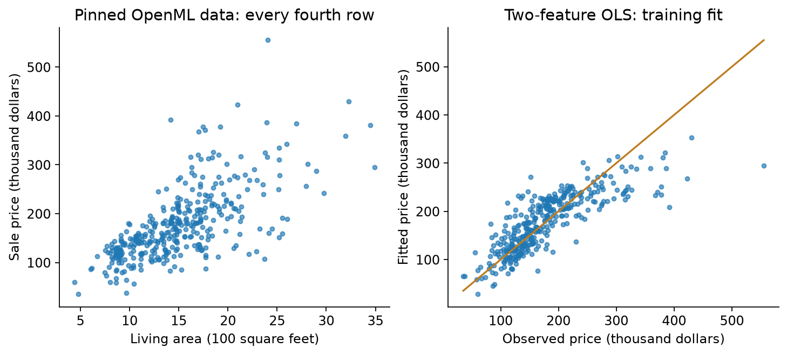
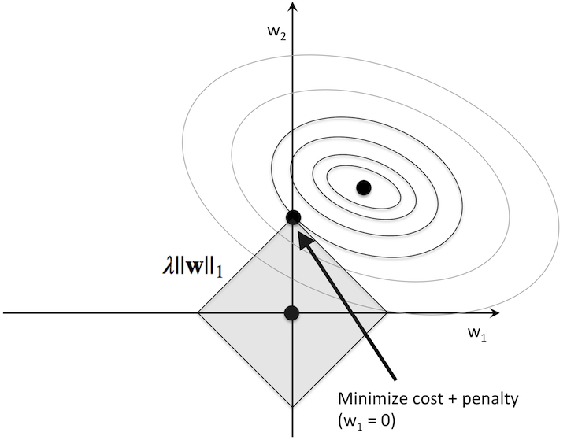
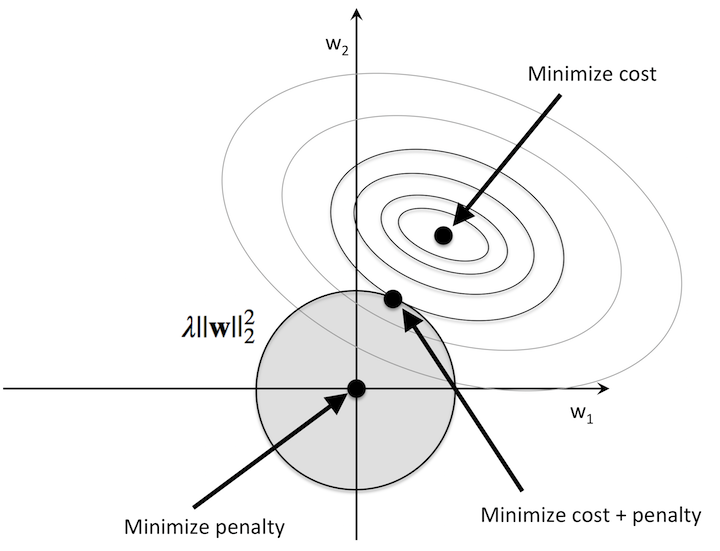
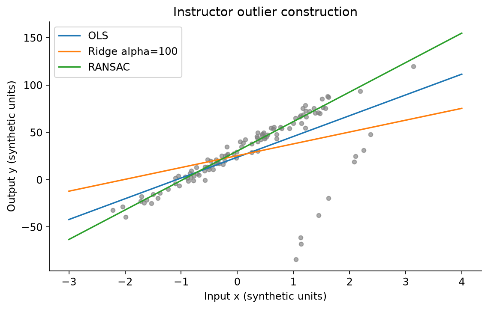
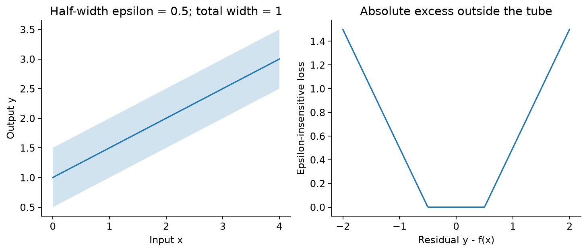
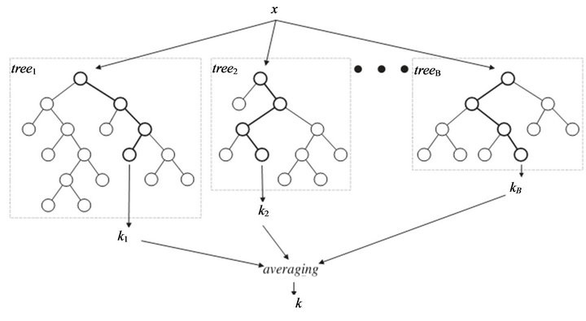

# Lecture 4 · Regression｜从“分到哪一类”走向“预测多少”

[课程目录](README.md) · [上一讲：分类](Lecture03.md) · [数学补课：秩与伪逆](../../learning/foundation-notes/MathForML.md#rank-pseudoinverse)

上一讲给一朵花贴类别标签。这一讲老师换成房价：已知房屋面积、售出时的年龄等信息，希望预测一个数值。输出不再是有限几个标签，而是实数。我们沿着 **线性回归 → 特征选择 → 异常值 → 非线性回归 → 集成模型** 走一遍。下面用房价数据观察这些方法怎样拟合数值。

配套练习是[Tutorial 4：共享单车回归](Tutorial04.ipynb)，会把回归用于按年份变化的需求数据。原课文件及单元覆盖见文末。

基础复习可跳过：不熟悉函数和斜率，读[函数图像](../../learning/foundation-notes/MathForML.md#symbols-functions)；矩阵不满秩、不能直接求逆，读[秩与伪逆](../../learning/foundation-notes/MathForML.md#rank-pseudoinverse)；不熟悉向量导数，读[梯度](../../learning/foundation-notes/MathForML.md#optimization)。Python与数组回到[Lecture1](Lecture01.md#arrays)。

<!-- EXAM:overview:START -->

## Exam focus｜这一讲怎样安排复习

历史期中常要求比较正则化、损失和集成方法。矩阵求解、RANSAC及核回归即使在这批卷中出现较少，也由当前Lecture和Tutorial直接要求；不要按卷数跳过它们。

| 考点 | 复习动作 | 期中：直接／关联 | 期末：直接／关联 | QE记录 | 入口 |
|---|---|---|---|---|---|
| OLS与基线 | 会手算并核对单位与秩条件 | 1套／未见 | 未见／未见 | 未见 | [讲解](#ols) |
| Ridge、LASSO与特征选择 | 先分清残差损失和参数惩罚 | 6套／未见 | 未见／未见 | 未见 | [讲解](#ridge) |
| 稳健与非对称残差损失 | Huber与非对称损失为历史补充 | 5套／未见 | 未见／未见 | 未见 | [讲解](#regression-losses) |
| Bagging、RF与boosting | 分清训练并行与预测并行 | 4套／3套 | 未见／未见 | 未见 | [讲解](#ensembles) |
| 树间相关性与平均方差 | 保留等方差、等相关假设 | 1套／未见 | 未见／未见 | 未见 | [讲解](#forest-variance) |
| 核回归与SVR | 当前主课与Tutorial仍需掌握 | 1套／未见 | 未见／未见 | 未见 | [讲解](#kernel-regression) |

**口径：** 同一考点在同一独立试卷只计一次；题纸、答案和扫描副本不重复计。已辨识6套期中、3套期末；模拟题另列，2021B*保留封面年份冲突。同卷可同时有直接题和关联题，两列不相加。未见不等于不考，QE题段不换算为已确认卷数。

Huber、非对称损失、Elastic Net和RF方差推导作为明确标识的历史补充。AdaBoost、Gaussian process需要额外知识；当前不扩写成另一整讲。现有期末与QE未见直接对应本讲的独立题。

标记：期中期末QE颜色区分考试类别；卷数与考查关系直接见标签文字。

题号见[讲末索引](#exam-topic-index)，材料身份见[全册附录](ExamIndex.md)。

<!-- EXAM:overview:END -->

[TOC]

| 主题 | 优先级 | 难度与卡点 | 掌握要求与依据 |
|---|---|---|---|
| OLS、残差与矩阵解 | 核心必会 | 中至高；样本放行还是列 | 解释、手算、推导并判断可逆；Lecture4a，第13–34个单元 |
| Ridge、LASSO、OMP | 核心必会 | 高；缩小与精确为零不同 | 比较目标、选择特征、验证；Lecture4a，第35–88个单元 |
| RANSAC | 常规掌握 | 中；阈值与随机采样 | 解释并走完一次迭代；Lecture4b，第4–15个单元 |
| Polynomial、kernel ridge、SVR | 核心必会 | 中至高；模型与损失 | 计算小例，设计CV；Lecture4b，第16–72个单元 |
| Tree、RF、boosting | 常规掌握 | 中；模型怎样组合 | 解释机制、比较误差；Lecture4b，第73–100个单元 |
| 大规模网格与一般核理论 | 二读拓展 | 高；计算规模 | 能读流程和适用条件；Lecture4a／Lecture4b中的搜索示范 |

优先级依据当前课件及Tutorial4的回归任务。难度反映理解所需的步骤，考核范围仍以教师公布的要求为准。

## 1. Regression and the housing example｜先弄清横纵轴的单位

输入 $\mathbf x\in\mathbb R^d$，输出 $y\in\mathbb R$；希望学到 $\hat y=f(\mathbf x)$。误差 $r_i=y_i-\hat y_i$ 叫 residual（残差）。图上的点表示实际观测，线或曲面表示模型预测；在同一个输入位置，真实值减预测值得到残差；一维图上是带正负号的竖直差，不是点到直线的最短垂直距离。

老师先用100个人工数据点展示斜率、截距和噪声，再用真实房屋记录预测售价。

课堂mode1按下面的方式处理房屋记录：

| 原字段 | 处理后 | 单位与解释 |
|---|---|---|
| GrLivArea | 除100 | 100平方英尺（不是平方米） |
| YrSold、YearBuilt | 相减 | 售出时年龄，年 |
| SalePrice | 除1000 | 原数据价格单位的千元，图中标为美元千元 |
| 行采样 | `[::4]` | 每4行取1行，保留原顺序；不是随机抽样 |

mode2 取 GrLivArea、TotRmsAbvGrd、GarageArea、TotalBsmtSF、Fireplaces、BedroomAbvGr、FullBath、LotArea、LowQualFinSF、OverallQual、OverallCond、YrSold、YearBuilt，合并最后两列为 Age 后剩12维；这些面积列不统一除100。预测目标仍除1000。不同 mode 的系数不能直接比数值。

看图时，找几栋面积接近的房屋：它们的售价仍然不同。面积能解释一部分价格差异，房龄等因素还可能提供更多信息。因此，我们寻找的是总体误差较小的预测关系。

## 2. Linear regression and OLS｜找一条总体偏差较小的线

一维 $\hat y=wx+b$，w是每增加一单位x的预测变化；b是在x=0的截距。多维 $\hat y=\mathbf w^T\mathbf x+b$，每个系数解释为**其他输入固定时模型的预测变化**，不是现实中强行改变该属性的因果效应。

Ordinary least squares（OLS，普通最小二乘）最小化平方残差和：

$$
E(\mathbf w,b)=\sum_{i=1}^N[y_i-(\mathbf w^T\mathbf x_i+b)]^2.\tag{4.1}
$$

为什么平方？正负残差不能相互抵消，偏离越远罚得越多，也形成方便求导的目标。代价是极端点的影响可能很大。MSE=E/N，RMSE=$\sqrt{E/N}$：MSE的单位是价格单位的平方，RMSE才回到价格单位。

**完整补算（教学例子）：** 三个观测点为 $(0,1),(1,2),(2,2)$。先求平均：$\bar x=(0+1+2)/3=1$，$\bar y=(1+2+2)/3=5/3$。先用下面的斜率公式算一次结果，随后从平方误差推导它，再接到矩阵写法。

| 点 | $x_i-\bar x$ | $y_i-\bar y$ | 两者乘积 | $(x_i-\bar x)^2$ |
|---|---:|---:|---:|---:|
| (0,1) | −1 | −2/3 | 2/3 | 1 |
| (1,2) | 0 | 1/3 | 0 | 0 |
| (2,2) | 1 | 1/3 | 1/3 | 1 |
| 合计 | | | 1 | 2 |

$$
w=\frac{\sum_i(x_i-\bar x)(y_i-\bar y)}{\sum_i(x_i-\bar x)^2}=\frac12,
\qquad b=\bar y-w\bar x=\frac76.\tag{4.2}
$$

把各个x代入 $\hat y=x/2+7/6$，预测为 $(7/6,5/3,13/6)$；真实值减预测值得残差 $(-1/6,1/3,-1/6)$。因此

$$
\mathrm{SSE}=\frac1{36}+\frac19+\frac1{36}=\frac16,
\qquad\mathrm{MSE}=\frac{\mathrm{SSE}}3=\frac1{18}.\tag{4.3}
$$

### 斜率和截距的公式从哪里来？

先固定斜率$w$，看怎样选择截距$b$。在$E(w,b)=\sum_i[y_i-wx_i-b]^2$中，每个残差对$b$的导数都是$-1$；平方求导后得到：

$$
\begin{gathered}
\frac{\partial E}{\partial b}
=-2\sum_{i=1}^N(y_i-wx_i-b)=0,\\
\sum_i y_i-w\sum_i x_i-Nb=0,\\
b=\bar y-w\bar x.
\end{gathered}\tag{4.3a}
$$

这里$\bar x,\bar y$分别是输入与输出的平均值。固定斜率后，平方误差关于$b$的二阶导数为$2N>0$，因此这个截距确实使误差最小。把它代回预测式，得到$wx_i+b=\bar y+w(x_i-\bar x)$：最佳直线经过平均点$(\bar x,\bar y)$。

接着只剩斜率未知。为看清求导，记$u_i=x_i-\bar x$、$v_i=y_i-\bar y$，它们都是已经由数据算好的数。代回截距后的残差就是$v_i-wu_i$，将此时的误差记作$E_c(w)$：

$$
\begin{gathered}
E_c(w)=\sum_i(v_i-wu_i)^2,\\
\frac{dE_c}{dw}=-2\sum_i u_i(v_i-wu_i)=0,\\
w\sum_i u_i^2=\sum_i u_i v_i.
\end{gathered}\tag{4.3b}
$$

只要输入不全相同，$\sum_i u_i^2>0$，两边除以它，就得到式（4.2）的斜率。三点表中已经算出$\sum_i u_i v_i=1$、$\sum_i u_i^2=2$，所以$w=1/2$；再用$\bar y-w\bar x$求得$b=7/6$。

若所有输入都等于某个$x_0$，则所有$u_i=0$，不能除以0。这时所有训练记录得到同一个预测$wx_0+b$；平方误差要求它等于$\bar y$，但满足这个关系的斜率和截距有无穷多组。后面的矩阵写法会把同一个问题表现为秩不足。

**English takeaway:** First minimize over the intercept to obtain $b=\bar y-w\bar x$. Substitution centers the data and leaves a one-variable problem for the slope. A unique slope requires at least two distinct input values.

来源：Lecture4a，第13、19–21个单元；一维逐步推导及三点算例为教学补充。

## 3. Matrix solution｜先摆好矩阵，再求导
<!-- EXAM:focus-ols:START -->

考点：OLS与基线

期中直接 · 1 套

<!-- EXAM:focus-ols:END -->

三点的计算可以一次写成矩阵运算。先沿用老师“每列一个样本”的约定：给每个输入补一个常数1，让偏置也能放进权重向量。记

$$
\begin{gathered}\tilde x_i=(x_i^T,1)^T,\qquad w\in\mathbb R^{d+1},\quad y\in\mathbb R^N,\\[3pt]
X=[\tilde x_1,\ldots,\tilde x_N]\in\mathbb R^{(d+1)\times N}.\end{gathered}\tag{4.4}
$$

这里d是每条记录的特征数，N是记录数；w最后一项是截距。$X^Tw$得到N个预测值，每个样本恰好对应一个。程序常把样本放在行上，此时数据矩阵应写成 $A=X^T$，预测为Aw。

展开目标：

$$
E=\|y-X^Tw\|^2=y^Ty-2y^TX^Tw+w^TXX^Tw.\tag{4.5}
$$

第一项不含w，导数0；第二项导数 $-2Xy$；因为 $XX^T$ 对称，第三项导数 $2XX^Tw$。令梯度为0：

$$
XX^Tw=Xy.\tag{4.6}
$$

方程能直接求逆的条件是X的各行相互独立，即**满行秩（full row rank）**。这时：

$$
w=(XX^T)^{-1}Xy.\tag{4.7}
$$

用刚才的三点核对两种写法。此处把矩阵解的权重明确写成$(w,b)^T$，避免把标量斜率$w$与整组参数混淆：

$$
\begin{gathered}
X=\begin{pmatrix}0&1&2\\1&1&1\end{pmatrix},\qquad
y=\begin{pmatrix}1\\2\\2\end{pmatrix},\\[4pt]
\underbrace{\begin{pmatrix}5&3\\3&3\end{pmatrix}}_{XX^T}
\begin{pmatrix}w\\b\end{pmatrix}
=\underbrace{\begin{pmatrix}6\\5\end{pmatrix}}_{Xy}.
\end{gathered}\tag{4.7a}
$$

第二行$3w+3b=5$给出$b=5/3-w$，正是前面的截距关系。第一行$5w+3b=6$减去第二行，得到$2w=1$，因此仍是$w=1/2,b=7/6$。矩阵方程把原来分别对斜率、截距求导的两条等式放在了一起。

在当前“样本放列”的约定下，每一行对应一项特征或常数1。若两项特征完全重复，便有两行相同，矩阵不能直接求逆。仅仅两条样本重复，并不足以断言所有行都不独立。

不能求逆时，最小二乘仍然有意义：仍可寻找误差最小的预测；若有多组系数做到同样好，伪逆会选长度最小的一组。具体数字见[秩与伪逆补课](../../learning/foundation-notes/MathForML.md#rank-pseudoinverse)。程序可用 `np.linalg.lstsq(A,y,rcond=None)`，等价写法是 $A^+y$。

**对照原课：** Lecture4a，第21个单元的 $(XX^T)^{-1}X$ 是 $X^T$ 的伪逆。数值程序通常通过解方程、QR或SVD求解，避免显式求逆；这些求解器细节可在二读时补充。

**变式 / Transfer:** 三点改成 $(0,2),(1,3),(2,3)$，w、b、MSE怎样变？ / Add one to every output in the worked example; how do w, b and MSE change?

答案 / Answer

w仍1/2，b变13/6，残差与MSE不变。 / The slope remains 0.5, the intercept becomes 13/6, and MSE remains 1/18. 整条线向上平移1。

### 为什么要和“永远预测平均值”比较？

一个不看输入的简单模型，只输出训练目标的平均值$\bar y$。沿用三点例子，它每次预测$5/3$，训练SSE为$4/9+1/9+1/9=2/3$；前面的OLS为$1/6$，确实从x中利用到了信息。

含截距、无正则且求到最优解的OLS，在**同一训练集**上的SSE不会高于这个常数基线，因为$w=0,b=\bar y$本来就是它可以选择的一组参数。验证集没有这个保证。如果验证MSE只与基线相当，应检查两件事：输入是否缺少有用信息或线性形式不够；训练拟合是否受小样本、噪声或分布变化影响。前者可尝试有根据的新特征或非线性表示，后者可检查划分与数据质量，并用训练内部验证选择正则强度。

**判断 / Check：** 验证集上不如均值基线，是否证明OLS没有把训练目标最小化？ / Does worse validation MSE than the training-mean baseline prove that OLS failed to minimize its training objective?

**答 / Answer：** 不证明。训练目标与新样本表现是不同问题；比较时基线仍只用训练集算平均值。 / No. Training optimization and generalization are different; the baseline mean must still be fitted on training data only.

来源：2021B*期中Q11的验证集基线比较；三点计算为本讲例子的延伸。

## 4. Housing coefficients and feature selection｜大权重必须配着单位读

课堂分别用面积、年龄，以及两者共同拟合。原 Lecture4a，第34个单元 保存的文字系数“每100平方英尺增加8874、每年减少1048、截距82709”是**原课结果**。复算所用数据及结果见文末记录。

接着比较12个特征的散点/成对图。一个特征单独相关不代表加入其他特征后仍有同样贡献；面积、房间数可能彼此相关。想比较系数大小，先在训练数据上标准化，否则“美元/平方英尺”和“美元/年”不在同一尺度。标准化后系数对应输入改变一个训练标准差的预测差异。

来源：Lecture4a，第25–34个单元；第35–41个单元。

## 5. Ridge regression｜用平方惩罚稳定系数
<!-- EXAM:focus-ridge:START -->

考点：Ridge、LASSO与特征选择

期中直接 · 6 套

<!-- EXAM:focus-ridge:END -->

房屋面积和房间数往往一起增加，两项特征可能提供很相近的信息。此时，很多组系数都能拟合得差不多，数据稍有变化，系数却可能变很多。

看一个更极端的教学例子：把同一列面积重复输入两次。系数取 $(100,-99)$ 与 $(0.5,0.5)$ 时，预测相同，因为都只相当于面积乘1。前一组依赖两个大数互相抵消。Ridge在拟合误差之外，加上系数平方和作为代价：前一组是19801，后一组只有0.5，因此更偏好后一种分配。这里比较的是两组相同预测的系数；完整训练还会同时权衡预测误差。

$$
E(w)=\sum_i(y_i-f(x_i))^2+\alpha\|w\|^2,\qquad\alpha\ge0.\tag{4.8}
$$

第一项要求预测贴近数据，第二项限制系数大小。alpha越大，大系数的代价越高；它与上一讲分类器C的调节方向相反。常用实现只惩罚特征权重，不惩罚截距。

**一维手算（无截距）：** x=(1,2)，y=(1,2)，所以 $\sum x^2=\sum xy=5$。目标为 $5(1-w)^2+\alpha w^2$，求导得

$$
10(w-1)+2\alpha w=0
\quad\Rightarrow\quad w=\frac5{5+\alpha}.\tag{4.9}
$$

alpha=0时回到OLS的w=1；alpha=5时w=0.5。预测离训练点更远，但系数更小。这个例子展示了两项代价的取舍；是否改善新数据预测，要用验证数据判断。Ridge通常缩小系数，LASSO则可以直接得到零系数，下一节会比较。

**变式 / Transfer：** 同样x=(1,2)、y=(1,2)、无截距，Ridge的alpha改为10，求w与两个预测。 / For x=(1,2), y=(1,2), no intercept and ridge alpha=10, find w and both predictions.

**答 / Answer：** $w=5/15=1/3$，预测$(1/3,2/3)$。 / w=1/3 and predictions (1/3,2/3).

进一步看矩阵：为什么加正则项后可以求解？

若w的所有分量都受惩罚，求导得到

$$
(XX^T+\alpha I)w=Xy.\tag{4.10}
$$

当 $\alpha>0$，对任意非零向量v，

$$
v^T(XX^T+\alpha I)v=\|X^Tv\|^2+\alpha\|v\|^2>0.\tag{4.11}
$$

即使某个方向满足 $X^Tv=0$，第二项仍大于0，所以矩阵可逆。直观上，原数据无法区分的系数组合，现在也要付出正则代价。若截距不受惩罚，应先中心化输入和目标、求特征权重，再恢复截距；也可以使用最后一个对角元素为0的惩罚矩阵。

**课堂实验与来源：** Lecture4a，第42–62个单元先展示近重复特征，再比较不同alpha。原划分为80/20、种子4487。课堂测试曲线用于探索；配套示范用训练内部交叉验证选alpha，并将标准化与模型放进同一个Pipeline，让每折只用该折训练数据估计缩放参数。

## 6. LASSO｜有时需要真的把系数变成零

LASSO（Least Absolute Shrinkage and Selection Operator）把平方惩罚换成绝对值：

$$
E=\sum_i(y_i-f(x_i))^2+\alpha\sum_j|w_j|.\tag{4.12}
$$

图中的椭圆表示相同拟合误差：越靠近椭圆中心，误差越小。圆或菱形表示允许的系数范围。寻找两者刚好接触的位置，就是在限制下尽量降低误差。L1的菱形尖角落在坐标轴上，接触点落到尖角时，一个系数恰好为0；L2的圆形边界没有这种尖角。这个图解释了LASSO为什么容易产生零系数，具体哪些系数为0仍取决于数据和alpha。

用一维计算看清“变成零”的过程。对无截距目标 $\sum_i(y_i-wx_i)^2+\alpha|w|$，记 $a=\sum_i x_i^2>0$、$t=\sum_i x_i y_i$。与w有关的部分是 $aw^2-2tw+\alpha|w|$。

- w>0时，$|w|=w$，导数为 $2aw-2t+\alpha$，候选解 $(t-\alpha/2)/a$ 必须为正。
- w<0时，$|w|=-w$，导数为 $2aw-2t-\alpha$，候选解 $(t+\alpha/2)/a$ 必须为负。
- 若 $|t|\le\alpha/2$，两侧都不能继续降低目标，最优点落在w=0的尖角上。

合起来得到

$$
w=\frac{\operatorname{sign}(t)\max(|t|-\alpha/2,0)}a.\tag{4.13}
$$

沿用a=t=5，alpha=4得w=0.6；alpha=10得0。这叫软阈值（soft thresholding）。sklearn Lasso把拟合项写成 $\|y-Aw\|^2/(2N)$，同名alpha与上式缩放不同；应先对齐目标再比较数字。

**独立比较 / Check：** 沿用x=(1,2)、y=(1,2)，无截距，LASSO采用本节未除样本数的目标。alpha=6和10时，w分别多少？ / Under this section's unaveraged LASSO objective, use x=(1,2), y=(1,2) and no intercept. Find w for alpha=6 and 10.

**答 / Answer：** $(5-3)/5=0.4$与0；alpha达到10时阈值恰好把系数推到零。 / w=0.4 and 0; the threshold reaches the observed correlation at alpha=10.

课堂用非零系数数目和CV选择alpha。原课特征列表是该数据/设置下的结果，不是宣告房间数等永远无用。相关变量可能互相替代；大alpha也可能丢掉真正有用的信号。

来源：Lecture4a，第69–80个单元。

## 7. Sparsity and OMP｜每次挑方向，但要回头一起重拟合

$\|w\|_0$表示非零个数，不是真正的范数。限制 $\|w\|_0\le K$ 是组合选择问题，一般难以穷举。Orthogonal Matching Pursuit（OMP）用贪心近似：从残差开始，在归一化后的未选特征中，选与残差**内积绝对值最大**的那一列，加入已选集合，**对所有已选特征联合重做最小二乘**，再更新残差。

**对照原课：** Lecture4a，第83个单元的简写只计算新特征的系数；OMP还需要把所有已选特征一起重新拟合。拟合截距时，先将输入和目标减去各自的均值；无截距的本节算例直接使用原值。比较前将特征列归一化，避免只因某列数值更大就选中它。强负相关也参与比较：内积为−3的列优先于内积为2的列。 / Compare absolute inner products of normalized columns: a value of −3 ranks ahead of 2.

**走完两轮（补充算例）：** 不设截距，两列特征都已归一化为长度1：$a_1=(1,0)^T$、$a_2=(1,1)^T/\sqrt2$，目标 $y=(1,2)^T$。

第一轮还没选特征，残差就是y。计算 $a_1^Ty=1$，$a_2^Ty=3/\sqrt2$，因此选a₂。它的系数为 $3/\sqrt2$，预测为 $(3/2,3/2)$，残差为 $(-1/2,1/2)$。

第二轮把a₁也选进来。现在一起求两个系数c₁、c₂：

$$
c_1\begin{pmatrix}1\\0\end{pmatrix}
+\frac{c_2}{\sqrt2}\begin{pmatrix}1\\1\end{pmatrix}
=\begin{pmatrix}1\\2\end{pmatrix}.\tag{4.14}
$$

第二行给 $c_2=2\sqrt2$，第一行给c₁=−1。两列合起来恰好重建y，残差为0。注意a₂的系数也从 $3/\sqrt2$ 改成了 $2\sqrt2$：这就是“联合重拟合”。如果固定旧系数，只计算新特征的贡献，就做不到这一步。Lecture4a，第84个单元调用的OMP包含这次联合更新。

**变式 / Transfer：** 保留同样两列、无截距，将目标改成$y=(2,1)^T$。第一轮选谁？第二轮的两个联合系数是多少？ / Keep the same normalized columns and no intercept, but use y=(2,1)ᵀ. Identify the first selected column and the final two coefficients.

**答 / Answer：** 相关量为2与$3/\sqrt2$，仍先选a₂。联合解为$c_1=1,c_2=\sqrt2$，重建$(2,1)^T$。 / Select a₂ first; the joint coefficients are 1 and √2, exactly reconstructing y.

### 选读：改残差的惩罚，与改权重的惩罚
<!-- EXAM:focus-regression-losses:START -->

考点：稳健与非对称残差损失

期中直接 · 5 套

<!-- EXAM:focus-regression-losses:END -->

前面的LASSO在权重w上使用L1惩罚，目的是让某些系数为0。历史题也会把**残差**$r=y-\hat y$改成绝对值损失$|r|$：残差从1变成10时，平方损失从1升到100，绝对损失从1升到10，因此后者相对减轻大残差的影响。它并不会仅凭这一点把权重变稀疏。

Huber损失把两种形状接起来。以无量纲残差、阈值1为例：

$$
\ell_H(r)=\begin{cases}\frac12r^2,&|r|\le1,\\|r|-\frac12,&|r|>1.\end{cases}\tag{4.15}
$$

在r=±1处，两段的值和斜率相接。小残差用光滑二次项，大残差线性增长。例如r=0.5时为0.125，r=2时为1.5。它减轻大y残差的影响，但不能保证对所有异常输入都稳健，例如极端x仍可能强烈影响拟合。

**变式 / Transfer：** 同一Huber损失在r=−3处是多少？与平方损失相比呢？ / Evaluate the Huber loss above at r=−3 and compare it with squared loss.

**答 / Answer：** Huber为2.5，平方损失为9。 / Huber loss is 2.5; squared loss is 9.

如果低估需求的成本高于高估，损失还可以不对称。由于$r=y-\hat y$，r>0才表示低估；一种教学设计是r>0罚$4r^2$，否则罚$r^2$。同样差2个单位，低估罚16，高估罚4。设计时先写残差方向，避免把高成本那一侧画反。

**判断 / Check：** 若改为高估更贵，上述4倍惩罚应放在哪一侧？ / If overprediction is more costly, which side should receive the fourfold penalty?

**答 / Answer：** 放在r<0一侧，因为这时预测超过真实值。 / Use it for r<0, where the prediction exceeds the target.

历史题中的Elastic Net则保留平方残差，同时惩罚权重的L1与L2项。用两个非负系数把作用分开：

$$
E=\sum_i(y_i-f(x_i))^2+\alpha_1\|w\|_1+\alpha_2\|w\|_2^2.
\tag{4.15a}
$$

$\alpha_1$鼓励精确零系数，$\alpha_2$抑制大权重，两者都为0时回到OLS。沿用无截距$x=(1,2),y=(1,2)$，目标为$5(1-w)^2+\alpha_1|w|+\alpha_2w^2$。对正半轴求导得到$2(5+\alpha_2)w-10+\alpha_1=0$；配合零点条件，解为$w=\max(5-\alpha_1/2,0)/(5+\alpha_2)$。例如$\alpha_1=4,\alpha_2=5$得到0.3；仅用相同L1项时是0.6。

**自查 / Check：** 保持$\alpha_2=5$，将$\alpha_1$改为10，w是多少？ / Keep α₂=5 and set α₁=10 in the same example. What is w?

**答 / Answer：** w=0。L1阈值已达到5，L2项不改变本例的零点阈值。 / w=0; the L1 threshold reaches 5, and the L2 term does not change this example's zero threshold.

这与对残差使用Huber或绝对值损失是两种不同选择。来源：历史期中与样题中的损失、Elastic Net比较；当前Lecture4a主线仍是Ridge、LASSO和OMP，完整题号见讲末索引。此处采用未除样本数的目标，库中的alpha／l1_ratio须按其目标缩放换算。

## 8. RANSAC｜用相互一致的数据点拟合

几个离群点就可能明显拉动拟合直线，课堂例子展示大残差如何支配平方误差。Ridge缩小权重，但仍平方惩罚残差，因此不是专门的异常值过滤器。RANSAC（Random Sample Consensus）反复：随机选足够拟合的小子集 → 拟合候选模型 → 按残差阈值找inliers → 保留较大一致集 → 对一致集重新拟合。

拟合二维图中的直线至少需要两个横坐标不同的点，不是任意两行都够。原手工示范Lecture4b，第9个单元有放回采样，可能抽中同一个点；学习时应检查退化样本并跳过。阈值T用y的单位，例如预测价格千元时T=15表示1.5万元，不是15%。inlier/outlier是相对于模型和阈值的判断，不自动代表真实数据好坏。

此图采用Lecture4b，第5个单元的4487/447数据种子及Lecture4b，第13个单元的RANSAC种子1234。图中对照线说明稳健拟合的目的；成功仍依赖足够的一致点、合理模型与阈值。补充概率：若每轮独立抽取$s$个点，每次抽到内点的概率为$q$，且各次抽取相互独立，则一轮全为内点的概率为$q^s$；$k$轮至少成功一次的概率为$1-(1-q^s)^k$。有限数据内不放回抽样时，$q^s$是近似；抽中全内点还要求这些点足以拟合候选模型。

把一次迭代落到数字上（教学补充）：四点为$(0,1),(1,2),(2,3),(3,10)$，横纵坐标均无量纲。抽中第1、3点得到候选线$\hat y=x+1$；取绝对残差阈值0.5。

| x | 真值y | 候选预测 | 绝对残差 | 本轮是否内点 |
|---:|---:|---:|---:|---|
| 0 | 1 | 1 | 0 | 是 |
| 1 | 2 | 2 | 0 | 是 |
| 2 | 3 | 3 | 0 | 是 |
| 3 | 10 | 4 | 6 | 否 |

用前三个内点重新拟合，仍得到$\hat y=x+1$。这只是一轮候选；完整RANSAC还会比较其他抽样轮次。阈值决定哪些点参加这次重拟合。

**变式 / Transfer：** 相同四点与候选线，把阈值改成7。哪些点成为内点？重新做OLS得到什么线？ / Keep the four points and candidate line above, but change the absolute-residual threshold to 7. Which points are inliers, and what is the refitted OLS line?

**答 / Answer：** 四点全部纳入。$\bar x=1.5,\bar y=4$，中心化乘积和14、平方和5，得到$w=2.8,b=-0.2$。 / All four are inliers; refitting gives ŷ=2.8x−0.2. 阈值过宽让原离群点重新影响了拟合。

来源：Lecture4b，第4–15个单元；四点迭代及变式为教学补充。

## 9. Polynomial regression｜对输入非线性，对参数仍线性

把x变成 $(1,x,x^2,\ldots,x^p)$ 再线性拟合。曲线可以弯，但待估参数w仍线性进入。二元二次可含 $(1,x_1,x_2,x_1^2,x_1x_2,x_2^2)$；三次纯项为 $(x_1^3,x_1^2x_2,x_1x_2^2,x_2^3)$，原Lecture4b，第34个单元最后的 $x_3^3$ 是笔误。

给直线模型加上x²项后，新模型仍然能画出原来的直线：只要把x²的系数设成0即可。因此，在不加正则且精确求到最优解时，增加多项式阶数不会提高训练SSE。但多出来的弯曲也可能追着训练噪声跑，使新数据上的误差变大。用交叉验证选择阶数；阶数很高时，还需留意数值计算不稳定。

代码中的 `polyfeats__degree` 是Pipeline内多项式步骤的参数名。搜索器统一寻找更大的分数，所以 `neg_mean_squared_error` 返回MSE的负值；画误差图时再取负号恢复MSE。

**变式 / Transfer:** 二维输入(2,3)用含常数和一次项的二次映射，结果是什么？ / For the two-dimensional input (2,3), list the degree-2 features in the order (1,x₁,x₂,x₁²,x₁x₂,x₂²).

答案 / Answer

$(1,2,3,4,6,9)$，共6维。 / (1,2,3,4,6,9), six features. `include_bias=False`时去掉首项，若模型另估截距可避免重复常数列。

来源：Lecture4b，第16–39个单元。

## 10. Kernel ridge regression｜用训练样本的核值预测
<!-- EXAM:focus-kernel-regression:START -->

考点：核回归与SVR

期中直接 · 1 套

<!-- EXAM:focus-kernel-regression:END -->

前面的Ridge为每一项特征学习一个权重。若先把输入变成多项式等新特征，还可以怎样计算同一个预测？我们从普通Ridge出发，看看权重为什么能改写成训练样本的组合。

记新特征为$\phi(x)\in\mathbb R^m$，$m$是变换后的特征数。继续采用**每列一个样本**：$\Phi=[\phi(x_1),\ldots,\phi(x_N)]\in\mathbb R^{m\times N}$，目标$y\in\mathbb R^N$，权重$w\in\mathbb R^m$。本段没有单独的截距，全部权重都受平方惩罚，且$\alpha>0$；$I_m$、$I_N$分别表示$m$维和$N$维单位矩阵。

目标是$\|y-\Phi^Tw\|^2+\alpha\|w\|^2$，因此[前面的Ridge方程](#ridge)变为$(\Phi\Phi^T+\alpha I_m)w=\Phi y$。把含$\Phi\Phi^T$的部分移到右边，提取共同的$\Phi$，得到$\alpha w=\Phi(y-\Phi^Tw)$。这说明最优权重可以由训练样本的特征向量组合而成：定义$N$维向量$a=(y-\Phi^Tw)/\alpha$，便有$w=\Phi a=\sum_i a_i\phi(x_i)$。

现在求这组样本系数。令$K=\Phi^T\Phi$，它是$N\times N$矩阵，第$i,j$项为$k(x_i,x_j)=\phi(x_i)^T\phi(x_j)$。将$w=\Phi a$代回$a$的定义，得到$\alpha a=y-\Phi^T\Phi a=y-Ka$，即$(K+\alpha I_N)a=y$。

新输入$x_*$只需与各训练点计算核值，组成$k_*=(k(x_1,x_*),\ldots,k(x_N,x_*))^T\in\mathbb R^N$。这样便得到老师给出的求解与预测公式：

$$
a=(K+\alpha I_N)^{-1}y,\qquad \hat y_*=k_*^Ta.\tag{4.16}
$$

$a_i$是样本系数，可以为负；$\alpha$则是控制惩罚强度的正数。预测为什么可以用核值相加？把刚才求出的$w=\Phi a$放回原预测式即可：

$$
\begin{aligned}
\hat y_*&=w^T\phi(x_*)
 =\left(\sum_{i=1}^N a_i\phi(x_i)\right)^T\phi(x_*)\\
&=\sum_{i=1}^N a_i k(x_i,x_*)=k_*^Ta.
\end{aligned}\tag{4.16a}
$$

显式构造特征时，$K$就是特征内积表；采用有效的半正定核，也可以直接计算这张表而不列出特征。$\alpha>0$保证$K+\alpha I_N$可逆，即使训练特征有重复或线性相关也能求解。若要拟合不受惩罚的独立截距，需要另作中心化等处理；默认`KernelRidge`不自动完成这件事。

**同一个小例，两种算法：** 训练输入$x=(0,1)$，目标$y=(0,2)$，线性核$k(x,z)=xz$，$\alpha=1$，无截距。直接求特征权重，得到$w=(0\times0+1\times2)/(0^2+1^2+1)=1$；在$x_*=2$时预测$2w=2$。换成核写法，$K=\operatorname{diag}(0,1)$，所以$a=(0,1)^T$；$k_*=(0,2)^T$，仍预测2。

两种算法等价的前提是特征内积和正则惩罚对应。Lecture4b，第41个单元将多项式核与多项式特征回归写成“same as”，应按这个条件理解；不能直接换成无正则OLS。多项式核还可能对应带缩放的特征，例如$(1+xz)^2$对应$(1,\sqrt2x,x^2)$的内积，并非$(1,x,x^2)$的未经缩放内积。

**English takeaway:** The ridge stationarity equation gives $w=\Phi a$, with $a=(y-\Phi^Tw)/\alpha$. Substitution yields $(K+\alpha I)a=y$, where $K$ contains feature inner products. Prediction uses the same inner products with the new input. This derivation assumes α>0, penalized feature weights, and no separate unpenalized intercept.

来源：Lecture4a的Ridge目标；Lecture4b，第40–43个单元。由驻点条件连接样本系数及双算法核对为教学补充。

RBF gamma控制距离尺度，alpha控制正则，二者作用不同。Lecture4b，第50个单元用10×10候选、5折，共500次候选拟合；保存的最佳CV分数是模型选择结果，不是独立测试证据。

## 11. Support vector regression｜在容忍带内不追究小误差

SVR在曲线两侧各留epsilon，**总带宽2epsilon**。残差的epsilon-insensitive loss为 $\max(0,|y-f(x)|-\epsilon)$。残差0.3、epsilon0.5时损失0；残差−1.2时损失0.7。这里是超出带的**绝对误差**，不是普通平方误差；原总结Lecture4b，第101个单元的“squared error”不对应前面讲的标准epsilon-SVR。

通常目标为 $\frac12\|w\|^2+C\sum_i\max(0,|r_i|-\epsilon)$。原Lecture4b，第57个单元使用 $1/C$正则写法时需对齐因子约定。带外和边界上的支持样本可能参与预测，退化情况不能把“在边界”与“非零系数”写成双向必然。

图左先看容忍带，图右看损失的平底。C决定违约代价，epsilon决定忽略多大误差，gamma决定RBF核尺度。Lecture4b，第70个单元同时搜索三者：10×10×10候选、5折，共5000次候选拟合。这一段说明原课的搜索流程；执行范围见文末。

## 12. Trees and random forests｜把多棵回归树的预测取平均
<!-- EXAM:focus-ensembles:START -->

考点：Bagging、RF与boosting

期中直接 · 4 套期中关联 · 3 套

<!-- EXAM:focus-ensembles:END -->

回归树按阈值逐层分支，每个叶子输出其中训练目标的平均值（平方损失情形），所以形成台阶。单棵深树容易记住训练噪声。Random Forest通过bootstrap抽样，并在节点分裂时按设置随机选特征，让多棵树产生不同规则；最终预测是**各树预测的平均**，不是只找其中一棵树的叶子。

例如三棵树对同一房屋输出180、210、210（千元），森林输出200。增加树通常稳定随机波动，但不保证每增加一棵测试误差就降低。原Lecture4b，第91个单元画的是训练MSE随树数变化，不能读成测试泛化曲线。Lecture4b，第94个单元再用5折选树深度，这才把复杂度选择和验证联系起来。

当前`RandomForestRegressor`默认`max_features=1.0`，即每个节点可考虑所有特征；若要演示特征子采样需显式设置。回归树的叶子输出训练目标的平均值，因此通常不擅长预测超出训练目标范围的数值。

### 选读：树很多，为什么仍有误差？
<!-- EXAM:focus-forest-variance:START -->

考点：树间相关性与平均方差

期中直接 · 1 套

<!-- EXAM:focus-forest-variance:END -->

平均能消掉一部分随机波动，但多棵树若经常一起偏高、一起偏低，这部分共同波动不会被平均掉。固定一个输入，设n棵树的随机预测各有方差$\sigma^2$，任意不同两棵之间的相关系数均为$\rho$，则平均预测的方差为

$$
\begin{aligned}\operatorname{Var}\!\left(\frac1n\sum_{j=1}^n T_j\right)
&=\frac{n\sigma^2+n(n-1)\rho\sigma^2}{n^2}\\[3pt]
&=\sigma^2\left[\rho+\frac{1-\rho}{n}\right].\end{aligned}\tag{4.17}
$$

第一项来自n个自身方差，第二项来自不同树之间的协方差。这里$T_j$表示因训练抽样等随机性而变化的第j棵树预测；公式不把偏差或观测噪声算成0。取$\sigma^2=1,\rho=0.2$，5棵时方差0.36，20棵时0.24；若这些条件保持，树数趋于无穷仍留下0.2。因此降低树间相关性也很有价值。

**变式 / Transfer：** 保持方差1，将相关系数改成0.5，10棵树的平均方差是多少？树数很大时趋近多少？ / Each tree has variance 1 and every pair has correlation 0.5. Find the variance of the average of ten trees and its limit as the number grows.

**答 / Answer：** $0.5+0.5/10=0.55$，极限0.5。 / 0.55, approaching 0.5. 来源：2023B期中Q11的等方差、等相关模型；数字为教学改编。

## 13. Boosting and XGBoost｜后一棵树接着修前面的误差

Bagging让多棵树主要并行学习不同抽样，boosting让后一个模型针对当前组合的不足继续学习。平方损失的负梯度与残差方向一致，因此可拟合 $y-f_{t-1}(x)$，再作 $f_t=f_{t-1}+\eta h_t$。若h拟合的是正梯度，则用减号。Lecture4b，第97个单元采用正梯度配减号的约定；改用负梯度时，更新要配加号。 / Fit the positive gradient and subtract, or fit the negative gradient and add; keep the direction and update sign paired.

补算：当前预测(2,2)，真实值(3,1)，残差(1,−1)。若新弱学习器恰拟合残差，学习率0.5，新预测(2.5,1.5)，平方误差和从2降为0.5。这一步把两个残差都缩小了一半。实际弱学习器只能近似拟合残差，效果还需用验证集检查。

**变式 / Transfer：** 同样真值(3,1)、旧预测(2,2)、新模型输出(1,−1)，把学习率改为0.25，求新预测与SSE。 / With targets (3,1), old predictions (2,2) and new learner outputs (1,−1), use learning rate 0.25. Find the updated predictions and SSE.

**答 / Answer：** 新预测(2.25,1.75)，SSE=$0.75^2+(-0.75)^2=1.125$。 / Predictions are (2.25,1.75), and SSE is 1.125.

“后一棵依赖前一棵”描述的是boosting的训练过程。所有弱模型训练完毕后，对一个新输入分别计算它们的输出、最后求加权和，可以并行；随机森林也可以并行计算各树后求平均。实际加速还取决于树的数量、深度、硬件和合并开销，不能只凭算法名称断言预测必然快慢。历史题中的AdaBoost调整错分样本权重，与本节平方损失的梯度提升有关联，但不是同一更新公式。

XGBoost在梯度提升树中还使用正则化及二阶信息。Lecture4b，第98个单元搜索列采样、分裂gamma、树深、行采样、学习率、树数；这里的`gamma`是最小分裂损失收益，**不是RBF gamma**。`RandomizedSearchCV(n_iter=200,cv=5,random_state=4487)`共1000次候选拟合。学习率控制每一轮新树对总预测的贡献。

按 [XGBoost官方参数说明](https://xgboost.readthedocs.io/en/stable/parameter.html#learning-task-parameters)（查阅2026-09-23），`reg:squarederror`为平方误差目标，`reg:gamma`使用Gamma回归且目标须为正；不应将任意含0的非负目标直接套进去。上面的手算展示了一次提升步骤；原200候选XGBoost搜索未在本讲重新执行。

## 14. Comparing regression methods｜模型、目标、假设一起记

| 方法 | 主要能力 | 关键代价/条件 |
|---|---|---|
| OLS | 线性平方误差拟合 | 异常值、共线性；唯一系数及直接求逆需满秩 |
| Ridge | 缩小权重、稳定解 | 通常不精确选零特征；需尺度一致 |
| LASSO | 稀疏线性模型 | alpha约定、相关特征选择不稳定 |
| OMP | 贪心选择少数特征 | 需联合重拟合，不是一般全局L0最优 |
| RANSAC | 抗较多污染点 | 模型、阈值、采样成功概率 |
| Polynomial/KRR | 弯曲预测关系 | 复杂度、外推、核矩阵与正则 |
| SVR | 容忍带与稀疏样本系数 | epsilon/C/核调参，非平方损失 |
| RF/boosting trees | 组合规则捕捉交互 | 仍需验证，树规则呈分段常数 |

有时房价相差几个数量级，可以对目标取log。只有正目标能直接log；改变后最小化的是log空间误差，更看重相对比例。简单exp回转一般对应log预测的反变换，不自动等于原空间条件均值；最终评价需回到任务要求的单位/指标。相关回归练习见[Tutorial4](Tutorial04.ipynb)。

来源：Lecture4b，第103个单元。

## 15. English self-test and review｜解释清楚再复习

1. **Why does ridge help with collinear features? / 为什么ridge能缓解共线性？** 答：给正则化方向增加正对角项，限制不稳定大系数。 / It stabilizes penalized directions and discourages large unstable coefficients.
2. **Does LASSO prove that a zero-weight feature is useless? / LASSO的零权重证明特征没用吗？** 答：只说明当前表示、数据与正则设置未使用它。 / It is unused in this fitted model, not universally irrelevant.
3. **What does OMP refit after selecting a feature? / OMP新选特征后重拟合什么？** 答：全部已选特征的联合系数。 / All active coefficients jointly.
4. **Does lower training MSE imply better prediction? / 训练MSE更低就一定更好？** 答：不，需验证新数据表现与假设。 / No; assess generalization on appropriate validation data.

首轮可选[现有回归卡](https://crazyshout.github.io/micro-course/cards.html#CS5489-M187) **M187（OLS与残差）、M189（截距与设计矩阵）、M194（ridge）、M207（非线性输入与线性参数）**，按卡号进入Markji；其他模型按需要分次复习。参见[最小二乘微课](https://crazyshout.github.io/micro-course/?lesson=ml19)。

<!-- EXAM:topics:START -->

## Historical exam map｜按考点查题源

题号和页码指向原题纸；多题出现只增加定位，不重复增加同一卷的次数。需要整题作答时，请按题号回查原卷；当前独立题答册只整理Lecture 2。

### OLS与基线

解释残差、矩阵解及拟合失败。

| 试卷 | 原题号／页码 | 关系与要求 |
|---|---|---|
| 2021B*期中 | Q11／4 | 直接：线性回归未超过常数基线时的改进方向 |

### Ridge、LASSO与特征选择

比较权重收缩、精确为零及联合重拟合。

| 试卷 | 原题号／页码 | 关系与要求 |
|---|---|---|
| 2020B期中Quiz | Q13／6–7 | 直接：残差L1与权重L2的不同作用 |
| 2021A期中 | Q6／3 | 直接：OLS、Ridge、LASSO与稀疏系数 |
| 2021B*期中 | Q1（LASSO选项）、Q4／2 | 直接：L1/L2回归的选择与限制 |
| 2023A期中 | Q6／3 | 直接：Ridge、OMP、L1与特征选择 |
| Mock Exam（复用2023A题面） | Q6／2 | 直接（样题）：Ridge、OMP、L1与特征选择 |
| 2023B期中 | Q6／3 | 直接：Elastic Net组合L1/L2惩罚 |
| 2025A期中 | Q6／3 | 直接：Elastic Net惩罚及其作用 |

**题源条件：** 历史补充；当前主线仍是Ridge/LASSO。

### 稳健与非对称残差损失

计算分段损失并解释哪一侧误差更贵。

| 试卷 | 原题号／页码 | 关系与要求 |
|---|---|---|
| 2020B期中Quiz | Q13／6–7 | 直接：残差L1与权重L2的不同作用 |
| 2021A期中 | Q12／4 | 直接：绝对残差损失与异常值 |
| 2023A期中 | Q12／9 | 直接：低估成本更高时设计非对称回归损失 |
| Mock Exam（复用2023A题面） | Q12／8 | 直接（样题）：低估成本更高时设计非对称回归损失 |
| 2023B期中 | Q12／9 | 直接：Huber损失的图形与稳健性 |
| 2025A期中 | Q7(b)／4 | 直接：Huber损失的分段图形与稳健性 |
| 2025A期中 | Q12／9 | 直接：低估需求更贵的回归损失设计 |
| Question Samples（年份未载） | Q4(a)／4 | 直接（样题）：样题Huber分段损失画图 |

### Bagging、RF与boosting

比较训练依赖、平均与逐步修正。

| 试卷 | 原题号／页码 | 关系与要求 |
|---|---|---|
| 2020B期中Quiz | Q6／3 | 直接：比较bagging与boosting的采样和依赖关系 |
| 2021A期中 | Q9／3 | 关联：分类任务中比较RF与线性／核模型 |
| 2021B*期中 | Q10／4 | 关联：按规模、异常值及输入分布比较RF回归与GP |
| 2021B*期中 | Q12／4 | 关联：多核条件下RF和AdaBoost的预测并行 |
| 2023A期中 | Q5／3 | 直接：RF、boosting及回归用途 |
| Mock Exam（复用2023A题面） | Q5／2 | 直接（样题）：RF、boosting及回归用途 |
| 2023A期中 | Q11／8 | 关联：AdaBoost训练与在线应用、噪声 |
| Mock Exam（复用2023A题面） | Q11／7 | 关联（样题）：AdaBoost训练与在线应用、噪声 |
| 2023B期中 | Q5／3 | 直接：集成训练并行、树数与错误分析 |
| 2025A期中 | Q5、Q7(a)／3–4 | 直接：RF、bagging与boosting比较 |

**题源条件：** 当前本讲演示RF回归；分类投票与回归平均不同；Gaussian process是后续知识，未记作当前完整覆盖；题问预测；boosting训练有顺序不意味着预测不可并行；深度和弱模型复杂度决定题设结论；AdaBoost不是本讲梯度提升的同一更新公式。

### 树间相关性与平均方差

推导平均预测的方差与极限。

| 试卷 | 原题号／页码 | 关系与要求 |
|---|---|---|
| 2023B期中 | Q11／8 | 直接：推导等方差等相关树的平均方差 |

### 核回归与SVR

区分核、正则与容忍带。

| 试卷 | 原题号／页码 | 关系与要求 |
|---|---|---|
| 2021B*期中 | Q3（SVR选项）／2 | 直接：核方法中SVR与分类的区别 |

<!-- EXAM:topics:END -->

## 16. Source coverage and execution boundary｜能回查，也能知道哪些跑过

本讲依据 Lecture4a（88个单元）和 Lecture4b（104个单元），单元号包含Markdown与代码，从1起算。

**数据与复算记录：** 合成例保留 `bias=30, noise=10, random_state=4487`；房价使用OpenML `house_prices`，data ID 42165、version 1，字段与哈希见数据记录。关键手算、矩阵解、房价OLS及训练内部Ridge选择见计算脚本和[结果](lecture-examples-results.json)。大型kernel/SVR/XGBoost搜索保留原课流程与原输出说明，未在此讲义中重新运行。

| 原课单元 | 本文对应 |
|---|---|
| Lecture4a，第1–12个单元 | 开篇、§1：任务、原合成例、房价与散点/三维含义 |
| Lecture4a，第13–24个单元 | §2–3：一/多维线性、OLS、偏置、推导、绘图函数 |
| Lecture4a，第25–34个单元 | §1、§4：单/双特征房价、单位与原系数 |
| Lecture4a，第35–41个单元 | §4：12特征与成对图 |
| Lecture4a，第42–49个单元 | §5：shrinkage、ridge、病态矩阵演示 |
| Lecture4a，第50–62个单元 | §5：固定划分、缩放、alpha路径、CV、系数 |
| Lecture4a，第63–80个单元 | §6：L1/L2、LASSO路径、非零数、CV |
| Lecture4a，第81–88个单元 | §7：L0、OMP及与LASSO比较、末空单元 |
| Lecture4b，第1–15个单元 | §8：离群、OLS/Ridge、手工RANSAC、库实现 |
| Lecture4b，第16–33个单元 | §9：一维多项式、sin例、Age房价、Pipeline/CV |
| Lecture4b，第34–39个单元 | §9：二维多项式及课件笔误 |
| Lecture4b，第40–52个单元 | §10：KRR、多项式/RBF、alpha/gamma搜索 |
| Lecture4b，第53–72个单元 | §11：容忍带、损失、核SVR、三参数搜索 |
| Lecture4b，第73–85个单元 | §12：集成、树、森林及各树/树数图 |
| Lecture4b，第86–96个单元 | §12：房价、训练MSE、树深CV |
| Lecture4b，第97–100个单元 | §13：boosting/XGBoost机制与原搜索 |
| Lecture4b，第101–104个单元 | §14–16：比较、归一化、目标变换、末空单元 |

原课疑点集中记录：Lecture4a，第21个单元伪逆对象需转置；Lecture4a，第44个单元截距是否惩罚需约定；Lecture4a，第54个单元“shrink to0”通常是趋近；Lecture4a，第83个单元漏掉OMP联合重拟合；Lecture4b，第34个单元末项应$x_2^3$；Lecture4b，第41个单元核ridge与OLS不无条件等价；Lecture4b，第53个单元带宽应区分半宽；Lecture4b，第101个单元 SVR损失应为epsilon-insensitive绝对损失；Lecture4b，第103个单元目标反变换不自动是原空间均值。全部在所属解释处给出条件，原件保持不变。
