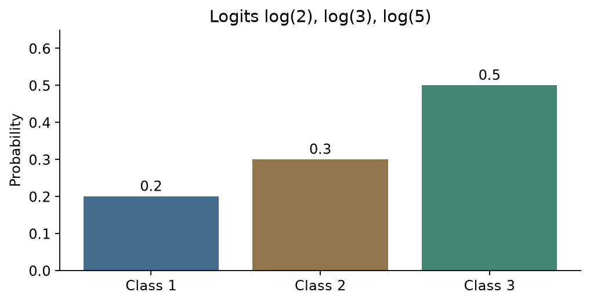
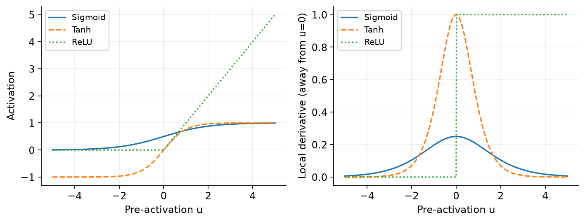

# Lecture 5 · Neural Networks
## 从一条分类线，到能自己学特征的网络

[课程目录](README.md) · [上一讲：回归](Lecture04.md) · [Assignment 2 学习指南](Assignment02.md)

假设我们仍在辨认鸢尾花。每朵花是一行测量，标签是已知品种；给一朵新花，我们希望输出它属于各品种的概率。前几讲已经会手工挑特征、拟合线性边界。现在老师追问：能不能让模型自己学出对分类有帮助的中间特征？本讲先从最简单的感知机开始，经过多分类逻辑回归，再把可训练的特征层接到分类器前面。

**基础复习（可跳过）：** 不熟指数、求导，读[对数与导数](../../learning/foundation-notes/MathForML.md#derivatives)；不熟悉矩阵求导，读[批量梯度与计算图](../../learning/foundation-notes/MathForML.md#batch-gradients)。这里会保留即时解释，不需要先把整个数学册读完。

| 主题 | 学习优先级 | 理解难度与卡点 | 掌握要求／判断依据 |
|---|---|---|---|
| 感知机及更新 | 核心必会 | 中，标签与方向 | 手算一次更新、解释收敛条件；Lecture5a，第14–39个单元 |
| Softmax与交叉熵 | 核心必会 | 中，分数不是概率 | 计算概率与梯度；Lecture5a，第41–66个单元、作业Loss层 |
| MLP与激活 | 核心必会 | 中，层与形状 | 解释非线性的作用、数参数；Lecture5b，第4–14个单元 |
| 反向传播 | 核心必会 | 高，转置、分支求和 | 完整走通小网络；Lecture5b，第15–21个单元、作业Section1 |
| SGD、验证与早停 | 核心必会 | 中，数据角色 | 区分前向、求梯度、更新与选模型；Lecture5b，第22–47个单元 |
| 逼近与深度 | 常规掌握 | 高，存在性不等于可训练 | 解释定理边界；Lecture5b，第48–61个单元。证明列二读拓展 |
| MNIST示范与权重解释 | 常规掌握 | 中，展平及可视化 | 看懂流程、参数规模和结果边界；Lecture5b，第62–95个单元 |

优先级依据当前课件与Assignment2。本讲暂未提供当前Tutorial5。

<!-- EXAM:overview:START -->

## Exam focus｜这一讲怎样安排复习

本讲在现有期末材料中主要对应激活、反向传播、优化与泛化；2025A期中也出现了梯度消失与链式法则。先用小网络把计算走通，再练用英文解释条件。

| 考点 | 复习动作 | 期中：直接／关联 | 期末：直接／关联 | QE记录 | 入口 |
|---|---|---|---|---|---|
| 输出概率与交叉熵 | 把概率、标签和损失对上 | 未见／未见 | 1套／未见 | 关联题段；卷次待定 | [讲解](#cross-entropy) |
| 链式法则与反向传播 | 完整走通小网络的前向与反向 | 1套／未见 | 1套／未见 | 未见 | [讲解](#batch-backprop) |
| 激活函数与梯度消失 | 解释条件，避免只背函数名称 | 1套／未见 | 3套／未见 | 未见 | [讲解](#vanishing-gradient) |
| MLP表达能力与深浅比较 | 说明没有非线性时为何仍为线性 | 未见／未见 | 3套／未见 | 未见 | [讲解](#capacity) |
| SGD、学习率与momentum | 结合Assignment2优化器公式 | 未见／未见 | 2套／未见 | 未见 | [讲解](#training) |
| 正则化、曲线与早停 | 不给单条曲线唯一诊断 | 未见／未见 | 3套／1套 | 关联题段；卷次待定 | [讲解](#monitoring) |

**口径：** 同一考点在同一独立试卷只计一次；题纸、答案和扫描副本不重复计。已辨识6套期中、3套期末；模拟题另列，2021B*保留封面年份冲突。同卷可同时有直接题和关联题，两列不相加。未见不等于不考，QE题段不换算为已确认卷数。

QE片段中的CNN题只映射到损失与过拟合等基础，卷次待定；CNN结构、卷积尺寸、数据增强、ResNet、BatchNorm、AE/VAE和GAN不计入当前Lecture5已覆盖内容。

绿色波浪＝期中，黄色＝期末，红色＝QE；文字同时标明类别，黑白打印可直接读。题号见[讲末索引](#exam-topic-index)，材料身份见[全册附录](ExamIndex.md)。

<!-- EXAM:overview:END -->

[TOC]

## 1. Perceptron｜先做一个会纠错的线性判断器

用神经元的加权输入引出人工网络，回顾早期MLP、上世纪90年代的低潮，以及数据、算力与训练进步后的深度学习。生物类比只帮助认识“输入加权再响应”；人工神经元不是大脑细胞的完整模拟。

给输入列向量 $\mathbf{x}\in\mathbb R^d$ 和权重 $\mathbf w$。分数 $a=\mathbf w^T\mathbf x$ 为加权和，分数非负输出+1，否则输出−1。偏置可写成 $a=\mathbf w^T\mathbf x+b$，也可把常数 $x_0=1$ 并入输入；比较参数数量前要说明采用哪种写法。

两个输入如果是花瓣长和宽，权重就规定它们怎样共同决定分数。分类线的位置与方向由权重和偏置控制。感知机只给硬类别，不把分数直接叫“80%把握”。

对真实标签 $y_i\in\{-1,+1\}$，有符号分数 $z_i=y_i\mathbf w^T\mathbf x_i$：正值通常表示方向正确，负值表示误分类。原课损失为 $\ell(z)=\max(0,-z)$。误分类时

$$
\frac{\partial\ell_i}{\partial\mathbf w}=-y_i\mathbf x_i,\qquad
\mathbf w\leftarrow\mathbf w+\eta y_i\mathbf x_i.\tag{5.1}
$$

$\eta>0$ 是学习率。负梯度不是“看见负类就所有权重减1”，而是按输入每个分量调整。边界 $z=0$ 是损失的不可微点。本文沿用“分数0判+1，预测错误就更新”的规则：负类点落在0处会更新，正类点落在0处不更新。若偏置单独保存，同一次错分还应更新 $b\leftarrow b+\eta y_i$。

**对照原代码：** Lecture5a第24个单元只在$z<0$时更新，因此会漏过“负类、分数0”这种错分；其余非边界情形与上述规则一致。答题时以题目给出的平局与更新约定为准。

**跟做 / Worked（补充算例）：** 无偏置，$\mathbf w=(0,0)$、$\mathbf x=(2,1)$、$y=-1$、$\eta=0.5$。原预测为+1，错误。更新为 $\mathbf w=(-1,-0.5)$，新分数−2.5，方向正确。 / The initial +1 prediction is wrong. One update gives (−1,−0.5), scoring the point at −2.5.

**自己做 / Check：** $\mathbf w=(1,-1)$、$\mathbf x=(1,2)$、$y=+1$、$\eta=0.2$，是否更新，得到什么？ / With w=(1,−1), x=(1,2), y=+1, no bias and learning rate 0.2, is an update needed, and what is the new weight?

答案 / Answer

原分数−1，更新为(1.2,−0.6)，该样本新分数0。一小步不保证得到严格正间隔。 / Update to (1.2,−0.6); the new score is zero, not a strictly positive margin.

用数据和边界演示训练，Lecture5a，第36–39个单元讨论收敛：在线性可分、标准更新条件下能找到分隔面；不可分数据可能持续更新。多条线都可把训练样本分对，初始值和样本顺序可改变最终结果。它没有自动最大化SVM间隔。

**English takeaway:** A perceptron corrects mistakes using the signed feature vector. Separability supports convergence, but neither calibrated probabilities nor maximum margin follows from zero training error.

来源：Lecture5a，第3–12个单元；第14–15个单元；第26–35个单元。

## 2. Multiclass logistic regression｜三个分数，怎样成为三个概率？

多分类任务中，从二分类转到 $C$ 类。老师写 $\mathbf g=\mathbf W^T\mathbf x$，其中 $\mathbf W$ 的第j列为第j类权重。省略的偏置仍可吸收入输入。$g_j$ 是logit，正负、大小都不受概率范围约束。

Softmax把实数分数变为一组和为1的数：

$$
p_j=s_j(\mathbf g)=\frac{e^{g_j}}{\sum_{k=1}^{C}e^{g_k}}.\tag{5.2}
$$

所有指数都为正，除以总和后形成概率向量。最大分数对应最大概率，但不意味着概率必定接近1；各分数相等时得到均匀分布。

**跟做 / Worked（补充算例）：** 三类分数为 $(\ln2,\ln3,\ln5)$，指数是(2,3,5)，概率为(0.2,0.3,0.5)。这里最高类只有一半，不能把argmax和“十分确定”混成一回事。 / Exponentiating gives (2,3,5), hence probabilities (0.2,0.3,0.5).

图把每个logit、指数和概率对应起来；柱高表示概率，不是三次独立判断，三柱总和为1。该图是上面教学数字的重绘。

计算时先减去最大logit：$e^{g_j-m}/\sum_ke^{g_k-m}$，其中 $m=\max_k g_k$。所有项同乘 $e^{-m}$，比例不变，却避免把大分数直接指数化。PyTorch的CrossEntropyLoss接收logits，内部处理log-softmax；不要在它前面再对输出做一次softmax。

**变式 / Transfer：** 全部logit加100，概率改变吗？若全部乘2呢？ / What happens after adding 100 to every logit, or multiplying all logits by two?

答案 / Answer

共同加常数不变；乘2通常更尖锐，本例变为(4,9,25)/38。两种变换不能混淆。 / A common shift cancels. Scaling generally changes confidence; here it produces (4,9,25)/38.

来源：Lecture5a，第41–48个单元。

## 3. Cross-entropy and MLE｜惩罚给真类太少的概率
<!-- EXAM:focus-cross-entropy:START -->

考点：输出概率与交叉熵 期末直接：1套；QE关联题段，年份未载／卷次待定。

<!-- EXAM:focus-cross-entropy:END -->

用$c_i$表示第i个样本的真实类别编号；one-hot标记$y_{ij}$只在$j=c_i$处取1，其余为0。$p_{ij}$是模型给第i个样本属于第j类的概率。单样本负对数似然为

$$
L_i=-\sum_j y_{ij}\log p_{ij}=-\log p_{i,c_i}.\tag{5.3}
$$

上一例若真类是第三类，损失为 $-\log0.5\approx0.6931$；若真类是第一类，则约1.6094。模型把真类概率压得越低，惩罚越大。取自然对数时单位可理解为nats，不是百分比错误率。

原课目标式的排版把argmin结果与损失求和直接连等。应分清“目标函数” $E(\mathbf W)=\sum_iL_i$ 与“最优参数” $\mathbf W^*=\arg\min_{\mathbf W}E(\mathbf W)$；两者类型不同。下文用E表示目标、W*表示最优参数。

来源：Lecture5a，第49–51个单元。

## 4. Chain rule｜先走完一个只有输出层的反向传播

从权重到损失的计算链是权重影响分数，分数影响概率，概率影响损失。要问某个权重该怎么改，必须把这些影响接起来。不是把损失数值从最后一层原样“传回去”，传的是导数。

先暂时只看一个样本，省略样本下标i。$g_j$是第j类的分数，$p_j$是对应softmax概率，$y_j$是真实类别的one-hot标记。我们要算“把一个分数稍微调高，损失会怎样变”。

Softmax的每个概率都有共同分母。对 $p_k=e^{g_k}/\sum_r e^{g_r}$ 使用商的求导法则：

$$
\begin{aligned}\frac{\partial p_k}{\partial g_j}
&=\frac{\mathbf1[k=j]e^{g_k}\sum_r e^{g_r}-e^{g_k}e^{g_j}}{(\sum_r e^{g_r})^2}\\[4pt]
&=p_k\big(\mathbf1[k=j]-p_j\big).\end{aligned}\tag{5.4}
$$

当k=j时，分子和分母都变；当k不等于j时，只改变分母。因此某一类分数升高时，其他类概率也会受影响。

交叉熵 $L=-\sum_k y_k\log p_k$ 先对概率求导，再沿概率对分数的导数相乘并求和：

$$
\begin{aligned}
\frac{\partial L}{\partial g_j}
&=\sum_k\left(-\frac{y_k}{p_k}\right)p_k\big(\mathbf1[k=j]-p_j\big)\\
&=-\sum_k y_k\mathbf1[k=j]+p_j\sum_k y_k\\
&=-y_j+p_j.
\end{aligned}\tag{5.5}
$$

第一项只留下第j类的标记；第二项中，one-hot标签的总和是1。这两步消去后，才得到简洁的 $p_j-y_j$。对真类，$y_j=1$，梯度通常为负；梯度下降减去负数，会提高真类分数。对其他类，$y_j=0$，则会降低其分数。

最后，$g_j=\mathbf w_j^T\mathbf x$对该类权重$\mathbf w_j$的导数是输入$\mathbf x$。与上一段的$p_j-y_j$相乘，得到权重梯度：

$$
\frac{\partial L}{\partial\mathbf w_j}=\mathbf x(p_j-y_j).\tag{5.6}
$$

**完整例子 / Worked：** 取 $\mathbf x=(1,2)^T$，概率仍为(0.2,0.3,0.5)，真类3。logit梯度为(0.2,0.3,−0.5)，权重梯度的三列是(0.2,0.4)、(0.3,0.6)、(−0.5,−1)。学习率0.1时，减去这个梯度：压低错类分数，提升真类分数。 / The gradient matrix is the outer product of x and (p−y); descent raises the true-class score relative to the others.

**补一步 / Fill in：** 同样概率但真类2，logit梯度是什么？ / Change only the true label to class 2.

答案 / Answer

(0.2,−0.7,0.5)。梯度和为0，与softmax不受共同分数平移影响一致。 / (0.2,−0.7,0.5), summing to zero.

课堂将原鸢尾花数据送进多分类逻辑回归。这里要认出：类别标签可以是整数索引，推导用one-hot；二者表达相同目标，但代码接口不同。数据划分与实际类别编码以原代码为准，不擅自把标签1..C直接当PyTorch要求的0..C−1。

来源：Lecture5a，第52–58个单元；第59–65个单元。

## 5. Multi-layer perceptron｜把特征也变成可训练的

为了学习中间特征，把隐藏层放到分类器前面。单隐藏层按老师列向量写法为

$$
\begin{aligned}\mathbf g_1&=\mathbf A^T\mathbf x,&\mathbf z&=h_1(\mathbf g_1),\\[3pt]
\mathbf g_2&=\mathbf W^T\mathbf z,&\mathbf f&=h_2(\mathbf g_2).\end{aligned}\tag{5.7}
$$

隐藏层输出 $\mathbf z$ 是新的特征。例如输入的两项花朵尺寸先形成若干“加权组合是否超过门槛”的响应，最后一层利用这些响应分类。每一层都只做线性变换而没有非线性，连乘后仍是一个线性变换，堆十层也不能凭空变成弯曲边界。

常见激活函数包括sigmoid、tanh与ReLU。前两者在饱和区导数很小，反传经过多层小因子可能缩小；ReLU在正区导数1，负区0，避免一部分饱和问题，但可能出现长期不激活的单元。ReLU不会自动保证“多数单元为0”，稀疏程度取决于输入和参数。Leaky ReLU在负区保留小斜率，是作业用到的变体。

把图中的响应与求导规则列在一起。令u为激活前的一个实数：

| 激活 | 输出及范围 | 对u的导数 |
|---|---|---|
| Sigmoid | $\sigma(u)=1/(1+e^{-u})$，范围$(0,1)$ | $\sigma(u)[1-\sigma(u)]$ |
| Tanh | $h=\tanh u$，范围$(-1,1)$ | $1-h^2$ |
| ReLU | $\max(0,u)$，范围$[0,\infty)$ | u>0时为1，u<0时为0；0处需约定 |

Sigmoid导数在u=0时最大，为1/4；tanh导数在u=0时为1。两者到了饱和区，输出变化慢，导数便接近0。数值计算可能因舍入显示端点，有限实数输入下的数学范围仍是上表的开区间。

左图看响应值，右图看局部斜率。ReLU在0处左斜率为0、右斜率为1，因此普通导数不存在。程序仍需约定在这个点传回什么值；这是计算规则，不是该点存在普通导数。回归输出可用线性层，互斥多分类输出使用logits配交叉熵。

输出层还必须与损失匹配。比如二分类交叉熵在真类为1时是$-\log p$：p=0.75时约0.2877；若把一条直线截断成[0,1]并恰好输出p=0，损失就变成无穷大，不能直接套“平段导数0所以梯度0”。隐藏层ReLU可以大于1，也不能直接当类别概率。历史输出激活题要同时检查取值范围、饱和区与log的定义域。 / Check output range, saturation and the logarithm's domain together; a zero probability for the true class gives infinite cross-entropy.

**参数例子 / Worked：** 784输入、50隐藏节点、10输出，全连接且两层都有偏置：$(784+1)50+(50+1)10=39760$。 / Include every layer's biases, not just its weights.

**独立题 / Check：** 4输入、3隐藏、2输出，参数多少？ / Count parameters for a fully connected 4–3–2 network with a bias at every hidden and output unit.

答案 / Answer

$(4+1)3+(3+1)2=23$。激活本身通常没有参数；作业的可学习指数是明确例外。 / 23; a learnable activation parameter would add to this count.

来源：Lecture5b，第4–9个单元；第10–14个单元。

### 沿一条路径看梯度怎样变小
<!-- EXAM:focus-vanishing-gradient:START -->

考点：激活函数与梯度消失 期中直接：1套；期末直接：3套。

<!-- EXAM:focus-vanishing-gradient:END -->

链式法则把沿途的局部导数相乘。用一条标量路径说明：第l层的输入为$u_l=w_lh_{l-1}$、输出为$h_l=\sigma(u_l)$。设所有权重$w_l=1$，从末端传来的梯度为1，经过m层sigmoid时，每层激活导数最多为1/4，所以传回起点的梯度绝对值最多为$(1/4)^m$。5层约0.0009766，10层约0.000000954；在饱和区还会更小。

这解释了“梯度消失”（vanishing gradient）：早层参数收到的更新信号可能很弱，不一定在数学上恰好为0。权重也参与连乘，较大的权重可能放大梯度，所以这里的数字依赖刚才的单位权重假设。多维网络对应矩阵连乘，机制相似但不能只数层数就给出一个固定衰减率。

**独立题 / Check：** 一条4层标量路径的每个局部导数均为0.2，末端梯度为1，起点梯度是多少？若改成4层都在正区的ReLU、权重均为1呢？ / Along a four-layer scalar path, each local derivative is 0.2 and the upstream gradient is 1. Find the input gradient. Then use active ReLUs with unit weights in all four layers.

**答 / Answer：** 分别为$0.2^4=0.0016$和1。 / The gradients are 0.0016 and 1. ReLU正区不缩小这个激活导数；若有单元进入负区，这条路径的导数又可能变为0。

教学补充：连接激活函数的斜率图与后面的反向传播，也用于历史梯度消失题的解释。

## 6. 把一层的梯度推给上一层
<!-- EXAM:focus-batch-backprop:START -->

考点：链式法则与反向传播 期中直接：1套；期末直接：1套。

<!-- EXAM:focus-batch-backprop:END -->

把刚才的链条延长。为对应NumPy作业，下面明确改成“每行一个样本”的批量约定；这是老师列向量公式的转写，不是另一套模型。

先把前向计算读成三步：原始特征 → 隐藏层响应 → 各类分数。用B表示批量中的样本数、d表示输入特征数、h表示隐藏节点数、C表示类别数。

| 这一步产生什么 | 计算 | 数组形状 |
|---|---|---|
| 输入记录X | 每行一条样本 | B×d |
| 隐藏层的加权输入U | $U=XA+c$ | B×h |
| 激活后的隐藏特征H | $H=\phi(U)$ | B×h |
| 输出分数Z | $Z=HW+b$ | B×C |

A为d×h，c为1×h；W为h×C，b为1×C。加偏置时，同一行偏置被用于每个样本。对Z的每一行使用softmax，得到概率矩阵P；Y是同形的one-hot标签矩阵。

现在反向走。记 $G_Z=\partial L/\partial Z$，意思是“Z中每个数稍微改变，损失怎样改变”；其他G下标同理。损失采用批内平均交叉熵，并对A、W加 $\lambda(\|A\|_F^2+\|W\|_F^2)/2$，偏置不惩罚。

**从输出开始。** 上一节单样本的p−y按B个样本取平均：

$$
G_Z=(P-Y)/B.\tag{5.8}
$$

输出层每个权重的贡献来自“隐藏特征×分数梯度”，把所有样本的贡献相加，便是矩阵乘法：

$$
\nabla_W L=H^TG_Z+\lambda W,\qquad
\nabla_b L=\sum_i(G_Z)_{i,:}.\tag{5.9}
$$

例如 $H^TG_Z$ 的形状是 $(h\times B)(B\times C)=h\times C$，与W一致。一个偏置会影响全部样本，所以对行求和，结果保持1×C。

**继续回到隐藏层。** Z由H乘W得到，因此传回H的梯度为 $G_H=G_ZW^T$。激活函数再按每个位置的斜率缩放它：

$$
G_U=G_H\odot\phi'(U).\tag{5.10}
$$

$\odot$表示逐元素相乘。使用ReLU时，正输入位置保留梯度，负输入位置传回0；这一步说明激活函数如何影响前面一层能否继续学习。

**最后求输入层权重。** 与输出层同样地，累加每个样本的“输入×本层梯度”：

$$
\begin{gathered}\nabla_A L=X^TG_U+\lambda A,\\
\nabla_c L=\sum_i(G_U)_{i,:},\qquad G_X=G_UA^T.\end{gathered}\tag{5.11}
$$

A的梯度形状为d×h，c的梯度为1×h，传回X的梯度为B×d。平均因子已经在起点除过B，后面的链式法则直接使用这些梯度，不逐层再除一次。

**一层手算 / Worked：** $X=\begin{bmatrix}1&2\\3&4\end{bmatrix}$，上游梯度 $G=\begin{bmatrix}1&-1\\2&0\end{bmatrix}$，无正则。对$U=XA+c$，$\nabla_A L=X^TG=\begin{bmatrix}7&-1\\10&-2\end{bmatrix}$，$\nabla_cL=(3,-1)$。G若已来自平均损失，此处不要再除2。

### 同一小网络，从输入一直算到两层梯度

下面是完整的教学算例，所有数均无量纲：只有一条输入$X=[1,2]$，两层各有2个输出，$A=W=I_2$，偏置$c=b=[0,0]$。隐藏层用ReLU，真实类别为第2类，$Y=[0,1]$，不加正则。 / Use one dimensionless row X=[1,2], two 2×2 identity weight matrices, zero biases, a ReLU hidden layer, label Y=[0,1], and no regularization.

前向先得到$U=XA+c=[1,2]$。两项都为正，ReLU保留它们，$H=[1,2]$；输出$Z=HW+b=[1,2]$。取softmax后$P\approx[0.2689,0.7311]$，损失$-\log0.7311\approx0.3133$。

令$q=1/(1+e)\approx0.2689$，把反向过程沿原路排出来：

| 回到哪里 | 为什么这样算 | 本例结果 |
|---|---|---|
| 输出分数Z | P−Y，B=1 | $[q,-q]$ |
| 输出权重W | 每项隐藏特征乘上对应输出梯度 | $\begin{pmatrix}q&-q\\2q&-2q\end{pmatrix}$ |
| 输出偏置b | 汇总样本；这里只有1条 | $[q,-q]$ |
| 隐藏特征H | 乘更新前的$W^T=I$ | $[q,-q]$ |
| 隐藏加权输入U | 正区ReLU斜率为1 | $[q,-q]$ |
| 隐藏权重A、偏置c | 用X作外积、按样本汇总 | 与本例W、b的梯度相同 |

两层梯度相同是这组单位矩阵和输入造成的，换参数后通常不同。若学习率为0.1，输出权重$W_{11}$从1更新为$1-0.1q\approx0.9731$。所有梯度算完后再统一更新，不能让前一层用到后一层刚改过的权重。

**独立变式 / Transfer：** 保持上述输入、权重、偏置和激活，只把真实类别改为第1类。求$G_Z$及W、A、b、c的梯度。 / Keep the same network and input, but change the label to Y=[1,0]. Find G_Z and the gradients of W, A, b and c.

答案 / Answer

$G_Z\approx[-0.7311,0.7311]$。W和A的梯度第一行为这个向量，第二行为其2倍，即$[-1.4621,1.4621]$；b和c梯度均为$[-0.7311,0.7311]$。 / The score and bias gradients are [−0.7311,0.7311]. Both weight-gradient matrices have this as their first row and twice it as their second row. 前向概率未变，改变的是用哪个真实答案评价这些概率。

### 换成回归任务：tanh与平方误差怎样反传？

链式法则不变，换损失和激活后，沿途的导数需要重算。下面是教学补充，数字与原样题不同。输入$x=1$，隐藏节点$h=\tanh u$、$u=w_1x+b_1$，输出$\hat y=w_2h+b_2$。取$w_1=b_1=b_2=0,w_2=2$，真值$y=1$，损失$L=(\hat y-y)^2$。

前向得到$u=h=\hat y=0$，所以L=1。要改$w_1$，沿“权重→隐藏输入→激活→预测→损失”逐段求导：

$$
\begin{aligned}
\frac{\partial L}{\partial w_1}
&=\frac{\partial L}{\partial\hat y}\frac{\partial\hat y}{\partial h}
  \frac{\partial h}{\partial u}\frac{\partial u}{\partial w_1}\\[3pt]
&=2(\hat y-y)w_2(1-h^2)x=-4.
\end{aligned}
\tag{5.11a}
$$

学习率0.1、只更新$w_1$的一步得到$w_1=0.4$；保持其他参数，预测成为$2\tanh(0.4)\approx0.7599$，损失约0.0576，确实比1小。式中系数2来自未除以2的平方损失，不能从前面的交叉熵照搬$p-y$。

**变式 / Transfer：** 回到初始参数，仅把损失改为$L=(\hat y-y)^2/2$，学习率仍为0.1且只更新$w_1$。导数与新权重各是多少？ / Return to the stated initial network (x=1, y=1, w₁=b₁=b₂=0, w₂=2). Use half-squared error, learning rate 0.1, and update only w₁. Find its gradient and new value.

**答 / Answer：** 导数为−2，新$w_1=0.2$。 / The gradient is −2 and the updated weight is 0.2. 要更新全部参数时，每个梯度都由同一组旧参数计算。

来源：Lecture5b第15–21个单元的链式法则；对应《CS5489 Question Samples》Q4(b)的tanh回归题型，原样题与期中真题分开统计。

分支也有一条规则：同一中间量同时流向两个下游，返回的梯度要相加。链条上的影响相乘，分支汇合的影响相加。原课还介绍了自动微分框架的历史分类；读这部分时，重点理解计算图如何组织链式法则。

**English takeaway:** Backpropagation composes local derivatives and sums contributions from all children. A gradient must match its parameter's shape, and loss averaging must be applied consistently.

来源：Lecture5b，第15–21个单元。

## 7. SGD、监控与早停｜从一次更新到选择训练时刻
<!-- EXAM:focus-training:START -->

考点：SGD、学习率与momentum 期末直接：2套。

<!-- EXAM:focus-training:END -->

课堂用小批量SGD与PyTorch演示训练。`nn.Linear`保存权重和偏置，激活逐元素处理，DataLoader分批提供数据；每批典型顺序是清梯度、前向、算损失、`backward()`、`step()`。不清梯度会累积，这是可用功能，但不能在不知道时意外累积。

一次optimizer step是一次参数更新，一个epoch通常是一遍训练数据。例如1000样本、batch=100、无累积，每epoch10次更新。Momentum把先前的更新方向保留一部分，再加入本次梯度。沿用[作业指南](Assignment02.md#optimizers)的一种普通动量约定：$v_t=\gamma v_{t-1}+\eta g_t$，$\theta_{t+1}=\theta_t-v_t$。其中$g_t$是当前批的梯度，$\gamma\in[0,1)$控制保留比例；v已经含学习率，更新参数时不再乘一次。

例如$\theta_0=1,v_{-1}=0,\eta=0.1,\gamma=0.9$，连续两批提供的梯度为2和−2。第一步$v_0=0.2,\theta_1=0.8$；第二步$v_1=0.18-0.2=-0.02,\theta_2=0.82$。方向突然翻转时，两次梯度的一部分互相抵消。若第二批仍为2，动量会沿原方向累积。

**自查 / Check：** 在同样初值与参数下，两批梯度均为2，第二步后θ是多少？ / With the same initial state, learning rate 0.1 and momentum 0.9, use gradients 2 and 2. What is θ after two steps?

**答 / Answer：** 第二步v=0.38，θ=0.42。 / The second velocity is 0.38, giving θ=0.42.

原Lecture5b第40个单元还设了`nesterov=True`，其更新与上面普通动量不同；这里的小例用于解释累积与抵消，不是逐数值复现原训练。

一批数据的梯度为0，也不代表整个训练目标已经最优。教学反例：两个样本的损失分别为$(w-1)^2$和$(w+1)^2$。w=1时，第一份损失的梯度为0，第二份为4，平均损失的梯度仍为2。小批量SGD只看当前抽中的那批；momentum会平滑历史方向，但不会把一次零梯度变成收敛证明。

**判断 / Check：** 上述两样本、平均损失，在w=−1时第二个样本的梯度为0。平均梯度是多少？ / For these two sample losses and their average, evaluate the average gradient at w=−1, where the second sample's gradient is zero.

**答 / Answer：** 两个样本梯度为−4、0，平均为−2。 / The sample gradients are −4 and 0, so the average is −2.

### 训练曲线与早停
<!-- EXAM:focus-monitoring:START -->

考点：正则化、曲线与早停 期末直接：3套；期末关联：1套；QE关联题段，年份未载／卷次待定。

<!-- EXAM:focus-monitoring:END -->

训练集参与更新参数；验证集用于观察曲线、选学习率、选择早停时刻。早停要保存验证表现较好的参数，而不只是退出循环时的最后一次参数。若使用验证准确率，阈值与方向应按准确率定义；若使用验证损失，按越低越好。测试集用于冻结选择后的最后评价。

原课的两类数据示范比较不同隐藏宽度和训练长度。训练误差下降、验证误差反升，是过拟合的线索；两者都高还可能是优化没跑通、模型容量不够或表示不合适；训练与验证分布不同、预处理不一致也可能造成差距。仅凭一条曲线不能独断一个原因。

**迁移 / Transfer：** 若每个epoch都看测试准确率，再挑最高的一轮，能称它独立最终测试吗？ / Is the highest test accuracy over many selected epochs an untouched final evaluation?

答案 / Answer

不能。测试反馈已用于选择训练时刻，应另留最终测试，或明确标为课堂探索。 / No. Test feedback selected the epoch; use validation for that decision or label the result exploratory.

来源：Lecture5b，第22–47个单元。

## 8. Universal approximation｜能表示，不等于容易学会
<!-- EXAM:focus-capacity:START -->

考点：MLP表达能力与深浅比较 期末直接：3套。

<!-- EXAM:focus-capacity:END -->

如果只研究一个有限输入范围，例如面积在给定区间内的房价函数，网络有没有能力把一条连续曲线画得足够接近？通用逼近结果回答的是这个“能否表示”的问题：在适当激活等条件下，足够宽的单隐藏层网络，可以在紧致域上将连续函数逼近到指定精度。这里可先把紧致域理解为欧氏空间中闭且有界的输入集合。

结论说存在这样的网络和参数，没有给出当前训练一定能找到它们的方法；实际网络宽度、数据量与优化过程仍会限制效果。来源：Lecture5b，第48个单元。

老师用$n$个二值输入共有$2^n$种输入、$2^{2^n}$种布尔函数说明最坏复杂度。不要从“函数数量很多”直接推导“每个实际任务都必须指数个神经元”：表示精度、权重编码与函数族都会影响论证。Lecture5b，第51个单元的深度优势也应理解为某些函数族的表达效率，而非任何深网络都优于任何浅网络。

课堂实验把原数据扩成两部分，比较宽单层和较窄多层。此处目标是观察结构改变会怎样影响边界与训练；参数数量、优化条件同时变化，不能把一次结果归因成“只因为深度”。

**English takeaway:** Approximation guarantees describe representational possibility under assumptions. They do not provide a training guarantee or a universal ranking of architectures.

来源：Lecture5b，第49个单元；第52–60个单元。

## 9. MNIST｜看懂老师完整示范的每个接口

读取本地IDX文件。当前下载包含60000训练图和10000测试图，每张28×28灰度图。原流程先展平为784维，再缩放并从训练数据留出验证集。展平没有创造新像素，只改变排列。

比较无隐藏层与多种MLP。无隐藏层就是多分类线性logits模型；隐藏层权重可重排成28×28观察其匹配的结构。看某类输出权重的正负，可讨论它对某些隐藏响应的支持与抑制，但单张权重图不是完整因果解释。

| 架构 | 按层独立重算的参数数 | 原Lecture5b，第92个单元表中的测试准确率 |
|---|---:|---:|
| 784→10 | 7850 | 0.8813 |
| 784→50→10 | 39760 | 0.9395 |
| 784→200→10 | 159010 | 0.9464 |
| 784→1000→10 | 795010 | 0.9482 |
| 784→500→500→10 | 648010 | 0.9463 |

表中准确率沿用老师保存的运行结果；参数数按各层输入、输出和偏置计算。单次表格显示更宽/更深不一定持续提高该设置下的准确率，不能据此建立普遍排名。

总结容量、过拟合、初始化、学习率与梯度传播。数据归一化能改善数值尺度，但不保证训练稳定；GPU加速不改变损失定义。原PyTorch示范需要torch；本讲的小型手算与梯度核验使用NumPy。

来源：Lecture5b，第62–70个单元；第71–91个单元；第93–96个单元。

## 10. 回顾与英文自测

这一讲的联系是：感知机先纠正分类方向；Softmax把多个分数转成概率；交叉熵给出训练目标；隐藏层学习特征；反向传播计算梯度；优化器更新参数；验证集帮助决定怎么训练。每个环节的职责应分别说清。

英文自测：What changes when a hidden layer is added? Why does softmax cross-entropy yield p−y? Where does the batch-size factor enter? What does early stopping select? What does universal approximation not guarantee?

关键要点 / Key points：隐藏层学习非线性表示；p−y包含分子分母共同求导；平均损失只缩放一次；早停选参数时刻；逼近定理不保证训练或泛化。 / Learned nonlinear features; full softmax derivative; one averaging factor; a selected checkpoint; no training or generalization guarantee.

首轮卡沿用[M241](https://crazyshout.github.io/micro-course/cards.html#CS5489-M241)、[M243](https://crazyshout.github.io/micro-course/cards.html#CS5489-M243)、[M248](https://crazyshout.github.io/micro-course/cards.html#CS5489-M248)、[M251](https://crazyshout.github.io/micro-course/cards.html#CS5489-M251)。先手算§4与§6，再用卡片回忆各步的作用和梯度形状。

<!-- EXAM:topics:START -->

## Historical exam map｜按考点查题源

题号和页码指向原题纸；多题出现只增加定位，不重复增加同一卷的次数。需要整题作答时，请按题号回查原卷；当前独立题答册只整理Lecture 2。

### 输出概率与交叉熵

说明输出层、标签编码及负对数似然。

| 试卷 | 原题号／页码 | 关系与要求 |
|---|---|---|
| 2021B期末 | Q4／2 | 直接：无隐藏层MLP与多分类Logistic的对应 |
| 2021B期末 | Q9／4 | 直接：分段线性输出配二元交叉熵的性质 |
| CS5489 QE整理片段（年份未载） | Apple (b.3)／PDF1（原印8/11） | 关联：为二类图像分类选择损失并说明原理 |

**题源条件：** 原题有图，需保留饱和区与log零概率边界；不是把ReLU直接当概率；CNN架构未在当前讲义覆盖；题段年份与卷次待定。

### 链式法则与反向传播

逐层算梯度并检查形状。

| 试卷 | 原题号／页码 | 关系与要求 |
|---|---|---|
| 2025A期中 | Q13(a–b)／10 | 直接：计算链式导数与两层网络参数梯度 |
| 2020B期末 | Q3／2 | 直接：MLP反传、激活与表达能力 |
| Question Samples（年份未载） | Q4(b)／4 | 直接（样题）：tanh单隐藏节点的链式导数与更新 |

**题源条件：** 按印刷题面读取；手写答案不作标准。

### 激活函数与梯度消失

比较斜率、饱和与梯度连乘。

| 试卷 | 原题号／页码 | 关系与要求 |
|---|---|---|
| 2025A期中 | Q10／7 | 直接：解释梯度消失及激活函数的作用 |
| 2020B期末 | Q3／2 | 直接：MLP反传、激活与表达能力 |
| 2020B期末 | Q13／4 | 直接：Leaky ReLU的正负区斜率与利弊 |
| 2021A期末 | Q2／2 | 直接：sigmoid、ReLU与输出激活的性质 |
| 2021B期末 | Q9／4 | 直接：分段线性输出配二元交叉熵的性质 |

**题源条件：** 原题有图，需保留饱和区与log零概率边界；不是把ReLU直接当概率。

### MLP表达能力与深浅比较

区分能表示、能优化与能泛化。

| 试卷 | 原题号／页码 | 关系与要求 |
|---|---|---|
| 2020B期末 | Q3／2 | 直接：MLP反传、激活与表达能力 |
| 2020B期末 | Q10／4 | 直接：比较单隐藏层与深层MLP |
| 2021A期末 | Q8／3 | 直接：无隐藏非线性的深层MLP仍是线性判别 |
| 2021B期末 | Q4／2 | 直接：无隐藏层MLP与多分类Logistic的对应 |

### SGD、学习率与momentum

区分批次梯度、训练噪声与收敛。

| 试卷 | 原题号／页码 | 关系与要求 |
|---|---|---|
| 2020B期末 | Q5／3 | 直接：SGD噪声、momentum与学习率 |
| 2021A期末 | Q11(a–b)／4 | 直接：SGD、momentum及Adam的训练噪声 |

**题源条件：** 单个minibatch梯度为零不足以说明全部损失最优；Adam细节见Assignment2；图仅支持该设置下的可能解释。

### 正则化、曲线与早停

依据验证表现选择训练时刻。

| 试卷 | 原题号／页码 | 关系与要求 |
|---|---|---|
| 2020B期末 | Q9／4 | 直接：分析训练／验证损失并提出调整 |
| 2021A期末 | Q3（L2与早停选项）／2 | 直接：正则化与早停降低过拟合的思路 |
| 2021B期末 | Q5／3 | 直接：网络L2正则与先验解释 |
| 2021B期末 | Q11／5 | 关联：CNN曲线与结构调整 |
| CS5489 QE整理片段（年份未载） | Apple (b.4)／PDF1、3（原印8–9/11） | 关联：苹果CNN训练／验证曲线诊断 |
| CS5489 QE整理片段（年份未载） | Bottles (b.3)／PDF5、7（原印8–9/10） | 关联：瓶子CNN泛化差距分析 |
| CS5489 QE整理片段（年份未载） | CWD (b.3)／PDF11（原印7/9） | 关联：海豚CNN过拟合的原因与改善 |

**题源条件：** 一般诊断已讲；具体CNN结构仍需后续课；仅映射通用训练诊断；图与问题跨两个原页；不使用扫描手写解答；缺年份和独立原卷身份。

<!-- EXAM:topics:END -->

## 来源覆盖索引

依据当前Lecture5a（66个单元）和Lecture5b（96个单元）。单元从1起算，包括文字与代码。本讲覆盖感知机、MLP与训练方法；完整CNN内容仍待后续课件。

| 原课位置 | 对应讲义 |
|---|---|
| Lecture5a，第1–13个单元 目录、神经元历史与MLP引入 | 开头、§1、§5 |
| Lecture5a，第14–25个单元 感知机定义、损失与训练 | §1 |
| Lecture5a，第26–39个单元 原示范、可分性与不同边界 | §1 |
| Lecture5a，第40–48个单元 多分类与Softmax、原图 | §2 |
| Lecture5a，第49–58个单元 MLE、交叉熵、Jacobian与梯度 | §3–4 |
| Lecture5a，第59–66个单元 原数据实现与总结 | §4、§10 |
| Lecture5b，第1–14个单元 特征、MLP与激活 | §5 |
| Lecture5b，第15–21个单元 计算图与反向传播 | §6；批量公式为明确补充 |
| Lecture5b，第22–47个单元 SGD、框架代码、训练曲线与过拟合 | §7 |
| Lecture5b，第48–61个单元 逼近、深度及扩展示范 | §8 |
| Lecture5b，第62–70个单元 IDX、展平、验证划分 | §9 |
| Lecture5b，第71–91个单元 MNIST模型与权重可视化 | §9，程序结果标原课而非本轮运行 |
| Lecture5b，第92–96个单元 比较、优缺点与参考 | §9–10 |

新增图、手算与梯度检查见同目录`tools/verify_october_examples.py`。这些图与手算为配套教学补充。
