# CS5489 · 期中答案与解析 / Midterm Answers and Explanations

收录六套历年期中卷，78个原题位置按实质内容去重后为67题。同题跨年只排一次，全部出处保留；条件、选项或要求有实质区别时分别保留。

英文题干保留原题内容，数学符号按原卷核对排版；中文帮助理解。MT编号属于本题库，与原卷Q编号不同。2021B*存在封面年份冲突，按配套解答归档。

各组按概念、示范、判断与应用逐步展开，阅读次序不按MT编号大小排列。按一整套卷练习可用 [原卷索引](PaperIndex.md)。模拟题、期末题和QE不混入本册。旧题规则不代表本学期考试规定。

每题先给完整中文题意与必要题图，再给简洁的English answer和连续中文解析。第一次学习时，读清题意，沿中文步骤算一遍；复习时可遮住答案，用英文独立说明。标为“选读”的段落供深入理解，完成原题所需步骤都在主线。

两册按MT题号对应，各自分页；目录与题间回指提供实际页码。随卷答案有差异时，在题后简注，文末集中汇总；2025A的学生手写作答未作为标准答案。

## 目录

**学习流程与模型诊断**

- [MT011 · 识别过拟合，并提出可操作的改进](#mt011)
- [MT004 · CV选完参数后，为什么还要重新训练？](#mt004)
- [MT028 · 训练误差低、测试误差高：可能原因](#mt028)
- [MT002 · 训练准、测试差：哪些改进值得尝试？](#mt002)
- [MT020 · 数据很多，训练和测试仍都差](#mt020)
- [MT022 · 五万客户、需要解释：选择哪种分类器？](#mt022)

**Bayes、Naive Bayes与模型比较**

- [MT040 · Bayes规则和Naive Bayes的关系](#mt040)
- [MT052 · 生成式分类器学了什么](#mt052)
- [MT046 · 完整讲出Gaussian NB](#mt046)
- [MT015 · NB的最优性、独立性与边界](#mt015)
- [MT032 · Bayesian classifier的性质](#mt032)
- [MT005 · NB的学习、不确定性和正则化](#mt005)
- [MT034 · 无限数据能消除分类错误吗](#mt034)
- [MT014 · 生成式与判别式的区别](#mt014)
- [MT033 · 用图像特征解释两种建模方式](#mt033)
- [MT059 · LR与共享方差Gaussian NB](#mt059)
- [MT021 · 同为线性分类器，学习原则有何不同](#mt021)
- [MT017 · 哪些模型能产生不同形状的边界](#mt017)
- [MT027 · 连续特征能否使用NB：混合选择题](#mt027)
- [MT058 · 智能笔上的文本NB如何改进](#mt058)

**逻辑回归与参数正则**

- [MT041 · Logistic的概率、多分类与最优解](#mt041)
- [MT047 · 解释Logistic目标中的两项](#mt047)
- [MT024 · 损失与正则项：α从哪里来？](#mt024)
- [MT018 · 为什么在线性分类器上加L2？](#mt018)
- [MT012 · L1逻辑回归：写目标并画边界](#mt012)
- [MT001 · Logistic训练：哪些说法不成立？](#mt001)
- [MT053 · LR与生成式模型：混合选择题](#mt053)

**SVM与核方法**

- [MT042 · SVM的基本特点](#mt042)
- [MT048 · 用一个例子讲清Kernel Trick](#mt048)
- [MT016 · 核SVM：变换、存储与非向量输入](#mt016)
- [MT031 · RBF距离与带宽：看近点和远点](#mt031)
- [MT055 · 判断五个候选核是否合法](#mt055)
- [MT060 · 二次核SVM：大C与小C的边界](#mt060)
- [MT054 · C、支持向量与RBF的零训练误差](#mt054)
- [MT043 · 核SVM怎样处理非线性？](#mt043)
- [MT029 · 哪些SVM说法错误？](#mt029)
- [MT010 · 同一张分布图，Gaussian Bayes与二次核SVM如何判断？](#mt010)
- [MT009 · 十万维特征、两千样本：SVM怎样提速？](#mt009)
- [MT061 · 预测内存：线性SVM与RBF SVM](#mt061)

**回归、特征选择与残差损失**

- [MT019 · Ridge、LASSO与零系数](#mt019)
- [MT045 · 特征选择：零系数、Ridge与OMP](#mt045)
- [MT030 · L1/L2回归的益处与措辞边界](#mt030)
- [MT057 · 同时使用L1与L2：Elastic Net](#mt057)
- [MT025 · 绝对残差损失对异常值有什么影响？](#mt025)
- [MT063 · Huber损失：画图并解释好处](#mt063)
- [MT013 · 残差L1＋权重L2，各自在做什么？](#mt013)
- [MT050 · 缺车比车多更糟：设计非对称损失](#mt050)
- [MT037 · 线性回归为何与均值预测器表现相近？](#mt037)

**集成学习**

- [MT006 · Bagging与Boosting的基本区别](#mt006)
- [MT044 · 随机森林与Boosting的用途](#mt044)
- [MT062 · 随机森林：树多了为什么仍有共同误差？](#mt062)
- [MT056 · 集成方法：树深、并行与后续轮次](#mt056)
- [MT038 · 100核部署：RF与AdaBoost如何并行预测？](#mt038)
- [MT049 · 在线更新AdaBoost：速度与异常值](#mt049)
- [MT064 · 综合题：Bagging/Boosting与Huber](#mt064)

**分类损失图与错误代价**

- [MT008 · 平方形分类损失为什么惩罚“太正确”？](#mt008)
- [MT026 · V形损失：最优点为何在z=1？](#mt026)
- [MT051 · 负间隔也零损失：分类器会放过什么？](#mt051)
- [MT039 · 饱和的非凸分类损失](#mt039)
- [MT065 · 比较Logistic、Hinge和Exponential损失](#mt065)
- [MT007 · 筛查任务：漏诊比误报更贵](#mt007)
- [MT023 · 1000名受试者中只有50名阳性](#mt023)
- [MT035 · 正常邮件被大量拦截怎么办？](#mt035)

**神经网络与链式法则**

- [MT067 · 链式求导与两层网络反传](#mt067)
- [MT066 · 梯度消失：为什么深度和激活函数有关？](#mt066)

**历史范围拓展：Gaussian Process**

- [MT003 · 历史拓展：Gaussian Process的假设](#mt003)
- [MT036 · 历史拓展：音乐地理回归，GP还是RF？](#mt036)

## MT011 · 识别过拟合，并提出可操作的改进

**考点：** 学习流程与模型诊断

### 中文题意
什么是过拟合？怎样发现它？列举并说明几种解决过拟合的方法。

### English answer
Overfitting occurs when a learned model captures training-specific noise or fluctuations that do not generalize. A much smaller training error than validation error is a warning sign, after checking that the data and preprocessing are comparable.

Possible remedies include selecting complexity by training-only cross-validation, stronger suitable regularization, fewer or better-selected features, a simpler model, and more representative training data. Keep the final test set outside these choices.

### 中文讲解
过拟合是模型把训练样本中的偶然变化也当成了普遍规律。一个极深的树可以不断切分，直到几乎给每个训练样本单独安排一个区域；它容易把训练题答对，但这些很小的区域未必适合新样本。

训练集用于学习模型参数；验证集检查模型对未参与这次拟合的数据表现如何。分类错误率就是分错的条数除以总条数。判断过拟合时，比较同一指标下的训练误差与验证误差。例如训练错1%、验证错20%，值得检查过拟合；训练和验证都错20%，则更像还没学到规律。比较之前要确认两批数据的处理方式和来源大体一致，避免把分布变化误当成纯粹的过拟合。

交叉验证（cross-validation，CV）在训练数据内部轮流留出一部分做验证，用这些验证成绩比较不同方案；五折示例见[MT004](Answers.md#mt004)。可以尝试以下改进：

1. **限制模型复杂度。** 减小树深、降低多项式次数，或用更简单的模型，让模型不能为每个训练点单独绕路。
2. **加强合适的正则化。** 给大权重增加代价，并用训练集内部的CV选强度；惩罚过强也会把真实规律压掉。
3. **减少无关特征。** 无关输入给模型更多凑巧拟合噪声的机会，特征筛选也须放在训练流程内完成。
4. **增加有代表性的训练数据。** 让同一个真实规律在更多样本中反复出现，比重复收集同一小群体的数据更有帮助。

最终测试集留到方法选择完成后使用。

**出处：** 2020B期中Quiz Q11，原卷第5页（10分）

**答案依据：** 2020B期中 Q11 随卷／配套参考答案；条件与解释经复核。

[题目](Questions.md#mt011) · [答案](Answers.md#mt011)

## MT004 · CV选完参数后，为什么还要重新训练？

**考点：** 学习流程与模型诊断

### 中文题意
关于交叉验证，哪些说法正确？多选。

A）CV的验证部分来自训练数据。B）通过比较最终测试集表现选择最优参数。C）逻辑回归选出最佳C后，重训练得到的w、b可能与CV阶段不同。D）最佳CV设置的最终测试分数仍低，可能因为超参数搜索步长太大。

### English answer
**A, C and D.** Validation folds come from the training pool; the final test set is not used for tuning. After selecting C, refit on all training data, so coefficients can differ from fold-specific coefficients. A coarse candidate grid may miss a useful value, although poor test performance can have other causes.

### 中文讲解
先区分两种“参数”：$w,b$是模型从数据中学出来的权重和偏置；$C$是训练前指定的超参数，控制拟合与正则化的权衡。交叉验证比较的是不同$C$的效果，每次比较仍需要重新学习一组$w,b$。

补充例子：共有100条训练记录，做五折CV，把它们分成5组，每组20条。对一个候选$C$，每次用80条训练、20条验证，轮流做5次，再平均验证成绩。更换$C$后重复比较。最终测试集始终单独留着。

- **A正确。** 五个验证折来自原训练池。某条记录在这一轮用于验证，下一轮可以参与训练；它不会同时参与同一轮的拟合和验证。
- **B错误。** 用验证成绩选$C$。若不断根据测试成绩修改$C$，测试集已经参与了模型选择，最后的成绩就不再是独立评价。
- **C正确。** 选定$C$后，用全部100条训练记录重训最终模型。CV中的每个模型只见过80条，最终模型见过100条；即使$C$相同，学出的$w,b$也可能不同。
- **D正确。** 例如只试$C=0.01$和$C=100$，可能漏掉中间更合适的强度。因此搜索间隔过大“可能”导致表现差，但不能仅凭测试差就确定是这个原因。

若还有标准化、词表选择等步骤，也要在每一折的80条训练记录上拟合，再应用到其20条验证记录。否则验证记录的信息会提前进入模型。

**出处：** 2020B期中Quiz Q4，原卷第2–3页（5分）

**答案依据：** 2020B期中 Q4 随卷／配套参考答案；条件与解释经复核。

[题目](Questions.md#mt004) · [答案](Answers.md#mt004)

## MT028 · 训练误差低、测试误差高：可能原因

**考点：** 学习流程与模型诊断

### 中文题意
分类器训练误差低、测试误差高，可能的原因有哪些？多选。

A）训练集太小。B）测试集太大。C）训练与测试分布不同。D）分类器过强，过拟合训练集。E）分类器太弱，无法拟合测试集。

### English answer
**A, C and D.** Too little representative training data and excessive flexibility can cause overfitting; distribution shift can also cause a gap. A large test set does not itself worsen the expected generalization error. “Too weak” normally manifests as poor training fit as well, so E is not the intended explanation for the stated pattern.

### 中文讲解
训练误差低表示模型能适应训练数据；测试误差高表示这套规律没有顺利推广。造成差距的原因可能在模型，也可能在数据来源。逐项看：

- **A选。** 训练集太小，学到的规律容易受到个别样本影响。例如只看到少数客户时，模型可能把某个碰巧共同的特征当成购买原因。
- **B不选。** 测试集大只是让错误率估计通常更稳定，不会因为题数更多就使每题的预期错误率上升。若新增测试数据来自不同人群，原因应归到C。
- **C选。** 训练与测试分布不同，即使模型把训练规律学得合理，换一个人群、设备或环境也可能失败。
- **D选。** 模型表达能力过强，可能记住训练中的偶然细节，产生过拟合。可通过正则化或限制复杂度处理。
- **E不选。** 模型太弱通常连训练数据也拟合不好，对应训练和测试都差。本题已经说明训练误差低；而且测试集用于检验推广能力，不是另一个要单独拟合的训练集。

处理A、D时可以补代表性数据或控制复杂度；处理C则要检查两批数据到底哪里不同。这个区别决定你下一步应该改数据还是改模型。

**出处：** 2021B*期中 Q2，原卷第2页（5分）

**答案依据：** 2021B*期中 Q2 随卷／配套参考答案；条件与解释经复核。

[题目](Questions.md#mt028) · [答案](Answers.md#mt028)

## MT002 · 训练准、测试差：哪些改进值得尝试？

**考点：** 学习流程与模型诊断

### 中文题意
二分类器训练集准确率高、测试集准确率低，哪些方法可能改善测试表现？多选。

A）随机删除训练样本。B）换更复杂的模型。C）加强正则。D）在训练集内部使用交叉验证。E）用bagging训练集成分类器。

### English answer
**C, D and E** are reasonable candidates. Stronger regularization can reduce excessive fitting; training-only cross-validation selects complexity; bagging can reduce the variance of unstable learners. These are possible remedies, not guaranteed improvements. Also check distribution shift and preprocessing differences.

### 中文讲解
题中同一个模型有两种表现：做见过的训练题很准，换成没有参与训练的测试题却不准。这通常提示过拟合（overfitting）：模型连训练数据里的偶然细节也学了进去。比如按几个客户的特殊习惯制定规则，换一批客户就失效。这里讨论的是可能有用的改进，不要求某项操作保证提分。

- **A不选。** 随机删除训练样本通常使可用信息更少，小样本中的偶然规律反而更突出；它没有针对题中的问题。
- **B不选。** 更复杂的模型能拟合更多细节，但目前训练已经很好，继续增强拟合能力可能扩大训练与测试的差距。
- **C选。** 正则化（regularization）是在训练目标中给过大的权重或过高的复杂度增加代价。模型必须为额外的细节付出代价，因此更可能保留能推广的规律。
- **D选。** 交叉验证（cross-validation，CV）在训练数据内部轮流留出一部分，检查模型对没参与本轮拟合的数据表现如何。它帮助选择模型复杂度或正则强度；CV本身不会把一个固定模型直接变好。
- **E选。** Bagging用不同的重采样训练集训练多个模型，再投票。若单个模型会随训练样本变化而大幅改变，把这些结果平均能减弱这种波动，尤其适用于容易过拟合的树。

这几项以训练和测试的来源、预处理一致为前提。若训练用白天图像、测试全是夜间图像，问题还包含分布变化；此时需要先处理数据差异。有关CV选参后怎样得到最终模型，见[MT004](Answers.md#mt004)。

**出处：** 2020B期中Quiz Q2，原卷第2页（5分）

**答案依据：** 2020B期中 Q2 随卷／配套参考答案；条件与解释经复核。

[题目](Questions.md#mt002) · [答案](Answers.md#mt002)

## MT020 · 数据很多，训练和测试仍都差

**考点：** 学习流程与模型诊断

### 中文题意
用症状清单训练线性分类器诊断精神障碍。已有100,000个训练样本，题设认为数据量充分，但训练和测试表现都很差。主要问题可能是什么？提出两种解决办法。

### English answer
The intended diagnosis is underfitting: the representation or linear decision rule may be too restrictive. Two remedies are (1) add informative nonlinear or interaction features, and (2) use a suitable nonlinear classifier, such as a kernel SVM or a tree ensemble. If regularization is excessive, reducing it is another possibility. Verify optimization and label quality before attributing all poor fit to capacity.

### 中文讲解
模型连训练样本都处理不好，说明它还没有充分表示训练数据中的关系。这叫欠拟合（underfitting）。本题已经给了大量训练样本，重点应放在“线性规则是否足够表达症状之间的关系”。

线性分类器的分数是$w_1x_1+\cdots+w_dx_d+b$：每个症状各自贡献一项，再相加。每个症状的作用若取决于另一个症状是否出现，仅把各项相加就可能不够。补充例子：两项特征各取0或1，只有恰好一项为1时是正类，即$(1,0)$、$(0,1)$为正，$(0,0)$、$(1,1)$为负。这四个角无法由一条直线分开。不断增加相同形式的数据也不会让直线获得弯曲能力。

可以提出两种不同的办法：

1. **保留线性模型，改善输入表示。** 加入有依据的交互项，如$x_1x_2$，或多项式特征。模型对新特征仍是线性的，但在原输入空间能表示更复杂的关系。对上述例子，加入$z=x_1x_2$，取分数$f=x_1+x_2-2z-0.5$：两个正类点的分数都是0.5，两个负类点都是$-0.5$，按分数正负就能分开。
2. **换成能表达非线性关系的模型。** 例如核SVM或树模型，再用验证集比较是否真正改善。

若正则化太强，减弱惩罚也可能改善欠拟合。实际排查还要确认训练程序已收敛、标签没有系统错误；按本题给定条件，主要诊断与两项答案仍是表示能力不足及上述改进。

**出处：** 2021A期中 Q7，原卷第3页（10分）

**答案依据：** 2021A期中 Q7 随卷／配套参考答案；条件与解释经复核。

[题目](Questions.md#mt020) · [答案](Answers.md#mt020)

## MT022 · 五万客户、需要解释：选择哪种分类器？

**考点：** 学习流程与模型诊断

### 中文题意
市场分析任务有50,000名客户，每人25个特征，例如年龄、收入、教育程度、产品使用频率和对类似产品的评分。按购买的产品分类，并希望得到业务洞见。在逻辑回归、核SVM和随机森林中选择一种。说明两个选择理由，以及另两种各一个不选理由。

### English answer
A defensible choice, and the supplied answer, is **random forest**. It captures nonlinear relationships/interactions and supports feature-importance or permutation-importance analyses for inspection. A plain logistic model may miss nonlinear structure unless features are expanded. A conventional kernel SVM on 50,000 samples can incur substantial kernel computation/storage cost. These are task-based reasons, not proof that RF must be most accurate.

### 中文讲解
任务有50,000名客户、25个特征，需要预测购买类别，同时分析哪些特征有帮助。按配套答案，可选择随机森林（random forest，RF）。

第一个理由是**能处理非线性和特征交互**。例如“收入高”未必单独意味着购买，可能还取决于年龄与使用频率。树在不同分支用不同条件判断，多棵树投票可以表示这类关系，不必预先手写所有交互项。

第二个理由是**能辅助分析特征的预测作用**。例如打乱某个特征后，验证表现明显下降，说明模型依赖它提供的信息，这叫置换重要性（permutation importance）。它能帮助找业务线索，但说明的是预测关联；不能由此断言改变收入就一定改变购买决定。

另外两种模型各写一个与本题有关的不足即可：

- **普通逻辑回归：** 在给定25个特征上使用线性分数，可能遗漏复杂交互。它其实很便于解释，也可以扩展特征，所以不能写成“LR没有解释性”。
- **常规核SVM：** 需要处理样本之间的核值。完整核矩阵有$50{,}000^2=2.5\times10^9$个元素；若每个用8字节，单是该矩阵就约20 GB（十进制）。这是说明规模压力的计算，不是断言所有实现都必须保存整个矩阵。

实际谁更准仍要验证；原题允许有依据的模型选择。

**出处：** 2021A期中 Q9，原卷第3页（10分）

**答案依据：** 2021A期中 Q9 随卷／配套参考答案；条件与解释经复核。

[题目](Questions.md#mt022) · [答案](Answers.md#mt022)

## MT040 · Bayes规则和Naive Bayes的关系

**考点：** Bayes、Naive Bayes与模型比较

### 中文题意
哪些说法准确描述Bayes决策规则与NB的关系？多选。

A）NB是Bayes决策规则的一种具体实现。B）二分类标签为0、1时，只要类0的类条件密度较大就选0。C）NB对各特征维独立建模。D）Bayes决策规则比NB计算更高效。E）Bayes决策规则只能用于二分类。

### English answer
**A and C.** C means independence **conditional on the class**. NB specifies class-conditional models and then applies the Bayes decision rule. B omits the priors: compare $p(x\mid c)p(c)$ under equal error costs. D compares a decision principle with a particular implementation; efficiency depends on the model. The rule applies to any finite number of classes, so E is false.

### 中文讲解
$x$是一条待分类记录的特征，$c$是候选类别。先验$P(c)$表示还没看这条记录时，类别$c$有多常见；类条件分布$p(x\mid c)$描述已知类别是$c$时，什么输入常见；后验$P(c\mid x)$表示看过输入$x$后，它属于$c$类的概率。竖线“$\mid$”读作“在已知……的条件下”，条件写在竖线右边。二分类的两个后验概率加起来为1。

Bayes决策规则在错分代价相同时选择后验最大的类。NB通过一个具体假设计算这些后验：给定类别后，各特征独立，因而可以把各维的概率或密度相乘，再结合类别先验。

二分类时，两类的未归一化分数为

$$s_0=p(x\mid0)P(0),\qquad s_1=p(x\mid1)P(1).$$

真正的后验还要分别除以共同的$p(x)=s_0+s_1$。这个分母是同一个正数，所以只想比较大小时可以省略；先验$P(c)$却随类别变化，不能随手删掉。

- **A选。** NB先作条件独立的建模假设，再执行上述规则，是一种具体实现。
- **B不选。** 补充数值：类条件密度为0.4、0.2，先验为0.1、0.9。两类分数是0.04、0.18，后验约为0.182、0.818，应选类1。单独比较密度会选错。连续量的密度值不是“恰好取这个值的概率”，这里用它比较证据。
- **C选，但补上条件。** 独立指**给定类别之后**独立，即$p(x\mid c)=\prod_j p(x_j\mid c)$，其中$\prod_j$表示把每个特征$j$对应的项相乘。这个假设不要求混合所有类别后的特征也独立。
- **D不选。** 决策规则没有规定采用什么概率模型，无法脱离模型谈它必然比NB快。
- **E不选。** 三类、十类都可以逐一算后验再取最大值，规则不局限于二分类。

**出处：** 2023A期中 Q1，原卷第2页（5分）；2025A期中 Q1，原卷第2页（5分）

**答案依据：** 2023A期中Q1随卷答案AC；2025A Q1同题复用。

[题目](Questions.md#mt040) · [答案](Answers.md#mt040)

## MT052 · 生成式分类器学了什么

**考点：** Bayes、Naive Bayes与模型比较

### 中文题意
关于生成式分类模型，哪些说法正确？多选。

A）估计每一类中特征的概率分布。B）难以向分类器加入先验知识。C）只能处理二分类。D）选择不同分布可能得到不同分类表现。E）预测类条件密度最大的类别。

### English answer
**A and D.** A generative classifier models $p(x\mid c)$ and the class prior $p(c)$. It predicts using $p(c\mid x)\propto p(x\mid c)p(c)$, so maximizing only the class-conditional density is generally insufficient. Priors can encode prior information, and the construction extends to multiple classes.

### 中文讲解
生成式分类器需要知道两件事：每类内部的数据是什么样，以及每类有多常见。以前者$p(x\mid c)$描述新输入像不像某类，以后者$P(c)$表示先验，再比较两者乘积。

- **A正确。** 正是在每类内部估计特征分布。例如Gaussian NB学习该类各特征的均值和方差。
- **B错误。** 类别先验是加入既有知识的直接入口。若已知某类在目标人群中的比例，可以在有依据时指定或调整$P(c)$；对参数也可加先验。
- **C错误。** 有三类时，为三类各建立分布及先验，再比较三个分数即可，没有只能二分类的限制。
- **D正确。** 分布假设决定哪些输入在模型看来常见。若数据是二值出现信息，却用不合适的连续形状强行拟合，估计的概率和分类表现都可能受影响。
- **E错误。** 它只比较$p(x\mid c)$，漏了$P(c)$。罕见类的密度略高，仍可能不足以抵消它很低的先验。只有先验相等等条件下，单独比较密度才等价。

类条件密度与后验的数值比较见[MT040](Answers.md#mt040)。

**出处：** 2023B期中 Q1，原卷第2页（5分）

**答案依据：** 2023B随卷解答 Q1，随卷答案AD。

[题目](Questions.md#mt052) · [答案](Answers.md#mt052)

## MT046 · 完整讲出Gaussian NB

**考点：** Bayes、Naive Bayes与模型比较

### 中文题意
考虑特征向量$x\in\mathbb R^d$、类别$y\in\{0,1\}$的Gaussian NB分类器。（a）模型有什么假设？（b）涉及哪些概率分布，各自是什么形式？（c）给定$x$，怎样分类？

### English answer
(a) Training observations are modeled as independent and identically distributed. **Conditional on the class**, features are independent, and each feature has a Gaussian distribution. This does not require unconditional feature independence.

(b) Let $\pi=P(y=1)$, with $P(y=0)=1-\pi$. For class $c$,

$$p(x\mid y=c)=\prod_{j=1}^d\mathcal N(x_j;\mu_{cj},\sigma^2_{cj})=\mathcal N(x;\mu_c,\operatorname{diag}(\sigma^2_{c1},\ldots,\sigma^2_{cd})).$$

Here $\mu_c\in\mathbb R^d$ and each variance is positive. Unless a shared-variance model is specified, different classes may have different variances.

(c) Under equal misclassification costs, select the largest posterior:

$$\hat y=\arg\max_{c\in\{0,1\}}\left[\log P(y=c)+\sum_{j=1}^d\log\mathcal N(x_j;\mu_{cj},\sigma^2_{cj})\right].$$

The common evidence $p(x)$ cancels in this comparison. Use a fixed rule for ties.

### 中文讲解
一条样本$x=(x_1,\ldots,x_d)$含$d$个测量值，$y$是类别0或1。Gaussian NB要回答：这组测量更像哪一类？本题三问依次是“作什么假设、用什么分布、怎样作决定”。

**训练时分别学哪些量。** 类别先验$\pi_c=P(y=c)$表示$c$类的比例；$\mu_{cj}$表示该类第$j$维的平均值；$\sigma^2_{cj}$表示这维围绕平均值的波动。方差大，分布较宽；方差小，同样偏离均值的距离会显得更异常。不同类通常各学一组均值、方差。

**两个不同层面的独立假设。** 独立同分布（i.i.d.）针对训练记录：每条记录按同一总体规律抽取，相互独立。朴素假设针对同一记录内的特征：给定类别后各维独立。因此可以把各维高斯密度相乘：

$$p(x\mid c)=\prod_{j=1}^d\frac{1}{\sqrt{2\pi\sigma_{cj}^2}}
\exp\left[-\frac{(x_j-\mu_{cj})^2}{2\sigma_{cj}^2}\right].$$

这里$\prod$表示逐项相乘，$\exp(t)=e^t$。离均值越远，平方距离越大，指数越负，密度越小。前面的系数使每个高斯密度下的总面积为1；密度是分布曲线在这个位置的高度。一个很窄区间内的概率，约等于这里的密度乘以区间宽度；整条曲线下的面积为1。因此单点密度本身不是“恰好等于这个数的概率”。

**预测时把证据和先验合起来。** 比较$\pi_c p(x\mid c)$即可，因为后验共同的分母$p(x)$不改变排序。实际常取自然对数。这里$e\approx2.718$，$\log q=s$表示$q=e^s$。log严格递增，不改变大小关系，并把一串乘积改成求和。先看单个特征：令$a=2\pi\sigma_{cj}^2>0$、$t=-(x_j-\mu_{cj})^2/(2\sigma_{cj}^2)$，它的密度就是$a^{-1/2}e^t$。根号分母写成负二分之一次方后，取log得到

$$\log(a^{-1/2}e^t)
=\log(a^{-1/2})+\log(e^t)
=-\frac12\log a+t.$$

这里分别用了“乘积的log等于各项log之和”“幂次可以移到log前面”及$\log(e^t)=t$。把$a,t$换回原式，再将各维相加、加上$\log\pi_c$，得到

$$g_c(x)=\log\pi_c-\frac12\sum_{j=1}^d\log(2\pi\sigma_{cj}^2)
-\frac12\sum_{j=1}^d\frac{(x_j-\mu_{cj})^2}{\sigma_{cj}^2}.$$

先验、分布宽窄、离中心的距离都在这个分数里。$\arg\max_c g_c(x)$的意思是“返回使分数最大的类别编号”，不是返回分数本身。错分代价相同才直接采用这个规则。

**把补充例子从头算完。** 设两类先验各0.5，均值$\mu_0=(0,0)$、$\mu_1=(1,1)$，两维方差均为1，新点$x=(0.8,0.8)$。两类的$\log0.5$相同，$-\log(2\pi)$也相同。剩下的平方距离为

$$D_0=0.8^2+0.8^2=1.28,\qquad D_1=(-0.2)^2+(-0.2)^2=0.08.$$

所以$g_0=K-0.64$、$g_1=K-0.04$，其中$K=\log0.5-\log(2\pi)$是共同项。类1高0.60，应选1。分数是未归一化概率的log，因此分数差0.60表示两类概率之比为$e^{0.60}\approx1.822$。把类0的相对份额记为1，类1就是1.822；两份加起来再归一化，得到$P(1\mid x)=1.822/(1+1.822)\approx0.646$。这里能只比较普通距离，是因为先验与方差都相同；一般情形要保留完整分数。

选读：矩阵写法把各维均值装成向量$\mu_c$，把方差放到协方差矩阵对角线上。非对角位置为0表示模型没有加入各维间的协方差。这个紧凑写法与上面的逐维乘积表示同一模型。

**出处：** 2023A期中 Q7，原卷第4页（10分）；2025A期中 Q11，原卷第8页（10分）

**答案依据：** 2023A期中Q7随卷解答；2025A Q11同题归并。

[题目](Questions.md#mt046) · [答案](Answers.md#mt046)

## MT015 · NB的最优性、独立性与边界

**考点：** Bayes、Naive Bayes与模型比较

### 中文题意
关于NB，哪些说法正确？多选。

A）NB会最小化出错概率。B）NB不建模特征相关性，所以边界总与坐标轴对齐。C）NB不直接学习类别后验。D）NB不会过拟合。E）NB的准确率很依赖类条件分布（CCD）的选择。

### English answer
**A, C and E in the supplied key.** Under equal error costs, choosing a class with maximal true posterior minimizes classification error. Correct posterior estimates are sufficient, but not necessary if the maximizing class is unchanged. NB learns priors and class-conditional distributions; their choice affects accuracy. Independent features do not force axis-aligned decision boundaries, and fitted NB models can overfit.

### 中文讲解
NB的“朴素”是：**已经知道类别后**，把不同特征分别建模。例如在同一类邮件中，近似把各词的出现情况分开估计。它没有保证真实数据一定满足这个假设。

- **A按原解选，但要带条件。** 错分代价相同时，选择真实后验最大的类能使出错概率最小。若真实后验为$(0.8,0.2)$，选第一类错的概率是0.2，选第二类则是0.8。准确估计后验可以保证选中概率最大的类；即使估成$(0.6,0.4)$，仍选第一类，错误概率也还是0.2。因此“概率估计完全准确”是充分条件，关键是能否选中真实后验最大的类；NB的独立假设本身不保证这一点。
- **B不选。** “单个类的分布轮廓”和“两类打平的位置”不是同一幅图。各特征独立使高斯轮廓不倾斜，但比较两类仍可以得到斜边界。
- **C选。** NB先估计各类特征分布和先验，再代入Bayes公式算后验，没有直接把类别后验作为训练模型。
- **D不选。** 小样本会使均值、方差和词概率估计不稳；碰巧没见过某个词就给它零概率，也是过度贴合训练样本的表现。可以平滑或稳定方差估计。
- **E选。** 如果把完全不符合数据的分布强加进去，算出的后验就可能错。因此类条件分布（class-conditional distribution，CCD）的选择会影响分类。

看B的一个补充反例：两类先验相同，均值分别为$(0,0)$、$(1,1)$，各维方差都是1。边界上到两中心的平方距离相等：

$$x_1^2+x_2^2=(x_1-1)^2+(x_2-1)^2.$$

展开右边并抵消平方项，得到$x_1+x_2=1$。这是一条斜线，已经足以反驳“总与坐标轴对齐”。

**出处：** 2021A期中 Q2，原卷第2页（5分）

**答案依据：** 2021A配套解答 / 2021A配套解答副本 Q2，随卷答案ACE；最优性加成立条件。

[题目](Questions.md#mt015) · [答案](Answers.md#mt015)

## MT032 · Bayesian classifier的性质

**考点：** Bayes、Naive Bayes与模型比较

### 中文题意
关于Bayesian分类器，哪些说法正确？多选。

A）NB只能表示线性决策面。B）Bayesian分类器显式定义后验$p(y\mid x)$。C）Bayesian分类器不会过拟合。D）Bayesian分类器最小化预测错误概率。E）类别概率$p(y)$不影响分类器。

### English answer
**The supplied answer key selects D.** The Bayes rule minimizes conditional error under equal misclassification costs when it uses the true posterior. A fitted model need not achieve this optimum if its probability estimates are wrong.

A, C and E are false: Gaussian NB may have quadratic boundaries, fitted distributions can overfit, and priors influence posterior scores. B is ambiguous. In the course's generative/discriminative distinction, a generative model directly specifies $p(x\mid y)$ and $p(y)$, and **derives** $p(y\mid x)$; it does not directly parameterize the conditional classifier.

### 中文讲解
Bayes分类比较的是看到$x$后，各类的后验概率。错分代价相同时，选概率最大的类最有把握：若两类后验为0.7和0.3，选第一类的错误概率为0.3，已经比选第二类的0.7小。

- **A错误。** NB的边界取决于类条件分布。Gaussian NB的类间方差不同，比较分数时可以留下平方项，形成非线性边界。
- **B依本卷语境不选。** 生成式模型直接规定$p(x\mid y)$和$P(y)$，再由Bayes公式推得$P(y\mid x)$。若“显式定义”只是指能写出后验计算式，字面上又可成立；原卷按“直接建模的对象”区分生成式与判别式，配套解答只选D。
- **C错误。** 有限数据估出的分布也可能过度贴合样本。比如只见到一次某个事件就把概率估成1，未必适合新数据。
- **D按原解选。** 使用正确后验、错分代价相同的Bayes决策，最小化每个输入位置的错误概率，因此也最小化平均错误率。拟合出的NB若概率估计错了，不能自动享有这个保证。
- **E错误。** 后验分数包含类别先验。某类本来极罕见，即使新输入略像它，也可能不足以抵消先验差异；数值例子见[MT040](Answers.md#mt040)。

作答为D，并能解释B的语义。这里的歧义来自原题措辞，同学笔记中的BD与配套答案D应保留区分。

**出处：** 2021B*期中 Q6，原卷第3页（5分）

**答案依据：** 2021B配套解答 / 2021B配套答案副本 Q6答案D；同学小抄写BD，保留措辞解释。

[题目](Questions.md#mt032) · [答案](Answers.md#mt032)

## MT005 · NB的学习、不确定性和正则化

**考点：** Bayes、Naive Bayes与模型比较

### 中文题意
关于NB，哪些说法正确？多选。

A）学习Bayesian分类器等价于估计后验分布。B）在决策边界附近有较大预测方差，体现了合理的不确定性。C）生成分布非高斯时，NB可以是非线性分类器。D）NB与逻辑回归都可用最大似然估计参数。E）NB没有正则化。

### English answer
**The supplied key selects A, B, C and D.** NB estimates priors and class-conditional distributions, then derives posteriors. Near-boundary label uncertainty is high: Var(Y|x)=p(1−p). Non-Gaussian NB can be nonlinear, and NB/LR can use MLE. E is false because smoothing regularizes NB. A describes the resulting posterior, not direct discriminative training.

### 中文讲解
先把三个概率分清。$P(y=c)$是**先验**，表示还没看到这条输入时，类别$c$有多常见；$p(x\mid y=c)$是**类条件分布**，表示已知是$c$类时，什么输入常见；$P(y=c\mid x)$是**后验**，表示看到输入$x$以后，它属于$c$类的概率。竖线“$\mid$”可读成“在已知……的条件下”。

NB先学习前两项，再用Bayes公式得到后一项。比如先统计垃圾邮件的比例，以及垃圾邮件和正常邮件分别常用哪些词，再判断一封新邮件。每个选项都应放回这条流程理解：

- **A按原解选。** 训练最终使我们能够估计类别后验，但生成式模型直接学习的是先验与类条件分布。这里“等价”指最终作用，不能理解成直接用后验作训练模型；[MT032](Answers.md#mt032)的措辞差异也在这里。
- **B按原解选。** 决策边界附近两类势均力敌，模型应表现出不确定性。把标签写成0或1，若$P(Y=1\mid x)=p$，则标签方差为$p(1-p)$：$p=0.5$时为0.25，$p=0.9$时为0.09。这里是标签的不确定性，不是反复训练所得参数的波动。
- **C选。** 非高斯的类条件分布可以产生非线性边界。这只是“可以”，没有说只有非高斯才可以；各类方差不同的Gaussian NB也常有弯曲边界。
- **D选。** 最大似然估计（maximum likelihood estimation，MLE）选择使已观察数据最可信的参数。NB拟合各类的数据分布，LR拟合给定输入后的标签概率；两者的学习对象不同，但都能使用MLE。
- **E不选。** NB也能正则化。例如某词在一类中碰巧没出现，直接估计概率为0会使整条概率乘积归零。加平滑给各事件少量额外计数，可以缓和小样本导致的极端估计。

选读：二值标签满足$Y^2=Y$，所以$E[Y^2]=E[Y]=p$。按方差定义，$\operatorname{Var}(Y)=E[Y^2]-E[Y]^2=p-p^2$，这就是B中公式的来源。

**出处：** 2020B期中Quiz Q5，原卷第3页（5分）

**答案依据：** 2020B Quiz随卷解答 / 2020B随卷答案副本 Q5，随卷答案ABCD；解释A/B语境。

[题目](Questions.md#mt005) · [答案](Answers.md#mt005)

## MT034 · 无限数据能消除分类错误吗

**考点：** Bayes、Naive Bayes与模型比较

### 中文题意
判断并解释：若用无限多、符合模型假设的独立训练数据来训练Bayes分类器，它在这些训练样本上的错误率将为0。

### English answer
**False in general.** Infinite correctly modeled data can remove parameter-estimation uncertainty, but it does not remove overlap between class distributions. At an input where both labels have positive posterior probability, even the optimal deterministic decision makes errors with conditional probability $1-\max_c P(y=c\mid x)$.

Zero error requires additional separability conditions, such as disjoint class supports almost everywhere. Correct modeling alone does not guarantee this.

### 中文讲解
题目的诱惑是把“样本无限多”理解成“所有问题都能学会”。更多数据能让我们更准确地知道各类怎样分布，却不能让本来重叠的两类自动分开。

补充例子：设类0与类1的特征分布完全相同，而且各占一半。那么看到任何$x$，两个类别的后验都是0.5。你选0，会错掉标签为1的那一半；选1，也会错一半。无限多数据只是让你更确定这个50%与50%的事实，最小错误率仍是50%。

一般地，选后验最大的类别后，在给定$x$处的错误概率是

$$P(\text{error}\mid x)=1-\max_c P(y=c\mid x).$$

例如最高后验是0.8，即使做了当前最合理的决定，仍有0.2概率遇到另一类。把这些无法区分造成的错误在所有输入上平均，得到Bayes错误率。只要重叠区域有正概率，它就可能大于0。

题目说的是训练误差，但分类器被限定为按正确分布建立的Bayes分类器，不能改成逐条记住标签的查表程序。要保证零错误，还需要几乎每个可能遇到的输入都只对应一个类别，即后验概率只能是0或1；原题没有给出这个条件，故一般为False。

**出处：** 2021B*期中 Q8，原卷第3页（10分）

**答案依据：** 2021B配套解答 / 2021B配套答案副本 Q8随卷解答。

[题目](Questions.md#mt034) · [答案](Answers.md#mt034)

## MT014 · 生成式与判别式的区别

**考点：** Bayes、Naive Bayes与模型比较

### 中文题意
关于生成式与判别式分类器，哪些说法不正确？多选。

A）生成式分类器增加新特征维度不需要重新训练。B）生成式分类器学习类条件分布与类别先验。C）判别式分类器可用无标签训练数据学习。D）生成式分类器高度依赖先验概率分布，而且高斯分布总比其他分布好。E）Bayes分类器属于生成式；SVM、逻辑回归、AdaBoost、XGBoost和随机森林属于判别式。

### English answer
**A, C and D are incorrect.** A new feature requires learning its class-conditional behaviour; a full joint model may also require new dependency parameters. Standard supervised discriminative training requires labels. Gaussian distributions are useful assumptions, not universally superior choices. B and E follow the course's generative/discriminative distinction.

### 中文讲解
生成式和判别式都要给新输入分类，区别在于先学什么。生成式分别描述“各类通常产生怎样的数据”，再比较类别；判别式直接学“输入怎样对应到标签”，不必完整描述每一类的数据分布。本题要求选**不正确**的说法。

- **A错误，选。** 假设原来根据长度分类，现在新增重量。模型至少要知道每类重量的大致分布，否则新的一列数字无法提供类别证据。NB中原有长度参数可以保留，但重量参数仍需学习；若联合模型还描述特征关系，相关参数也要更新。
- **B正确，不选。** 生成式学习$p(x\mid c)$及$P(c)$，预测时比较$p(x\mid c)P(c)$。前者说明新样本像不像该类，后者考虑该类本来有多常见。
- **C按本课监督分类设定错误，选。** 训练数据要给出正确类别，才能知道当前判别结果对不对。无标签预训练、半监督方法属于额外流程，不能拿来改变此题的标准监督设定。
- **D错误，选。** 分布必须匹配特征含义。身高这类连续测量可以尝试高斯分布；“词是否出现”是0/1，更适合Bernoulli模型；词次数可用Multinomial模型。不存在高斯在所有场合都更好的结论。
- **E按课程分类正确，不选。** 题中Bayes分类器走“分布与先验→后验”的路线；SVM、LR及这些树集成方法直接学习分类规则或类别概率。

**出处：** 2021A期中 Q1，原卷第2页（5分）

**答案依据：** 2021A配套解答 / 2021A配套解答副本 Q1，随卷答案ACD（题目要求选不正确）。

[题目](Questions.md#mt014) · [答案](Answers.md#mt014)

## MT033 · 用图像特征解释两种建模方式

**考点：** Bayes、Naive Bayes与模型比较

### 中文题意
原题要求根据人脸图像预测题中记录的性别标签。比较采用判别式分类器与生成式模型的区别，并解释各自学到的模型表示什么。

### English answer
A generative approach models the distribution of image features within each supplied class, $p(x\mid c)$, together with $p(c)$, and obtains a classifier by Bayes' rule. Its learned class-conditional model describes features typical of that class.

A discriminative approach learns $p(c\mid x)$ or a decision function directly. For a linear classifier, the weights describe which feature combinations help separate the supplied classes.

Discriminative training avoids specifying a full feature distribution. A simple generative model can be effective with limited labelled data when its assumptions are appropriate; this is a modelling trade-off, not a guarantee of better accuracy.

### 中文讲解
把图像表示为特征向量$x$，标签$c$是题目训练数据已经给定的类别。

**生成式路线：分别认识每类的特征分布。** 若用简单高斯模型，训练会得到每类的平均特征、各特征的变化范围及类别比例。预测新$x$时，计算它在每类模型下有多常见，再乘该类先验，通过Bayes公式比较。学出的均值和方差描述题中类别的数据特点。

**判别式路线：直接学习区分类别的规则。** 例如LR学习各特征的权重$w$和偏置$b$，先算分数$w^Tx+b$，再用sigmoid函数把分数转成0到1之间的类别概率。某个特征的权重为正，表示在其他特征固定时，增大它会提高模型预测为类1的概率；不要求同时学出该类所有图像特征怎样分布。

两者的取舍来自假设。简单生成式模型对分布作较强限制，假设合适时可能用较少带标签样本就学得稳定；假设不合适时也会产生系统偏差。判别式把学习集中在分类上，不必完整描述输入分布，但仍需要足够数据来估计判别规则。

解释模型时还要看特征单位：以像素数或归一化数值表示同一特征，权重大小会改变。权重和特征重要性描述模型如何预测，不直接表示现实因果关系。

**出处：** 2021B*期中 Q7，原卷第3页（10分）

**答案依据：** 2021B配套解答 / 2021B配套答案副本 Q7，随卷解答；补充样本效率的条件。

[题目](Questions.md#mt033) · [答案](Answers.md#mt033)

## MT059 · LR与共享方差Gaussian NB

**考点：** Bayes、Naive Bayes与模型比较

### 中文题意
比较逻辑回归与共享方差参数的Gaussian NB，合计列出至少5项主要相同点或不同点。

### English answer
1. Both can yield linear decision boundaries in the given feature space when Gaussian NB shares variances across classes.
2. Both can be learned using maximum likelihood, but LR maximizes conditional label likelihood, whereas NB fits the joint model through class priors and class-conditional likelihoods.
3. NB is generative; LR directly models the class posterior and is discriminative.
4. Both have multiclass extensions and can incorporate regularization or parameter priors.
5. For binary classification with $d$ features, LR has $d+1$ coefficients, including the intercept. Under the key's **single shared scalar variance** convention, NB has $2d+1$ class-conditional parameters: two mean vectors and one variance. A learned binary class prior adds one more free parameter, making $2d+2$ in total.

If “shared variance” means one shared variance **per feature**, NB has $3d+1$ free parameters including the learned prior. State which model and counting convention you use.

### 中文讲解
从学习对象、边界形状、训练方法、扩展方式和参数数量五个方面比较两种模型。

**学习对象不同。** LR直接写出$P(y=1\mid x)=\sigma(w^Tx+b)$，从带标签数据学习$w,b$。Gaussian NB先学$P(y=c)$及$p(x\mid c)$，再用Bayes公式得到后验；因此前者判别式，后者生成式。

**共享方差时都可得到线性边界。** 看一维就能理解抵消过程。设两类共用方差$v>0$，均值为$\mu_0,\mu_1$，先验为$\pi_0,\pi_1>0$。取后验比是为了比较两类：两者相等时比为1、log为0，正好对应边界。对这个比取log，共同分母和高斯归一化系数消掉：

$$\log\frac{P(1\mid x)}{P(0\mid x)}
=\log\frac{\pi_1}{\pi_0}-\frac{(x-\mu_1)^2-(x-\mu_0)^2}{2v}.$$

把平方展开，分子里的$x^2$一正一负抵消，得到

$$\log\frac{P(1\mid x)}{P(0\mid x)}
=\frac{\mu_1-\mu_0}{v}x+\frac{\mu_0^2-\mu_1^2}{2v}+\log\frac{\pi_1}{\pi_0}.$$

这正是$wx+b$的形式。多维NB把各维对应项相加，得到$w^Tx+b$；若每类方差不同，平方项通常不会抵消。记$p=P(1\mid x)$，则另一类的概率为$1-p$。上式说明$\log[p/(1-p)]=f$，即$p/(1-p)=e^f$。两边乘以$1-p$并把含$p$的项移到一起，得$p(1+e^f)=e^f$，所以$p=1/(1+e^{-f})$。这就是sigmoid。

**训练原则可都叫MLE，但最大化的量不同。** LR让给定输入后的真实标签更可信；NB让观察到的输入与类别在联合模型下更可信。NB的高斯参数可用分类后的均值、方差等估计；普通LR通常需要迭代数值优化。二者都可扩展多分类，也都能加入正则或参数先验。

**数参数前说明“共享”的含义。** 二分类$d$维LR有$d$个权重和1个偏置，共$d+1$。配套答案采用$\Sigma_0=\Sigma_1=\sigma^2I$：两类均值共$2d$个数，所有维度共用1个方差，类条件部分共$2d+1$。若还学习先验$\pi$，另一个先验由$1-\pi$决定，只再加1。

补充$d=2$的清单：$(\mu_{01},\mu_{02},\mu_{11},\mu_{12},\sigma^2)$是5个数，加$\pi$为6个。若仅要求同一维在类间共享、不同维各有方差$v_1,v_2$，则是4个均值＋2个方差＋1个先验，共7个。英文作答采用原解的共享标量约定，并注明是否计先验，不能混用两种计数。

**出处：** 2023B期中 Q8，原卷第5页（10分）

**答案依据：** 2023B随卷解答 Q8随卷答案；补清2d+1的模型约定和先验计数。

[题目](Questions.md#mt059) · [答案](Answers.md#mt059)

## MT021 · 同为线性分类器，学习原则有何不同

**考点：** Bayes、Naive Bayes与模型比较

### 中文题意
逻辑回归、SVM、各类共享方差的Gaussian NB都能写成学习$f(x)=w^Tx+b$。它们的区别是什么？哪一种的准确率最好？

### English answer
Their decision functions can share a linear form while their training objectives differ. Logistic regression maximizes the conditional likelihood of the observed labels, usually with regularization. A standard SVM trades off margin size against hinge-loss penalties. Gaussian NB fits class-conditional distributions and class priors, then obtains a linear decision rule under shared class variances.

There is no universally most accurate choice. Performance depends on the data, whether model assumptions fit, sample size and regularization. Compare suitable candidates using held-out validation or cross-validation, and evaluate the selected procedure on an untouched test set.

### 中文讲解
$f(x)=w^Tx+b$只说明预测时怎样算分数：各特征乘权重后相加，再加偏置。它没有规定训练时怎样选$w,b$。同一批点可以画出很多分隔线，不同模型用不同标准选择其中一条。

**逻辑回归（LR）看真实标签有多可信。** 分数经sigmoid变成类别概率。如果真实标签是1，模型给它0.9比给它0.6更好。训练把所有样本的真实标签概率相乘并尽量增大；常用等价的负log损失来最小化。正则化再控制权重大小。

**SVM看间隔及违例。** 它希望分隔线离两侧关键样本更远，同时惩罚分错或离边界太近的点。软间隔允许一定违例，用$C$权衡间隔与这些代价。

**Gaussian NB先估计每类的数据分布。** 学出各类均值、方差与先验后，比较两类对新样本提供的证据。共享方差使二次项抵消，最后也能整理成线性分数；但这条线来自分布比较。

哪条线最好取决于数据是否适合相应假设、样本数量及正则强度，不能只凭“都线性”判断一样，也不能给出固定冠军。用训练内验证比较候选方案，再用独立测试集评价。

选读：LR最大化的是标签条件似然$\prod_i P(y_i\mid x_i;w,b)$。这里的“后验概率”若指$P(y\mid x)$，随机对象是类别；若讨论参数MAP，则是给定数据后的$p(w\mid D)$。写清对象可以避免把两种后验混为一谈。

**出处：** 2021A期中 Q8，原卷第3页（10分）

**答案依据：** 2021A配套解答 / 2021A配套解答副本 Q8随卷解答；不把LR标签似然称为参数后验。

[题目](Questions.md#mt021) · [答案](Answers.md#mt021)

## MT017 · 哪些模型能产生不同形状的边界

**考点：** Bayes、Naive Bayes与模型比较

### 中文题意
二分类输入维数$d>2$。哪些模型原则上能在不同数据集上学出线性或非线性边界？多选。A）Gaussian NB；B）RBF核SVM；C）至少3个决策树桩的AdaBoost；D）齐次二次核$k(x,x')=(x^Tx')^2$的SVM；E）选取某个$\alpha$的逻辑回归。

### English answer
**A, B and C in the supplied key.** For Gaussian NB, shared class variances cancel the quadratic terms, giving a linear boundary; class-dependent variances generally leave quadratic terms. RBF SVMs and stump ensembles can represent simple separating surfaces as well as nonlinear ones.

D uses a **homogeneous** degree-2 kernel: its explicit features contain quadratic products, but no first-order terms. It does not supply the general affine boundary family. Do not replace it with $(x^Tx'+1)^2$, which is a different kernel. E remains linear in the given features; changing the regularization strength does not introduce nonlinear features.

### 中文讲解
线性边界满足$w^Tx+b=0$：二维时是一条直线，更高维对应一个超平面。非线性边界不能只用这个形式表达，例如圆弧或分段折线。题目问同一种模型换数据后，能否形成两类形状，而不是问它是否总能找到任意边界。

- **A选。** Gaussian NB比较两类的高斯分数。若两类共享每一维的方差，展开后$x_j^2$项抵消，只剩一次项；方差不同时，二次项通常保留，所以也能产生非线性边界。完整展开见[MT059](Answers.md#mt059)。
- **B按原解选。** RBF核根据到训练样本的距离形成局部响应，组合后能产生弯曲边界；对称数据及系数也可以得到直线分隔。使用RBF不等于边界必须弯曲。
- **C按原解选。** 决策树桩只做一次阈值判断，如$x_1>t$。多个树桩加权投票，可只使用一个有效阈值形成直线，也可结合不同阈值形成分段边界。有限树桩不保证精确表示任意光滑曲线。
- **D不选。** 注意核是$(x^Tx')^2$，没有“$+1$”。它只提供二次乘积特征，例如$x_1^2,x_1x_2,x_2^2$，缺少一般的一次项。把输入从$x$换成$-x$，这些二次乘积不变，分数也不变；它无法像一般线性分类器那样，按一个方向的正负区分这两个点。
- **E不选。** 改变正则强度$\alpha$只改变权重大小，分数仍是$w^Tx+b$。若没有另加非线性特征，就不会因此获得曲线边界。

选读：某些二次式的零集合能退化成直线，但这不等于它能像一般线性分类器那样给直线两侧分配不同类别。

**出处：** 2021A期中 Q4，原卷第2页（5分）

**答案依据：** 2021A配套解答 / 2021A配套解答副本 Q4，随卷答案ABC。

[题目](Questions.md#mt017) · [答案](Answers.md#mt017)

## MT027 · 连续特征能否使用NB：混合选择题

**考点：** Bayes、Naive Bayes与模型比较

### 中文题意
哪些说法正确？多选。A）一个SVM模型可用于三分类。B）逻辑回归只形成线性决策面。C）训练逻辑回归前必须归一化特征。D）NB不适合连续变量。E）线性回归中的LASSO可用于变量选择。

### English answer
**B and E in the supplied key.** D is false: Gaussian NB explicitly models continuous features with Gaussian densities.

A refers to the standard binary SVM taught in the course; multiclass wrappers or multiclass SVM formulations are separate constructions. B assumes logistic regression on the given, untransformed feature vector. C is too strong: scaling is often helpful, especially with regularization, but is not a mathematical prerequisite. E follows from the sparsity encouraged by the L1 penalty.

### 中文讲解
这道混合选择题需要分别检查模型定义，不必把五个选项硬连成一种算法。

- **A不选。** 本课基本SVM输出一个实数分数，按正负区分两类。处理三类可以训练多个二分类器，或使用另一个多分类SVM定义；不能把它当作原二分类模型无需改动就有三个输出。
- **B按题设选。** 二分类LR先计算$w^Tx+b$，再经sigmoid变成概率。以0.5作阈值时，边界是$w^Tx+b=0$，在给定特征空间中是线性的。若先造$x_1^2$等新特征，原空间中的形状可能不同，那是额外的表示变换。
- **C不选。** 特征标准化常有帮助，却不是定义上的必要条件。例如收入用“元”还是“万元”会影响权重尺度，标准化有助于优化及公平施加正则；没有标准化仍然可以写出并训练LR。
- **D不选。** NB并不只支持0/1特征。Gaussian NB用高斯密度描述连续测量，Bernoulli NB用出现与否，Multinomial NB常用词计数。
- **E选。** LASSO在回归目标中加入$\lambda\sum_j|w_j|$。某些权重会被压成精确的0，预测式不再使用对应特征，这就是变量选择。具体留下哪些变量由数据及惩罚强度决定。

**出处：** 2021B*期中 Q1，原卷第2页（5分）

**答案依据：** 2021B配套解答 / 2021B配套答案副本 Q1，随卷答案BE；其余选项为跨讲说明。

[题目](Questions.md#mt027) · [答案](Answers.md#mt027)

## MT058 · 智能笔上的文本NB如何改进

**考点：** Bayes、Naive Bayes与模型比较

### 中文题意
智能笔扫描文字后，要把它分成happy、sad、neutral等情绪类别，并点亮不同的灯。设备算力有限，采用词袋和生成式分类器。已有5000句带类别标签的训练文本，初始Bernoulli NB表现较差。提出4项改进。

### English answer
1. Try Multinomial NB with word counts.
2. Add selected bigrams, such as “not happy”.
3. Tune additive smoothing on validation data.
4. Select a compact, informative vocabulary.

Validate accuracy and device memory/inference cost.

### 中文讲解
Bernoulli NB把一句话变成一串0/1：词表中的词出现过记1，没出现记0。“happy”出现一次和三次，在这项特征上没有区别。词袋还忽略顺序，因此“happy”和“not happy”的组合含义不容易表达。改进要留在算力有限的词袋生成式路线内。

**第一项：尝试词计数与Multinomial NB。** 改用每个词的出现次数，使重复词能够多次提供证据。训练估计各情绪类别中的词概率，预测时仍主要是查表和加法。重复未必总有用，所以用验证数据比较。

**第二项：加入少量有意义的bigram。** Bigram是相邻两个词组成的特征，例如把“not happy”作为一个整体计数。这补充了局部顺序，代价是词表更大；在设备约束下筛选常见或有效的短语，不能无限扩充。

**第三项：调平滑强度。** 训练只有5000句，某词在某类未出现并不表示它永远不可能出现。加性平滑给计数加一个小量，使概率不轻易为0。平滑太强又会把不同类别的词分布抹得太像，因此强度需要验证。

**第四项：选择合适词表。** 去除几乎没有信息或极不可靠的词，保留情绪相关词，并比较不同词表规模。这同时控制内存、推理成本和估计噪声。不要自动删掉not，否定词可能改变整句含义；感叹号也可能提供情绪信息。

词表与概率由训练集确定，用验证集选择上述方案，最后评价测试集。

**出处：** 2023B期中 Q7，原卷第4页（10分）

**答案依据：** 2023B期中Q7随卷解答；不把更复杂模型当必然更好。

[题目](Questions.md#mt058) · [答案](Answers.md#mt058)

## MT041 · Logistic的概率、多分类与最优解

**考点：** 逻辑回归与参数正则

### 中文题意
关于逻辑回归，哪些说法正确？多选。

A）用类别似然除以输入的先验概率，估计类别概率。B）常用sigmoid将输出压到0与1之间。C）三分类的one-vs-rest只需两个分类边界。D）输出可解释为类别概率。E）对任何数据都保证收敛到唯一解。

### English answer
**B and D.** Binary logistic regression models a conditional class probability through sigmoid. OvR with three classes fits three class-versus-rest classifiers. The probability is not computed by A's likelihood/prior division, and convexity does not guarantee a unique finite optimum for every dataset.

### 中文讲解
二分类LR先得到任意实数分数$f=w^Tx+b$，再计算

$$P(y=1\mid x)=\sigma(f)=\frac{1}{1+e^{-f}}.$$

因为$e^{-f}>0$，结果始终在0与1之间。$f=0$时概率为0.5，$f$越大越偏向类1；这就是B、D的依据。预测时再按阈值把概率变成类别。

- **A错误。** LR直接用上式表示给定$x$后的类别概率，没有“类别似然除以输入先验”的计算。Bayes公式也应包含类别先验，选项混用了概念。
- **B正确。** Sigmoid把实数分数映射成0到1之间的数。
- **C错误。** One-vs-rest（OvR）是“一类对其余所有类”。三类时分别训练1对其余、2对其余、3对其余，共3个二分类器，再比较分数。它不是任意画两条线分三个区域。
- **D正确。** 输出按模型定义解释为类别概率；模型假设或拟合不佳时，概率未必在真实数据中校准准确。
- **E错误。** 在附近小改参数也不能降低损失，叫局部最小；在全部可能的参数中损失最低，叫全局最小。凸目标的局部最小值也是全局最小值，但最优参数可能不止一组，最低损失也未必能在有限参数处达到。无正则且数据完全可分就是后一种情况；例子见[MT001](Answers.md#mt001)。迭代是否收敛还取决于学习率等设置。

**出处：** 2023A期中 Q2，原卷第2页（5分）；2025A期中 Q2，原卷第2页（5分）

**答案依据：** 2023A期中 Q2 随卷／配套参考答案；条件与解释经复核。

[题目](Questions.md#mt041) · [答案](Answers.md#mt041)

## MT047 · 解释Logistic目标中的两项

**考点：** 逻辑回归与参数正则

### 中文题意
二分类逻辑回归的训练目标为

$$
(w^*,b^*)=\arg\min_{w,b}\left\{\alpha w^Tw+
\sum_{i=1}^N\log(1+\exp[-y_i f(x_i)])\right\}.
$$

(a) 分别解释每项的作用。(b) 解释α的意义及其变化对w和模型表现的影响。

### English answer
The first term is L2 regularization; it discourages large weights. The sum is the logistic negative conditional log-likelihood for labels yᵢ∈{−1,+1}; it rewards assigning higher probability to the true label. Larger α strengthens shrinkage and may underfit; smaller α permits larger weights and may overfit. Select α by validation. Under a zero-mean isotropic Gaussian weight prior, α is proportional to the inverse prior variance.

### 中文讲解
题中每条记录有输入$x_i$和标签$y_i\in\{-1,+1\}$。模型先算$f(x_i)=w^Tx_i+b$；它可正可负，也可大于1，因此**不是概率**。把分数乘真实标签，得到$z_i=y_if(x_i)$：$z_i>0$说明方向正确，$z_i<0$说明方向错误。

用补充数字看Logistic损失$\ell(z)=\log(1+e^{-z})$怎样工作：正类$y=1$若得到$f=2$，$z=2$，损失约0.127；若得到$f=-2$，$z=-2$，损失约2.127。负类$y=-1$若得到$f=-2$，乘积同样为2，也受到小惩罚。因此同一个公式同时处理正负两类。

sigmoid给真实标签的概率为$\sigma(z_i)=1/(1+e^{-z_i})$。这里$e\approx2.718$，$\log$是以$e$为底的自然对数；$\log(1/u)=-\log u$，所以取负log得到

$$-\log\frac{1}{1+e^{-z_i}}=\log(1+e^{-z_i}).$$

概率越接近1，负log越接近0；概率越接近0，负log越大。因此这个损失会惩罚“给真实类别很低概率”的预测。

求和$\sum_i\ell(z_i)$就是把所有样本的代价加起来。减小它，意味着整体上给真实标签更高概率。

另一项$\alpha w^Tw=\alpha\sum_jw_j^2$对大权重收费。例如同样把损失降低一点，用巨大的系数通常比用较小系数付出更多正则代价。$\alpha$越大，模型越倾向缩小权重；太大可能连真实规律也学不出，产生欠拟合。$\alpha$很小则更着重贴合训练数据，可能过拟合，应用验证选择合适值。

本式$\alpha$乘在惩罚前，另一种课堂写法以$1/C$乘惩罚；在这些约定下方向相反。不要只背“参数变大就更复杂”，先看它在目标中乘哪一项。

选读：零均值高斯参数先验的负log为平方惩罚，故$\alpha$与先验方差的倒数成正比。按题目使用损失求和还是平均，具体比例常数也会变化。

**出处：** 2023A期中 Q8，原卷第5页（10分）；2025A期中 Q8，原卷第5页（10分）

**答案依据：** 2023A期中Q8随卷答案；2025A Q8同题。分数与概率的区别已复核。

[题目](Questions.md#mt047) · [答案](Answers.md#mt047)

## MT024 · 损失与正则项：α从哪里来？

**考点：** 逻辑回归与参数正则

### 中文题意
监督训练希望最小化

$$
\hat w=\arg\min_w\{L(X,Y)+\alpha\|w\|^2\}.
$$

(a) 平方范数项的目的是什么？(b) 怎样确定α？(c) 将平方范数换成 $\|w\|_1$，训练结果可能怎样变化？

### English answer
(a) The quadratic term discourages large weights and controls complexity.
(b) Treat α as a hyperparameter and select it by validation or cross-validation inside the training data.
(c) L1 encourages sparse coefficients and can perform feature selection; exact zeros depend on the data and penalty strength. Keep preprocessing inside each training fold and refit after selection.

### 中文讲解
这里$X,Y$是已有训练输入与标签，$w$是要学习的权重。虽然原题把数据损失简写成$L(X,Y)$，它实际上还依赖$w$产生的预测。整个目标同时要求“解释好训练数据”和“不要使用不必要的大权重”。

**(a) 平方范数约束权重。** $\|w\|^2=\sum_jw_j^2$，权重越大代价越大。它使模型在降低训练损失的收益与增加复杂度的代价之间取舍，有助于减少过拟合；并不要求每个权重最终都相同。

**(b) 用未参与该次拟合的数据选$\alpha$。** 它是控制取舍的超参数。补充例子：对$\alpha=0.01,0.1,1,10$分别完成训练内CV，比较平均验证表现。选好一个强度后，用全部训练数据再拟合权重。不能直接以训练损失最低来选，否则常会偏向限制最弱的模型；测试集也不参与选择。

如果把$\alpha$也放进原训练目标中任其最小化，且$\alpha\ge0$，它可能直接取0以去掉惩罚，失去用新数据检查泛化的意义。超参数与权重的学习职责不同，完整CV流程见[MT004](Answers.md#mt004)。

**(c) L1鼓励精确为0的系数。** 用$\sum_j|w_j|$替换平方和后，一些特征可能完全退出预测式；L2通常只是把它们缩小。L1能用于特征选择，但留下多少特征取决于数据与强度，不是固定比例。

特征尺度会影响两种惩罚的比较：同一个量换单位，表示它所需的权重会变。因此通常先在训练数据上确定标准化参数，再用于验证或测试。

**出处：** 2021A期中 Q11，原卷第4页（10分）

**答案依据：** 2021A期中 Q11 随卷／配套参考答案；条件与解释经复核。

[题目](Questions.md#mt024) · [答案](Answers.md#mt024)

## MT018 · 为什么在线性分类器上加L2？

**考点：** 逻辑回归与参数正则

### 中文题意
在线性分类器权重上使用L2正则，有哪些目的？多选。

A）鼓励某些权重变大。B）防止过拟合。C）在SVM中等价于最小化间隔距离。D）在逻辑回归中等价于对权重施加高斯先验。E）只稳定训练，对权重没有影响。

### English answer
The course answer is **B and D**. L2 penalizes large weights and can reduce overfitting; a zero-mean Gaussian weight prior gives a quadratic penalty under MAP. In the normalized SVM formulation, minimizing the weight norm increases the geometric margin. A and E contradict the penalty's direct effect.

### 中文讲解
L2正则化在数据损失之外加$\alpha\|w\|^2$，其中$\|w\|^2=w_1^2+\cdots+w_d^2$。例如一个权重从2变成4，平方代价从4变成16；因此模型不能免费使用很大的权重追逐训练中的细节。

- **A不选。** 正则项惩罚大权重，不鼓励它们变大。
- **B按原解选。** 合适的惩罚能减少对训练噪声的敏感性，从而降低过拟合风险。“防止”应理解为作用方向，强度不当仍可能欠拟合或过拟合。
- **C不选。** 在SVM采用规范化约束$y_if(x_i)\ge1$时，一侧几何间隔为$1/\|w\|$。范数从2降到1，间隔从0.5增到1；减小范数对应增大间隔，选项方向写反。
- **D选。** 若预先偏好靠近0的权重，用零均值高斯先验表达，$p(w)\propto\exp[-\|w\|^2/(2s^2)]$。最大化参数后验等价于最小化负log后验；对先验取负log后，留下$\|w\|^2/(2s^2)$加一个不影响最优解的常数，恰是L2项。
- **E不选。** 目标函数新增一项，最优权重一般随之改变，它不只是数值计算的辅助技巧。

先验方差$s^2$越小，允许权重偏离0的程度越小，对应越强的L2惩罚。

**出处：** 2021A期中 Q5，原卷第3页（5分）

**答案依据：** 2021A期中 Q5 随卷／配套参考答案；条件与解释经复核。

[题目](Questions.md#mt018) · [答案](Answers.md#mt018)

## MT012 · L1逻辑回归：写目标并画边界

**考点：** 逻辑回归与参数正则

### 中文题意
(a) 将逻辑回归的L2正则换成L1，写出训练优化问题。

(b) 观察题图，画出最可能的L1正则逻辑回归边界，并解释。可以移动或调整图中给出的红线。

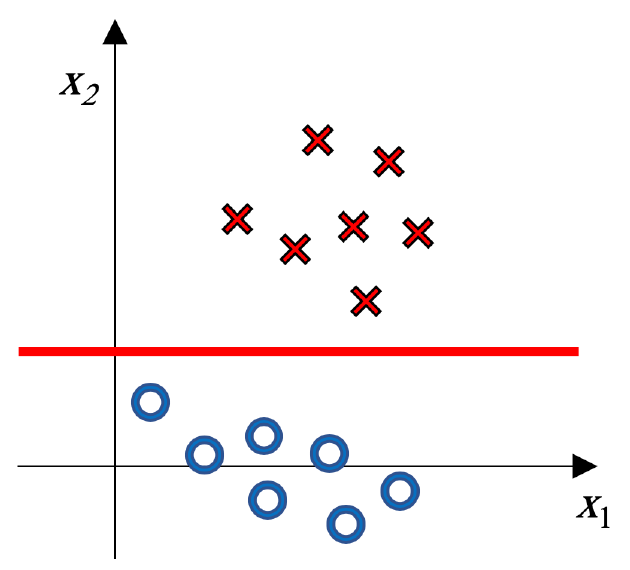

*原卷提供一条可调整红线；按题意自行移动或重画。 / The original supplies an adjustable red line.*

### English answer
For labels yᵢ∈{−1,+1}, one consistent objective is

$$
(w^*,b^*)=\arg\min_{w,b}\left\{\frac1C\sum_j|w_j|+
\sum_i\log\!\left(1+e^{-y_i(w^Tx_i+b)}\right)\right\},\quad C>0.
$$

In the depicted configuration, a horizontal separator is a natural sparse solution: retain x₂ and set w₁=0, so the boundary is w₂x₂+b=0. L1 encourages exact zeros; it does not guarantee an axis-parallel boundary for every dataset or C.

### 中文讲解
先给每个符号一个位置：第$i$条训练样本为$x_i$，标签$y_i\in\{-1,+1\}$；$w$是特征权重，$b$是偏置；$f(x_i)=w^Tx_i+b$是分类分数。$y_if(x_i)>0$表示分数方向和真实类别一致。

原来L2对权重平方求和，L1则对绝对值求和：$\|w\|_1=\sum_j|w_j|$。只更换正则项，Logistic数据损失不变，所以得到英文答案中的目标。$\arg\min$表示寻找使整项最小的$w,b$；这里沿用不惩罚$b$的约定，$C>0$控制权重惩罚。

L1的特点是容易让某些权重恰好为0。一个权重为0时，对应特征无论怎样改变，都不再贡献分数，这就是稀疏（sparse）模型。比如$w=(0,2)$，分数$2x_2+b$只看纵坐标。

回到题图，红叉与蓝圈主要沿纵向分开，横向位置对区分类别帮助较小。因此合理的稀疏草图是**水平分隔线**：取$w_1=0$，边界满足

$$w_2x_2+b=0\quad\Longrightarrow\quad x_2=-b/w_2\quad(w_2\ne0).$$

读图时在上下两群之间画水平线，并说明“保留$x_2$，舍去$x_1$”。原图没有足够数值来确定唯一高度，不需要编一个精确截距。L1是鼓励稀疏，不是保证所有数据都得到轴平行边界；弱正则时两个系数都可能保留。

选读：平方惩罚在权重接近0时导数也接近0；绝对值在0两侧仍有固定大小的斜率，在0处形成尖点。这使一段范围内的数据拟合收益不足以抵消L1代价，最优权重就停在0，详见[MT019](Answers.md#mt019)。

**出处：** 2020B期中Quiz Q12，原卷第6页（10分）

**答案依据：** 2020B期中 Q12 随卷／配套参考答案；条件与解释经复核。

[题目](Questions.md#mt012) · [答案](Answers.md#mt012)

## MT001 · Logistic训练：哪些说法不成立？

**考点：** 逻辑回归与参数正则

### 中文题意
关于逻辑回归，选择所有不正确的说法。

A）训练时只有一个局部最优解。B）必须固定学习率 $\eta$ 才能取得局部最优。C）使用L2正则时，增大C会使训练错误率上升、测试错误率下降。D）训练和测试可使用不同的决策函数，例如训练用sigmoid、测试用sign。

### English answer
The supplied key selects **B and C**. A fixed learning rate is not necessary; increasing C weakens the usual penalty and does not guarantee the stated changes in either error. Training may use sigmoid probabilities while prediction thresholds the score, making D valid. **A needs an additional qualification:** convexity rules out inferior local minima, but alone does not guarantee a unique finite minimizer.

### 中文讲解
逻辑回归先算实数分数$f(x)=w^Tx+b$，再用sigmoid函数$\sigma(f)=1/(1+e^{-f})$把它变成0到1之间的正类概率；另一类的概率是$1-\sigma(f)$。训练通过调整$w,b$，使正确标签的概率更高；学习率决定每次调整迈多大一步，正则强度决定我们多不愿意使用大权重。

在附近小幅改变参数，损失都不会更低，称为局部最小；在所有可能的参数中损失最低，称为全局最小。凸函数的图像不高于任意两点间的连线，因此它的局部最小值也是全局最小值。不过，最低位置可以不止一个。

补充例子：$L(w_1,w_2)=w_1^2$不依赖$w_2$。只要$w_1=0$，无论$w_2$取0、2还是其他值，损失都是最小值0。这是凸目标，却有一整条同样低的“平底”。

- **A按原解视为正确，但表述有条件。** 标准线性LR的负log似然是凸函数，因而没有损失更高的局部最小值；这不保证最优参数唯一，也不保证存在有限的最优权重。原解意在说明前一个性质。
- **B错误，选。** 梯度下降写成$w_{t+1}=w_t-\eta_t\nabla L(w_t)$。这里$t$是第几次更新，$L$是训练损失；梯度$\nabla L$把各个权重的局部变化率列在一起，指出损失增加最快的方向。沿反方向走足够小的一步，损失会下降；步长太大则可能越过低点。$\eta_t$控制这一步的大小，可以固定，也可以随训练调整，没有“必须固定”的要求。
- **C错误，选。** 常见目标为$\|w\|^2/C+\sum_i\ell_i$，增大$C$使权重惩罚变弱。模型更能贴合训练数据，但测试表现可能改善，也可能过拟合后变差；连分类错误率也不必随参数连续、严格变化。
- **D正确。** 训练使用连续概率，便于计算损失和梯度；测试只需要类别，可以判断$f(x)>0$。因为$\sigma(0)=0.5$且sigmoid递增，分数取正与概率超过0.5等价。

选读：无正则且数据线性可分时，把已正确分类的权重越放越大，真实标签的概率就越接近1，损失趋向0，却可能始终不在任何有限权重处等于0。这说明“目标凸”和“必有唯一有限解”是两回事。考试按配套答案选B、C，并保留A的精确条件。

**出处：** 2020B期中Quiz Q1，原卷第2页（5分）

**答案依据：** 2020B期中 Q1 随卷／配套参考答案；条件与解释经复核。

[题目](Questions.md#mt001) · [答案](Answers.md#mt001)

## MT053 · LR与生成式模型：混合选择题

**考点：** 逻辑回归与参数正则

### 中文题意
关于逻辑回归，哪些说法正确？多选。A）MLE有闭式解，因此求解高效。B）为抑制过拟合，可给参数加高斯先验。C）LR建模类别后验，而生成式分类器建模类条件分布。D）可用交叉验证选正则化参数。E）L2只稳定训练，不影响权重。

### English answer
**B, C and D.** Logistic regression models $P(y\mid x)$ directly, whereas a generative classifier models $p(x\mid y)$ and $P(y)$ and derives $P(y\mid x)$ using Bayes' rule. Gaussian parameter priors correspond to L2 penalties in MAP training. Cross-validation can select their strength.

A is false for general logistic regression; numerical optimization is required. E is false because the penalty changes the optimized coefficients, typically shrinking their magnitudes.

### 中文讲解
先区分这里的两个“后验”。$P(y\mid x)$是在知道输入后，**类别**有多可能；$p(w\mid D)$是在知道数据集$D$后，**参数**有多可能。LR直接描述前者，给权重加先验并做MAP时才涉及后者。

- **A错误。** 闭式解是能通过有限公式直接算出最优参数，例如某些线性最小二乘问题。一般LR的梯度中含依赖$w$的sigmoid，把梯度设为0后不能直接解出一个通用矩阵公式，通常要迭代数值优化。
- **B正确。** 高斯先验偏好不太大的权重；取负log后变成L2惩罚，可以控制过拟合。这个先验加在参数$w$上，与生成式模型的类别先验$P(y)$不是同一项。
- **C正确。** LR直接建模$P(y\mid x)$；生成式学习$p(x\mid y)$与$P(y)$，再导出后验。
- **D正确。** 正则化强度是超参数，可用训练数据内部的CV选择，使限制强度适合新样本。
- **E错误。** 对$\alpha\|w\|^2$求导得到$2\alpha w$，梯度更新因此多了一项把权重拉向0的作用，最优系数会改变。

**出处：** 2023B期中 Q2，原卷第2页（5分）

**答案依据：** 2023B随卷解答 Q2，随卷答案BCD；其余选项为跨讲说明。

[题目](Questions.md#mt053) · [答案](Answers.md#mt053)

## MT042 · SVM的基本特点

**考点：** SVM与核方法

### 中文题意
关于SVM，哪些说法成立？多选。

A）可通过松弛变量处理不可分数据。B）寻找最大间隔超平面。C）SVM对训练异常值敏感。D）SVM不适合高维数据。E）SVM用k-means聚类分开数据。

### English answer
The supplied 2023A key selects **A and B**. Slack variables allow violations, and margin maximization is central to the objective. D and E are false. C is context-dependent: hard-margin or heavily penalized soft-margin SVMs can be sensitive to outliers, whereas the degree of sensitivity depends on C, the kernel and contamination; the bare statement is too broad to treat as a universal characteristic.

### 中文讲解
线性SVM用分数$f(x)=w^Tx+b$判断类别；$w$是特征权重，$b$是偏置。标签$y_i$取$+1$或$-1$，所以$y_if(x_i)>0$表示分对，负值表示分错。分界是$f(x)=0$；二维时是一条直线，SVM希望在分界两侧留出较宽的间隔。

把$w,b$同时乘一个正数不会改变这条分界，所以需要固定分数尺度。通常把两侧间隔边缘的分数约定为$+1$与$-1$。对非零$w$，每一侧到分界的垂直距离为$1/\|w\|$，其中$\|w\|=\sqrt{\sum_jw_j^2}$是权重向量的长度。要求$y_if(x_i)\ge1$，表示样本不仅分对，还位于本类间隔边缘或更远处。

软间隔允许这个要求有所不足，写成$y_if(x_i)\ge1-\xi_i$、$\xi_i\ge0$。松弛变量$\xi_i$记录允许的不足量；给定分数后，所需的最小值是$\max(0,1-y_if(x_i))$。补充例子：

| 有符号分数$y_if(x_i)$ | 样本情况 | 最小松弛$\xi_i$ |
|---:|---|---:|
| 1.2 | 分对，已越过间隔边缘 | 0 |
| 0.5 | 分对，但距分界太近 | $1-0.5=0.5$ |
| $-0.2$ | 分错 | $1-(-0.2)=1.2$ |

训练目标中的$C\sum_i\xi_i$对这些不足收费。$C$越大，模型越不愿接受违例；它与间隔大小的取舍见[MT060](Answers.md#mt060)。

- **A正确。** $\xi_i=0$表示满足原间隔要求；正值允许样本进入间隔，甚至分错。因此线性不可分时也能训练软间隔模型，而非要求所有点都完全分开。
- **B正确。** 在上述尺度下，减小$\|w\|$就会增大间隔$1/\|w\|$；软间隔同时考虑违例损失。
- **C不作为本题无条件结论选择。** 硬间隔或很大的$C$会强烈要求照顾每个点，异常点可能拉动边界；较小正$C$允许接受它的违例，影响又会不同。配套答案未选C，不能反过来理解成“SVM对异常值免疫”。
- **D错误。** 高维输入不自动排除SVM；合适的线性求解器及正则化可以用于高维稀疏特征。效率还取决于样本数和实现。
- **E错误。** k-means在没有类别监督的情况下聚类；SVM用已有类别标签学习分界，两者不是同一种训练过程。

按原卷参考答案选A、B，同时理解C依赖模型和参数条件。

**出处：** 2023A期中 Q3，原卷第2页（5分）；2025A期中 Q3，原卷第2页（5分）

**答案依据：** 2023A期中Q3随卷答案AB；2025A Q3复用题面。C的适用条件由本题解补充。

[题目](Questions.md#mt042) · [答案](Answers.md#mt042)

## MT048 · 用一个例子讲清Kernel Trick

**考点：** SVM与核方法

### 中文题意
解释SVM中的kernel trick，并给一个直观例子，可以画图。

### English answer
A feature map can make data linearly separable. The kernel trick replaces mapped inner products by k(x,z), without constructing the mapped vectors. For example, x=−1,+1 are positive and x=0 negative. Mapping Φ(x)=x² separates them at 0.5; its kernel is k(x,z)=x²z².

### 中文讲解
考虑一维输入：$x=-1$和$x=1$属于正类，$x=0$属于负类。在原数轴上，正类夹着负类，只用一个阈值把左右分开，无法把两端同时归正、中间归负。

把输入变成$\phi(x)=x^2$：原来的两个正点都变成1，负点仍为0。在新轴上，用直线分数$\phi(x)-0.5$即可分开。回到原坐标，这条规则是$x^2-0.5$，它能给中间与两端不同的类别。这说明特征变换怎样改变可表达的边界。

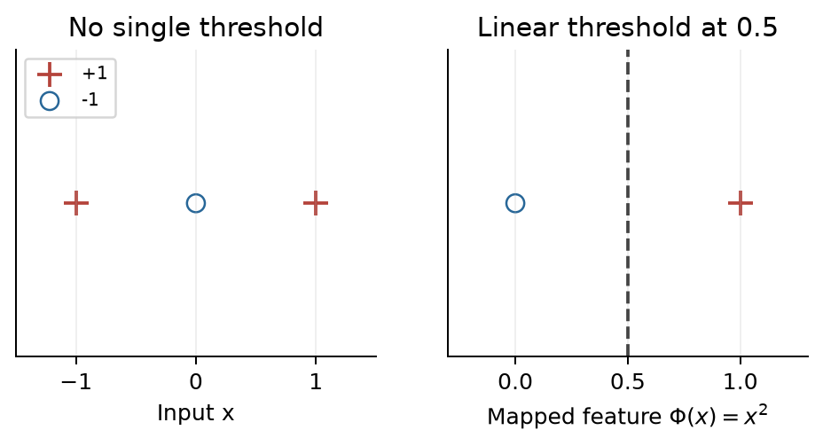

**核技巧使我们能直接计算映射后的内积。** 多维向量的内积是把对应分量相乘再相加，例如$(1,2)$与$(3,4)$的内积为$1\times3+2\times4=11$。记号$u^Tv$中的$T$将列向量转成行向量，以完成这次相乘。一维时，内积就是普通乘法，因此本例的核为

$$k(x,z)=\phi(x)\phi(z)=x^2z^2.$$

假如$x=-1,z=2$，先映射再相乘得到$1\times4=4$；直接计算核也得4。两种路径得到同一个内积。对本例这样的小映射，直接构造没有负担；对于极多特征的映射，直接求核值才可能省去大量工作。

SVM可写成按训练样本组合分数的形式：$f(x)=\sum_i\alpha_i y_i\phi(x_i)^T\phi(x)+b$。这里$x_i$是训练样本，$y_i$是其正负标签，$\alpha_i$是训练得到的贡献系数，$b$是偏置。系数非零、仍参与预测的样本称为支持向量。

把每项内积替换成$k(x_i,x)$，就能计算同一个预测分数。采用按样本系数求解的等价训练形式时，训练中的特征运算也只需这些内积，因此不必逐维构造映射后的向量。

**出处：** 2023A期中 Q9，原卷第6页（10分）

**答案依据：** 2023A期中 Q9 随卷／配套参考答案；条件与解释经复核。

[题目](Questions.md#mt048) · [答案](Answers.md#mt048)

## MT016 · 核SVM：变换、存储与非向量输入

**考点：** SVM与核方法

### 中文题意
关于核SVM，哪些说法正确？多选。

A）等价于在变换后的输入上训练线性SVM。B）训练完成后不再需要训练数据。C）输出为正的任意函数都是合法核。D）可用于字符串、集合等非向量输入。E）相比显式变换再求内积，核技巧可能减少内存与计算。

### English answer
**A, D and E**, with E interpreted as a possible saving relative to explicitly constructing the feature map. Nonlinear kernel prediction normally retains support vectors and coefficients, so B is false. A valid real kernel must produce symmetric positive-semidefinite Gram matrices, not merely positive entries.

### 中文讲解
设$\phi(x)$把原输入变成一组新特征。内积把两组特征的对应分量相乘再相加；核函数直接返回这个结果：$k(x,z)=\phi(x)^T\phi(z)$。我们可以不显式生成很长的$\phi(x)$，这就是核技巧。

把每对训练样本的核值排成一张表，得到核矩阵（Gram matrix）：第$i$行、第$j$列是$K_{ij}=k(x_i,x_j)$。例如两条样本对应

$$K=\begin{pmatrix}k(x_1,x_1)&k(x_1,x_2)\\k(x_2,x_1)&k(x_2,x_2)\end{pmatrix}.$$

矩阵乘一个向量，就是分别用每一行与该向量求内积；下面C的反例会用到这个运算。

- **A正确。** 核SVM对应在映射后的特征空间学习线性分隔，在原空间看起来可能是曲线。
- **B错误。** 一般非线性核预测为$f(x)=\sum_{i\in SV}\alpha_i y_i k(x_i,x)+b$。新点要与支持向量$x_i$算核值，因此通常仍需保存这些训练点及系数；其余训练点可以不参与预测。
- **C错误。** 核不只是一个数值为正的相似度函数，它必须对任意有限样本形成对称半正定Gram矩阵。半正定要求：用任意实数系数$v$加权组合这些样本，都有$v^TKv\ge0$；对内积核，这个量就是组合后向量的平方长度。反例$K=\begin{pmatrix}1&2\\2&1\end{pmatrix}$虽然每项都正，取$v=(1,-1)^T$却有$Kv=(-1,1)^T$，于是$v^TKv=-1-1=-2$。平方长度不可能为负，所以它不是合法的内积矩阵。
- **D正确。** 字符串或集合也能定义合法核，只要满足内积结构的条件；不要求显式写出有限维向量。
- **E正确，理解为可能的节省。** 若映射包含数量庞大的特征，直接算核值可省去它们的构造与存储。不过样本很多时，$N\times N$核矩阵本身仍可能很大。

合法性与效率是两个问题：满足核条件不意味着一定省内存，输出全正也不意味着满足核条件。半正定的具体检查见[MT055](Answers.md#mt055)。

**出处：** 2021A期中 Q3，原卷第2页（5分）

**答案依据：** 2021A期中 Q3 随卷／配套参考答案；条件与解释经复核。

[题目](Questions.md#mt016) · [答案](Answers.md#mt016)

## MT031 · RBF距离与带宽：看近点和远点

**考点：** SVM与核方法

### 中文题意
题图中x离y较近、离z较远。用逆带宽γ计算Gaussian RBF核 $k(x,y)$ 和 $k(x,z)$，哪些说法正确？多选。

A）某些γ可使两者都接近1。B）某些γ可使两者都接近0。C）对任意γ>0都有 $k(x,y)\ge k(x,z)$。D）若前者接近1，后者也接近1。E）若前者接近0，后者也接近0。

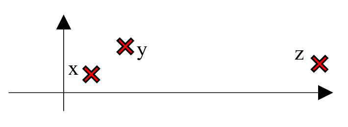

### English answer
**A, B, C and E as printed.** For distinct points, both RBF similarities approach 1 as γ→0⁺ and 0 as γ→∞. The nearer point always has higher similarity, proving C and E. D fails: near similarity can be close to 1 while far similarity is not. The supplied key omits the true printed option C.

### 中文讲解
RBF核把距离转换成相似度：

$$k(u,v)=e^{-\gamma\|u-v\|^2},\qquad\gamma>0.$$

$\|u-v\|^2$是各坐标差的平方和，距离越大，指数越负，核值越小。$\gamma$是逆带宽：增大它，同样的距离会受到更强的衰减。图中$x,y,z$互不相同，且$x$离$y$近、离$z$远。

- **A正确。** $\gamma\to0^+$时，两份距离乘上$\gamma$都趋近0，$e^0=1$，所以两核值都可接近1。
- **B正确。** $\gamma$很大时，只要距离非零，指数都成为很大的负数，两值都可接近0。若其中两点重合，该核恒为1，但图中并非这种情况。
- **C正确。** 近点的平方距离较小，负指数较大，所以$k(x,y)>k(x,z)$，自然也满足印刷题面的“$\ge$”。
- **D错误。** 近处还很相似，不代表远处也相似。补充例子：两距离为1和10，$\gamma=0.01$，两值为$e^{-0.01}\approx0.9900$和$e^{-1}\approx0.3679$。
- **E正确。** 始终有$0\le k(x,z)\le k(x,y)$。较大的那个都已接近0，较小的那个也必接近0。

判断D、E的差别时，画一条从0到1的数轴即可：大值靠近1不能限制小值靠近1，大值靠近0却能把小值一起夹在0附近。

**原题差异 / Source note：** 配套答案列A、B、E；题纸的≥使C也成立，本解按题纸补C。 / The supplied key omits C, which is true as printed.

**出处：** 2021B*期中 Q5，原卷第3页（5分）

**答案依据：** 2021B题纸第3页、配套答案第2页及RBF公式。版本差异汇总见本册末尾。

[题目](Questions.md#mt031) · [答案](Answers.md#mt031)

## MT055 · 判断五个候选核是否合法

**考点：** SVM与核方法

### 中文题意
下面哪些函数是合法的半正定核？多选。各输入是实向量。

A）$k(x,z)=x^Tz/(\|x\|\|z\|)$。

B）$k(x,y)=\int p(x\mid z)p(y\mid z)p(z)\,dz$，前两项为条件分布，$p(z)$为边缘分布。

C）当 $-1<x^Ty<1$ 时 $k(x,y)=1$，否则为0。

D）$k(x,y)=\sin(x^Ty)$。

E）$k(x,y)=\tanh(x^Ty)$。

### English answer
**A and B**, on appropriate domains. A is the inner product of normalized nonzero inputs. For B, assuming the integrals exist, any coefficients aᵢ give

$$
\sum_{i,j}a_i a_j k(x_i,x_j)
=\int\left[\sum_i a_i p(x_i\mid z)\right]^2p(z)\,dz\ge0.
$$

C fails on one-dimensional inputs 0 and 2: its Gram matrix is [[1,1],[1,0]], with negative determinant. D can have a negative diagonal, e.g. x=√(3π/2). For E, inputs 1 and 2 and coefficients (1,−1) give tanh(1)+tanh(4)−2tanh(2)≈−0.1671<0. Thus C–E are not valid on all real inputs.

### 中文讲解
核要像“某个特征空间里的内积”。取样本$x_1,\ldots,x_n$，把每对核值填成矩阵$K_{ij}=k(x_i,x_j)$。合法实核要求对称，并且对任意系数向量$a$都有$a^TKa\ge0$，这叫半正定（positive semidefinite，PSD）。

为什么要检查这个量？如果核确实是内积，就有

$$a^TKa=\sum_{i,j}a_i a_j\phi(x_i)^T\phi(x_j)
=\left\|\sum_i a_i\phi(x_i)\right\|^2\ge0.$$

向量的平方长度是各分量的平方和，例如$(v_1,v_2)$的平方长度为$v_1^2+v_2^2$，所以右边不可能负。找到一次负值，就能证明候选函数不是所有实输入上的合法核；无需证明它对每组输入都失败。

**A合法，但排除零向量。** 定义$\phi(x)=x/\|x\|$，就是把向量缩到长度1，方向不变。候选式等于$\phi(x)^T\phi(z)$，符合内积结构。$x=0$时分母为0，题目的原式没有定义。

**B在积分有限时合法。** $z$可理解为一个潜在状态，$p(x_i\mid z)$表示固定这个状态后，输入$x_i$的概率或密度。先只看两个样本，简写$p_i(z)=p(x_i\mid z)$。

对于一个固定的$z$，$i,j$各取1或2，四项对应$(1,1)$、$(1,2)$、$(2,1)$、$(2,2)$；中间两项相同，合并后为

$$\begin{aligned}
\sum_{i,j=1}^{2}a_i a_j p_i(z)p_j(z)
&=a_1^2p_1(z)^2+2a_1a_2p_1(z)p_2(z)+a_2^2p_2(z)^2\\
&=[a_1p_1(z)+a_2p_2(z)]^2.
\end{aligned}$$

平方项正是这样出现的。若$z$只有$z_1,z_2$两个可能状态，概率为$q_1,q_2\ge0$、$q_1+q_2=1$，令$t_r=a_1p_1(z_r)+a_2p_2(z_r)$（$r=1,2$），再对状态求和便得到$q_1t_1^2+q_2t_2^2\ge0$：每个平方非负，权重也非负。

连续的$z$用积分把各位置的贡献累加。更多样本仍可按同样方式展开平方，因此对任意系数向量$a$，

$$a^TKa=\int\left(\sum_i a_i p(x_i\mid z)\right)^2p(z)\,dz\ge0.$$

这里$p(z)$是非负密度，$dz$表示累加时的小区间宽度。每一份贡献都非负，总和也非负；积分有限的条件保证核值是可用的有限数。

**C不合法。** 只选一维点$x_1=0,x_2=2$，它们的内积分别为0、0、0、4，按候选规则得到

$$K=\begin{pmatrix}1&1\\1&0\end{pmatrix}.$$

取$a=(1,-2)^T$。先用$K$的每一行与$a$相乘：

$$Ka=\begin{pmatrix}1\times1+1\times(-2)\\1\times1+0\times(-2)\end{pmatrix}
=\begin{pmatrix}-1\\1\end{pmatrix}.$$

再把$a$与这个结果求内积，得到$a^TKa=1\times(-1)+(-2)\times1=-3<0$，直接反驳半正定。

**D不合法。** 单点也要满足$k(x,x)\ge0$，因为它对应自己的平方长度。取一维$x=\sqrt{3\pi/2}$，则$\sin(x^2)=\sin(3\pi/2)=-1$，已经失败。

**E不合法。** $\tanh$是双曲正切函数，可按$\tanh t=(e^t-e^{-t})/(e^t+e^{-t})$计算。取一维点1、2，核矩阵为$K=\begin{pmatrix}\tanh1&\tanh2\\\tanh2&\tanh4\end{pmatrix}$。沿用前面的检查方法，取$a=(1,-1)^T$，得到

$$a^TKa=\tanh1+\tanh4-2\tanh2
\approx0.7616+0.9993-2(0.9640)=-0.1671<0.$$

所以E也不满足半正定。A、B成立，需保留A的非零输入条件及B的积分有限条件。

**出处：** 2023B期中 Q4，原卷第3页（5分）

**答案依据：** 2023B期中 Q4 随卷／配套参考答案；条件与解释经复核。

[题目](Questions.md#mt055) · [答案](Answers.md#mt055)

## MT060 · 二次核SVM：大C与小C的边界

**考点：** SVM与核方法

### 中文题意
给定题图训练点，使用二次多项式核SVM。(a) C趋于无穷时画边界。(b) C趋于0时画边界。(c) 哪个在测试数据上可能更好？每问说明理由。

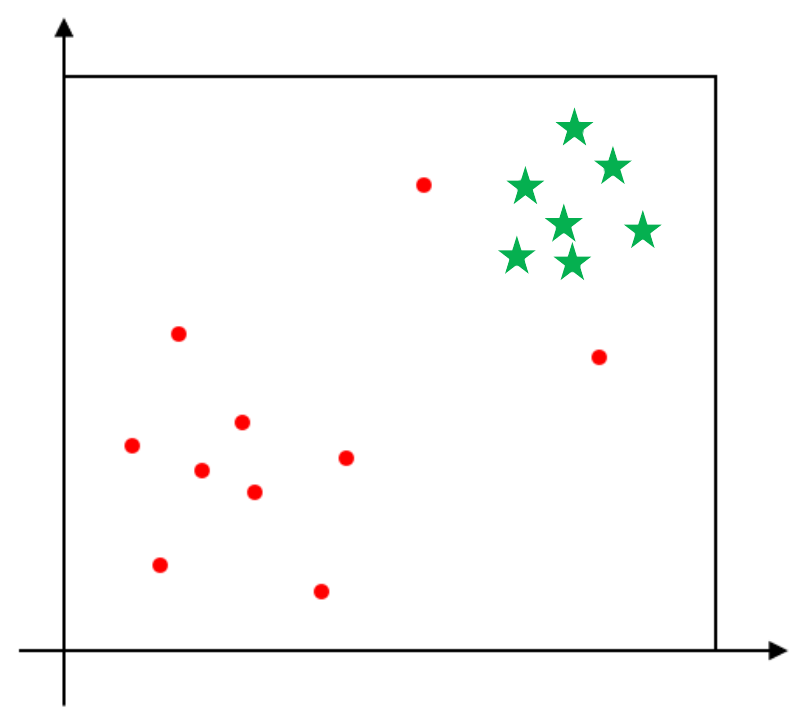

### English answer
The intended sketches contrast a **large C**, which strongly penalizes margin violations and bends the boundary to accommodate the isolated red points, with a **smaller positive C**, which accepts some violations for a simpler, wider-margin separation. If those isolated points are noise, the latter may generalize better, but a training diagram alone cannot determine test accuracy.

Two limits need care: zero training error for large C requires separability in the chosen feature space. At exactly C=0, the data term disappears and w=0 minimizes the objective with unconstrained bias. This endpoint does not by itself determine the decision-boundary limit as C→0⁺; the supplied right-hand sketch illustrates a smaller positive C.

### 中文讲解
软间隔SVM的目标可写成

$$\frac12\|w\|^2+C\sum_i\max(0,1-y_if(x_i)).$$

第一项偏好较小权重、较宽间隔；第二项对分错或离边界太近的点收费。$C$乘在违例损失前，所以越大，模型越不愿意接受个别点的违例。

**(a) 大$C$的草图。** 先看两团主数据，再看偏离主团的红点。若二次特征空间能把它们分开，大$C$会更努力照顾这些点，边界因而弯曲。原解的左图试图把那两个红点也留在红类一侧。不能泛化成“任何核、任何数据、$C$大都必然零错误”。

**(b) 较小正$C$的草图。** 容忍少数点违例的代价下降，模型可以在主团之间保持较平滑、较宽间隔的分界，接受那些红点落到错误一侧。原解右图表达的是这种取舍。原题用红圆点和绿星形区分类别；下方答案草图把两类都画成圆点，因此答案草图建议保留彩色。画图时要解释哪些点被牺牲、换来了什么，而非只画两条不同曲线。

**(c) 测试表现取决于离群点的性质。** 若它们是标签噪声，追着它们弯曲可能过拟合，较小$C$更有希望；若它们代表真实但少见的规律，忽略它们也会犯错。应在验证数据上选$C$，不能单凭训练图保证哪条更准。

**这里把原图理解为大小$C$的定性比较。** 题面写$C\to0$，但仅凭示意图无法算出这一极限的精确边界，所以下图右侧表达的是较小正$C$允许部分违例的取舍。若直接设$C=0$，数据项消失，$w=0$即可最小化目标，$b$不再由数据确定；这是端点的退化情况，不能直接代替$C\to0^+$时的边界分析。

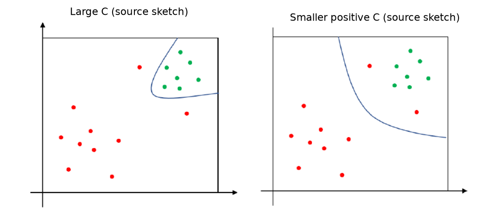

*左：原答案的大C草图；右：较小正C草图。极限符号的解释见本题文字。*

**出处：** 2023B期中 Q9，原卷第6页（10分）

**答案依据：** 2023B期中 Q9 随卷／配套参考答案；条件与解释经复核。

[题目](Questions.md#mt060) · [答案](Answers.md#mt060)

## MT054 · C、支持向量与RBF的零训练误差

**考点：** SVM与核方法

### 中文题意
关于SVM，哪些说法正确？多选。

A）线性可分时，C设为无穷可使训练点全部分类正确。B）三个支持向量之一移动，边界不会改变。C）欠拟合时，映射到更低维空间会改善表现。D）基本SVM是凸二次规划。E）RBF核SVM总能把训练数据完全分类正确。

### English answer
The supplied key is **A, D and E**, but **E requires qualification**. For distinct finite inputs, an RBF kernel with positive bandwidth parameter permits interpolation in its feature space, and sufficiently strong fitting can achieve zero training error. Duplicate inputs with conflicting labels cannot be separated by any deterministic classifier, and an arbitrary finite C need not fit all labels. A refers to the separable hard-margin limit; B and C have no such guarantee.

### 中文讲解
本题有一个必须保留的区别：配套答案把RBF的强表达能力简写成“总能零训练错误”，但无条件的“总能”并不成立。

- **A按原解正确。** 已给定线性可分，说明存在把训练点完全分对的线性边界。$C\to\infty$是越来越不容忍违例的硬间隔极限，在可分设定下可得到零分类训练错误。
- **B错误。** 支持向量正是参与决定边界的点。移动一个点可能改变最佳间隔、其系数以及边界位置，没有“必定不变”的保证。
- **C错误。** 欠拟合表示当前模型或表示不够。盲目降维可能进一步丢掉有用信息，不是普遍补救；若能去除噪声有时有帮助，但选项没有给出这个条件。
- **D正确。** 标准SVM的目标是凸二次函数、约束为线性，属于凸二次规划。核形式需使用合法半正定核，以保留相应凸性。
- **E按原解选，但需写出条件。** 有限个互异输入、正的RBF参数及足够强的数据拟合下，RBF空间能表达把训练标签分开的规则。实际取某个较小$C$，模型可能主动接受错误以减小正则代价。

E最简单的反例是：两条输入完全相同，一条标$+1$、另一条标$-1$。任何固定函数对同一个输入只能给同一个预测，不可能同时答对。因此应区分“原卷答案ADE”与“严格的E需限定”，不能靠更换核消除相同输入的冲突标签。

**出处：** 2023B期中 Q3，原卷第2页（5分）

**答案依据：** 2023B期中 Q3 随卷／配套参考答案；条件与解释经复核。

[题目](Questions.md#mt054) · [答案](Answers.md#mt054)

## MT043 · 核SVM怎样处理非线性？

**考点：** SVM与核方法

### 中文题意
关于核SVM，哪些说法成立？多选。

A）SVM可以直接处理线性不可分的数据。B）径向基函数是常用核。C）核方法把非线性问题变成特征空间里更高效的问题。D）SVM对偶问题主要涉及选择支持向量。E）通过显式特征变换和内积，核可以降低内存与计算。

### English answer
The supplied key is **B and D**. Interpret D as optimizing sample multipliers, whose nonzero values identify support vectors—not selecting them in advance. A is ambiguous under the kernel-SVM heading: nonlinear kernels can model nonlinear boundaries, whereas soft-margin tolerance alone does not make a linear SVM nonlinear. The supplied key nevertheless omits A. A feature-space reformulation does not automatically guarantee efficiency. The kernel trick avoids explicit feature construction, contrary to E's wording.

### 中文讲解
这题的关键是分开三件事：原空间能否画出非线性边界、训练时优化什么、核技巧省掉什么。

- **A依原解不选，但题头语境有歧义。** 普通线性SVM可以用软间隔处理线性不可分数据，却不会因此获得任意非线性边界；若已经明确使用非线性核，它当然可以建模非线性分界。2023A题头含kernel，配套答案仍未选A；本册保留原解BD，并说明不能将A一概讲成“核SVM不能处理非线性”。
- **B正确。** 径向基函数RBF是常用核，例如$e^{-\gamma\|x-z\|^2}$，按样本距离给出相似度。
- **C不选。** 换到特征空间使分界可以线性化，说明的是表示方式；它不自动保证训练更高效，样本对的核计算仍可能昂贵。
- **D按原解选。** 对偶优化每个训练样本的乘子$\alpha_i$，非零系数对应参与预测的支持向量。这是优化后的结果，不是训练前先手选几个样本。
- **E不选。** 核技巧的节省来自直接算$k(x,z)$，避免**显式**构造$\phi(x)$再求内积。选项恰把这点写反。

答题可写B、D，并在解释A时指出“软间隔容错”与“非线性表示能力”的区别。一个完整核技巧例子见[MT048](Answers.md#mt048)。

**原题差异 / Source note：** 2023A题头含kernel，2025A省略该词；五个选项相同。 / The 2025 heading omits “kernel”; the options are unchanged.

**出处：** 2023A期中 Q4，原卷第3页（5分）；2025A期中 Q4，原卷第2页（5分）

**答案依据：** 2023A期中Q4随卷答案BD；2025A Q4同组选项。原题简略措辞按上述条件解释。

[题目](Questions.md#mt043) · [答案](Answers.md#mt043)

## MT029 · 哪些SVM说法错误？

**考点：** SVM与核方法

### 中文题意
关于SVM，选择所有不正确的说法。

A）核SVM不能处理线性可分数据。B）SVR中回归容忍带边界附近的点称为支持向量。C）核SVM可理解成在高维空间中学习线性分类器。D）核函数只能用于向量输入。E）SVM只需要支持向量估计模型参数，所以对大数据扩展性很好。

### English answer
**A, D and E** are the intended incorrect statements. Kernel models can also fit linearly separable data, and valid kernels can be defined on strings or sets. Support vectors are identified during fitting; training does not start by knowing which examples can be discarded. B is an informal description: nonzero dual coefficients define predictive support, and points outside the SVR tube can also be support vectors.

### 中文讲解
支持向量（support vectors）是在训练完成后，具有非零对偶系数、会参与预测的训练样本。不能在训练前凭名称就知道哪些点可以扔掉。本题选**不正确**的表述。

- **A错误，选。** 能处理非线性不意味着不能处理线性可分的数据。核模型同样可以找到适合线性可分样本的分类规则。
- **B按课程简写视为正确。** SVR是支持向量回归：预测曲线周围留一条误差容忍带，带内误差可以不受罚，边界及带外点可能参与决定模型。严格说，是否为预测中的支持向量取决于系数是否非零；不能把“边界附近”当作完整定义。
- **C正确，不选。** 通过特征映射，核SVM可理解为新空间的线性分类器。映射可能是很高维，甚至不需要显式写出。
- **D错误，选。** 对字符串、集合等也能构造合法核，关键是是否形成对称半正定的内积关系，而非原输入是否已经是向量。
- **E错误，选。** 预测可能只需支持向量，但训练必须从样本中找出它们。常规核训练要处理许多样本对，不能据此断言天然适合大数据。

把“训练要处理哪些数据”和“最终预测保存哪些数据”分开，是这题最关键的区别。

**出处：** 2021B*期中 Q3，原卷第2页（5分）

**答案依据：** 2021B*期中 Q3 随卷／配套参考答案；条件与解释经复核。

[题目](Questions.md#mt029) · [答案](Answers.md#mt029)

## MT010 · 同一张分布图，Gaussian Bayes与二次核SVM如何判断？

**考点：** SVM与核方法

### 中文题意
依据题图的两类训练数据，Gaussian Bayes分类器会将点D判为哪一类？换成二次多项式核SVM后呢？分别解释。红点为+1，绿点为−1。

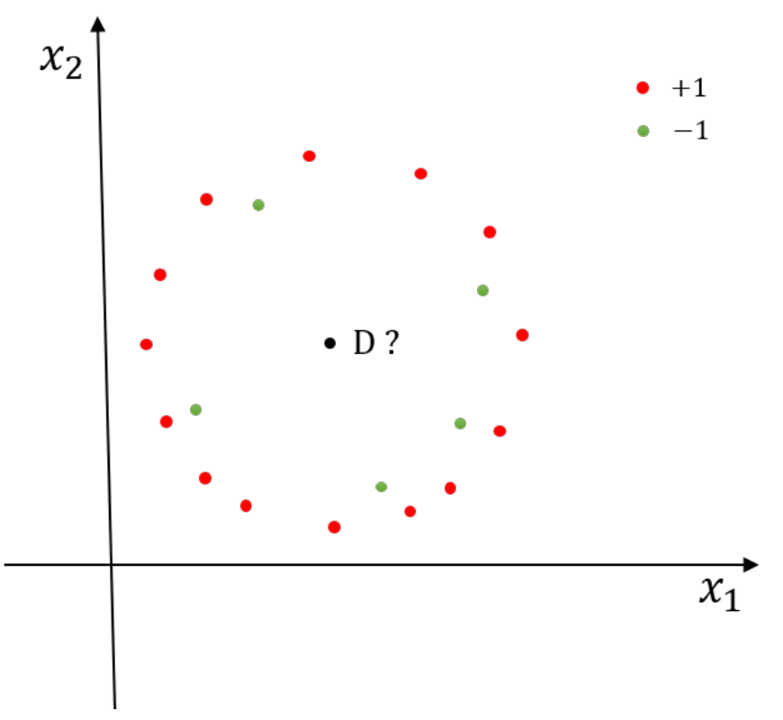

### English answer
The supplied solution expects **+1 for Gaussian Bayes and −1 for quadratic-kernel SVM**. Bayes compares density times prior; the SVM sketch encloses the inner negative points, including D. These are the intended schematic results: exact Gaussian parameters and SVM C are not supplied, so the plot does not uniquely determine a numerical fit.

### 中文讲解
先看图的结构：绿色负类在内层，红色正类分布更宽、数量更多，D靠近内层区域。题目让两种模型判断同一个D，是要比较它们决定边界的依据。

**Gaussian Bayes比较概率证据。** 为两类分别拟合高斯分布，再乘类别先验。某类样本多，估出的先验通常更大；但某类分布很宽，同样的位置上密度又可能更低。因此不能只看D离哪个中心近，也不能只看哪类点多。原解在其示意拟合下预期D属于红色$+1$类。原图两类均为圆点，本题建议保留彩色。

**二次核SVM寻找特征空间的间隔分界。** 二次特征使原空间可以出现曲线，例如把内层点围住、把外圈留在另一侧。配套草图把D放在绿色内层一侧，因此预期为$-1$。它没有先拟合两个高斯密度。

精确的高斯分类需要各类均值、协方差与先验；精确的SVM曲线还依赖$C$与实际点坐标。原图没有给齐这些量，因此两类结果是配套解答的示意判断。

选读：Gaussian Bayes的矩阵分数。把待判断点D的特征写成向量，$\mu_c$是$c$类各维均值，$\pi_c$是类别先验。协方差矩阵$\Sigma_c$的对角线记录各维方差，其他位置描述两维怎样一起变化。假定它正定且可逆，两类可比较

$$g_c(D)=\log\pi_c-\frac12\log|\Sigma_c|
-\frac12(D-\mu_c)^T\Sigma_c^{-1}(D-\mu_c),$$

其中省略了两类共同的常数。$\Sigma_c^{-1}$是与$\Sigma_c$相乘得到单位矩阵的逆矩阵；$|\Sigma_c|$是行列式，这里反映分布在各方向上的总体宽窄。最后的二次型按各方向的波动和关联调整距离。

若各维独立，$\Sigma_c$只有对角线上的方差$v_j$，最后的距离项便是$\sum_j(D_j-\mu_{cj})^2/v_j$，而$\log|\Sigma_c|=\sum_j\log v_j$。这就回到[MT046](Answers.md#mt046)的逐维高斯分数；完整矩阵写法还允许各维相关。

**出处：** 2020B期中Quiz Q10，原卷第5页（10分）

**答案依据：** 2020B期中 Q10 随卷／配套参考答案；条件与解释经复核。

[题目](Questions.md#mt010) · [答案](Answers.md#mt010)

## MT009 · 十万维特征、两千样本：SVM怎样提速？

**考点：** SVM与核方法

### 中文题意
医院数据有2000名患者，每人100,000维特征。朋友训练线性SVM很慢，你建议怎样提速？说明理由。

### English answer
Compare primal and dual formulations and use a solver suited to the data. The primal has about 100,000 weights plus a bias; the dual has 2,000 sample multipliers and a 2,000×2,000 Gram matrix. A dual method may therefore be attractive when d≫N. Also exploit sparse inputs and efficient linear-SVM implementations; validated feature reduction is another option. Variable counts alone do not guarantee a wall-clock speedup.

### 中文讲解
数据有$N=2000$条、每条$d=100{,}000$个特征。线性SVM最后仍用$f(x)=w^Tx+b$预测，但求出这个模型可以走两条路线。

**原始问题（primal）按特征求权重。** $w$有100,000个分量，分别决定每一维特征怎样影响分数。这里优化变量规模主要跟特征数$d$走。

**对偶问题（dual）按训练样本求系数。** 给每条样本一个乘子$\alpha_i$，再用

$$w=\sum_{i=1}^{N}\alpha_i y_i x_i$$

把样本组合成同一个权重向量。$y_i$是正负标签，$\alpha_i$控制第$i$条样本的贡献；为0的项不参与最终预测。此时主要优化2000个样本系数，而非100,000个特征权重，所以$d\gg N$时可以考虑对偶求解器。

对偶还要计算样本之间的内积。把$K_{ij}=x_i^Tx_j$排成表就是Gram矩阵，它有$2000\times2000=4{,}000{,}000$个元素，并非$100{,}000^2$。构造这些内积本身仍有成本，减少未知数不自动等于每种实现都更快。

实际建议是比较合适的primal/dual线性SVM求解器，并利用稀疏输入：若很多特征为0，不要按稠密矩阵反复运算。也可验证降维或特征筛选，但需检查是否损失分类信息。英文答题重点给出$d$、$N$的比较及换用对偶的理由，不必完整推导拉格朗日对偶。

**出处：** 2020B期中Quiz Q9，原卷第4页（10分）

**答案依据：** 2020B期中 Q9 随卷／配套参考答案；条件与解释经复核。

[题目](Questions.md#mt009) · [答案](Answers.md#mt009)

## MT061 · 预测内存：线性SVM与RBF SVM

**考点：** SVM与核方法

### 中文题意
二分类输入1000维、训练样本2000条。按预测函数的内存从小到大排列：线性SVM(C=0.1)、线性SVM(C=1000)、RBF SVM(C=0.1)、RBF SVM(C=1000)。解释排序。

### English answer
The two linear models tie under the standard compressed representation: d weights plus one bias, **1001 numbers**, independent of C. A kernel model with M support vectors stores approximately M(d+1)+1 numbers (support-vector coordinates, one coefficient each, and a bias).

Under this representation, the ranking is linear(C=0.1) = linear(C=1000) < ordinary nondegenerate RBF models. The two RBF models cannot be universally ordered from C alone; their actual support-vector counts are needed. The supplied answer puts C=1000 before C=0.1 based on a presumed decrease in M, but support-vector count is not generally monotone in C.

### 中文讲解
题目问**预测函数占多少内存**，不是训练时需要保存多大的核矩阵。先把最终预测式写出来，再数需要存的数。

线性模型为$f(x)=w^Tx+b$。1000维输入需要1000个权重及1个偏置，共1001个数。即使训练中用了很多支持向量，它们也能合并为同一个$w$；所以$C=0.1$与$C=1000$在线性压缩表示下并列。

一般RBF模型为$f(x)=\sum_{i=1}^{M}\beta_i k(x_i,x)+b$，其中$\beta_i=\alpha_i y_i$，$M$是实际支持向量数。预测时要保存$M$个1000维向量、$M$个系数及1个偏置，即

$$1000M+M+1=1001M+1\text{ 个数}.$$

补充例子：若$M=100$，需要100,101个数；若$M=500$，需要500,501个数。因此常规非退化RBF模型比压缩后的线性模型存得多，两个RBF之间则要看谁的$M$小。数据类型相同且忽略软件开销时，数字个数才能直接用于内存比较。

原题只给$C$，没有给两个$M$，所以不足以普遍确定两种RBF的先后。配套答案假设大$C$的支持向量更少，但数量并不对$C$普遍单调。可靠作答是“两线性并列；RBF按实际支持向量数排序”，并注明原解使用的额外假设。

**出处：** 2023B期中 Q10，原卷第7页（10分）

**答案依据：** 2023B期中 Q10 随卷／配套参考答案；条件与解释经复核。

[题目](Questions.md#mt061) · [答案](Answers.md#mt061)

## MT019 · Ridge、LASSO与零系数

**考点：** 回归、特征选择与残差损失

### 中文题意
关于线性回归，哪些说法正确？多选。

A）训练数据越多越容易过拟合。B）LASSO的惩罚α很大时，某些系数只接近零而不会恰为零。C）LASSO可用于特征选择。D）Ridge的惩罚α很大时，某些系数接近零但通常不精确为零。E）OLS是LASSO和Ridge的特殊情形。

### English answer
**C, D and E** under the usual interpretation. LASSO can produce exact zeros; ridge generally shrinks coefficients continuously. Setting the penalty to zero recovers the OLS objective. A is not a general relationship. D describes typical ridge behaviour, not a theorem that a ridge coefficient can never equal zero.

### 中文讲解
回归预测一个数值。第$i$条记录的预测为$f(x_i)$，真实值为$y_i$，残差$r_i=f(x_i)-y_i$就是带正负方向的预测误差；例如预测5、实际3，残差为2，残差平方为4。

普通最小二乘（ordinary least squares，OLS）把各条残差平方后相加，最小化$\sum_i r_i^2$。Ridge再加$\alpha\sum_jw_j^2$，LASSO再加$\alpha\sum_j|w_j|$。二者都控制权重，区别在于压到零附近时的行为。

- **A错误。** 更多有代表性的数据通常使估计更稳定，不能说数据越多越容易过拟合；数据来源与模型复杂度仍需考虑。
- **B错误。** LASSO恰能使一些系数精确为0，并非只能接近0。
- **C正确。** 系数为0时，该特征退出预测式，因此LASSO可用于特征选择。
- **D按通常行为正确。** Ridge连续缩小权重，通常不会主动制造精确零。若某特征与目标的相关项本来为0，其系数也可能恰为0，所以“通常”不能省成“永不”。
- **E正确。** 令$\alpha=0$，两种正则项都消失，目标回到OLS。

选读：用一个只有一个权重的教学目标看差别。最小化$\frac12(w-3)^2+\alpha w^2$，求导得$(w-3)+2\alpha w=0$，所以Ridge解为$w=3/(1+2\alpha)$，随着惩罚变大逐渐靠近0。

若改成$\frac12(w-3)^2+\alpha|w|$，在$w>0$处求导得$w=3-\alpha$；当$\alpha\ge3$，这个正解不再成立，最优值停在尖点$w=0$。这就解释了L1的“精确选零”。这个一维例子不是一般多维LASSO都能逐坐标独立求解的保证。

**出处：** 2021A期中 Q6，原卷第3页（5分）

**答案依据：** 2021A期中 Q6 随卷／配套参考答案；条件与解释经复核。

[题目](Questions.md#mt019) · [答案](Answers.md#mt019)

## MT045 · 特征选择：零系数、Ridge与OMP

**考点：** 回归、特征选择与残差损失

### 中文题意
关于线性回归和特征选择，哪些说法正确？多选。

A）鼓励部分权重为零可做特征选择。B）Ridge因使用L2而能有效自动选择特征。C）OMP能找到给定稀疏度下的全局最优特征集合。D）只要特征集合相同，无论选择方法如何都会得到同一组系数。E）L1等高线的尖角有利于产生稀疏权重。

### English answer
**A and E.** A zero coefficient removes that feature's direct contribution; L1 geometry promotes such solutions. Ridge usually shrinks rather than exactly eliminates coefficients. OMP is greedy, not a general solver for the globally best subset. Different penalties/objectives can yield different weights even with the same feature list.

### 中文讲解
线性回归预测为$w_1x_1+\cdots+w_dx_d+b$。若$w_j=0$，第$j$个输入不会直接影响预测，因此“让一些权重恰好为0”能完成特征选择。

- **A正确。** 零系数直接删除相应特征的贡献。
- **B错误。** Ridge惩罚平方和，通常让权重整体变小，不像LASSO那样主动产生稀疏解。
- **C错误。** OMP（orthogonal matching pursuit）每轮挑一个与当前残差最相关的候选特征，再对已选集合重新拟合。它是在当前局面作贪心选择，没有穷举所有同样大小的特征集合，因此不保证全局最佳。
- **D错误。** 即使特征集合相同，训练目标也可能不同。OLS只顾平方误差；Ridge加平方惩罚；LASSO加绝对值惩罚，学出的系数自然可能不同。
- **E正确。** 权重平面上的一点$(w_1,w_2)$就是一组候选系数。把权重绝对值的总和限制在上限$t>0$以内，即$|w_1|+|w_2|\le t$，可选范围便是菱形内部。边界尖角落在坐标轴上，这些位置有一个系数为0。下面用一个具体损失说明最优解怎样落到尖角。

补充教学目标为$L(w_1,w_2)=\frac12[(w_1-1.6)^2+(w_2-0.4)^2]$。没有约束时，最优点是$u=(1.6,0.4)$。把损失相同的参数点连起来，得到以它为中心的圆，这些圆叫损失等高线；圆越小，损失越低。

左图允许$|w_1|+|w_2|\le1$，右图允许$w_1^2+w_2^2\le1$。两者都把无约束最优点排除在外。把等高线从中心向外扩大，第一条接触允许范围的圆，对应能取到的最小损失。

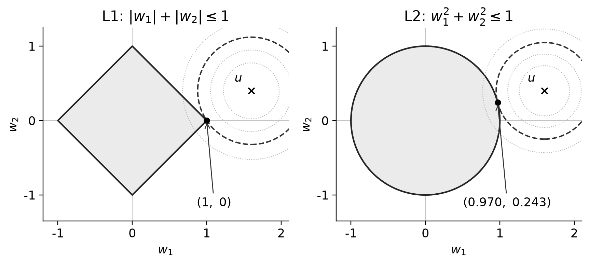

*整理者补充的二维约束示意。横轴为权重$w_1$，纵轴为权重$w_2$；灰色区域是可选参数，叉号$u$是无约束最优点，虚线是首次接触可选范围的损失等高线，实心圆点为约束下的最优点。*

左图在菱形尖角$(1,0)$接触，第二个系数恰好为0。右图离$u$最近的圆上点位于原点指向$u$的方向，把$u$除以自身长度便能缩到半径1：$(1.6,0.4)/\sqrt{1.6^2+0.4^2}\approx(0.970,0.243)$，两个系数都非零。L1的轴上尖角有利于产生零系数；实际哪些系数为0仍取决于数据与惩罚强度。一维代数解释见[MT019](Answers.md#mt019)。

**出处：** 2023A期中 Q6，原卷第3页（5分）

**答案依据：** 2023A期中 Q6 随卷／配套参考答案；条件与解释经复核。

[题目](Questions.md#mt045) · [答案](Answers.md#mt045)

## MT030 · L1/L2回归的益处与措辞边界

**考点：** 回归、特征选择与残差损失

### 中文题意
给线性回归加L1或L2正则，哪些说法成立？多选。

A）两者都能让优化更容易。B）两者都能使矩阵求逆更良态。C）两者都使模型更抗异常值。D）两者可使某些权重接近零，从而选择特征。E）两者都可以为模型增加惩罚、抑制过拟合。

### English answer
The supplied key selects **D and E**. Read D carefully: both can shrink coefficients, but **automatic exact-zero selection is characteristic of L1**, not ordinary ridge. E describes a possible generalization benefit, not a guarantee. L2 can improve a least-squares system's conditioning; L1 is nonsmooth and does not provide the same inverse-matrix argument. Weight regularization alone is not a robust residual loss.

### 中文讲解
L1、L2正则化都在训练损失外增加对**权重**的惩罚。两者的共同作用是限制复杂度，具体优化方式与是否产生零系数却不同。

- **A不选。** L2在某些问题中改善求解稳定性，但L1在0处不可导，不能一概称两者都让优化更容易。
- **B不选。** “良态”是指输入数据略有变化时，求出的系数不会剧烈变化。若一些特征几乎重复，普通最小二乘可能很不稳定。把每条输入排成一行得到数据矩阵$X$；Ridge求解时将$X^TX$换成$X^TX+\alpha I$，其中$I$的主对角线为1、其他位置为0。$\alpha>0$相当于给主对角线加一个正数，可以改善求解稳定性。L1没有同样的矩阵求逆形式，不能把Ridge的理由直接套过去。
- **C不选。** 若数据损失仍是平方误差，一个极端输出值仍能带来很大的损失与梯度。限制权重与采用稳健残差损失是不同操作；绝对损失的作用见[MT025](Answers.md#mt025)。
- **D按原解选，但拆开理解。** 两者都可以缩小系数；L1还能把某些系数直接变为0，自动选掉特征。Ridge通常只是让系数较小，若据此删特征还需要人为阈值等额外规则。
- **E选。** 给权重增加代价，可减少为贴合训练细节而使用复杂参数的倾向，有助于控制过拟合；过强惩罚又可能欠拟合。

**出处：** 2021B*期中 Q4，原卷第2页（5分）

**答案依据：** 2021B*期中 Q4 随卷／配套参考答案；条件与解释经复核。

[题目](Questions.md#mt030) · [答案](Answers.md#mt030)

## MT057 · 同时使用L1与L2：Elastic Net

**考点：** 回归、特征选择与残差损失

### 中文题意
线性回归采用

$$
\min_{w,b}\left\{\alpha\|w\|_1+\beta\|w\|_2^2+
\sum_{i=1}^N[y_i-f(x_i)]^2\right\}.
$$

它有哪些性质？多选。A）对所有权重一视同仁。B）惩罚更侧重压低大权重。C）存在闭式解。D）可同时做特征选择与收缩。E）w各元素总为正。

### English answer
**B and D in the supplied key.** L1 encourages exact zeros; L2 shrinks large weights. General Elastic Net requires numerical optimization, though special cases have explicit solutions. Equal penalty coefficients do not mean equal penalties for different weight magnitudes. Negative weights are allowed.

### 中文讲解
这个目标叫Elastic Net：把L1的稀疏作用和L2的收缩作用放在一起。对单个权重$w_j$，惩罚为$\alpha|w_j|+\beta w_j^2$，通常取$\alpha,\beta\ge0$；讨论两种作用同时存在时，两者应为正。

- **A依原解不选。** “一视同仁”不够精确。各坐标可以用相同的$\alpha,\beta$，但大小不同的权重付出的代价不同；配套答案按后一个意思判断。
- **B正确。** 平方项对大权重增加得更快。例如绝对值从1变2时，L1项翻倍，平方项却变成4倍；L2因此对大系数施加更强收缩。
- **C一般不成立。** 非零L1项在0处有尖点，普通多维问题不能直接使用OLS式的单次矩阵求逆，需要适当迭代算法。特殊一维或正交设计可以有显式解，不应把原解扩成“任何情况都没有解析表达”。
- **D正确。** L1能使一些系数恰好归零，完成特征选择；L2还能缩小保留下来的大系数，二者同时作用。
- **E错误。** 绝对值和平方对正负同等大小的权重给相同惩罚，没有禁止负权重。负系数只是表示该特征增大时预测向下变化，具体取决于编码与其他条件。

特征尺度会改变惩罚的实际效果，通常在训练流程中先做合适标准化。

**出处：** 2023B期中 Q6，原卷第3页（5分）；2025A期中 Q6，原卷第3页（5分）

**答案依据：** 2023B期中Q6随卷答案BD；2025A Q6同题。A、C的文字边界在此说明。

[题目](Questions.md#mt057) · [答案](Answers.md#mt057)

## MT025 · 绝对残差损失对异常值有什么影响？

**考点：** 回归、特征选择与残差损失

### 中文题意
线性回归 $f(x)=w^Tx+b$ 在N条记录上最小化

$$
(\hat w,\hat b)=\arg\min_{w,b}\sum_{i=1}^N|f(x_i)-y_i|.
$$

使用这种损失会怎样影响训练？为什么？

### English answer
Absolute-error loss grows linearly instead of quadratically, so very large output residuals have less relative influence than under least squares. Its residual derivative has constant magnitude away from zero, making it more robust to large y-outliers. This is a change to the data loss, not an L1 penalty on the weights, and it does not imply sparse coefficients.

### 中文讲解
题目只改了**数据损失**，没有加入权重正则。残差$r=f(x)-y$表示预测误差；正负表示高估或低估，绝对值表示错的大小。

用平方损失时，$r=1,10,100$分别贡献1、100、10,000。一个特别离谱的观测可能抵过很多普通样本，逼着回归线向它偏移。改用绝对损失后，三项是1、10、100，极端点仍受罚，但不会以平方速度扩大作用。

从更新方向看更直接。残差不为0时，

$$\frac{d|r|}{dr}=\begin{cases}-1,&r<0,\\1,&r>0.\end{cases}$$

而$r^2$的导数是$2r$。导数是损失随残差变化的局部斜率，斜率越大，一点误差变化带来的损失变化越强。绝对损失不会因为$r$从10变100就把斜率放大十倍，因此对大的输出异常值更稳健。$r=0$处有尖点，可以用次梯度等方法优化。

注意两条边界：损失本身仍随$|r|$增长，不能写成“大误差都罚一样”；这也不保证特征权重为0，因为绝对值没有加在$w$上。若$x$本身很大，参数梯度还含输入因子，对这类高杠杆点的稳健性要另看。

**出处：** 2021A期中 Q12，原卷第4页（10分）

**答案依据：** 2021A期中 Q12 随卷／配套参考答案；条件与解释经复核。

[题目](Questions.md#mt025) · [答案](Answers.md#mt025)

## MT063 · Huber损失：画图并解释好处

**考点：** 回归、特征选择与残差损失

### 中文题意
令残差 $r=y_i-f(x_i)$，线性回归使用

$$
L(r)=\begin{cases}\frac12r^2,&|r|<1,\\|r|-\frac12,&\text{otherwise}.\end{cases}
$$

(a) 画出损失函数。(b) 解释使用Huber损失的一个好处。

### English answer
Draw a parabola between −1 and 1, joined smoothly to straight tails: L(0)=0, L(±1)=1/2 and L(±2)=3/2. Its residual derivative is r inside the interval and sign(r) outside. Thus extreme output residuals have bounded gradient magnitude, reducing their influence relative to squared loss. Unlike pure absolute loss, the curve is differentiable at zero and at the two joining points.

### 中文讲解
先按残差$r=y-f(x)$画损失，不必先想权重。该函数在$|r|<1$时使用半平方误差，两端改为绝对值减0.5。

**(a) 先算关键点再连线。** $L(0)=0$；到$r=\pm1$时，中心公式给$1/2$，外侧公式也给$1-1/2=1/2$，所以两段接得上。到$r=\pm2$时，$L=2-1/2=1.5$。中心画开口向上的抛物线，$-1$左侧及1右侧画直线，不要继续画成抛物线。

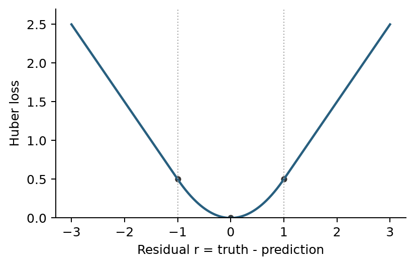

它们的斜率为

$$L'(r)=\begin{cases}-1,&r<-1,\\r,&-1\le r\le1,\\1,&r>1.\end{cases}$$

中心到接点的斜率恰为$\pm1$，与两端直线相同，因此连接处没有折角。0附近也平滑，比纯绝对损失在0处的尖点更容易处理。

**(b) 为什么对大输出异常值更稳健。** 对残差10，半平方损失为50，斜率为10；Huber损失为9.5，斜率只有1。梯度更新根据斜率调整参数，Huber不会让这个极端误差仅因更远就无限增大拉动强度。

说得更具体：因$r=y-w^Tx-b$，对$w$求导得到$-L'(r)x$。Huber限制的是残差方向的$L'(r)$，输入$x$若极大仍会放大参数梯度，因此它主要缓和大输出残差，而不是保证对所有异常点都无影响。

**原题差异 / Source note：** 随卷答案图高度为题干公式的两倍；本图按公式，L(±1)=0.5。 / The supplied plot is scaled by two; this plot follows the formula.

**出处：** 2023B期中 Q12，原卷第9页（10分）

**答案依据：** 2023B期中 Q12 随卷／配套参考答案；条件与解释经复核。

[题目](Questions.md#mt063) · [答案](Answers.md#mt063)

## MT013 · 残差L1＋权重L2，各自在做什么？

**考点：** 回归、特征选择与残差损失

### 中文题意
某回归方法同时最小化残差的L1范数与权重的L2平方：

$$
w^*=\arg\min_w\left\{\sum_{i=1}^N|w^Tx_i-y_i|+\lambda\|w\|_2^2\right\}.
$$

预期它有什么性质？解释原因。

### English answer
Absolute residual loss grows linearly, so large output errors have less influence than under squared loss. L2 regularization discourages large coefficients and can stabilize fitting. It normally shrinks weights rather than producing the exact sparsity associated with L1 weight penalties. The loss is convex but nonsmooth at zero residual; suitable regularization can improve generalization, without guaranteeing it.

### 中文讲解
这个目标同时出现L1和L2，但它们作用的对象不同。预测值$w^Tx_i=\sum_jw_jx_{ij}$把各项输入乘上对应权重后相加。残差$r_i=w^Tx_i-y_i$就是预测值减真实值；$|r_i|$衡量预测错了多少，$\|w\|_2^2=\sum_jw_j^2$衡量权重整体有多大。$\arg\min_w$表示“找出使括号内总量最小的那组权重”，通常取$\lambda\ge0$。

**残差使用绝对损失，减轻极端输出误差的影响。** 误差从10变成20，绝对损失从10变20，平方损失却从100变400。平方损失会越来越强地要求模型照顾这个极端点；绝对损失在正负两侧的斜率大小都是1，随误差增加不继续放大。

这里“影响较小”不是“大误差与小误差罚得一样”。残差20仍比残差10有更大绝对损失，只是其增长速度不再随残差增加。对输出$y$异常通常更稳健；若输入$x$本身极大，参数梯度还会乘上$x$，所以不是对所有异常输入都免疫。

**权重使用L2，限制过大的系数。** $\lambda$越大，模型越不愿为降低训练误差而使用大权重，有助于稳定拟合。惩罚过强也可能欠拟合，强度仍需验证。

LASSO对**权重**取绝对值以鼓励精确零系数；本题绝对值在**残差**上，权重惩罚为平方，所以通常只有收缩作用，不自动得到稀疏特征选择。在$\lambda\ge0$时目标是凸的，即局部最小值也是全局最小值；但残差为0处有尖点，不能处处直接用普通导数。

**出处：** 2020B期中Quiz Q13，原卷第6页（10分）

**答案依据：** 2020B期中 Q13 随卷／配套参考答案；条件与解释经复核。

[题目](Questions.md#mt013) · [答案](Answers.md#mt013)

## MT050 · 缺车比车多更糟：设计非对称损失

**考点：** 回归、特征选择与残差损失

### 中文题意
预测某共享单车站每天借车量，用于调度。公司认为多放一些车可以接受，但缺车会流失顾客。给定N条特征/借车量记录，线性模型 $f(x)=w^Tx+b$ 通过最小化损失和训练。设计符合要求的损失，画图并解释。

### English answer
Define r=f(x)−y. Use L(r)=c₋r² for r<0 and L(r)=c₊r² otherwise, with c₋>c₊>0. Draw two parabolic halves meeting at zero, the negative-residual side steeper. Equal-sized shortages then cost more than surpluses.

### 中文讲解
预测值$f(x)$用于准备单车，真实借车量为$y$。先固定残差方向$r=f(x)-y$：$r<0$表示准备少了、会缺车；$r>0$表示多备了车。公司更怕缺车，因此**相同误差大小下，负残差应付出更高代价**。

可设计非对称平方损失。为避免与线性模型的偏置$b$混淆，把两侧损失系数称为$c_-$和$c_+$：

$$L(r)=\begin{cases}c_-r^2,&r<0,\\c_+r^2,&r\ge0,\end{cases}
\qquad c_->c_+>0.$$

取教学参数$c_-=4,c_+=1$。少准备1辆，$r=-1$，损失为4；多准备1辆，$r=1$，损失为1。少2辆损失16，多2辆损失4。因此模型宁可容忍一些多备车，也会更努力避免同等大小的缺车。

画图时横轴标$r=\text{预测}-\text{真实}$，纵轴标$L(r)$。两半抛物线都在$(0,0)$接上，左半边更陡，右半边较缓；$(-1,4)$与$(1,1)$是方便定位的点。两侧在0处斜率均为0，接点连续且光滑。

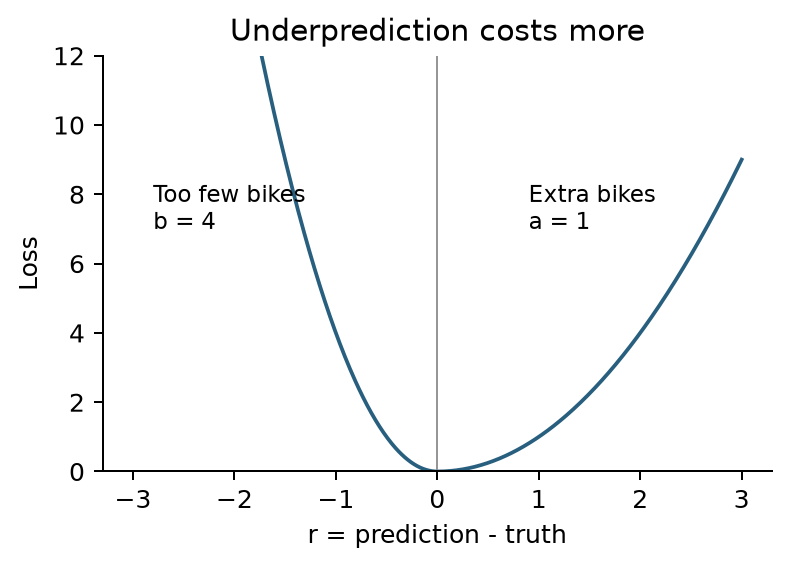

最后把每条记录的损失加起来训练：$\min_{w,b}\sum_iL(w^Tx_i+b-y_i)$。不对称代价改变了最优预测的取舍，但不保证每天绝不缺车。也可以设计非对称绝对损失，只要残差方向、贵的一侧及图形一致。

**出处：** 2023A期中 Q12，原卷第9页（10分）；2025A期中 Q12，原卷第9页（10分）

**答案依据：** 2023A期中Q12随卷方案；2025A Q12复用情境与要求。图中原系数a=1、b=4对应解析中的$c_+=1,c_-=4$，是教学作图参数。

[题目](Questions.md#mt050) · [答案](Answers.md#mt050)

## MT037 · 线性回归为何与均值预测器表现相近？

**考点：** 回归、特征选择与残差损失

### 中文题意
用天气、时段、日期等特征预测香港每小时出租车使用量。线性回归在验证集上的MSE与“永远输出训练集平均值”的基线相近。提出两个改进建议，并解释原因。

### English answer
Two useful directions are (1) add informative features or interactions, such as time-of-day effects interacting with weather, and (2) use a nonlinear representation/model if the relationship is not linear. Compare by validation or training-only CV. Also check excessive regularization, data alignment and optimization. The validation result alone does not prove the training least-squares solution is wrong.

### 中文讲解
均方误差（mean squared error，MSE）把每条预测误差平方后再取平均。对$N$条验证记录，$\mathrm{MSE}=\frac1N\sum_i[f(x_i)-y_i]^2$；同一批记录上，数值越小表示平均平方误差越小。

均值基线忽略所有输入，无论晴天雨天、早晨晚上，都预测训练集的平均出租车使用量。线性模型在验证集上与它的MSE差不多，说明当前模型还没有把输入中的信息转成可推广的预测收益。

**建议一：补充或改善有用特征。** 使用量可能与节假日、公共交通状态有关；还可能是“雨天并且下班高峰”才特别高。可以加入有依据的额外特征或交互项，例如雨天指标乘晚高峰指标，让模型区分只下雨、只晚高峰与两者同时发生。

**建议二：允许非线性关系。** 若直接把小时数字当一维线性输入，模型只会认为时间每增加一小时，需求固定增加或减少。实际需求可能早晚有两个高峰；可用适当的时间编码、非线性特征，或树等非线性模型表达这种形状。然后在相同验证划分上比较MSE。

还应检查特征与目标是否按小时正确对齐、正则是否过强及优化是否成功。题目只给验证结果，不能直接推断训练代码算错。

选读：含截距的无正则OLS在**同一个训练集**上最优时，不会比均值基线的平方误差更大，因为$w=0,b=\bar y$本来就是它可选的一组参数；找到最优解至少不差于这一组。验证集是新数据，没有这个保证，所以题目现象并不矛盾。

**出处：** 2021B*期中 Q11，原卷第4页（10分）

**答案依据：** 2021B*期中 Q11 随卷／配套参考答案；条件与解释经复核。

[题目](Questions.md#mt037) · [答案](Answers.md#mt037)

## MT006 · Bagging与Boosting的基本区别

**考点：** 集成学习

### 中文题意
关于bagging和boosting，哪些说法正确？多选。

A）二者都是集成方法。B）bagging是迭代建分类器，boosting的作用是让分类器更快。C）二者只能使用树或树桩。D）二者都会因为增加太多分类器而过拟合。E）二者可以组合。

### English answer
**A and E.** Bagging aggregates learners fitted to resampled data; boosting builds learners sequentially to address the current ensemble's errors or weighted loss. Neither is restricted in principle to trees. More learners do not universally cause overfitting, and boosting does not mean computational acceleration.

### 中文讲解
集成学习（ensemble learning）用多个模型共同作决定。分类可以投票，回归可以平均；单个参与的模型叫基学习器。Bagging与boosting的区别主要在于这些模型怎样训练。

**Bagging让多个模型分别学习。** 从训练数据有放回地抽样，每次得到稍有不同的数据集，再各自训练模型。某些原记录会重复出现，某些不会被抽到。最后把预测汇总，用平均减弱单个模型随样本变化的波动。

**Boosting让后续模型针对当前组合的不足继续学习。** 例如AdaBoost提高难分样本的相对权重，使下一轮更关注它们。下一轮训练因此依赖前面结果，模型贡献也常带不同权重。

- **A正确。** 两者都把多个学习器组合起来。
- **B错误。** Bagging的各模型可以独立训练；boosting中的“boost”指增强组合能力，不是保证计算加速。
- **C错误。** 树很常见，但集成方式与基模型种类是两个层面，并非原则上只能使用树或树桩。
- **D错误。** 更多模型不必然过拟合。Bagging增加模型常使平均更稳定；boosting的表现则与噪声、轮数、学习率等有关，不能给两者同一必然结论。
- **E正确。** 可以对多个boosted模型再做bagging等组合，只是实际成本与收益仍需验证。

**出处：** 2020B期中Quiz Q6，原卷第3页（5分）

**答案依据：** 2020B期中 Q6 随卷／配套参考答案；条件与解释经复核。

[题目](Questions.md#mt006) · [答案](Answers.md#mt006)

## MT044 · 随机森林与Boosting的用途

**考点：** 集成学习

### 中文题意
关于随机森林与boosting，哪些说法正确？多选。

A）随机森林的单棵树基于部分特征建立。B）随机森林有学习率超参数。C）两者都可用于回归。D）RF只用于回归，gradient boosting只用于分类。E）以上均不对。

### English answer
The course key selects **A and C**. Random forests use randomized feature candidates in their usual construction, and both ensemble families support regression as well as classification. Ordinary random forests do not use the boosting learning-rate parameter. A should not be read as requiring one permanently fixed feature subset for every split of a tree; feature sampling is commonly performed at each node.

### 中文讲解
随机森林训练许多有随机差异的树，再汇总预测。树之间的差异既来自抽样记录，也常来自每个节点只从部分候选特征中找切分点。

- **A按课堂含义正确。** 随机抽取候选特征能让各树不总依赖同一强特征，降低它们犯错的相关性。常见算法是在每个节点重新抽取，不一定给整棵树永久固定一组特征；原选项是简写。
- **B错误。** 普通RF把各树预测平均或投票，没有boosting那种控制每轮新增模型贡献的学习率。树数、深度、候选特征数等才是常见RF超参数。
- **C正确。** 分类树输出类别或概率，回归树输出数值，两类任务都可以构成森林；boosting也能针对分类或回归的损失训练。
- **D错误。** 它把两个方法家族限制到单一任务，和C的事实相反。
- **E错误。** A与C已成立。

**出处：** 2023A期中 Q5，原卷第3页（5分）；2025A期中 Q5，原卷第3页（5分）

**答案依据：** 2023A期中Q5随卷答案AC；2025A Q5同题。

[题目](Questions.md#mt044) · [答案](Answers.md#mt044)

## MT062 · 随机森林：树多了为什么仍有共同误差？

**考点：** 集成学习

### 中文题意
随机森林F由n棵树组成。每棵树误差方差为σ²，任意两棵不同树的误差相关系数均为ρ。题目给出

$$
\operatorname{Var}(F)=\frac{\sigma^2}{n}
+\frac{n-1}{n}\rho\sigma^2.
$$

(a) 树数与相关性怎样影响减少过拟合的能力？(b) 固定n时，有哪些具体降低误差方差的方法？

### English answer
Rewrite the variance as σ²[ρ+(1−ρ)/n]. More trees reduce the averaging term, but fixed positive correlation leaves the floor ρσ². At fixed n, diversify trees using bootstrap samples and randomized feature candidates while retaining predictive strength. Lower variance alone does not guarantee lower total test error.

### 中文讲解
方差衡量预测误差随训练随机性怎样波动；相关系数$\rho$衡量两棵树是否倾向一起偏高或一起偏低。树若总以相同方向犯错，平均以后这部分错误仍会留下。

先把题给公式整理成

$$\operatorname{Var}(F)=\sigma^2\left[\rho+\frac{1-\rho}{n}\right].$$

**(a) 增加树数消掉哪一部分？** 固定单树方差与相关性时，$(1-\rho)/n$随$n$增加而减小，但$\rho$不变。若$\rho=0$，方差按$1/n$下降；若$\rho=1$，所有树完全一起波动，平均再多也还是$\sigma^2$。对固定正$\rho$，很多树时的极限为$\rho\sigma^2$。

补充数字：$\sigma^2=1,\rho=0.2$，5棵树的方差为$0.2+0.8/5=0.36$；20棵为$0.24$；继续增加时趋于0.2。树数越多，后续新增的收益往往越小。

**(b) 固定树数怎样改进？** 不同bootstrap样本让树看到不同的训练组合；每个节点随机抽候选特征，避免所有树总在同一特征上切分。这些措施主要降低树之间的误差相关性。也可通过适当控制树深等改变单树波动，但随机化或简化过头会损害单树预测能力，需要一并验证。

选读：设各树误差为$E_i$，平均误差为$\frac1n\sum_iE_i$。展开方差时有$n$个自身方差$\sigma^2$，还有$n(n-1)$个有序协方差$\rho\sigma^2$，总和除以$n^2$就得到题式。该公式只描述方差，没有证明偏差、观测噪声或全部测试错误会降到0。

**出处：** 2023B期中 Q11，原卷第8页（10分）

**答案依据：** 2023B期中 Q11 随卷／配套参考答案；条件与解释经复核。

[题目](Questions.md#mt062) · [答案](Answers.md#mt062)

## MT056 · 集成方法：树深、并行与后续轮次

**考点：** 集成学习

### 中文题意
关于集成方法，哪些说法正确？多选。

A）AdaBoost用更少的深树一定优于更多树桩。B）LR计算便宜，所以是bagging的好选择。C）随机森林训练和预测都可以并行。D）AdaBoost中某点一旦被一轮分对，后续轮次就忽略它。E）增加RF树数通常有助于减少过拟合。

### English answer
The supplied key selects **C and E**. Trees can be fitted and evaluated independently before aggregation. Averaging more randomized trees reduces finite-ensemble variance toward a correlation-dependent limit. There is no universal superiority in A; bagging benefits most from unstable/high-variance learners, so low cost alone does not establish B. Correctly classified AdaBoost samples may receive lower relative weight but are not permanently removed.

### 中文讲解
- **A错误。** 深树单个模型更复杂，少量深树与大量树桩的组合能力、过拟合风险和成本不同；不能只按深度和数量断言前者一定更好。
- **B错误。** Bagging靠多个模型之间的差异来降低波动。普通LR通常比深树稳定，换一批重采样数据后模型变化可能较小；计算便宜本身不足以证明它是很有效的bagging基学习器。
- **C正确。** 各RF树可在自己的抽样数据上独立训练；预测时也可独立算结果，再投票或平均。因此两个阶段都能并行。
- **D错误。** AdaBoost某轮把样本分对后，通常会降低它的相对权重，但权重仍大于0，下一轮仍参与训练。以后若它又被分错，权重还可能重新升高，所以“一次分对就永久忽略”不成立。
- **E按原解正确。** 更多随机树使有限次平均更稳定，能降低集成的方差；但有共同错误的树无法靠数量完全相互抵消，也不保证每加一棵测试误差都单调下降。

增加树数受到的相关性限制，见[MT062](Answers.md#mt062)的公式。

**出处：** 2023B期中 Q5，原卷第3页（5分）

**答案依据：** 2023B期中 Q5 随卷／配套参考答案；条件与解释经复核。

[题目](Questions.md#mt056) · [答案](Answers.md#mt056)

## MT038 · 100核部署：RF与AdaBoost如何并行预测？

**考点：** 集成学习

### 中文题意
雷达目标分类中，RF与AdaBoost准确率相同、总计算量相同。RF有10棵深度10的树，AdaBoost有100个弱学习器；部署芯片有100个核心。推荐哪种？解释理由。

### English answer
The intended choice is **AdaBoost**, assuming its 100 weak learners are shallow and can run independently at prediction time. They can occupy the 100 cores, whereas the 10 RF trees each retain a depth-10 serial path. Under an idealized one-comparison weak-learner model this gives lower latency. Both ensembles can parallelize inference; AdaBoost's sequential training does not forbid parallel prediction. Exact speed depends on learner complexity, scheduling and aggregation overhead.

### 中文讲解
题目给定两者准确率和总计算量相同，比较的是100核芯片上一次**预测的等待时间**。总工作量相同，不代表能够并行完成的程度相同。

RF有10棵深度10的树。不同树可以同时预测，但单棵树必须先判断根节点，才能知道下一步访问哪个分支；同一路径上的约10次判断前后相依。简单地“一棵树一个核心”时，只有10个主要并行任务。

若AdaBoost的100个弱学习器都很浅，例如每个只是一个树桩，那么训练完成后，它们对同一输入的预测可同时放到100个核心上。最后把100个结果加权求和，再输出类别。弱学习器的**训练**需要前一轮的样本权重，但这不要求它们的**预测**依次执行。

理想化地，若一个树桩一次判断，RF路径需10次，每次耗时相同且忽略汇总与调度，AdaBoost的主体预测可比RF快约10倍。这是说明并行度的算例，不是由算法名称保证的真实倍率。

因此按原题意选择AdaBoost，同时交代“弱学习器浅、能够并行、汇总开销较小”的假设。如果100个弱学习器很复杂，或核心通信开销大，仅给数量就不足以推出相同优势。

**出处：** 2021B*期中 Q12，原卷第4页（10分）

**答案依据：** 2021B*期中 Q12 随卷／配套参考答案；条件与解释经复核。

[题目](Questions.md#mt038) · [答案](Answers.md#mt038)

## MT049 · 在线更新AdaBoost：速度与异常值

**考点：** 集成学习

### 中文题意
自动驾驶系统用AdaBoost实时决策，运行期间还要用新采集数据更新模型，因此希望快速收敛。(a) 怎样调整模型或超参数？(b) AdaBoost是否适合这种情境？解释。

### English answer
(a) Limit the number and complexity of weak learners, and tune the learning rate to meet a validated latency/accuracy budget. A larger rate may need fewer rounds, but can destabilize learning or worsen noise sensitivity.
(b) Conventional batch AdaBoost is not automatically an online-learning algorithm. Its exponential loss can emphasize difficult/noisy points; appending learners indefinitely also increases prediction cost. A bounded model, scheduled retraining or a method designed for streaming updates may be preferable.

### 中文讲解
题目同时提出“预测要及时”和“新增数据后还要更新”。第一件事关乎模型执行成本，第二件事关乎训练机制，应该分别回答。

**(a) 控制每轮成本与总轮数。** 减少弱学习器数量、限制它们的复杂度，可以减少训练与预测工作。学习率控制新学习器加入组合的力度，适当增大可能用较少轮数取得效果，但步子过大也会使训练不稳定或过度追逐噪声。因此选择要落到验证数据上的精度、时延与模型大小，不能只把学习率无限调大。

**(b) 常规批量AdaBoost不自动适合持续在线更新。** 第$t$轮训练使用前面结果得到的样本权重。新数据到来后，怎样与旧权重结合、是否重训已有学习器，都需要额外设计；“每次追加一个学习器”并不是无成本的更新方案，追加过多还会使预测越来越慢。

AdaBoost的指数损失是$e^{-yf(x)}$。某点严重错分时，$yf(x)$很负，损失与梯度会很大，模型会努力纠正它；若该点其实是传感噪声或错误标签，这种机制就可能浪费拟合能力。损失图的解释见[MT065](Answers.md#mt065)。

因此可建议限制模型大小、定期用经过检查的数据重训，或选择专门支持流式更新的方法。这里评价的是题述批量方案；训练好的AdaBoost仍可以并行预测，也不能据此断言所有在线AdaBoost变体都不可行。

**出处：** 2023A期中 Q11，原卷第8页（10分）

**答案依据：** 2023A期中 Q11 随卷／配套参考答案；条件与解释经复核。

[题目](Questions.md#mt049) · [答案](Answers.md#mt049)

## MT064 · 综合题：Bagging/Boosting与Huber

**考点：** 集成学习

### 中文题意
(a) [5分] 解释boosting与bagging的联系和区别。

(b) [5分] 线性回归使用Huber损失：当 $|y_i-f(x_i)|<1$ 时为 $\frac12[y_i-f(x_i)]^2$，否则为 $|y_i-f(x_i)|-\frac12$。画图，判断是否对异常值稳健并说明理由。

### English answer
(a) Both combine learners. Bagging fits resampled learners independently; boosting trains sequentially using the current ensemble’s errors or weighted loss.

(b) Huber is quadratic inside |r|<1 and linear outside. Join smoothly at (±1,1/2), with tail slopes ±1. Bounded residual gradients reduce sensitivity to large output errors.

### 中文讲解
**(a) 联系是组合多个学习器，区别是训练怎样组织。** Bagging对训练记录重采样，各基模型分别训练，最后投票或平均。Boosting根据当前组合没处理好的部分训练下一轮，例如提高难分样本权重，再把新模型加入组合。因此bagging各模型训练可独立进行，boosting训练具有前后依赖。

这个区别不延伸成“boosting预测也只能串行”。模型一旦训练好，各弱学习器对新输入的输出仍可分别计算，最后加权汇总。两者都不保证永远比另一种更快或更准。

**(b) 按分段公式画Huber图。** 横轴是$r=y-f(x)$。在$-1<r<1$画$L=r^2/2$的抛物线，经过$(0,0)$；在两端改画直线$L=|r|-1/2$。接点为$(-1,0.5)$、$(1,0.5)$，到$\pm2$时高度为1.5，两段斜率在接点相接。

它对大的输出异常值比平方损失稳健。半平方损失的斜率是$r$，误差越大，对拟合的拉动越强；Huber两端斜率大小固定为1。补充例子：$r=10$时，半平方损失的斜率为10，Huber只有1。

“损失没有上界，所以不稳健”这个判断不对。Huber的损失值仍会增长，但增长斜率受限；这里控制的是极端残差的影响，不要求损失有上界。完整分段导数及输入异常的条件见[MT063](Answers.md#mt063)。

**出处：** 2025A期中 Q7，原卷第4页（10分）

**答案依据：** 2025A期中 Q7 印刷题干；本题解为我们的推导，不采用扫描件的学生作答。

[题目](Questions.md#mt064) · [答案](Answers.md#mt064)

## MT008 · 平方形分类损失为什么惩罚“太正确”？

**考点：** 分类损失图与错误代价

### 中文题意
观察题图中的分类损失。描述使用这种损失训练的分类器会有什么性质，并解释原因。你认为它是好的还是不好的分类损失？图中横轴为 $z_i=y_i f(x_i)$。

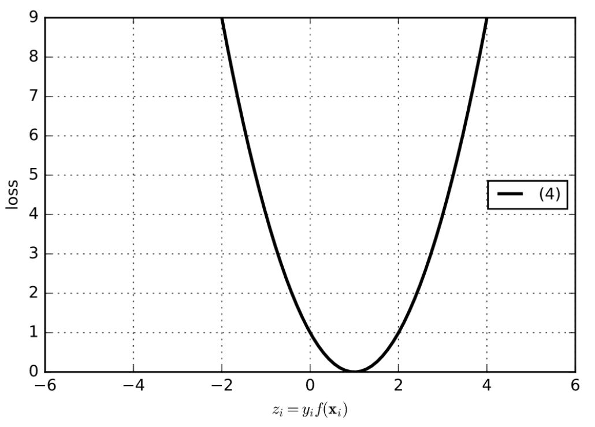

### English answer
The squared-shaped loss targets z=1. Large tail gradients make it sensitive to extreme errors, while scores above 1 penalize confidently correct examples unnecessarily. Both effects can make fitting less robust, especially with noisy labels.

### 中文讲解
先读横轴$z=yf(x)$。标签$y$取$-1$或$+1$：分数与标签同号时$z>0$，分类正确；异号时$z<0$，分类错误。$z$还表示朝正确方向走了多远，而不只是对错。

图像是一条最低点在$z=1$的平方形曲线，可用$(z-1)^2$理解。它会把每个训练点的有符号分数往1拉。

**左侧：错得很远的点受很大惩罚。** 以教学公式$(z-1)^2$算，$z=-1$的损失是4，$z=-4$时为25；斜率$2(z-1)$的大小也从4增加到10。极端错分样本会强烈拉动模型，若它是噪声或错误标签，就可能影响整体拟合。

**右侧：已经很有把握的正确点仍被罚。** $z=1$损失0，但$z=4$损失又成9。模型需要把这个正确分数拉低到1。这与hinge在$z\ge1$时不再处罚不同：对分类任务来说，已经正确且留有间隔的点未必需要继续调整。

原解据此评价它不理想；实际准确率还取决于数据与模型。

**出处：** 2020B期中Quiz Q8，原卷第4页（10分）

**答案依据：** 2020B期中 Q8 随卷／配套参考答案；条件与解释经复核。

[题目](Questions.md#mt008) · [答案](Answers.md#mt008)

## MT026 · V形损失：最优点为何在z=1？

**考点：** 分类损失图与错误代价

### 中文题意
读题图中的分类损失，描述所得分类器的性质。它是好的分类器吗？说明理由。横轴 $z=yf(x)$，图中两侧均为直线，在z=1处达到最小值。

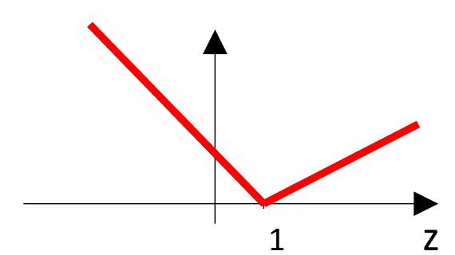

### English answer
The loss is minimized at z=1 and grows linearly on both sides. It corrects wrong or small-margin predictions with bounded tail slopes, but also penalizes confidently correct scores above 1. The latter is unnecessary for margin classification; it does not prove universally poor accuracy.

### 中文讲解
横轴$z=yf(x)$是有符号分数，$z<0$分错、$z>0$分对。本图最低点在1，两侧是直线，形成V形；图中左右斜率可以不同，不能未经题设就把它们设成相同数值。

当$z<1$，把分数往右移动会降低损失，所以模型会纠正错分点，也会推动间隔不足的正确点。由于这侧是直线，错分从很远变成更远时，斜率大小不继续增长；比起平方形损失，它不会仅因负间隔的绝对值更大，就给出越来越强的更新信号。

当$z>1$，曲线又往上走。$z=1$时损失最低，向右越走损失越大；虽然这些点已经明确分对，模型仍会把它们往1拉。它追求的是分数接近固定目标1，而非只要求分类正确且间隔足够。

所以要分别评价两侧：左边线性增长缓和了极端错分影响，右边却继续惩罚容易的正确样本。原解认为后一种压力对间隔分类不理想。与[MT008](Answers.md#mt008)相比，两题都偏好$z=1$，但本题两侧斜率有界，不能照搬“平方增长导致极端梯度”的解释。实际准确率仍需根据数据与模型验证。

**出处：** 2021A期中 Q13，原卷第4页（10分）

**答案依据：** 2021A期中 Q13 随卷／配套参考答案；条件与解释经复核。

[题目](Questions.md#mt026) · [答案](Answers.md#mt026)

## MT051 · 负间隔也零损失：分类器会放过什么？

**考点：** 分类损失图与错误代价

### 中文题意
描述题图所示分类损失训练出的分类器性质，判断它是否合适并说明理由。再画一幅采用此损失的线性分类器例子。横轴 $z=yf(x)$；曲线在z=−1处降至0，之后为0。

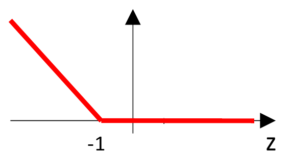

### English answer
A representative function with this shape is $L(z)=\max(0,-1-z)$; the vertical scale is not specified. Every −1≤z<0 example is misclassified but has zero loss, so minimizing this objective need not correct it. It is therefore unsuitable as a sole objective for enforcing correct classification.

For an explicit example use f(x)=0.1x+0.5 with (x,y)=(-1,-1) and (1,+1). The signed scores are −0.4 and 0.6; both losses are zero, but the negative example is classified positive. Draw the boundary x=−5 and the two points to its right, with opposite true labels.

### 中文讲解
图中损失在$z=-1$就降到0。纵轴没有数值刻度；取左侧斜率为$-1$，可用$L(z)=\max(0,-1-z)$代表这种形状，乘上任意正常数都不改变零损失区。而二分类正确至少需要$z=yf(x)>0$，因此$-1\le z<0$这一段明明分错，却也被目标当成零损失。

这不是仅仅把hinge曲线左右挪一点的无害改动，它改变了“什么算已经够好”。梯度法遇到零损失区没有数据损失的推动，可能就放过这些错分点；甚至令所有分数$f(x)=0$，数据损失也全为0，却没有产生有效分类。

按题目要求画一个明确反例。取两个一维输入：$x=-1$标签$y=-1$，$x=1$标签$y=+1$；选线性分数$f(x)=0.1x+0.5$。逐点计算：

| 输入与标签 | 分数$f(x)$ | 有符号分数$yf(x)$ | 预测 | 该损失 |
|---|---:|---:|---|---:|
| $x=-1,y=-1$ | 0.4 | $-0.4$ | 正类，错误 | 0 |
| $x=1,y=+1$ | 0.6 | 0.6 | 正类，正确 | 0 |

边界满足$0.1x+0.5=0$，即$x=-5$。画数轴，在$-5$标边界，把两个点放在它右侧；右侧全判正，真实负点却没有损失。这个具体图例足以证明该目标不能独自保证学出正确分类器，即使函数是凸的，也没有修复其目标错位。

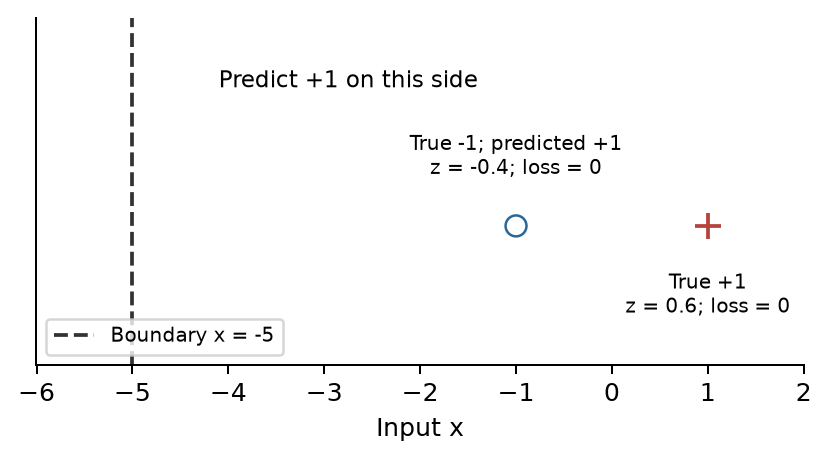

**出处：** 2023A期中 Q13，原卷第10页（10分）

**答案依据：** 2023A期中 Q13 随卷／配套参考答案；条件与解释经复核。

[题目](Questions.md#mt051) · [答案](Answers.md#mt051)

## MT039 · 饱和的非凸分类损失

**考点：** 分类损失图与错误代价

### 中文题意
描述题图所示损失训练出来的分类器会有哪些性质。横轴 $z=yf(x)$；z≥1后损失为0，向很负的z方向，曲线逐渐变平。

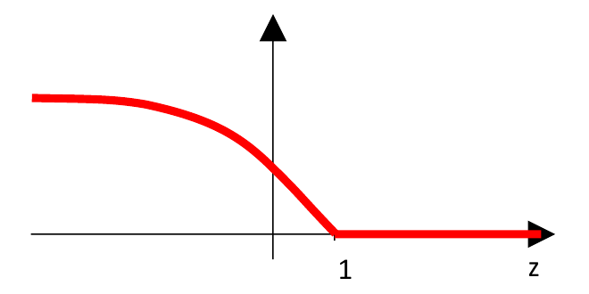

### English answer
The loss is zero for z≥1 and saturates at a high level for very negative z. Its left-tail slope approaches zero, limiting extreme points’ gradient influence but potentially leaving wrong predictions unrecovered. The shape is nonconvex, making optimization harder. The decreasing quantity is slope magnitude, not the loss value.

### 中文讲解
仍以$z=yf(x)$为横轴。负值分错，正值分对；损失曲线的高度表示当前付出多少代价，斜率表示把分数挪一点能改变多少代价。两者要分开看。

**右边$z\ge1$时损失为0。** 分对且达到足够间隔的样本不再推动数据损失下降，这与hinge的右侧相似。模型能把注意力放到还没有满足间隔的点上。

**最左边是一个较高但逐渐变平的平台。** 极端错分点仍有损失，绝不是越错损失越接近0。但局部斜率趋近0，继续改变它的分数只能带来很小的损失变化。因此梯度法从它收到的更新信号很弱。

这有两面作用：若极端点是异常值，弱化影响可避免模型为它牺牲很多正常点；若它是有用但目前分错的样本，过小的梯度也可能让模型难以把它救回来。不能只写“稳健”而忽略训练困难。

图形还是非凸的：凸函数的斜率从左往右不能变小，而本图从左端近乎水平，逐渐变为更陡的下降段，斜率由接近0变得更负。因此不能直接使用凸SVM“局部最优即全局最优”的结论。原解中“远端错分的处罚下降”应准确读成“梯度影响下降”，平台高度并没有降到0。

**出处：** 2021B*期中 Q13，原卷第4页（10分）

**答案依据：** 2021B*期中 Q13 随卷／配套参考答案；条件与解释经复核。

[题目](Questions.md#mt039) · [答案](Answers.md#mt039)

## MT065 · 比较Logistic、Hinge和Exponential损失

**考点：** 分类损失图与错误代价

### 中文题意
Logistic Regression、SVM和AdaBoost都是常见分类器。

1. [6分] LR与SVM的优化目标主要有什么区别？
2. [4分] 根据题图，将三种算法对异常点的敏感程度从高到低排序，并解释。图中横轴为有符号分数z，负值表示错分，正值表示分对。

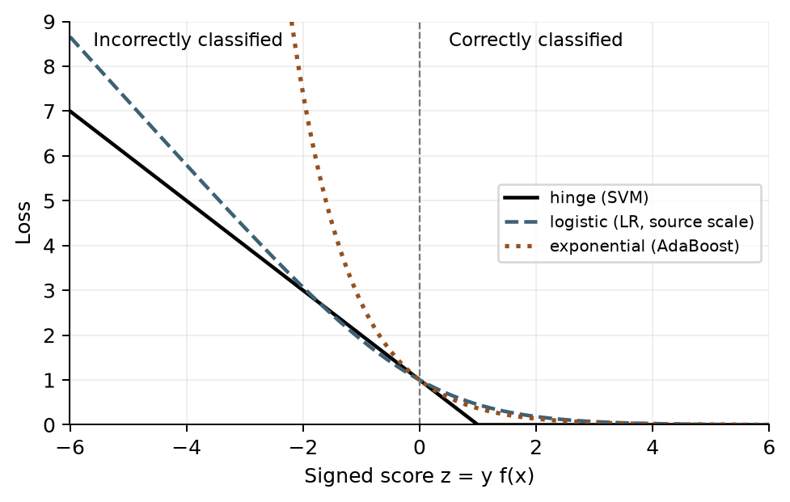

*按原卷曲线重绘并去掉手写批注；保留原图中LR的相对缩放，比较以题图为准。 / Clean redraw preserving the displayed relative scaling.*

### English answer
1. Logistic regression minimizes conditional log-loss, log(1+exp(−z)), usually with regularization. A soft-margin SVM minimizes a weight-norm penalty plus hinge loss max(0,1−z), balancing margin and violations.
2. **For the far-negative-margin region in the supplied figure: AdaBoost > LR > SVM.** Exponential loss has the steepest tail, so extreme misclassifications exert the strongest gradient influence. The plotted LR tail is steeper than the hinge tail. This comparison depends on the figure’s loss scaling; it is not a universal ranking of the algorithms.

### 中文讲解
**第一问比较训练目标。** 对$y=\pm1$，设$z=yf(x)$。LR通过$\log(1+e^{-z})$让真实标签的概率更高，通常再加权重正则。软间隔SVM使用$\max(0,1-z)$加权重范数惩罚，权衡间隔与违例。LR在有限正分数处仍有小损失；hinge在$z\ge1$后恰为0。两者都可以搭配特征变换，不能回答成“一个只能线性、另一个非线性”。

**第二问先找到图中的异常错分区域。** 横轴远左侧$z\ll0$代表模型很有把握地判错。若这类点是噪声，损失曲线越陡，它要求参数改变的力量通常越大。AdaBoost的指数曲线在左侧增长最快，影响最强。

根据本题给出的图，左侧陡峭程度依次是**AdaBoost、LR、SVM**，所以按图作答为这一排序。解释要落在曲线尾部增长，而非凭算法名称背排名。

**这里必须看清LR曲线的尺度。** 原图LR在$z=0$附近约为1，符合$\log_2(1+e^{-z})$或等价缩放。换底公式$\log_2 a=\ln a/\ln2$说明，这相当于把自然log损失整体乘上$1/\ln2$，曲线高度和斜率也都乘同一个数。

这些斜率可以直接复算。导数表示曲线在当前位置的斜率；这里用到$\frac{d}{du}\ln u=1/u$及$\frac{d}{du}e^u=e^u$，复合函数还要乘内层的导数。指数损失为$e^{-z}$，内层$-z$的导数为$-1$，所以

$$L'_{\mathrm{exp}}(z)=-e^{-z}.$$

图示LR损失为$\ln(1+e^{-z})/\ln2$。先对log里面的整体求导，再乘$1+e^{-z}$的导数：

$$L'_{\mathrm{LR,2}}(z)
=\frac1{\ln2}\frac{-e^{-z}}{1+e^{-z}}
=-\frac1{(1+e^z)\ln2}.$$

Hinge在$z<1$时就是直线$1-z$，斜率为$-1$；在$z>1$时恒为0，斜率也为0。接点$z=1$有折角，不能用单个普通导数表示。这里比较的是远左侧，取斜率绝对值衡量曲线有多陡。

补充代入$z=-4$：指数为$e^4\approx54.60$；图示LR为$1/[(1+e^{-4})\ln2]\approx1.417$；hinge为1，符合题图排序。当$z$继续变得很负，$e^z$趋近0，图示LR的斜率绝对值趋近$1/\ln2\approx1.443$。若改用自然log损失，就去掉了$1/\ln2$这个倍数，LR在0处的高度变为$\ln2\approx0.693$，远负区的斜率绝对值趋近1；原图中LR比hinge更陡的严格比较不能直接沿用。

改变损失缩放还会改变它与正则项的相对强度，此题结论限于给定图形。链式求导的完整拆解见[MT067](Answers.md#mt067)。

**出处：** 2025A期中 Q9，原卷第6页（10分）

**答案依据：** 2025A期中Q9；同题Mock Exam Q9的清晰题图与参考答案（PDF第5页，印刷页6）。缩放解释为补充推导。 / Sources: printed exam question and matching mock question/key; scaling analysis is supplementary.

[题目](Questions.md#mt065) · [答案](Answers.md#mt065)

## MT007 · 筛查任务：漏诊比误报更贵

**考点：** 分类损失图与错误代价

### 中文题意
设计癌症早期筛查二分类器。输入是特征向量，输出阳性或阴性；阳性者还会做更昂贵的确诊检查。目标是将所有癌症患者判为阳性，不漏掉病例，允许部分健康者被误报。讨论两种达到这种偏好的方法。

### English answer
1. Give positive/cancer cases or false-negative errors a larger training cost, so missing a positive is penalized more.
2. Lower the threshold for predicting the positive class. If positive is predicted when f(x)>t, lower t; for a calibrated positive-class probability, lower the probability threshold below the usual 0.5 as appropriate.

Choose the threshold on validation data using sensitivity and false-positive cost. These choices favour recall but cannot guarantee zero false negatives on unseen patients.

### 中文讲解
把“阳性”定义为需要进一步确诊检查。漏掉患者叫假阴性（false negative，FN），把健康者送去进一步检查叫假阳性（false positive，FP）。本题允许一些FP来减少更昂贵的FN，因此不能只追求两种错误加起来最少。

**方法一在训练时改代价。** 提高阳性样本的权重，或专门提高假阴性的损失。这样漏掉一位患者对目标函数的影响更大，模型会更重视把患者放到阳性一侧。它会重新改变学出的权重和边界。

**方法二在预测时改阈值。** 若$p=P(\text{患病}\mid x)$，原来$p>0.5$才判阳性，现在可降低门槛。补充例子：某人的模型概率为0.3，门槛0.5时判阴性，门槛0.2时就进入进一步检查。更多人被判阳性通常会减少漏诊，也会增加健康者的检查数量；0.2只是说明方向，不是本题给定或推荐的真实医疗阈值。

两种方法分别改变模型训练和最终决策，属于两个不同答案。用验证数据选择权重、阈值，并观察召回率$TP/(TP+FN)$及误报成本；其中$TP$是正确识别的患者数。原题目标是“不漏掉病例”，但有限验证数据上的表现不能保证未知患者中绝无漏诊。

选读：若概率已校准，漏诊代价为$C_{FN}$、误报代价为$C_{FP}$，判阳性的预期代价是$C_{FP}(1-p)$，判阴性是$C_{FN}p$。前者更小时选阳性，得到$p>C_{FP}/(C_{FP}+C_{FN})$。漏诊越贵，这个阈值越低。

**出处：** 2020B期中Quiz Q7，原卷第3页（10分）；2023B期中 Q13，原卷第10页（10分）

**答案依据：** 2020B期中 Q7 随卷／配套参考答案；条件与解释经复核。

[题目](Questions.md#mt007) · [答案](Answers.md#mt007)

## MT023 · 1000名受试者中只有50名阳性

**考点：** 分类损失图与错误代价

### 中文题意
医院用人口信息和唾液样本做肺病筛查，阳性者再做更贵且准确的CT。数据共1000人，50人患病。训练和测试应考虑哪些关键问题？怎样处理？

### English answer
There are two distinct issues: **class imbalance** (50 positives versus 950 negatives) and **asymmetric error costs** (missing disease is more costly than sending someone for CT). Use stratified training/validation splits and positive-class weighting or appropriate resampling within training. Select a lower positive threshold using validation data, and report sensitivity/recall, specificity and the confusion matrix rather than accuracy alone. Keep the test set separate.

### 中文讲解
先检查类别比例：1000人中只有50名患者，950名非患者。若模型永远预测阴性，准确率仍是$950/1000=95\%$，但50名患者一个也找不到。因此“95%准确率”不能说明筛查有效。

有两个不同问题。**类别不平衡**是人数悬殊，训练目标容易被多数类主导；**错误代价不对称**是漏掉患者比多做一次后续CT更严重。处理人数问题与处理决策偏好不能只写成同一句“多收数据”。

训练时可提高阳性样本权重，或在训练折内重采样，使少数类的错误不会被淹没。划分训练与验证时采用分层抽样，尽量让各部分都有阳性样本；不要先复制少数类再整体划分，否则同一原样本的副本可能跨到训练与验证，制造虚高成绩。

决策时可降低判阳性的阈值，用验证数据权衡漏诊与额外检查。最终测试至少报告混淆矩阵，并计算

$$\text{召回率/敏感度}=\frac{TP}{TP+FN},\qquad
\text{特异度}=\frac{TN}{TN+FP}.$$

$TP,FN$分别是查出的和漏掉的患者，$TN,FP$分别是正确放行和误报的非患者。补充例子：查出45名患者、误报95名非患者，则$FN=5,TN=855$，召回率90%，特异度90%，准确率也是90%。虽然低于全判阴性的95%，它却找到了45名患者，体现了任务真正关心的能力。

阈值与模型都在验证阶段确定，测试集留作最终独立评价。

**出处：** 2021A期中 Q10，原卷第4页（10分）；2023A期中 Q10，原卷第7页（10分）

**答案依据：** 2021A期中 Q10 随卷／配套参考答案；条件与解释经复核。

[题目](Questions.md#mt023) · [答案](Answers.md#mt023)

## MT035 · 正常邮件被大量拦截怎么办？

**考点：** 分类损失图与错误代价

### 中文题意
邮件分类训练集中垃圾邮件多于正常邮件。逻辑回归把大多数邮件都判成垃圾，几乎收不到邮件。提出两种修复方法并说明理由。

### English answer
Increase the cost/weight of misclassifying regular email during training, and adjust the prediction threshold to favour regular email. For example, if p=P(spam|x) and spam is predicted when p>t, raise t. Collecting more representative regular-mail training data is another option. Select the tradeoff on validation data and track false positives on regular mail.

### 中文讲解
先把概率方向写清：设$p=P(\text{垃圾邮件}\mid x)$，当前规则是$p>t$就拦截。用户“几乎收不到邮件”意味着大量正常邮件被误判为垃圾，这类错误代价很高。

**训练层面的修复：提高正常邮件的权重。** 数据中垃圾邮件很多，普通平均损失可能过度迎合多数类。给正常邮件更高的权重，使误拦一封正常邮件付出更多代价，促使模型学习区分它们的特征。补充更多有代表性的正常邮件也是可选的数据改进。

**决策层面的修复：提高判垃圾的阈值。** 例如原来$t=0.5$，某封正常邮件被估计垃圾概率为0.6就被拦截；把教学示例阈值升到0.8后，它会放行。这样需要更强的垃圾证据才拦截，代价是可能漏过更多真正垃圾邮件。

若模型输出的是“正常邮件概率”，同一个偏好应表现为降低判正常的门槛。所以不要脱离标签背“阈值要提高”或“要降低”，先写出哪个分数大时判哪一类。

在验证集上选择权重与阈值，并记录正常邮件被误拦的比例及垃圾漏过情况。

**出处：** 2021B*期中 Q9，原卷第4页（10分）

**答案依据：** 2021B*期中 Q9 随卷／配套参考答案；条件与解释经复核。

[题目](Questions.md#mt035) · [答案](Answers.md#mt035)

## MT067 · 链式求导与两层网络反传

**考点：** 神经网络与链式法则

### 中文题意
(a) 用链式法则求下式对x的导数，给出详细步骤，可定义中间变量：

$$
y=\left(1+e^{\sqrt[3]{3x^2}+\tan(5x)}\right)^{-1}.
$$

(b) 解释题图的前向过程，然后求 $\partial L/\partial a_i$、$\partial L/\partial g_1$ 和 $\partial L/\partial w_j$。题设 $A\in\mathbb R^{m\times m}$、$W\in\mathbb R^{m\times n}$；$a_i,w_j$分别表示相应矩阵中的权重向量。允许为 $g_1\to z$、$g_2\to f$ 选择合适函数。

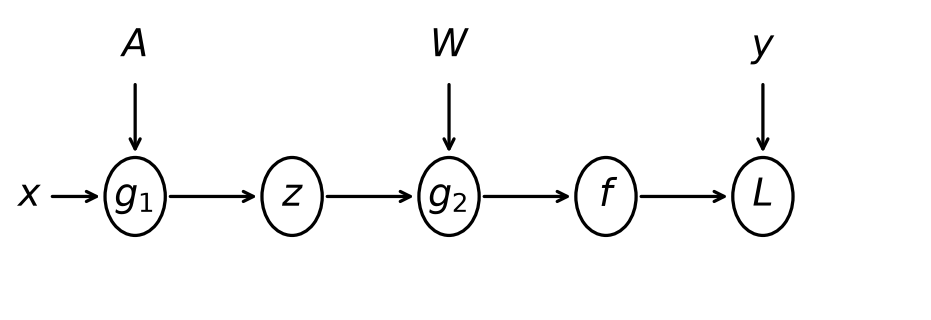

*按原卷印刷计算图重绘；去除了学生手写梯度及批改，保留所有前向节点与参数箭头。 / Redrawn from the printed graph, preserving its nodes and parameter arrows.*

### English answer
(a) Let $u=(3x^2)^{1/3}+\tan(5x)$ and $y=(1+e^u)^{-1}$. Where $x\ne0$ and $\cos(5x)\ne0$,

$$
\frac{du}{dx}=\frac{2x}{(3x^2)^{2/3}}+5\sec^2(5x),\qquad
\frac{dy}{du}=-\frac{e^u}{(1+e^u)^2}.
$$

Multiply the two factors:

$$
\frac{dy}{dx}=-\frac{e^u}{(1+e^u)^2}
\left[\frac{2x}{(3x^2)^{2/3}}+5\sec^2(5x)\right].
$$

(b) Choose a tanh hidden layer and a linear output, as permitted, and leave the unspecified loss as $L(f,y)$. Treat aᵢ and wⱼ as columns:

$$
g_1=A^Tx,\quad z=\tanh(g_1),\quad
g_2=W^Tz,\quad f=g_2,\quad L=L(f,y).
$$

Let $\delta_2=\nabla_f L$ and $\delta_1=(W\delta_2)\odot(1-z^2)$. Then

$$
\frac{\partial L}{\partial g_1}=\delta_1,\qquad
\frac{\partial L}{\partial a_i}=x\,\delta_{1i},\qquad
\frac{\partial L}{\partial w_j}=z\,\delta_{2j}.
$$

Here δ₁ and x are m-dimensional, δ₂ is n-dimensional and each column gradient is m-dimensional. For half-squared error, $\delta_2=f-y$; another loss requires its own derivative.

### 中文讲解
导数$dy/dx$表示$x$在当前位置增加一点时，$y$变化得多快；例如$y=3x$的导数为3。多个变量参与计算时，$\partial L/\partial a$表示暂时固定其他变量，只看$a$改变对$L$的影响，称为偏导数。

链式法则适用于“一个计算结果又被送入下一步”：最终结果对输入的变化率，等于沿路径各局部变化率的乘积；若输入通过多条路径影响结果，则把各条贡献相加。先按(a)练一条标量计算链，再用于(b)的网络。

**(a) 把长表达式拆成短操作。** 这里用到三条基本求导规则：$(u^p)^{\prime}=pu^{p-1}$、$(e^u)^{\prime}=e^u$、$(\tan u)^{\prime}=1/\cos^2u$，撇号都表示对各自输入$u$求导；三角函数角度按弧度计算。复合函数还要再乘内层输入的导数。定义

$$s=3x^2,\quad r=s^{1/3},\quad t=5x,\quad v=\tan t,
\quad u=r+v,\quad q=e^u,\quad y=(1+q)^{-1}.$$

从外向内求导。倒数层给$\partial y/\partial q=-(1+q)^{-2}$，指数层给$\partial q/\partial u=e^u$，所以

$$\frac{dy}{du}=-\frac{e^u}{(1+e^u)^2}.$$

$u$有两条分支，两条导数要相加。立方根分支先对$s$求导，再乘$s$对$x$的导数：

$$\frac{dr}{dx}=\frac13s^{-2/3}\cdot6x
=\frac{2x}{(3x^2)^{2/3}}.$$

另一分支$\tan t$的导数为$\sec^2t=1/\cos^2t$，再乘$dt/dx=5$，得$dv/dx=5\sec^2(5x)$。于是

$$\frac{du}{dx}=\frac{2x}{(3x^2)^{2/3}}+5\sec^2(5x).$$

把它乘上$dy/du$即为英文答案中的最终式。最容易漏的是内层的6x、5，以及外层倒数带来的负号。$x=0$时立方根复合项有尖点，普通导数不适用；$\cos(5x)=0$时tan无定义，也必须排除。

**(b) 先讲前向，每个变量都有尺寸。** 输入$x\in\mathbb R^m$；$A$有$m$列，每列$a_i$是第$i$个隐藏单元的输入权重。选双曲正切tanh作为隐藏激活：$\tanh(t)=(e^t-e^{-t})/(e^t+e^{-t})$，它把加权和压到$(-1,1)$；选线性输出，即最后一层直接输出加权和。这两项都是原题允许自定的部分。前向为

$$g_{1i}=a_i^Tx=\sum_{k=1}^m A_{ki}x_k,\qquad z_i=\tanh(g_{1i}).$$

因此$g_1,z$各有$m$个数。$W$有$n$列，每列$w_j\in\mathbb R^m$连接所有隐藏单元到第$j$个输出：

$$g_{2j}=w_j^Tz=\sum_{i=1}^m W_{ij}z_i,\qquad f_j=g_{2j}.$$

所以$g_2,f$各有$n$个数。损失$L(f,y)$比较输出与目标；题目没有指定损失，不能擅自把所有后续结论限定为平方损失。

**从输出往回传。** 记$\delta_{2j}=\partial L/\partial f_j$。由于输出是恒等映射，也有$\partial L/\partial g_{2j}=\delta_{2j}$。一个输出权重$W_{ij}$只在$f_j$中乘$z_i$，所以

$$\frac{\partial L}{\partial W_{ij}}=\delta_{2j}z_i,
\qquad \frac{\partial L}{\partial w_j}=z\,\delta_{2j}.$$

第$i$个隐藏激活$z_i$会影响所有$n$个输出，因此必须把分支相加：

$$\frac{\partial L}{\partial z_i}=\sum_{j=1}^{n}W_{ij}\delta_{2j}.$$

tanh的局部导数为$1-\tanh^2(g_{1i})=1-z_i^2$，再乘它得到隐藏输入的梯度：

$$\delta_{1i}:=\frac{\partial L}{\partial g_{1i}}
=\left(\sum_{j=1}^{n}W_{ij}\delta_{2j}\right)(1-z_i^2).$$

最后$g_{1i}=a_i^Tx$，对$a_i$的各分量求导分别得到对应输入$x_k$，所以

$$\frac{\partial L}{\partial a_i}=x\,\delta_{1i}.$$

把逐分量结果收成向量，就是$\delta_1=(W\delta_2)\odot(1-z^2)$。$W$为$m\times n$，乘$n$维$\delta_2$得到$m$维，再与$m$维激活导数逐元素相乘；$\odot$不是矩阵乘法。按题目所列顺序，三个量依次为$x\delta_{1i}$、$\delta_1$和$z\delta_{2j}$，每个都是$m$维。

**用一个小数值检查方向。** 额外选择$L=\frac12(f-y)^2$，令$m=n=1,x=1,A=0,W=2,y=1$。前向$g_1=z=f=0$，因此$\delta_2=f-y=-1$，$\delta_1=2(-1)(1-0)=-2$。所以$\partial L/\partial A=-2$，$\partial L/\partial W=z\delta_2=0$。当前隐藏输出为0，微调输出权重暂时无效；增大$A$却可先产生正的隐藏输出，使$f$靠近目标1，这与负梯度更新方向一致。

选读：完整矩阵梯度为$\nabla_A L=x\delta_1^T$和$\nabla_W L=z\delta_2^T$，分别为$m\times m$、$m\times n$，与参数尺寸完全一致。若改成其他输出激活或损失，需要重新写对应局部导数，再沿同样路径相乘、相加。

**出处：** 2025A期中 Q13，原卷第10页（10分）

**答案依据：** 2025A期中 Q13 印刷题干；本题解为我们的推导，不采用扫描件的学生作答。

[题目](Questions.md#mt067) · [答案](Answers.md#mt067)

## MT066 · 梯度消失：为什么深度和激活函数有关？

**考点：** 神经网络与链式法则

### 中文题意
(a) [4分] 解释梯度消失问题。(b) [3分] 用数学说明为什么更深网络更容易出现这个问题。(c) [3分] 相比Sigmoid，ReLU为什么能缓解它？

### English answer
(a) Gradients reaching earlier layers can become very small, so those parameters learn slowly.
(b) Backpropagation multiplies local Jacobians. On a scalar path, $\partial h_L/\partial h_0$ is the product of weight and activation derivatives. Sigmoid derivatives are at most 1/4; with unit weights, a path through L sigmoids has gradient magnitude at most $(1/4)^L$.
(c) An active ReLU has derivative 1, avoiding sigmoid's saturating factor on that path. Negative ReLU inputs have derivative zero, and weights still affect the product, so ReLU is not a universal cure.

### 中文讲解
损失$\mathcal L$衡量预测错得多严重。偏导数$\partial\mathcal L/\partial w$表示只把权重$w$调大一点时，损失会怎样变；所有参数的偏导数组成梯度。训练按$w\leftarrow w-\eta\,\partial\mathcal L/\partial w$更新，$\eta>0$是控制每步幅度的学习率。传到前面某层的梯度若很小，该层每次更新也很小，训练就很慢，这叫梯度消失，不要求梯度严格等于0。

**为什么深度会放大这个问题？** 链式法则把一条路径上的局部变化率相乘。设共有$L$层，$h_l$表示第$l$层输出，$w_l,b_l$分别是该层权重与偏置。对于一条只有标量相连的计算链，$h_l=\sigma(w_lh_{l-1}+b_l)$，有

$$\frac{\partial h_L}{\partial h_0}
=\prod_{l=1}^{L}\left[w_l\,\sigma'(w_lh_{l-1}+b_l)\right].$$

每一项都在回答“前一层动一点，后一层动多少”。若每层缩成原来的0.2，四层后剩$0.2^4=0.0016$。路径越长，多个小于1的因子越可能把梯度压得很小；矩阵网络还需要把多条路径贡献相加，但仍有连乘机制。

**Sigmoid为何容易带来小因子？** $\sigma(t)=1/(1+e^{-t})$把输入压到0与1之间，$e\approx2.718$是自然指数的底数。其导数为$\sigma(t)[1-\sigma(t)]$。令$p=\sigma(t)$，则$p(1-p)=1/4-(p-1/2)^2\le1/4$，两端饱和时还更接近0。以单位权重为例，经过$L$个sigmoid的单路径梯度不超过$(1/4)^L$。一般网络权重也参与乘积，因此不能只数激活层数就断言必然消失。

**ReLU缓解了哪一段？** ReLU为$\max(0,t)$，在$t>0$时斜率1，活跃路径不会再被sigmoid的小斜率压缩；在$t<0$时斜率0，仍可能让某些单元没有梯度。权重过小或其他层的因素也仍存在，所以ReLU是缓解手段，不是万能保证。

**出处：** 2025A期中 Q10，原卷第7页（10分）

**答案依据：** 2025A期中 Q10 印刷题干；本题解为我们的推导，不采用扫描件的学生作答。

[题目](Questions.md#mt066) · [答案](Answers.md#mt066)

## MT003 · 历史拓展：Gaussian Process的假设

**考点：** 历史范围拓展：Gaussian Process

历史期中原题；需要高斯过程背景，不作为当前Lecture 1–5已完整讲授的内容。

### 中文题意
关于高斯过程回归GPR，哪些说法正确？多选。

A）GPR被定义为：将贝叶斯线性回归的线性核换成Gaussian/RBF核。B）只有观测噪声为高斯时，GPR才有闭式解。C）高斯过程先验的一个假设是，输入越近，对应函数值的相关性越高。D）GPR不适合大数据是因为参数少、模型复杂度有限。E）GPR假设输入数据点独立同分布。

### English answer
**B and C under the course’s Gaussian-likelihood and RBF-kernel assumptions.** Gaussian noise gives the usual analytic posterior; RBF gives nearby inputs higher covariance. GP kernels need not be RBF, dense inference is costly, and inputs need not be i.i.d. B’s “only” and C are not universal GP definitions.

### 中文讲解
本题属于已保留的历史拓展。高斯过程（Gaussian process，GP）直接给未知函数赋予概率模型：取任意有限个输入，对应的函数值共同服从一个多元高斯分布。均值函数描述大致水平，核函数描述不同位置的函数值怎样一起变化。

- **A不选。** RBF是常用核，不是GP定义。GP也可以采用其他合法核；不能把“贝叶斯线性回归换成RBF”当作全部定义。
- **B按本课标准模型选。** 高斯函数先验配合高斯观测噪声，观测后的函数分布仍是高斯，可以通过矩阵公式求均值和协方差，这就是常说的解析后验。原题的“只有”不宜推广为所有可能特殊模型的数学定理。
- **C按RBF设定选。** RBF核给近输入更大的协方差，因此观察附近一个函数值会更多地影响当前点的预测。但“近就更相关”由核决定，并非每一种GP核都必须如此。
- **D不选。** 标准精确GP的大数据难点是要处理$N\times N$协方差矩阵；稠密计算通常需$O(N^3)$时间及$O(N^2)$存储，不是因为参数少所以表达能力不够。
- **E不选。** 输入可由实验者固定，也可按时间顺序采集；GP并不要求所有输入位置独立同分布。标准模型常假设观测噪声独立，这与输入独立是两回事。

**出处：** 2020B期中Quiz Q3，原卷第2页（5分）

**答案依据：** 2020B期中 Q3 随卷／配套参考答案；条件与解释经复核。

[题目](Questions.md#mt003) · [答案](Answers.md#mt003)

## MT036 · 历史拓展：音乐地理回归，GP还是RF？

**考点：** 历史范围拓展：Gaussian Process

历史期中原题；GPR属于本轮讲义主线之外的背景。

### 中文题意
共有10,597段世界各地音乐，每段68维音频特征，目标是经纬度。存在异常值，且部分地区样本远多于其他地区。比较Gaussian Process Regression与Random Forest Regression在这个任务中的优缺点。

### English answer
A standard GP provides a predictive mean and model-based uncertainty, useful when coverage is uneven; exact dense fitting on 10,597 samples is computationally costly, and a Gaussian likelihood can be sensitive to output outliers. RF captures nonlinear interactions and is often easier to scale, but ordinary leaf averages can still be affected by outlier targets and do not automatically provide calibrated uncertainty. Evaluate both with region-aware validation; sparse regions and out-of-range predictions remain difficult.

### 中文讲解
这里输入是68维音频特征，输出是经纬度。10,597条记录分布不均，还含异常值；要比较的是模型怎样表示规律、计算成本和数据缺陷会怎样影响预测。

**GP的优势是带模型不确定性的预测。** 标准GP给出预测均值及方差，除了位置估计，还可以提醒某些输入缺乏相近训练证据。不同地区样本不均时，这种信息有用；但可信程度仍依赖核与噪声模型，不是样本少就必然得到准确的不确定性。

**GP的代价是精确稠密计算较重。** $N=10{,}597$的协方差矩阵有112,296,409个元素，若每个8字节，单矩阵约0.90 GB（十进制），还没有计算分解和其他中间量。标准精确求解也有立方级时间增长。高斯观测模型对极端目标偏差可能敏感，需要核查异常值或采用合适的稳健扩展。

**RF能表达非线性及特征交互，通常较容易扩展训练。** 不同树可独立拟合、并行预测。但普通回归树叶子常输出训练目标均值，极端经纬度标签仍可能把均值拉偏；不能称其对异常值免疫，也不能凭名称断言它必然比GP更敏感。

两个方法都不会自动补齐少样本地区。验证应按实际泛化目标设计，并分别查看各地区误差，防止多数地区的平均成绩掩盖少数地区失败。普通RF也不会自动提供校准过的预测概率分布；可以构造不确定性估计，但应另行验证。

**出处：** 2021B*期中 Q10，原卷第4页（10分）

**答案依据：** 2021B*期中 Q10 随卷／配套参考答案；条件与解释经复核。

[题目](Questions.md#mt036) · [答案](Answers.md#mt036)

<h2 id="source-differences">原题差异与勘误 / Source differences</h2>

遇到题纸、参考答案或同学整理不一致时，先按题纸的条件作答，再看本页说明。正文中的简短“原题差异”注只提示会影响理解或答案的地方。

Keep the printed question intact. Distinguish the supplied key from a correction or an explanation that needs extra assumptions.

| 题号 | 原材料的差异 | 本册采用的处理 |
|---|---|---|
| **MT031** | 2021B题纸第3页C为≥；配套答案第2页仅列ABE。 | 按印刷题面C成立，复核为**ABCE**；保留原解ABE记录。此前本题库的≤已更正。 |
| MT032 | 2021B配套解答Q6只选D；同学小抄写BD。 | 保留原解D，并说明“显式定义后验”有措辞歧义。 |
| MT043 | 2023A Q4题头有kernel，2025A Q4没有；五个选项相同。 | 保留原解BD与题头差异；A在kernel语境下有歧义，区分软间隔容错与非线性表示能力。 |
| MT059 | 2023B Q8原解的NB参数量为2D+1。 | 对应单个共享方差且未计可学习先验；不同参数约定另列。 |
| MT060 | 2023B Q9写C→0，示意答案实际展示较小的正C。 | 区分小正C的示意与C=0忽略数据损失的情形。 |
| MT061 | 2023B Q10按较小C通常带来更多支持向量排序。 | 保留原解口径；一般情形须看实际支持向量数，并计入系数存储。 |
| **MT063** | 2023B Q12答案图在残差±1处约为1，与题干公式不符。 | 按题干作图：L(±1)=0.5，L(±2)=1.5；曲线形状与光滑连接不变。 |
| MT065 | 2025A Q9与Mock Q9同题；图中LR经过缩放。 | 按题图解释AdaBoost>LR>SVM，不把它当作不依赖尺度的普遍排序。 |

**阅读同学整理时：** 2020B Q13原式含λ，本册MT013已保留。SVM消去松弛变量后，hinge项系数仍为C；若整体除C，则权重项变为1/(2C)。2025A另有梯度消失与反传题（MT066、MT067），不能沿用“Lecture5只有一道样题”的旧盘点。

详细原卷入口见同目录Materials.md；逐项核查与同学资料中的其他问题见Issues.md。本页不改变题目编号或真题计数。
