# Math for Machine Learning｜看懂公式，再回到课堂

**可选基础补课 · 从四则运算和简单方程开始 · 扩展于2026-09-23**

[回到 Lecture 2 开头](../../CS5489/course-notes/Lecture02.md#intro) · [使用与运行说明](../../CS5489/course-notes/README.md)

看到一长串公式时，困难有时并不是“机器学习太难”，而是同时遇到了五个不认识的符号。这份补课把这些台阶拆开：先知道符号在说什么，再用小数字算一次，最后回到老师的公式。水箱、邮件计数和小矩阵均为**教学补充例子**。

只默认你会加减乘除、分数和简单方程。不必一次读完：可以从下面选择卡住的专题；小节末尾有返回相关Lecture或Tutorial具体位置的链接。正文中的英文术语帮助对照课堂，English takeaway 是整理后的表达，练习题答中英对齐。

<a id="foundation-nav"></a>
各专题可以单独阅读；学会当前需要的工具后，通过节末链接回到课程。

## 先找到自己缺的那一级台阶

| 如果你卡在这里 | 从哪里补 | 用在哪些内容 |
|---|---|---|
| 一看到下标、函数图像、Σ、Π就读不下去 | [1. 符号、函数与图像](MathForML.md#symbols-functions) | 数据记录、似然乘积、均值求和 |
| 分不清“给定谁”，或把密度高度当概率 | [2. 概率、条件与密度](MathForML.md#probability-density) | 生成模型、高斯观察模型 |
| 不懂为什么乘法变加法，或负对数怎样比较 | [3. 指数与自然对数](MathForML.md#powers-logs) | log-likelihood、log分数 |
| 求导像背口诀，链式法则或偏导跟不上 | [4. 导数与极值](MathForML.md#derivatives) | 先验与高斯参数的MLE |
| 看不懂向量、转置、协方差与逆矩阵 | [5. 向量、矩阵与协方差](MathForML.md#vectors-covariance) | 两维输入、完整高斯 |
| 多人同时活跃的概率不知道怎么数 | [6. 组合与二项概率](MathForML.md#combinations) | CS5222 Chapter1、Tutorial1 |
| 不知道投影、正交和张成空间是什么意思 | [7. 长度与投影](MathForML.md#projection) | CS5489 Tutorial1、Lecture3 |
| 逆不存在却还要拟合，不知怎么办 | [8. 秩与伪逆](MathForML.md#rank-pseudoinverse) | CS5489 Lecture4最小二乘 |
| 梯度、约束、乘子突然冒出来 | [9. 梯度与约束](MathForML.md#optimization) | CS5489 Lecture3 LR/SVM |
| 不清楚反向传播为什么转置、求和或平均 | [10. 批量梯度](MathForML.md#batch-gradients) | Lecture5、Assignment2 |

不确定从哪开始，可以先看这五道自查。**会解释理由就可以跳过相应入门段；卡住时再点专题。** 

**自查1 / Check 1**

**中文题：** 水箱原有1 L，以2 L/min匀速注水且不漏水、不溢出。3分钟后有多少水？图像的斜率是什么？  
**English question:** A tank starts with 1 L and receives 2 L/min, with no leakage or overflow. What is its volume after 3 minutes, and what is the graph's slope?

<details markdown="1"><summary>自查1答案 / Answer 1</summary>

7 L；斜率是每分钟增加2 L，即2 L/min。需要先认识坐标和函数时，读[专题1](MathForML.md#symbols-functions)。  
**English answer:** 7 L; the slope is 2 L/min, the increase in volume per minute.

</details>

**自查2 / Check 2**

**中文题：** 100封邮件中40封带附件，其中10封是垃圾邮件。已知随机选中的邮件带附件，它是垃圾邮件的比例是多少？  
**English question:** Of 100 messages, 40 have attachments, and 10 of those 40 are spam. Given that a uniformly selected message has an attachment, what proportion is spam?

<details markdown="1"><summary>自查2答案 / Answer 2</summary>

10/40=0.25；条件把范围缩到40封，分母不是100。见[条件概率](MathForML.md#conditional-probability)。  
**English answer:** 10/40=0.25. Conditioning restricts the reference group to the 40 messages with attachments.

</details>

**自查3 / Check 3**

**中文题：** ln(0.1)为什么是负数？对正数a、b，ln(ab)如何展开？  
**English question:** Why is ln(0.1) negative, and how does ln(ab) expand for positive a and b?

<details markdown="1"><summary>自查3答案 / Answer 3</summary>

e的负次幂才会得到0和1之间的数；ln(ab)=ln(a)+ln(b)。见[专题3](MathForML.md#powers-logs)。  
**English answer:** A negative power of e lies between zero and one; ln(ab)=ln(a)+ln(b).

</details>

**自查4 / Check 4**

**中文题：** f(x)=x²在x=2处的导数是多少？为什么“导数为0”不能单独证明最大值？  
**English question:** What is the derivative of f(x)=x² at x=2? Why does a zero derivative alone not prove a maximum?

<details markdown="1"><summary>自查4答案 / Answer 4</summary>

导数是4；零导数点可能是最小值或既非最大也非最小的点，还要检查变化方向或其他条件。见[专题4](MathForML.md#derivatives)。  
**English answer:** The derivative is 4. A stationary point may be a minimum or neither; additional checks are needed.

</details>

**自查5 / Check 5**

**中文题：** 4条记录各有2个特征，按行保存时X的形状是什么？协方差矩阵的非对角线记录什么？  
**English question:** Four records each have two features. What is the shape of the row-wise data matrix X, and what do off-diagonal covariance entries describe?

<details markdown="1"><summary>自查5答案 / Answer 5</summary>

X是4×2；非对角线描述两个特征相对于各自均值一起变化的情况。见[专题5](MathForML.md#vectors-covariance)。  
**English answer:** X is 4×2. Off-diagonal covariance entries describe joint deviations of two features from their respective means.

</details>

<a id="symbols-functions"></a>
## 1. Symbols, functions and graphs｜先让公式开口说人话

### 1.1 水箱的账本：谁变了，谁跟着变？

假设水箱起初有1升水，水龙头每分钟注入2升。暂时不考虑漏水、流速变化和装满后的溢出。我们想回答：“开了t分钟，现在有多少水？”

| 经过时间t（分钟） | 原有的水（升） | 新加入的水（升） | 总水量V（升） |
|---:|---:|---:|---:|
| 0 | 1 | 2×0=0 | 1 |
| 1 | 1 | 2×1=2 | 3 |
| 2 | 1 | 2×2=4 | 5 |
| 3 | 1 | 2×3=6 | 7 |

把每一行相同的计算压缩成一句话，就是

$$
V(t)=2t+1.\tag{M.1}
$$

这里t是 **variable（变量）**，V(t)读作“时间t对应的水量”。括号表示把t送入规则，**V(t)不是V乘以t**。2t才表示2×t；2的单位是L/min，乘以分钟后得到L，才能与原有1 L相加。

这样的输入—输出规则叫 **function（函数）**。在我们规定的条件下，同一个t对应一个确定的V。模型适用的输入范围叫 **domain（定义域）**；这里t≥0，而且必须在水箱尚未溢出的阶段。

<a id="coordinates"></a>
### 1.2 图像就是把账本放到坐标上

横轴记t，纵轴记V。点(2,5)表示“过了2分钟，共有5升水”；先读横坐标，再读纵坐标。允许半分钟之类的连续时间，所以这里可以连接成线；如果横轴是班级名称，就不能照搬这种连续解释。

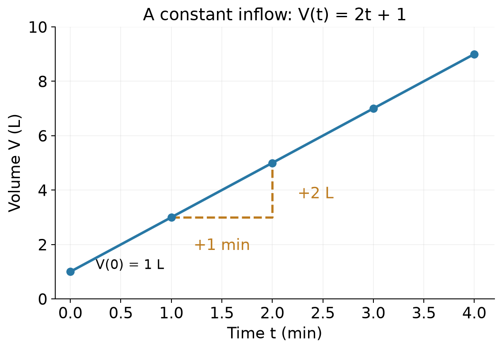

*看蓝线与金色虚线：从(1,3)走到(2,5)，向右1分钟，向上2升。起点的1升决定纵轴截距，注水速率决定斜率。图的适用条件仍是匀速、不漏、不溢出。*

**Slope（斜率）**是“输出变化量÷输入变化量”。大写希腊字母Δ读作delta，在这里表示“后一个值减前一个值”：

$$
\text{slope}=\frac{\Delta V}{\Delta t}=\frac{5-3}{2-1}=2\ \text{L/min}.\tag{M.2}
$$

这条直线到处斜率相同；曲线则可能一会儿陡、一会儿平，专题4会从这里引出导数。

**完整例题 / Worked example**  
中文题：保持水箱条件，求2.5分钟后的水量；如果想达到8 L，需要多久？  
English question: Under the same tank assumptions, find the volume after 2.5 minutes and the time needed to reach 8 L.

先代入：V(2.5)=2×2.5+1=6 L。反过来求时间，解2t+1=8，先减1再除以2，得到t=3.5 min。  
**English answer:** V(2.5)=6 L. Solving 2t+1=8 gives t=3.5 minutes.

### 1.3 下标是编号，Σ和Π是压缩过的算术

有三个读数1、2、4，写成x₁=1、x₂=2、x₃=4。**Subscript（下标）**i告诉你“第几个”；x₂是第二个读数，不是x乘2，也不是平方。

$$
\sum_{i=1}^{3}x_i=x_1+x_2+x_3=1+2+4=7,\tag{M.3}
$$

$$
\prod_{i=1}^{3}x_i=x_1x_2x_3=1\times2\times4=8.\tag{M.4}
$$

Σ（summation）说“逐项相加”，Π（product）说“逐项相乘”。下方i=1是起始编号，上方3是结束编号；i只是计数用的名字，换成j不会改变计算。省略上下限时，需要从上下文知道加了哪些项。

平方也要看括号：

$$
\sum_{i=1}^{3}x_i^2=1^2+2^2+4^2=21,
\qquad\left(\sum_{i=1}^{3}x_i\right)^2=7^2=49.\tag{M.5}
$$

前者“各自平方再相加”，后者“先合计再平方”。括号决定先做哪一步。在实数范围内，a≥0时，符号√a表示平方后得到a的非负数，例如√9=3；它稍后用于从方差回到标准差。

| 常见写法 | 此处怎样读 |
|---|---|
| x∈ℝ | x是实数，可以是整数、小数、正数、负数或零 |
| {xᵢ}ᵢ₌₁ᴺ | 从第1到第N个观测组成的一组记录 |
| μ、σ、θ | 希腊字母mu、sigma、theta；含义须看当前定义 |
| μ̂ | mu上戴“帽子”，通常表示用数据估出的值 |
| argmaxₜ f(t) | 找让f最大的输入t，不是返回最大高度本身 |

Lecture 2中，高斯公式的2π使用圆周率；先验参数π则是老师给参数起的名字。一样的字形可能承担不同角色，读公式时先对照变量表。

**独立变式 / Try**  
中文题：另一个水箱初始2 L，流速3 L/min，仍不漏、不溢出。写出函数并求4分钟水量。另给x=(2,3,5)，计算Σxᵢ、Πxᵢ和Σxᵢ²。  
English question: A second tank starts with 2 L and receives 3 L/min, without leakage or overflow. Write its volume function and evaluate it at 4 minutes. For x=(2,3,5), also compute the sum, product and sum of squares.

<details markdown="1"><summary>展开答案 / Show answer</summary>

V(t)=3t+2，V(4)=14 L；和为10，积为30，平方和为4+9+25=38。平方和不是10²。  
**English answer:** V(t)=3t+2 and V(4)=14 L. The sum is 10, the product is 30, and the sum of squares is 38, not 100.

</details>

**English takeaway:** A function maps an allowed input to an output. A slope compares changes with units. Subscripts identify entries; sums, products and parentheses specify the calculation order.

**回到课堂：** [Lecture1：变量](../../CS5489/course-notes/Lecture01.md#variables) · [数据记录与特征](../../CS5489/course-notes/Lecture02.md#classification) · [似然中的连乘](../../CS5489/course-notes/Lecture02.md#prior-mle) · [均值中的求和](../../CS5489/course-notes/Lecture02.md#gaussian-mle) · [补课导航](MathForML.md#foundation-nav)

<a id="probability-density"></a>
## 2. Probability and density｜先说清楚在谁里面数

### 2.1 事件是条件，概率是满足它的机会

把100封邮件放进一个盒子，**等可能地随机抽取一封**。如果其中30封是垃圾邮件，抽到垃圾邮件的概率就是30/100=0.3。这里“是垃圾邮件”叫 **event（事件）**，用S表示，P(S)=0.3。写成百分数就是30%，三种写法表示同一个比例。

“不是垃圾邮件”是S的补事件，记作Sᶜ。两种结果不重叠、合起来又覆盖全部邮件，所以P(Sᶜ)=1−P(S)=0.7。概率必须在0到1之间。很多概率能不能直接相加，要先问事件是否重叠；同一封邮件既含free又含meeting时，把两个计数直接相加会把它数两次。

<a id="conditional-probability"></a>
### 2.2 竖线后面的条件，会换掉分母

现在再记录邮件是否含单词free，用F表示“含free”。这是人为设计的教学计数：

| 教学邮件计数 / Message counts | 含free / F | 不含free / Fᶜ | 合计 / Total |
|---|---:|---:|---:|
| 垃圾邮件 / S | 18 | 12 | 30 |
| 正常邮件 / Sᶜ | 7 | 63 | 70 |
| 合计 / Total | 25 | 75 | 100 |

**完整例题 / Worked example**  
中文题：仍等可能抽一封。已知它是垃圾邮件，含free的概率是多少？已知它含free，是垃圾邮件的概率又是多少？  
English question: Select one message uniformly from the table. What is the probability of containing free given spam, and the probability of spam given containing free?

第一问先把目光缩到“垃圾邮件”那一行：30封里18封含free，得到

$$
P(F\mid S)=\frac{18}{30}=0.6.\tag{M.6}
$$

第二问先缩到“含free”那一列：25封里18封是垃圾邮件，得到

$$
P(S\mid F)=\frac{18}{25}=0.72.\tag{M.7}
$$

竖线“|”读作 **given（已知、给定）**。两问用了同一个18，却有不同分母；“已知是猫，有胡子的比例”和“已知有胡子，是猫的比例”也有这个区别。

**English answer:** P(F|S)=18/30=0.6; P(S|F)=18/25=0.72. The conditioning event changes the reference group, so reversing the condition changes the question.

两个条件同时满足叫交集，写成F∩S；本例概率是18/100=0.18。由计数关系可归纳出

$$
P(F\mid S)=\frac{P(F\cap S)}{P(S)},\qquad
P(F\cap S)=P(F\mid S)P(S),\quad P(S)>0.\tag{M.8}
$$

不必先背：30/100的人被留下，在留下的人中取18/30，乘起来正好18/100。条件事件概率为0时，这个分式不能直接计算；不能把0/0随意写成0或1。

回到Lecture 2：[继续理解先验与类条件](../../CS5489/course-notes/Lecture02.md#generative) · [继续Bayes决策](../../CS5489/course-notes/Lecture02.md#bayes-rule)。

<a id="independence"></a>
### 2.3 相乘也需要条件

**Independence（独立）**表示知道一个事件发生，不改变另一个的概率。上述邮件中P(F)=25/100=0.25，而P(F|S)=0.6，因此F和S不独立。

一般乘法规则是P(F∩S)=P(F|S)P(S)。只有独立时才能进一步改为P(F)P(S)。比如假设两次公平抛硬币独立，两个正面的概率才是1/2×1/2=1/4。

独立不等于 **mutually exclusive（互斥）**。一次抛硬币的正面与反面不能同时发生，它们互斥；知道正面出现，就确定反面没出现，显然改变了反面的概率。

课堂的“给定类别后独立”还固定了类别这个条件；这不等于所有特征在所有数据里都独立。具体怎样组成Naive Bayes模型，回Lecture正文继续学。

回到Lecture 2：[继续Gaussian NB的条件独立假设](../../CS5489/course-notes/Lecture02.md#gaussian-nb)。

<a id="density-area"></a>
### 2.4 连续读数：高度是密度，面积才是概率

邮件类别可以逐个数。等待时间、花瓣长度则可以有越来越细的小数位。假设等待时间X在0到0.5分钟之间均匀分布，“均匀”表示相同长度的区间有相同概率。

总区间长0.5分钟、总概率为1，所以每单位长度上的密度是1/0.5=2，单位为1/分钟。在区间内画高度2的长方形，面积正好0.5×2=1。

这条曲线叫 **probability density function，PDF（概率密度函数）**，写作f(x)。这里PDF是函数的缩写，不是文件格式。对于这个均匀模型：

$$
f(x)=\begin{cases}2,&0\le x\le0.5,\\0,&\text{otherwise}.\end{cases}\tag{M.9}
$$

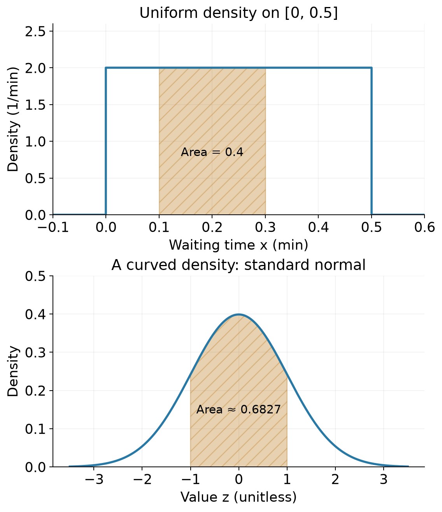

*上图看金色区域：宽0.3−0.1=0.2分钟，高2/分钟，面积0.4就是落在该区间的概率。下图的曲线是标准正态，−1到1之间的面积约0.6827；曲线下的面积仍是概率，但不能用一根柱子的高度代替整个面积。上下图的横轴、纵轴含义各自标明。*

**完整例题 / Worked example**  
中文题：在上述均匀等待模型中，求0.1到0.3分钟之间的概率。密度为2是否违反“概率不超过1”？  
English question: In the uniform waiting-time model on [0,0.5] minutes, find the probability of [0.1,0.3]. Does density 2 violate the probability bound of 1?

答案：区间面积(0.3−0.1)×2=0.4。密度2的单位为1/分钟，不是概率；概率是无单位的面积0.4，仍在0到1之间。  
**English answer:** The probability is (0.3−0.1)×2=0.4. Density has units of inverse minutes; its height need not be at most one. The dimensionless probability remains within [0,1].

对曲线，可以把区间切成很多窄长方形，将“宽×高”相加，越切越细。这种累计面积记为 **integral（积分）**：

$$
P(a\le X\le b)=\int_a^b f(x)\,dx.\tag{M.10}
$$

∫表示累计，a、b是左右端点，dx提示沿x方向累计很小的宽度。这里先会读“区间下的面积”即可，不需要先学一整套积分技巧。对有密度的连续模型，单个精确点没有宽度，概率为0；实际仪器显示“2.3 cm”通常代表经过舍入的一小段区间。混合了离散点质量的模型不属于这句说明的范围。

**独立变式 / Try**  
中文题：用上面的100封邮件表，已知邮件不含free，它是垃圾邮件的概率是多少？另用同一个均匀等待模型，求0到0.25分钟的概率，以及恰好0.25分钟这个点的概率。  
English question: Using the 100-message table, find P(spam | no free). In the same uniform waiting-time model, find the probability of [0,0.25] and the probability of the exact point 0.25.

<details markdown="1"><summary>展开答案 / Show answer</summary>

不含free的75封中有12封垃圾邮件，所以12/75=0.16。等待区间概率0.25×2=0.5；在该连续模型中，精确单点概率为0。  
**English answer:** P(spam | no free)=12/75=0.16. The interval probability is 0.5, while the exact point has probability zero under this continuous model.

</details>

**English takeaway:** Conditioning changes the reference group. Independence is an extra assumption for multiplying marginal probabilities. For a continuous density, probabilities are interval areas rather than curve heights.

**回到课堂：** [Lecture1：概率图](../../CS5489/course-notes/Lecture01.md#plots-probability) · [先验与类条件的方向](../../CS5489/course-notes/Lecture02.md#generative) · [高斯密度](../../CS5489/course-notes/Lecture02.md#observation) · [Bayes决策](../../CS5489/course-notes/Lecture02.md#bayes-rule) · [条件独立](../../CS5489/course-notes/Lecture02.md#gaussian-nb) · [补课导航](MathForML.md#foundation-nav)

<a id="powers-logs"></a>
## 3. Powers and logarithms｜正着问乘多少，反着问几次方

### 3.1 从整数次幂到“反向提问”

假设一个理想化过程每轮把数量翻倍，从1开始，三轮后是2×2×2=8。把重复乘法缩写成 **power（幂）**：2³=8。这里2是底数，3是指数。整数指数可以先理解为乘了几次。

往回走一轮，就除以2，因此2⁰=1、2⁻¹=1/2、2⁻³=1/8。分数指数也能定义：$2^{1/2}=\sqrt{2}$，因为两个√2相乘等于2。推广到实数指数时，不再把“次数”局限成整数；可以用越来越精细的小数指数逼近。这就形成连续的指数函数。

**Logarithm（对数）**把问题倒过来：“底数2的几次方等于8？”答案是3，记成log₂8=3。一般定义为

$$
\log_b x=y\quad\Longleftrightarrow\quad b^y=x,
\qquad b>0,\ b\ne1,\ x>0.\tag{M.11}
$$

双向箭头表示两句话等价。底数1不行，因为1的任何次幂仍是1，无法唯一反推出指数。实数对数这里要求正输入；log₂(−8)不是这个定义里的实数结果。

### 3.2 e和ln：认识名字，再认识图像

**Natural logarithm（自然对数）**以特殊常数e≈2.71828为底，写成ln(x)。对应的指数函数eˣ也写成exp(x)。它们互相反解：

$$
\ln(e^u)=u,\qquad e^{\ln x}=x\quad(x>0).\tag{M.12}
$$

以e为底有一个方便的性质：eˣ的局部变化率恰好等于当前高度，而ln(x)的变化率恰好为1/x。专题4会解释“变化率”怎样变成导数；此处先会读函数即可。Lecture 2中的log默认按自然对数理解。

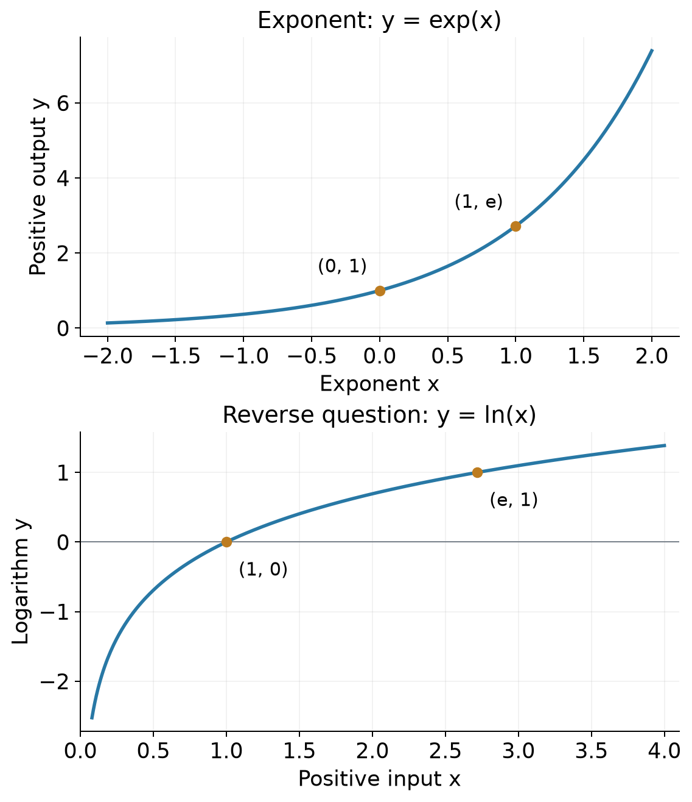

*上图的(0,1)与(1,e)，在下图变成(1,0)与(e,1)。ln(x)只接收正数；当0<x<1时，它位于横轴下方，因为e的负次幂才得到这样的数。两幅图的输入输出角色不同，纵轴范围也不同。*

例如e⁰=1，所以ln1=0；0.1小于1，所以ln0.1是负数，约−2.3026。负数并不代表“负概率”：对数已经把概率换到了另一条数轴。

<a id="log-products"></a>
### 3.3 为什么乘法会变成加法？

设a=eᵘ、b=eᵛ，两个数都为正。指数的相乘规则给出ab=eᵘeᵛ=eᵘ⁺ᵛ。对它反问“这是e的几次方”，答案就是u+v。因此

$$
\ln(ab)=\ln a+\ln b.\tag{M.13}
$$

同样，正数a有ln(aᵏ)=k ln(a)。例如ln(0.2×0.5)=ln0.2+ln0.5；多个因子时，把这个规则重复使用：

$$
\ln\left(\prod_{i=1}^{N}p_i\right)=\sum_{i=1}^{N}\ln p_i,
\qquad p_i>0.\tag{M.14}
$$

这不是任意“把括号拆开”。**加法没有同样的规则**：ln(2+4)=ln6，而ln2+ln4=ln8，两者不同。

回到Lecture 2：[继续先验MLE中的对数之和](../../CS5489/course-notes/Lecture02.md#prior-mle) · [继续比较log分数](../../CS5489/course-notes/Lecture02.md#log-scores)。

### 3.4 为什么最大值的位置没有变？

从图上看，ln(x)对正输入一直递增：a>b>0时，ln(a)>ln(b)。我们只改变了分数的刻度，没有交换谁大谁小。所以最大化正似然L(θ)，与最大化ln L(θ)，会选到同样的参数θ。

这里的 **argmax** 返回获胜的输入参数；**max** 返回最高的函数值。刻度换了，最高的数值会变，获胜参数可以不变。底数大于1的对数都保留这种排序；如果使用0到1之间的底数，对数会递减，不能照搬这个结论。

**完整例题 / Worked example**  
中文题：两项独立证据在模型A下的概率为0.2、0.5，在模型B下为0.1、0.8。比较证据联合概率，和比较它的自然对数，哪一个模型的值较大？  
English question: Two independent pieces of evidence have probabilities 0.2 and 0.5 under model A, and 0.1 and 0.8 under model B. Which model has the larger joint probability, and does taking natural logs change the ordering?

先按独立假设相乘：A为0.10，B为0.08，A更大。取对数后A≈−2.3026，B≈−2.5257；数轴上−2.3026仍更靠右，所以A仍较大。这里比较的是对已观察证据的似然，没有计算模型本身的后验。  
**English answer:** A gives 0.10 versus B's 0.08. Their natural logs are approximately −2.3026 and −2.5257, so A remains larger. These are likelihood comparisons, not model posterior probabilities.

电脑只能保存有限精度的数字，许多很小的数直接连乘可能被舍成0。取对数后改为加法，能减轻这种 **underflow（下溢）**。但这不能把真正的零概率变成合理的正概率；ln0没有有限实数值，程序有时用−∞表示其极限。不要把ln0擅自换成0，因为ln1才是0。

**独立变式 / Try**  
中文题：计算log₂(1/8)与log₂(2×4)。ln0.3和ln0.2哪个更大？能把ln(2+4)写成ln2+ln4吗？  
English question: Compute log₂(1/8) and log₂(2×4). Which is larger, ln0.3 or ln0.2? Can ln(2+4) be written as ln2+ln4?

<details markdown="1"><summary>展开答案 / Show answer</summary>

前两项为−3和3；ln0.3更大，因为0.3>0.2>0；不能拆开加法，左边ln6、右边ln8。  
**English answer:** The first two values are −3 and 3. ln0.3 is larger because ln is increasing on positive inputs. The proposed sum identity is false: it compares ln6 with ln8.

</details>

**English takeaway:** A logarithm reverses exponentiation. Natural logs convert positive products into sums and preserve their ordering. Logarithms of sums do not split, and zero inputs require explicit treatment.

**回到课堂：** [先验MLE中的对数似然](../../CS5489/course-notes/Lecture02.md#prior-mle) · [高斯MLE](../../CS5489/course-notes/Lecture02.md#gaussian-mle) · [log分数与稳定归一化](../../CS5489/course-notes/Lecture02.md#log-scores) · [TF-IDF中的对数](../../CS5489/course-notes/Lecture02.md#tfidf) · [补课导航](MathForML.md#foundation-nav)

<a id="derivatives"></a>
## 4. Derivatives and maxima｜输入动一点，输出怎样动？

### 4.1 曲线上的斜率，不只一个

水箱的V(t)=2t+1处处同样陡。换成f(x)=x²：从x=1到2，输出从1到4，平均斜率是3；从2到3，输出从4到9，平均斜率是5。曲线越走越陡，不能用一根直线的斜率概括全部位置。

我们先盯住x=2，问它附近的变化率。从x走到x+h，h表示这一步的长度，可以为正，也可以为负，但不能是0。两点间 **secant（割线）**的斜率为

$$
\frac{f(x+h)-f(x)}{h}
=\frac{(x+h)^2-x^2}{h}
=\frac{x^2+2xh+h^2-x^2}{h}=2x+h.\tag{M.15}
$$

中间只用了展开括号、约掉x²，再约掉非零h。把x=2放进去：

| 步长h | 平均斜率4+h |
|---:|---:|
| 1 | 5 |
| 0.25 | 4.25 |
| 0.01 | 4.01 |
| −0.01 | 3.99 |

让h从两侧越来越接近0，斜率趋近4。这个 **limit（极限）**不是先把分母h替换成0；它问非零h靠近0时整个比值趋向哪里。这个局部变化率叫 **derivative（导数）**，可以写成f′(x)或df/dx：

$$
f'(x)=\lim_{h\to0}\frac{f(x+h)-f(x)}h=2x.\tag{M.16}
$$

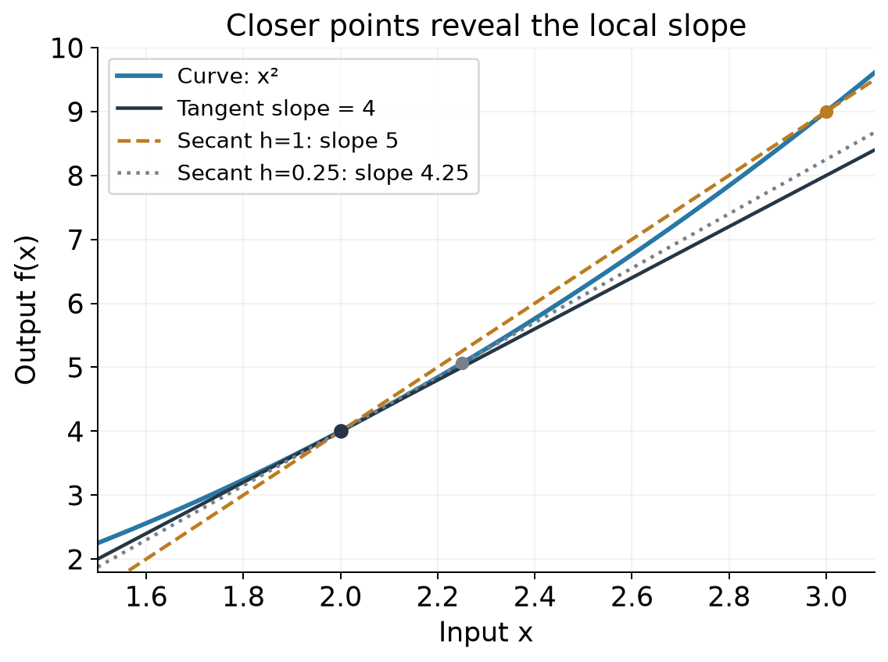

*蓝线是x²，虚线连接两个实际曲线点，深色实线是x=2处的切线。h从1缩到0.25，割线斜率从5变成4.25，向切线斜率4靠近。切线只在附近贴合曲线，并不是整条曲线的替身。*

因此在x=2附近，Δf≈4Δx。比如Δx=0.01，近似增加0.04；实际2.01²−2²=0.0401。步子小时两者很接近；步子为1时近似是4，实际是5，就不能再把近似写成精确等式。

<a id="derivative-rules"></a>
### 4.2 本讲需要的规则，从变化率理解

| 函数 | 导数 | 为什么或条件 |
|---|---|---|
| 常数c | 0 | 输入改变，输出不变 |
| ax+b | a | 输出变化a倍于输入变化 |
| x² | 2x | 刚才用差商展开得到 |
| 1/x | −1/x² | x≠0，见下方展开 |
| ln x | 1/x | x>0，见下方面积解释 |
| eˣ | eˣ | 与ln互逆，结合链式法则可得 |

对1/x也可以直接检查差商：

$$
\frac{1/(x+h)-1/x}{h}
=\frac{-h}{x(x+h)h}
=-\frac1{x(x+h)}\ \longrightarrow\ -\frac1{x^2}.\tag{M.17}
$$

为什么ln x的导数是1/x？自然对数也可以由曲线1/t从1到x累计的**有向面积**定义，它与以e为底的对数一致。x往右增加很小的Δx，多出的窄条面积约为(1/x)Δx；除以宽度Δx，再让宽度趋近0，就得到1/x。x<1时方向反过来，累计面积取负，这也呼应了上一专题的负对数。

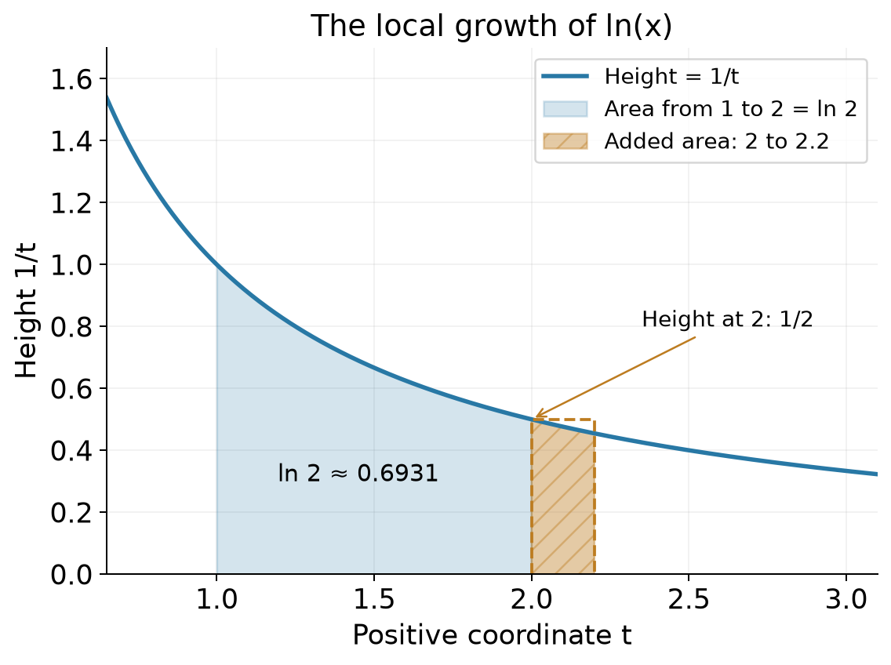

*从1到2的蓝色面积是ln2。金色窄条是从2到2.2新增的面积；起点高度为1/2，因此用小矩形估计是0.2×0.5=0.1，实际面积约0.09531。继续缩小宽度，单位宽度对应的面积变化就趋近1/2。*

对多个项相加，可以逐项求导；固定常数倍也可以提到外面。例如f(x)=3x²+5，f′(x)=3×2x+0=6x。常数不变，不表示含它的整项都不变。

回到Lecture 2：[继续高斯MLE：求导规则](../../CS5489/course-notes/Lecture02.md#gaussian-mle)。

<a id="chain-rule"></a>
### 4.3 链式法则：变化经过了几道工序？

令z=3x+1，再令y=z²。先把x变成z，再把z平方得到y。x动一点，第一道工序先把变化放大3倍；第二道工序在当前z附近再放大约2z倍。总变化率就是两段相乘：

$$
\frac{dy}{dx}=\frac{dy}{dz}\frac{dz}{dx}=2z\times3=6(3x+1).\tag{M.18}
$$

这叫 **chain rule（链式法则）**。dy/dz等写法在这里是变化率记号，不是任意情况下都能当普通分数约掉的字母。

**完整例题 / Worked example**  
中文题：z=3x+1，y=z²。当x=1时求dy/dx，并说明只写2z漏掉了什么。  
English question: Let z=3x+1 and y=z². At x=1, find dy/dx and explain what is missing if one writes only 2z.

先求当前位置z=4，外层变化率dy/dz=2×4=8；内层dz/dx=3。相乘得到24。只写2z等于把第一道工序当成没有放大。  
**English answer:** z=4, dy/dz=8 and dz/dx=3, so dy/dx=24. The expression 2z alone omits the inner rate dz/dx.

这也解释了ln(1−p)为什么求导为−1/(1−p)：外层ln的导数是1/(1−p)，内层1−p的导数是−1，必须相乘。对平方残差(xᵢ−μ)²关于μ求导也是同一个套路：2(xᵢ−μ)再乘−1。此时xᵢ是固定的数据，变化的是μ。

现在也能验证eˣ那条规则：对恒等式ln(eˣ)=x两边求导，左侧由链式法则得到(1/eˣ)·(eˣ)′，右侧为1，所以(eˣ)′=eˣ。

回到Lecture 2：[继续高斯MLE：链式求导](../../CS5489/course-notes/Lecture02.md#gaussian-mle)。

<a id="partial-derivatives"></a>
### 4.4 偏导：这次只动一个旋钮

如果函数有两个输入，比如E(u,v)=(u−1)²+(v−2)²，想知道u单独改变的影响，就先把v固定。这样的导数叫 **partial derivative（偏导）**，用弯曲的∂写成∂E/∂u：

$$
\frac{\partial E}{\partial u}=2(u-1),\qquad
\frac{\partial E}{\partial v}=2(v-2).\tag{M.19}
$$

对u求导时，(v−2)²是常数，导数为0；对v求导时反过来。把这些偏导按顺序排成向量，叫 **gradient（梯度）**，本讲先认识这个词，不需要先学梯度下降算法。

Lecture 2的高斯似然有μ与σ²两个参数。对μ求偏导时，方差固定；对方差求偏导时，μ固定。把v=σ²当作一个完整变量，可避免误把“对标准差求导”当成“对方差求导”。例如固定常数C有d(C/v)/dv=−C/v²。

回到Lecture 2：[继续高斯MLE：固定另一个参数](../../CS5489/course-notes/Lecture02.md#gaussian-mle)。

<a id="maxima-mle"></a>
### 4.5 找山顶：导数为零只是候选条件

导数为正，函数局部上升；为负，局部下降。光滑曲线的内部山顶通常会从上升变成下降，在山顶处变平。但只找到“平”还不够：x²在0处也平，却是谷底；x³在0处也平，却仍从负值一路升到正值，既不是峰也不是谷。

边界上的最大值也未必导数为0。比如f(p)=p在[0,1]上，最大值在p=1，而导数始终是1。求导法需要检查定义域、端点和不能求导的位置。

用本讲即将看到的一个教学例子连接起来：固定10个独立标签，其中4个为类1、6个为类2。令p为候选的类1概率；改变的是p，不是重新抽标签。该固定标签序列的似然为

$$
L(p)=p^4(1-p)^6,\qquad 0\le p\le1.\tag{M.20}
$$

这里没有乘二项式组合系数，因为我们写的是一个固定序列的概率；若只统计总数，组合系数不依赖p，也不改变获胜的p。L(p)不是“p本身的概率密度”，不要求它沿p的面积为1。

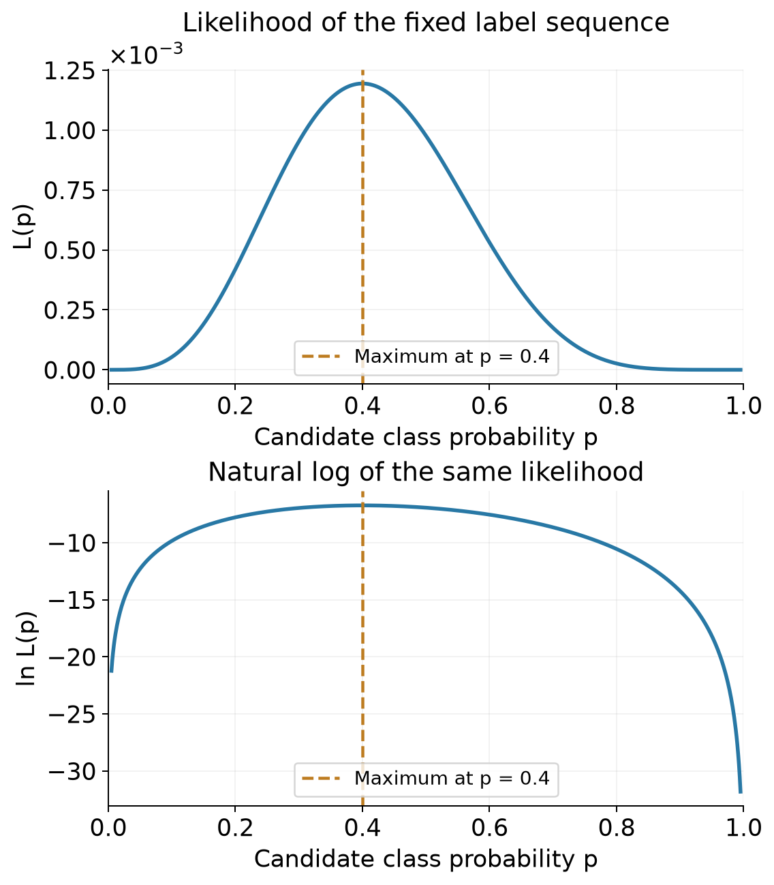

*上下图纵轴刻度不同，但金色线都穿过最高处p=0.4。上图纵轴的×10⁻³表示刻度还要乘0.001；图下半部的负数是对数值。读图时比较峰值的位置，而不是两图的纵轴高度。*

**完整例题 / Worked example**  
中文题：对上述4个类1、6个类2的固定序列，求最大化似然的p，并说明它为什么是最大值。  
English question: For the fixed independent label sequence with four class-1 and six class-2 outcomes, find the likelihood-maximizing p and justify that it is a maximum.

对0<p<1先取对数，再应用刚才的规则：

$$
\ell(p)=4\ln p+6\ln(1-p),\qquad
\ell'(p)=\frac4p-\frac6{1-p}.\tag{M.21}
$$

令导数为0，得到4(1−p)=6p，所以p=0.4。为了判断是不是山顶，把导数合成一个分式：

$$
\ell'(p)=\frac{4-10p}{p(1-p)}.\tag{M.22}
$$

区间内分母为正，p<0.4时分子为正，p>0.4时分子为负，因此函数先升后降；两个端点的L都为0。由此确认0.4是最大值。**English answer:** The log-likelihood derivative is 4/p−6/(1−p), which vanishes at p=0.4. It is positive before 0.4 and negative after it, while the endpoint likelihoods are zero, so p=0.4 is the maximizer.

老师还会使用 **second derivative（二阶导数）**：再对导数求一次导。负的二阶导数表示斜率持续减小，正的表示斜率持续增大；在可用的条件下可辅助判断峰谷。对本例，ℓ″(p)=−4/p²−6/(1−p)²<0，和我们刚才的判断一致。

**独立变式 / Try**  
中文题：① y=(2x−1)²，在x=3处的导数是多少？② E(u,v)=(u−1)²+(v−2)²，在(0,0)处两个偏导分别是多少？③ 一个新的固定独立标签序列有3个类1、2个类2，求最大似然p并说明为什么不能只报“导数为0”。  
English question: (1) Find the derivative of y=(2x−1)² at x=3. (2) Find both partial derivatives of E(u,v)=(u−1)²+(v−2)² at (0,0). (3) For a new fixed independent sequence with three class-1 and two class-2 outcomes, find the MLE of p and justify the maximum beyond stating that its derivative is zero.

<details markdown="1"><summary>展开答案 / Show answer</summary>

① 外层2(2x−1)乘内层2，在x=3时为20。② 两个偏导为−2、−4。③ 对数似然导数3/p−2/(1−p)=(3−5p)/[p(1−p)]，在p=0.6变号，由正变负，端点似然为0，故最大值在0.6。  
**English answer:** (1) The derivative is 4(2x−1), giving 20. (2) The partial derivatives are −2 and −4. (3) The log-likelihood derivative is (3−5p)/[p(1−p)]. It changes from positive to negative at 0.6 and the endpoint likelihoods are zero, establishing the maximum.

</details>

**English takeaway:** A derivative is a limiting local rate, not a finite-step identity. Apply the chain rule through every intermediate variable; partial derivatives hold other inputs fixed. Finding a maximum also requires domain and shape checks.

**回到课堂：** [先验MLE推导](../../CS5489/course-notes/Lecture02.md#prior-mle) · [高斯均值与方差求导](../../CS5489/course-notes/Lecture02.md#gaussian-mle) · [补课导航](MathForML.md#foundation-nav)

<a id="vectors-covariance"></a>
## 5. Vectors, matrices and covariance｜先数格子，再看一起怎样变化

### 5.1 一条记录是向量，很多条记录排成矩阵

假设每条记录有两个测量。把同一个类别里的四条人为教学记录写成(1,1)、(2,3)、(3,2)、(4,4)，数值均无量纲。一个 **vector（向量）**保存一条记录的有序特征；**matrix（矩阵）**则把很多数字按行列组织起来。

$$
X=\begin{pmatrix}1&1\\2&3\\3&2\\4&4\end{pmatrix}\in\mathbb R^{4\times2},
\qquad \mathbf{x}_2=\begin{pmatrix}2\\3\end{pmatrix}\in\mathbb R^2.\tag{M.23}
$$

X有4行、2列，写成4×2，顺序是“行数×列数”。第2行是一条记录；数学里把它单独拿出时，常写成竖着的 **column vector（列向量）**。ℝ²表示两个实数构成的向量空间，此处只需理解“有两个实数坐标”。

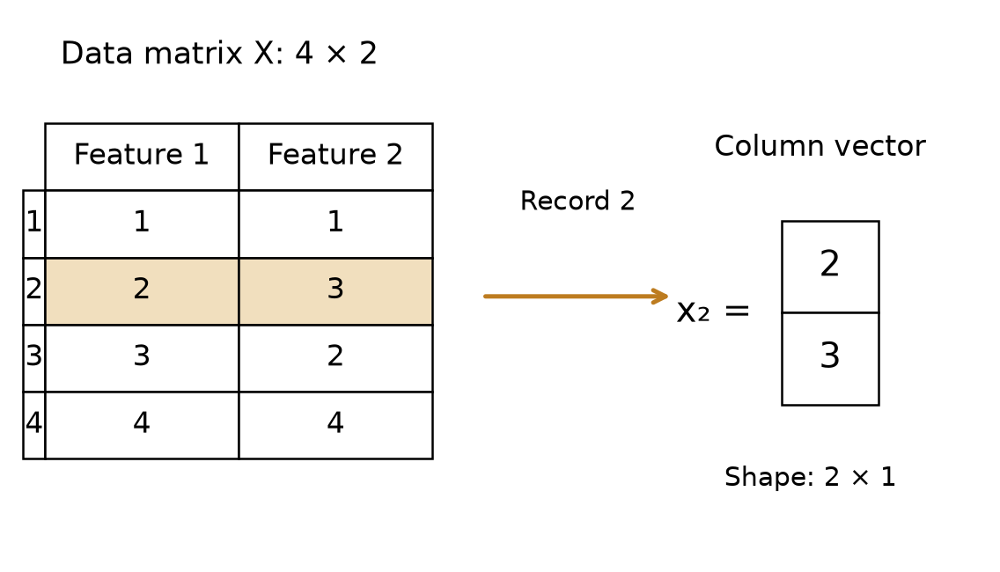

*金色行是第2条记录。按行存样本和把单条样本写成列向量是两种展示约定，不是不同的数据。别把“第2行”和“第2个特征列”交换。*

上标T表示 **transpose（转置）**，把行列互换。例如x₂ᵀ=(2,3)是1×2，Xᵀ是2×4。它不是平方，也不是把数值倒过来。写Xᵢⱼ时，下标i标第几行、j标第几列，因此X₂₁=2、X₂₂=3。

<a id="matrix-products"></a>
### 5.2 乘法的每一格，都有明确算法

两个长度相同的向量可以做 **dot product（点积、内积）**：对应位置相乘，再求和。令u=(2,3)ᵀ、v=(4,1)ᵀ：

$$
\mathbf{u}^T\mathbf{v}=2\times4+3\times1=11.\tag{M.24}
$$

这是1×2乘2×1，结果为1×1，即一个数。反过来u uᵀ是2×1乘1×2，得到2×2的 **outer product（外积）**：

$$
\mathbf{u}\mathbf{u}^T=
\begin{pmatrix}2\times2&2\times3\\3\times2&3\times3\end{pmatrix}
=\begin{pmatrix}4&6\\6&9\end{pmatrix}.\tag{M.25}
$$

交换乘法顺序，结果从一个数变成了一个矩阵。

对一般矩阵，(m×n)乘(n×k)得到(m×k)；中间的n必须相同。输出第i行第j列，是左矩阵第i行与右矩阵第j列的点积。

**完整例题 / Worked example**  
中文题：A=[[2,1],[0,1]]，x=(2,3)ᵀ。求Ax，说明每个输出来自哪里。  
English question: Let A=[[2,1],[0,1]] and x=(2,3)ᵀ. Compute Ax and explain the two output entries.

第一行[2,1]与x相乘，得到2×2+1×3=7；第二行[0,1]与x相乘，得到0×2+1×3=3：

$$
A\mathbf{x}=\begin{pmatrix}7\\3\end{pmatrix}.\tag{M.26}
$$

**English answer:** The result is (7,3)ᵀ. Each output is a row of A dotted with the input vector.

如果要对X的4条按行记录都应用同一个A，写XAᵀ，得到仍为4×2的结果；不能把按列写的Ax原样套成AX，因为A的2列对不上X的4行。代码里NumPy的`@`表示矩阵乘法，`*`通常表示逐元素乘法，读教师代码时必须区别。

回到Lecture 2：[继续读协方差估计代码](../../CS5489/course-notes/Lecture02.md#gaussian-code)。

<a id="mean-variance"></a>
### 5.3 平均数告诉你中心，方差告诉你散开多少

先回到一维。三个教学长度为2、4、6 cm，**mean（均值）**为(2+4+6)/3=4 cm。相对均值的偏差是−2、0、2 cm；直接相加正负抵消，无法表达“散得有多开”。

先把偏差平方，再取平均，就得到这里采用的经验 **variance（方差）**：

$$
\bar x=\frac1N\sum_{i=1}^N x_i,\qquad
v=\frac1N\sum_{i=1}^N(x_i-\bar x)^2.\tag{M.27}
$$

N是观测数，x̄表示样本均值。代入得到v=(4+0+4)/3=8/3 cm²。**Standard deviation（标准差）**是方差的平方根，s=√(8/3)≈1.633 cm，单位回到原长度单位。平方根取非负值。

这里分母是N，方便衔接本讲高斯MLE。另一种常见样本方差使用N−1，本例会得到4 cm²；它针对无偏估计的性质，不是可以不加说明地随意互换的写法。基础部分先固定N约定，原课代码的差异已在Lecture注明。

如果所有值都一样，方差为0；如果全部读数一起加100，均值加100而每个偏差不变，方差不变；如果全部读数乘3，偏差乘3，方差乘9、标准差乘3。这些检查比只看公式更容易发现单位或平方写错。

回到Lecture 2：[继续理解高斯分布的宽度](../../CS5489/course-notes/Lecture02.md#observation) · [继续估计均值与方差](../../CS5489/course-notes/Lecture02.md#gaussian-mle)。

<a id="covariance"></a>
### 5.4 两个特征一起动，怎样记账？

回到四条二维记录。两列均值都为2.5，先减去各列自己的均值：

| 记录 | 第一维偏差 | 第二维偏差 | 偏差乘积 |
|---|---:|---:|---:|
| (1,1) | −1.5 | −1.5 | 2.25 |
| (2,3) | −0.5 | 0.5 | −0.25 |
| (3,2) | 0.5 | −0.5 | −0.25 |
| (4,4) | 1.5 | 1.5 | 2.25 |

两个特征都高于各自均值、或都低于各自均值，乘积为正；一个高一个低，乘积为负。把这些乘积平均，得到 **covariance（协方差）**：

$$
s_{12}=\frac14(2.25-0.25-0.25+2.25)=1.\tag{M.28}
$$

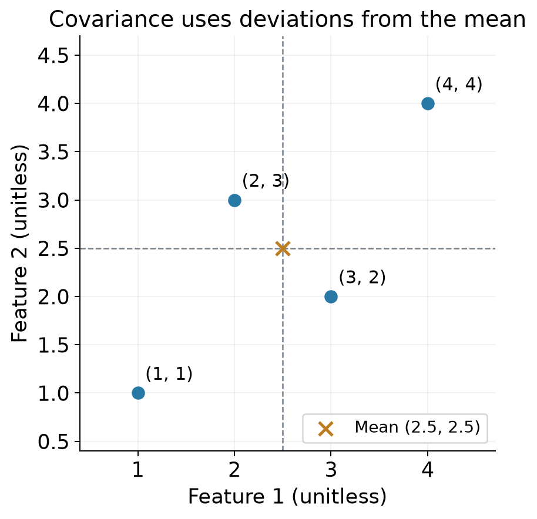

*看均值交叉线把平面分成的四块：(1,1)、(4,4)贡献正乘积；(2,3)、(3,2)贡献负乘积。最后是所有偏差乘积的平均，不是只挑最像直线的两个点。这里四点是同一类别内部的教学记录。*

每列自身的方差都为(2.25+0.25+0.25+2.25)/4=1.25。把它们与协方差排进矩阵：

$$
\hat\Sigma=\begin{pmatrix}1.25&1\\1&1.25\end{pmatrix}.\tag{M.29}
$$

对角线比较一个特征与它自己，所以是方差；非对角线比较不同特征，所以是协方差。它是对称的：先乘第一维再乘第二维，与反过来相同。这里Σ是矩阵名称，和带上下限的求和符号∑须按上下文区分。

刚学过的外积能一次记下全部偏差乘积。把第i条记录减均值得到列向量dᵢ=xᵢ−μ̂，则

$$
\hat\Sigma=\frac1N\sum_{i=1}^N\mathbf{d}_i\mathbf{d}_i^T.\tag{M.30}
$$

例如第一条的d₁=(−1.5,−1.5)ᵀ，外积四格都是2.25；第二条d₂=(−0.5,0.5)ᵀ，外积对角线为0.25、非对角线为−0.25。四个矩阵逐格相加再除以4，就得到上面的结果。这正是原课协方差估计式的含义。

协方差的单位是两个特征单位的乘积，改单位会改变数值。**Correlation（相关系数）**用两个标准差作归一化：当两者都非零时，r=s₁₂/(s₁s₂)。本例r=1/1.25=0.8。正相关描述一起变化的趋势，不能证明“第一项导致第二项”。

零协方差通常也不足以推出独立。比如一个变量X在−1、0、1上等可能取值，令Y=X²，二者协方差为0，但知道X就完全知道Y。它们显然不独立。联合高斯模型下，零协方差可以推出相应独立；这是带模型条件的结论。有限样本算到一个接近0的数，也不能单独证明真实分布就是这个模型。

回到Lecture 2：[继续理解完整协方差](../../CS5489/course-notes/Lecture02.md#full-gaussian)。

### 5.5 从共同变化到椭圆

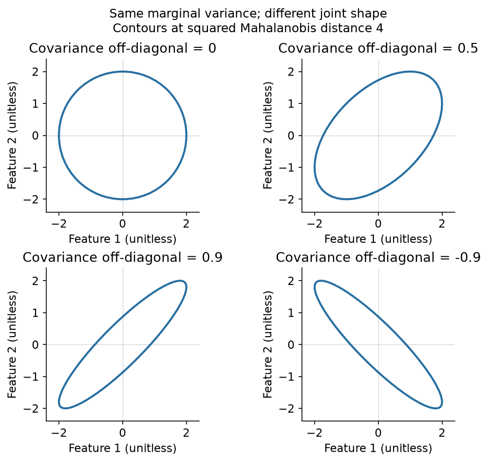

*复用已核查的Lecture2b，第36个单元的矩阵图：均值零、两维方差都为1，非对角元分别0、0.5、0.9、−0.9。正值让椭圆朝一起增大的方向倾斜，负值让它朝一增一减的方向倾斜。轮廓对应马氏距离平方4。*

这张图不要求你先会计算椭圆。先看同样的横纵波动范围，如何因为“是否一起变化”而形成不同形状。课堂中需要在每个类别内部估计这个形状，不能把所有类别混起来算一次，就当作每个类别的关系。

<a id="inverse-determinant"></a>
### 5.6 逆矩阵与行列式：能否倒回去，面积怎样变？

之前A把x=(2,3)ᵀ变成了(7,3)ᵀ。若能从结果唯一恢复原输入，这个反向操作可用 **inverse matrix（逆矩阵）**A⁻¹表示。单位矩阵I只保留原向量，A⁻¹A=I：

$$
I=\begin{pmatrix}1&0\\0&1\end{pmatrix},\qquad
A^{-1}=\begin{pmatrix}1/2&-1/2\\0&1\end{pmatrix}.\tag{M.31}
$$

用它恢复：(7/2−3/2,3)ᵀ=(2,3)ᵀ。矩阵的逆不是把每个元素分别倒数；那样还会在0的位置遇到除以0。

对一个2×2矩阵A=[[a,b],[c,d]]，**determinant（行列式）**为det(A)=ad−bc。若它非零，可以用

$$
A^{-1}=\frac1{ad-bc}\begin{pmatrix}d&-b\\-c&a\end{pmatrix}.\tag{M.32}
$$

本例det(A)=2。若det(A)=0，就没有这种通常的逆；例如[[1,1],[2,2]]把输出第二项永远变成第一项的两倍，许多不同输入被压到同一条线上，信息无法唯一恢复。不能把“逆不存在”处理成“逆矩阵是零”。

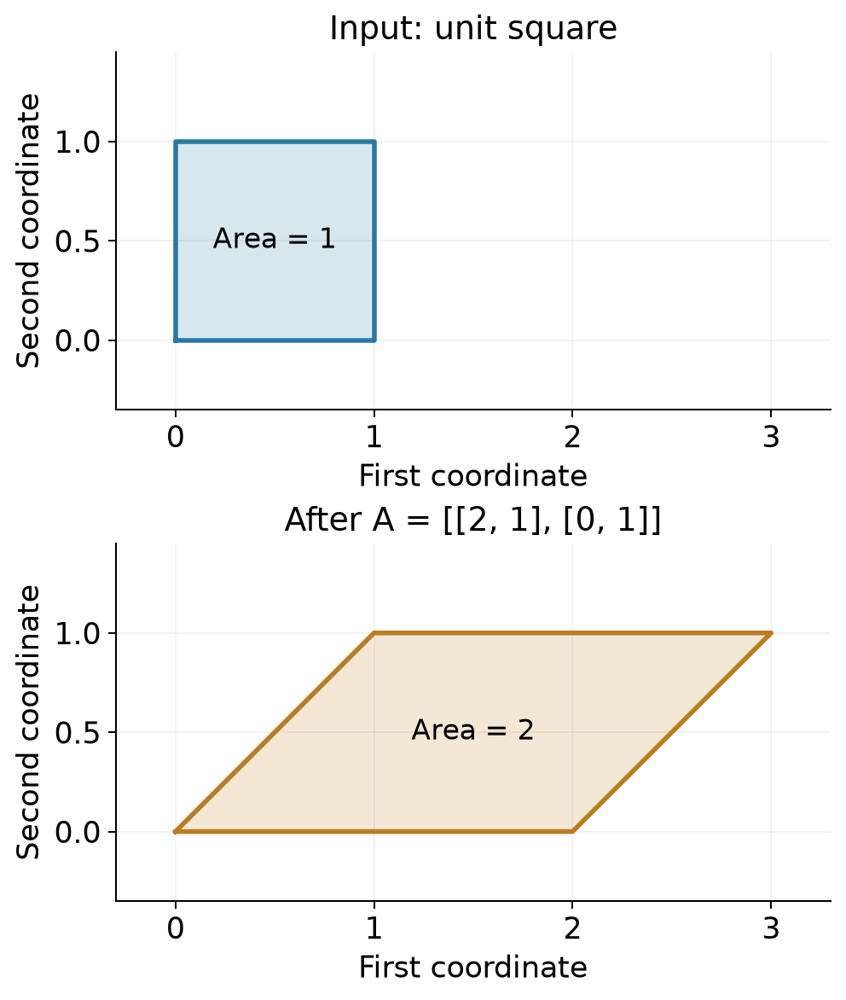

*上图单位正方形面积1，下图变换后的平行四边形面积2。两图坐标范围和纵横比例相同。|det(A)|给出面积缩放倍数；负行列式还表示方向翻转，但面积倍数取绝对值。*

把方形四个顶点分别乘A，就得到(0,0)、(2,0)、(3,1)、(1,1)。底长2、高1，面积为2，和行列式计算相互核对。这里坐标无量纲。

回到Lecture 2：[继续完整高斯的逆矩阵与行列式](../../CS5489/course-notes/Lecture02.md#full-gaussian)。

<a id="gaussian-bridge"></a>
### 5.7 回到高斯公式：先看形状，再算一项

原课的普通满维高斯密度要求协方差矩阵 **symmetric positive definite（对称正定）**。直观地说，每个非零方向都有正方差，没有把整片分布压扁成一条线。仅仅“某个矩阵可逆”不保证它是合法的协方差矩阵。重复特征或样本不足可能产生奇异协方差，原课会讨论正则化。

**完整例题 / Worked example**  
中文题：无量纲偏差向量d=(1,1)ᵀ，Σ=[[1,0.5],[0.5,1]]。分步求dᵀΣ⁻¹d，并与Σ=I比较。  
English question: For the dimensionless deviation d=(1,1)ᵀ and Σ=[[1,0.5],[0.5,1]], compute dᵀΣ⁻¹d step by step and compare it with the identity-covariance case.

1. 先求行列式：1×1−0.5×0.5=0.75，非零。
2. 用2×2逆公式，Σ⁻¹=(1/0.75)[[1,−0.5],[−0.5,1]]。
3. 先算Σ⁻¹d=(2/3,2/3)ᵀ，结果仍是2×1。
4. 再用dᵀ点乘，得到1×2/3+1×2/3=4/3；若Σ=I，则为1²+1²=2。

**English answer:** det(Σ)=0.75, Σ⁻¹d=(2/3,2/3)ᵀ, and dᵀΣ⁻¹d=4/3. Identity covariance gives 2. The positive-correlation model penalizes this joint deviation less.

这叫 **squared Mahalanobis distance（马氏距离的平方）**。偏差在共同增大的方向时，正相关模型觉得它不那么意外；但分类还要考虑分布宽度与先验，完整决策继续回Lecture学习。

最后注意面积缩放的平方根：上面|det(A)|是坐标变换x=Az的面积倍数；高斯协方差记录的是平方后的变化量。若两个方向的标准差分别2、1，协方差是diag(4,1)，行列式为4，但等标准距离椭圆的面积相对单位圆只扩大2倍，即√det(Σ)。一般写成Σ=AAᵀ时，也有|det(A)|=√det(Σ)。因此高斯密度的归一化项包含√det(Σ)，不能直接把det(Σ)当成椭圆面积。

**独立变式 / Try**  
中文题：① u=(1,2)ᵀ、v=(3,4)ᵀ，求uᵀv。② B=diag(3,2)，求B的行列式、逆矩阵，以及把(1,2)ᵀ变换后再恢复的结果。③ 四条同类教学记录为(0,0)、(0,2)、(2,0)、(2,2)，按分母N求均值与协方差；能否仅凭经验协方差为0就断言真实生成过程独立？  
English question: (1) Find uᵀv for u=(1,2)ᵀ and v=(3,4)ᵀ. (2) For B=diag(3,2), find its determinant and inverse, transform (1,2)ᵀ and recover the original vector. (3) For four same-class teaching records (0,0), (0,2), (2,0), (2,2), compute the mean and covariance using denominator N. Does zero empirical covariance alone establish independence of the true generating process?

<details markdown="1"><summary>展开答案 / Show answer</summary>

① 点积3+8=11。② det(B)=6，B⁻¹=diag(1/3,1/2)；变换为(3,4)ᵀ，再恢复为(1,2)ᵀ。③ 均值(1,1)ᵀ，两列偏差平方均值都为1，交叉乘积1−1−1+1=0，所以协方差为I。仅凭有限样本的零协方差不足以证明真实过程独立，还需要分布与抽样方面的依据。  
**English answer:** (1) The dot product is 11. (2) det(B)=6, B⁻¹=diag(1/3,1/2), the transformed vector is (3,4)ᵀ and the recovered vector is (1,2)ᵀ. (3) The mean is (1,1)ᵀ and the covariance is I. Zero empirical covariance alone does not establish independence of the true process.

</details>

**English takeaway:** Track matrix shapes before calculating. Covariance averages products of centered features, and its diagonal contains variances. Inverses require appropriate conditions; determinants describe scaling. Gaussian density uses a positive-definite covariance and a square-root determinant normalization.

**回到课堂：** [Lecture1：数组](../../CS5489/course-notes/Lecture01.md#arrays) · [Tutorial3：图像矩阵](../../CS5489/course-notes/Tutorial03.ipynb#data-input) · [两项测量与Gaussian NB](../../CS5489/course-notes/Lecture02.md#gaussian-nb) · [高斯均值与方差](../../CS5489/course-notes/Lecture02.md#gaussian-mle) · [完整高斯的距离与宽度](../../CS5489/course-notes/Lecture02.md#full-gaussian) · [协方差估计与代码](../../CS5489/course-notes/Lecture02.md#gaussian-code) · [补课导航](MathForML.md#foundation-nav)

<a id="combinations"></a>
## 6. Combinations and binomial probability｜先列小名单，再写大公式

咖啡店里有甲、乙、丙三个人，每人可能正在上传，也可能暂时安静。“恰好两个人上传”包括甲乙、甲丙、乙丙三种。甲乙和乙甲是同一批人，没有先后次序，这就是组合（combination）。它与“谁先谁后”的排列不同。

从n个人中选k个人：先按顺序选有 $n(n-1)\cdots(n-k+1)$ 种，但同一组k个人的顺序有 $k!=k(k-1)\cdots1$ 种，除掉重复：

$$
\binom nk=\frac{n!}{k!(n-k)!},\qquad 0!=1,\quad0\le k\le n.\tag{M.33}
$$

例如 $\binom32=3\times2/(2\times1)=3$。$\binom n0=1$：谁也不选，是一种空集合，不是没有可能情况。阶乘只是一种连乘记号，不需要先学一套新的运算。

若每人**独立**以概率p活跃，特定状态“甲乙活跃、丙安静”的概率为 $p\times p\times(1-p)$。恰两人活跃要把三个互不重叠的状态相加，得到 $3p^2(1-p)$。一般地，活跃人数 $K\sim\operatorname{Binomial}(n,p)$：

$$
P(K=k)=\binom nk p^k(1-p)^{n-k}.\tag{M.34}
$$

前项数“有几种人选”，后项算“每种人选有多可能”。独立且相同p是这个公式的条件。如果大家同时下课一起上传，独立假设可能失效，不能只因为有n个人就套二项分布。

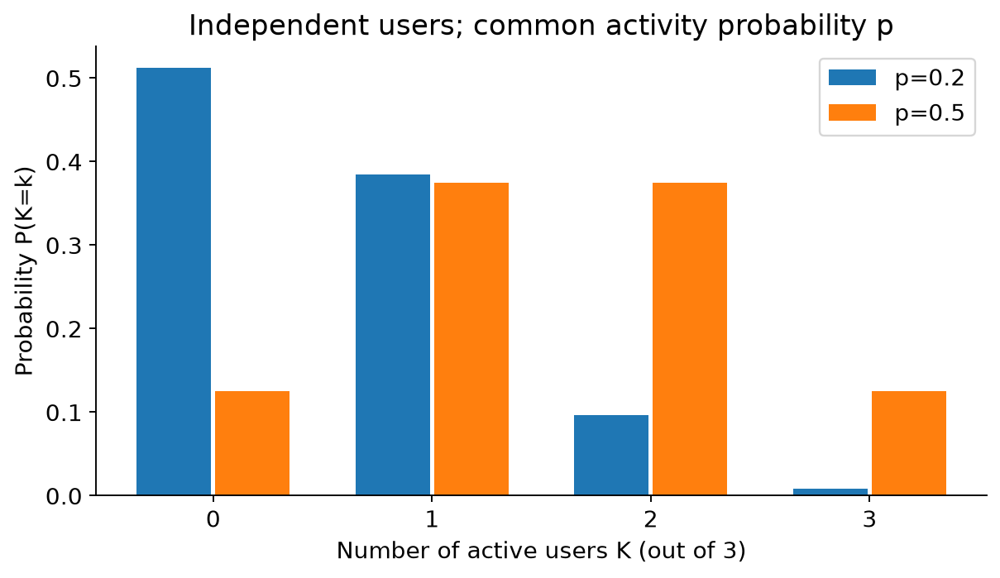

看图：总人数相同，p变大时概率移向右侧；每组柱的总和仍是1。不是八种状态必然等概率，只有p=0.5时每个具体开关状态才都等概率。

**完整算例（补充）**：三人、p=0.2，一条链路最多同时容纳两人的即时需求。超额恰在三人全活跃，概率 $0.2^3=0.008$。恰两人概率 $3(0.2)^2(0.8)=0.096$。两人用满容量不等于超额，题目若问“至少两人”则需相加得0.104。

**自查/变式 / Check and transfer:** 四个独立用户各以0.5概率活跃，容量只容纳两人，超额概率？ / Four independent users are active with probability 0.5 each. Capacity supports two users. What is the probability of excess demand?

<details markdown="1"><summary>答案 / Answer</summary>

恰3人有4种，恰4人有1种，每种状态概率1/16。超额概率 $(4+1)/16=5/16=0.3125$。 / Excess demand means 3 or 4 active users, giving (4+1)/16=0.3125. 不要把正好2人算进去。

</details>

**English takeaway:** Count the possible subsets, then multiply by the probability of each independent state. Capacity exceeded means strictly more than capacity.

返回：[CS5222 Chapter1：共享链路](../../CS5222/course-notes/Chapter01.md#switching) · [Tutorial1 Q4](../../CS5222/course-notes/Tutorial01.md#q4) · [导航](MathForML.md#foundation-nav)

<a id="projection"></a>
## 7. Length, orthogonality and projection｜沿一个方向走，剩下多少走不到

在坐标平面走到(3,4)：横着走3、竖着走4，直线距离是5。向量 $v=(v_1,v_2)$ 的欧氏长度（Euclidean norm）由勾股定理得到 $\|v\|=\sqrt{v_1^2+v_2^2}$；更多维时把所有分量平方相加再开方。不能把长度误写成分量简单相加，例如(3,−3)不是零长度。

想只保留方向，就把非零v除以长度：$q=v/\|v\|$，于是 $\|q\|=1$。q叫单位向量。零向量没有这种归一化方向，代码必须处理这个情况。

点积 $u^Tv=\sum_j u_jv_j$ 衡量两个方向的配合。非零u、v垂直时点积0，称正交（orthogonal）；正交归一（orthonormal）还要求每个长度1。各自长度1不保证互相垂直，两个相同的单位向量显然仍挤在同一条路上。

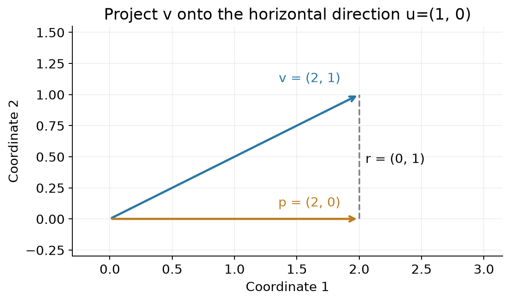

图中 $u=(1,0),v=(2,1)$。沿u方向只能走到横轴；离v最近的横轴点是p=(2,0)，剩下r=(0,1)垂直u。p叫v在u方向的投影（projection）。类比手电筒投影时要注意：这里是垂直投影，不是任意灯光角度的影子。

怎么计算？沿u方向的点可写成 $p=au$。要求余下 $r=v-au$ 与u垂直：

$$
u^T(v-au)=0\ \Rightarrow\ u^Tv-a(u^Tu)=0\ \Rightarrow\ a=\frac{u^Tv}{u^Tu}.\tag{M.35}
$$

所以 $p=(u^Tv)/(u^Tu)\,u$。如果u已经归一化为q，分母=1，写成 $(q^Tv)q$。向量维度必须相同，u必须非零。这个分母是长度平方，不是长度。

**完整算例（补充）**：u=(1,1)、v=(3,1)。点积4，u长度平方2；a=2，p=(2,2)，r=(1,−1)。检查：p+r=v，uᵀr=0，$\|v\|^2=10=8+2=\|p\|^2+\|r\|^2$。我们同时得到“方向成分”和“不在这个方向里的信息”。

一组向量所有线性组合形成的集合叫张成空间（span）。一条非零向量张成过原点的一条线，两条不共线向量能张成整个二维平面。Gram–Schmidt每次减去已有正交方向的投影，再将余下方向归一化；若余量为0，说明新向量没带来新方向。算法正文在Tutorial1，这里先把“减掉的是什么”讲明白。

**自查/变式 / Check and transfer:** 将v=(4,2)投影到u=(1,−1)，求p、r并检查垂直。 / Project v=(4,2) onto u=(1,−1), compute p and r, and verify orthogonality.

<details markdown="1"><summary>答案 / Answer</summary>

$u^Tv=2,u^Tu=2$，a=1，p=(1,−1)，r=(3,3)，uᵀr=3−3=0。 / The projection is (1,−1), the residual is (3,3), and their direction check gives zero. r长度不是0，v不在u张成的直线上。

</details>

**English takeaway:** Projection extracts the component along an existing direction. Subtracting it leaves a perpendicular residual; normalization alone does not create orthogonality.

返回：[Tutorial1：Gram–Schmidt](../../CS5489/course-notes/Tutorial01.ipynb#gram-schmidt) · [Lecture3：间隔](../../CS5489/course-notes/Lecture03.md#svm) · [导航](MathForML.md#foundation-nav)

<a id="rank-pseudoinverse"></a>
## 8. Rank and pseudoinverse｜两条重复信息，不会变成两条独立线索

假设表格记录“面积（平方米）”和“面积（平方厘米）”。第二列永远是第一列的10000倍，没有提供第二种独立信息。矩阵的秩（rank）数的是独立方向，不是看起来有多少列。

先用更小的矩阵 $A=\begin{bmatrix}1&1\\2&2\end{bmatrix}$。它的两列相同，秩=1。求 $Aw=y$，若y=(3,6)，条件只有 $w_1+w_2=3$；(3,0)、(1,2)、(1.5,1.5)都能解。没有唯一逆能告诉我们“这3究竟分给谁”。

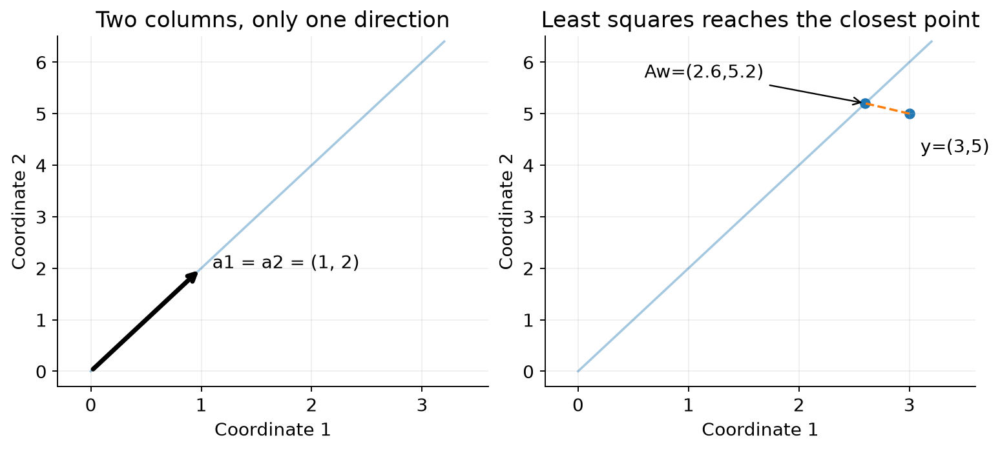

图左把两个重复列画在同一方向，图右将无法精确拟合的y投影到列空间。看不懂“列空间”时，可把它读成“把A各列加权相加所能到达的全部地方”。

再把y改为(3,5)，现在第一行希望和为3，第二行希望和为2.5，两者不能都满足。最小二乘不再问“有没有精确解”，而问“哪一个可达向量离y最近”。设s=w₁+w₂，误差

$$
E(s)=(3-s)^2+(5-2s)^2=5s^2-26s+34.\tag{M.36}
$$

求导 $10s-26=0$，得s=2.6，预测(2.6,5.2)，残差(0.4,−0.2)。残差与列(1,2)点积0，正好与前面的投影衔接。最优系数仍不唯一；伪逆（pseudoinverse）选其中长度最小的解w=(1.3,1.3)。

为什么平均分最短？固定 $w_1+w_2=s$，令 $w_1=s/2+t,w_2=s/2-t$，长度平方为 $s^2/2+2t^2$，在t=0最小。伪逆不是“给不存在的普通逆编一个值”，而是约定一个满足最小二乘/最小范数条件的解，记为 $A^+$。

```python
import numpy as np
A = np.array([[1.,1.],[2.,2.]])
y = np.array([3.,5.])
w, residuals, rank, singular_values = np.linalg.lstsq(A, y, rcond=None)
# w=[1.3,1.3], rank=1; compute y-A@w directly to inspect residuals.
```

接近重复而非完全重复时，矩阵可能可逆却病态（ill-conditioned）：很小数据变化造成很大系数变化。可逆不是“数值稳定”的同义词。Ridge在被惩罚方向加正数，限制不稳定权重；具体目标在Lecture4讲。

**自查/变式 / Check and transfer:** 同一个A，y=(4,8)。最小范数解、预测和残差？ / For the same A and y=(4,8), find the minimum-norm solution, prediction and residual.

<details markdown="1"><summary>答案 / Answer</summary>

w=(2,2)，预测(4,8)，残差0；仍有其他精确解，但其长度更大。 / w=(2,2), prediction=(4,8), zero residual; other exact solutions have larger norm.

</details>

**English takeaway:** Rank counts independent directions. A pseudoinverse provides the minimum-norm least-squares solution even when an ordinary inverse does not exist.

返回：[Lecture4：OLS矩阵解](../../CS5489/course-notes/Lecture04.md#ols) · [Lecture1：线性代数](../../CS5489/course-notes/Lecture01.md#linear-algebra) · [导航](MathForML.md#foundation-nav)

<a id="optimization"></a>
## 9. Gradients and constraints｜下山之前，先看哪里允许走

前面一元导数回答“x多一点，函数怎么变”。现在同时有两个参数，代价 $E(w_1,w_2)=w_1^2+2w_2^2$。固定w₂，对w₁求导得2w₁；固定w₁，对w₂求导得4w₂。把两个偏导按变量顺序装成向量：

$$
\nabla E=(2w_1,4w_2)^T.\tag{M.37}
$$

这个向量叫梯度（gradient）。在(1,1)，梯度(2,4)：往w₂方向多走一点，局部增加代价更快。负梯度是局部最陡下降方向（欧氏度量），梯度下降一次 $w\leftarrow w-\eta\nabla E$。eta=0.1时(1,1)变(0.8,0.6)，代价从3降为1.36。

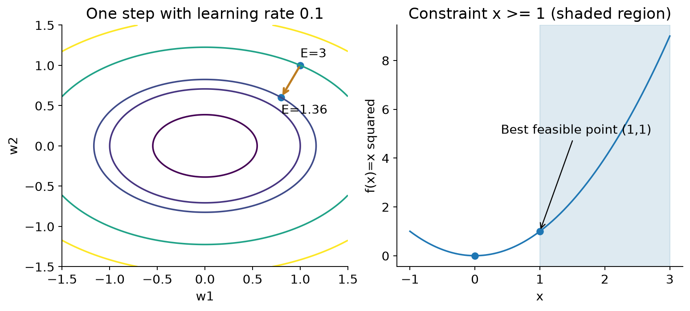

图左沿椭圆等高线观察一次下降，箭头不是保证“无论走多远都下坡”。eta=1时更新到(−1,−3)，代价37，反而冲过了谷底。学习率决定步长，需要检查目标是否合理下降。

有约束时，还要看允许去哪里。想最小化 $f(x)=x^2$，但规定 $x\ge1$。无约束最低点0去不了，可行集合（feasible set）是[1,∞)，最小值在边界x=1。这里 f′(1)=2，不是0；这解释了为什么不能对每个受限问题只背“令导数为0”。

把限制写成 $g(x)=x-1\ge0$，引入非负乘子lambda，写拉格朗日函数 $L(x,\lambda)=f(x)-\lambda g(x)$。在解处检查四件事：

1. 可行：g(x)≥0；
2. 乘子：lambda≥0；
3. 对原变量的驻点：f′(x)−lambda g′(x)=0；
4. 互补松弛：lambda g(x)=0。

本例x=1使g=0，驻点式2−lambda=0给lambda=2，四件事都满足。若限制改成 $x\ge-1$，无约束最小点0已可行，g(0)=1>0，lambda=0，约束没挡路。

这些是适当条件下的KKT条件，不是任意非凸问题的全局最优证明。互补松弛只要求乘积0：lambda>0推出g=0，g>0推出lambda=0；g=0不保证lambda>0。比如最小化x²且x≥0，解x=0恰在边界，但lambda=0。这正是SVM“在margin上却可能零乘子”的入门反例。

**自查/变式 / Check and transfer:** 最小化 $(x-3)^2$ 且x≤2，求解与乘子。先统一写g≥0。 / Minimize (x−3)² subject to x≤2. Write g≥0 and find the solution and multiplier.

<details markdown="1"><summary>答案 / Answer</summary>

g=2−x≥0，L=(x−3)²−lambda(2−x)。可行范围内最接近3的是x=2，驻点式 $2(x-3)+\lambda=0$ 给lambda=2。 / x=2, lambda=2, with g=2−x and L=(x−3)²−lambda(2−x). 注意g′=−1，所以lambda在导数里带加号。

</details>

**English takeaway:** A gradient collects partial derivatives. Under constraints, the best feasible point may lie on a boundary with a nonzero objective gradient; KKT conditions track this interaction.

返回：[Lecture3：Logistic Regression](../../CS5489/course-notes/Lecture03.md#logistic) · [Lecture3：SVM对偶](../../CS5489/course-notes/Lecture03.md#dual) · [Lecture4：OLS](../../CS5489/course-notes/Lecture04.md#ols) · [导航](MathForML.md#foundation-nav)

<a id="batch-gradients"></a>
## 10. Batch gradients｜两行数据，为什么只更新一个偏置？

[回到Lecture5反向传播](../../CS5489/course-notes/Lecture05.md#batch-backprop) · [回到Assignment2](../../CS5489/course-notes/Assignment02.md#interfaces)

这一节解释反向传播中的批量求导与共享参数。先想两天的温度都要加同一个校准值b。第一天结果对b的影响记为g₁，第二天记为g₂。调整b会同时影响两天，所以总影响是g₁+g₂；不能只留一天，也不能给每一天偷偷创建一个新的b。

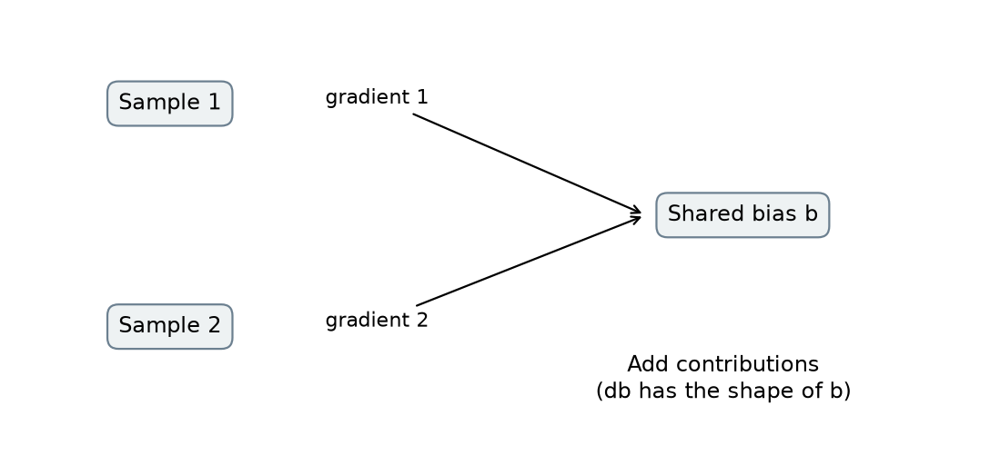

图中两条箭头是两条导数贡献，不是两个偏置参数。连续经过两步计算时，局部影响相乘；一个量被多处使用时，各条路径的影响相加。这是链式法则在计算图中的两条基本规则。

### 10.1 从一行扩到两行

一条记录$x=(x_1,x_2)$乘矩阵A，得到输出$u=xA+b$。两条记录排成X的两行，仍乘同一个A。设

$$
X=\begin{bmatrix}1&2\\3&4\end{bmatrix},\quad
G=\frac{\partial L}{\partial U}=\begin{bmatrix}1&-1\\2&0\end{bmatrix}.\tag{M.38}
$$

G每一格表示对应输出稍增一点，损失会怎样变。某权重$A_{jk}$同时影响所有样本的第k个输出，因此

$$
\frac{\partial L}{\partial A_{jk}}=\sum_i X_{ij}G_{ik}.\tag{M.39}
$$

四格分别为1×1+3×2=7，1×(−1)+3×0=−1，2×1+4×2=10，2×(−1)+4×0=−2。把这些求和排成矩阵，就是

$$
\nabla_A L=X^TG=\begin{bmatrix}7&-1\\10&-2\end{bmatrix},\qquad
\nabla_b L=\sum_iG_{i,:}=(3,-1).\tag{M.40}
$$

这里的转置有具体作用：X的每一列是某个输入特征，把它变成一行，才能与某输出的逐样本梯度作点积。若X为B×d，G为B×h，结果就是d×h，和A同形。

### 10.2 Jacobian是“一张影响关系表”

输入有两个分量、输出也有两个分量，Jacobian第j行第k列记$\partial f_j/\partial x_k$。例如$f(x_1,x_2)=(2x_1,x_1+x_2)$，表为

$$
J=\begin{bmatrix}2&0\\1&1\end{bmatrix}.\tag{M.41}
$$

若下游损失对两个输出的列梯度是(3,4)，输入梯度为$J^T(3,4)^T=(10,4)^T$：x₁沿两条路线影响损失，贡献6+4；x₂只有一条路线贡献4。这就是为什么一般向量函数不能只逐元素相乘。

逐元素激活比较特殊：第j个输出只依赖第j个输入，Jacobian的非对角线为0，所以计算可简化为逐元素乘。矩阵乘法、softmax等跨分量作用的函数不满足这个简化条件。

### 10.3 平均因子在哪里？

如果$L=(L_1+L_2)/2$，每个样本给总损失的贡献都缩小一半。可以在反传入口把梯度除2一次，后面的求和照常进行。已经除过后，在每一层又除2，会让前面层的梯度多缩小，不再是原目标的导数。

同理，正则项$\lambda\|A\|_F^2/2$的导数是λA；Frobenius范数平方就是每格平方再求和。它不是对每个样本分别添加一次后再随意缩放。先把一个标量目标写清，才能知道程序各层应该求和还是平均。

### 10.4 指数也能是需要学习的数

以前对$x^2$求x的导数，现在固定x，对指数n求$x^n$的导数。对于x>0，写成$e^{n\ln x}$，链式法则得到$x^n\ln x$。比如x=2，增加n会增加输出，导数为正；x=0.5，增加n会减小输出，导数为负。对数的定义域说明为什么不能不加分支地对负数使用这个公式。

**完整例子 / Worked：** x=2、n=2，下游梯度3。对x的梯度是$3n x^{n-1}=12$，对n是$3x^n\ln x\approx8.3178$。 / For x=2, n=2 and upstream derivative 3, the input gradient is 12 and the exponent gradient is 12 ln2≈8.3178.

**独立题 / Check：** 两样本对共享偏置的梯度为(2,−1)和(−3,4)，上游已经包含平均因子，偏置梯度是什么，还要除2吗？ / Two samples contribute (2,−1) and (−3,4) to a shared bias. The upstream gradients already include averaging. Find the bias gradient and state whether to divide by two again.

<details markdown="1"><summary>答案 / Answer</summary>

(−1,3)，不再除2。 / (−1,3), with no second averaging factor.

</details>

**English takeaway:** Match every derivative to its parameter shape. Multiply derivatives along a path, add them across branches or shared uses, and account for loss averaging exactly once.

[回到Lecture5：完整反传](../../CS5489/course-notes/Lecture05.md#batch-backprop) · [回到作业：可学习指数](../../CS5489/course-notes/Assignment02.md#learnable-activation)


<a id="sources"></a>
## 这些补课从哪里来，学到哪里为止？

这些专题按当前课程需要组织：前五节衔接Lecture2，组合概率用于网络课，投影、伪逆和优化衔接后续Lecture/Tutorial，批量梯度用于Lecture5与Assignment2。例子和推导为教学补充，按需要选读。

| 专题 | 当前课程需要它的位置 | 复用与补充 |
|---|---|---|
| 符号、函数、数组 | Lecture2a，第4–17个单元；Lecture2b，第6–15个单元 | 水箱、下标和数组形状的教学例子 |
| 概率与密度 | Lecture2a，第9–25、32–40个单元 | 邮件计数表、均匀等待时间与标准正态面积的教学例子 |
| 指数与对数 | Lecture2a，第13–15、41–47个单元；Lecture2b，第89–92个单元 | 两模型的概率比较；指数／对数曲线与定义域 |
| 导数与极值 | Lecture2a，第15、26–28个单元 | 差商、链式法则、偏导与似然峰值的教学例子 |
| 矩阵与协方差 | Lecture2b，第33–44个单元 | 原第36个单元的协方差模型；四条记录与矩阵操作为教学补充 |
| 组合与二项概率 | CS5222 Chapter1统计复用、Tutorial1 Q4 | 从3用户列举到n用户；教学补充，条件明确 |
| 长度与投影 | Tutorial1，第35–45个单元；Lecture3b，第27–36个单元 | 衔接原Gram–Schmidt和margin，算法留在课程正文 |
| 秩与伪逆 | Lecture4a，第19–21、43–49个单元 | 展开逆不存在与最小范数的具体例子 |
| 梯度与约束 | Lecture3a，第52个单元；Lecture3b，第37–44个单元；SVM.pdf第2–4页 | 展开原课求导与KKT前提，不代替SVM推导 |

表中单元号从原Notebook第1个单元起算，包含文字与代码，不是In[n]执行编号。

绘图的输入、参数与来源在[figure-data.json](figure-data.json)，可复现脚本为[build_figures.py](tools/build_figures.py)。图中英文坐标保持与课堂术语一致，中文读图说明在图旁。

组合、投影、伪逆和约束部分的图与计算见 [extend_figures.py](tools/extend_figures.py) 和 [extra-figure-data.json](extra-figure-data.json)，各图的参数与计算过程可在这些文件中回查。学习网络单位和报文读法请用[Network Basics](NetworkBasics.md)。

掌握需要的基础后，回到相应课程完成老师的模型、推导和任务。更完整的微积分、线性代数证明与优化方法，等后续课程真正用到时再补。
