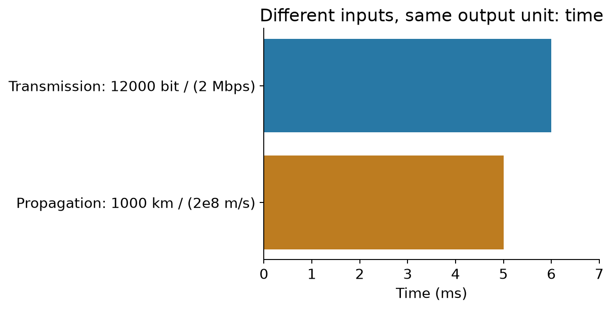

# Network Basics｜把单位、字节和时间轴读明白

**可选基础补课 · 2026-09-23**

[CS5222目录](../../CS5222/course-notes/README.md) · [数学补课](MathForML.md#foundation-nav)

网络计算最常见的绊脚石，不是公式复杂，而是把字节当比特、把距离当速率、把“第一个到”当“整个都到了”。这份补课只拆这些台阶，协议机制仍在 Chapter 正文讲。小算例均为教学补充。

| 卡在哪里 | 入口 | 自查（展开本节可见答案） |
|---|---|---|
| bit、byte、Mbps分不清 | [单位与数量级](NetworkBasics.md#units) | 1500 B以2 Mbps发出要多久？ |
| 二进制和IP字段陌生 | [二进制与字节](NetworkBasics.md#binary) | 00000101表示多少？ |
| 英文报文看起来像乱码 | [报文、字段与分隔](NetworkBasics.md#messages) | CRLF空行起什么作用？ |
| 时间轴不知道从哪里数 | [第一位、最后一位和流水线](NetworkBasics.md#timeline) | 2 ms发送、8 ms传播，最后一位何时到？ |

<a id="units"></a>
## 1. Bit, byte and rate｜仓库有多少货，和每秒搬多少货，是两件事

bit（比特）是一个二进制位，可取0或1。byte（字节）通常是8 bit，本课程采用8位字节。大写B与小写b不能省略：1500 B=12000 bit；文件大小是数量，2 Mbps是每秒2000000 bit的速率。

本课程网络速率用十进制：k=10³，M=10⁶，G=10⁹。时间中milli是千分之一（ms=10⁻³s），micro是百万分之一（µs=10⁻⁶s）；Mbps中的大写M和ms中的小写m方向相反。KiB、MiB才明确表示1024、1024²字节；题目中的Mbps按十进制换算。

$$
\text{发送时间}=\frac{\text{数据量(bit)}}{\text{速率(bit/s)}}.\tag{N.1}
$$

**完整算例 / Worked example:** 1500 B、R=2 Mbps。先换 $L=1500\times8=12000$ bit，再算 $L/R=12000/(2\times10^6)=0.006$ s=6 ms。单位“bit÷bit/s”最后剩s，是一个自带报警器：如果还剩米或字节，通常哪里没对齐。

传播是另一件事。距离d=1000 km=10⁶m，速度s=2×10⁸m/s，$d/s=0.005$s=5ms。提高链路发送速率R不等于让电磁信号速度s跟着翻倍。



图左是“把多少bit送上路”，图右是“已经上路的bit走多远”。两个除法输出同为秒，但分子和分母的含义不同。带宽还可能在物理通信里指Hz频宽；本章说link bandwidth时通常指bit/s容量，要看上下文。

**变式 / Transfer:** 1000 B以10 Mbps发送，链路2000 km、传播速度2×10⁸m/s，忽略其他时延，整包到达要多久？ / Send 1000 B at 10 Mbps over 2000 km at propagation speed 2×10⁸ m/s. Ignore other delays and find complete-packet arrival time.

<details markdown="1"><summary>答案 / Answer</summary>

发送0.8ms，传播10ms，总10.8ms。 / Transmission is 0.8 ms, propagation is 10 ms, total 10.8 ms. 计算前先把B换成bit、Mbps换成bit/s。

</details>

**English:** A byte contains eight bits. Convert all quantities before dividing; link rate and propagation speed describe different processes.

返回：[Chapter1：时延](../../CS5222/course-notes/Chapter01.md#delay) · [Tutorial2](../../CS5222/course-notes/Tutorial02.md) · [Assignment1 P6](../../CS5222/course-notes/Assignment01.md#p6)

<a id="binary"></a>
## 2. Binary and octets｜位的位置，也在贡献数值

十进制305表示3×100+0×10+5×1。二进制每向左一位权重翻倍：一个8位字节的权重是128、64、32、16、8、4、2、1。

| 位权 | 128 | 64 | 32 | 16 | 8 | 4 | 2 | 1 |
|---|---|---|---|---|---|---|---|---|
| 00000101 | 0 | 0 | 0 | 0 | 0 | 1 | 0 | 1 |

只把为1的列相加，4+1=5。8位无符号数最小0、最大255，共256种。IPv4地址用四个这样的八位组（octet）展示，例如192.0.2.1：192=128+64，写为11000000；整个地址是32位。这个例子使用文档示例地址，不是让你访问的真实服务器。

端口号是另一个字段，帮助定位主机上的服务/进程；并不是IP的“第五个点分数字”。域名是人方便使用的名称，经DNS解析得到记录；名称、IP和端口分别回答不同问题。协议更详细的命名、寻址与复用在Chapter2讲。

十六进制（hexadecimal）每位代表4个二进制位，数字0–9后用A–F表示10–15。0x0D=13，0x0A=10，所以能在抓包中用紧凑的两位hex表示一个字节。`0x`是记号，不是额外数据。

**变式 / Transfer:** 00001010的十进制值是多少？11000000呢？ / Convert these two binary octets to decimal.

<details markdown="1"><summary>答案 / Answer</summary>

8+2=10；128+64=192。 / They represent 10 and 192. 前导0不改变数值，却帮助我们看出字段固定8位。

</details>

**English:** Binary digits are weighted by powers of two. An IPv4 address contains four octets; a port identifies a transport endpoint within a host context.

返回：[Chapter1：转发表示](../../CS5222/course-notes/Chapter01.md#core) · [Chapter2：进程与socket](../../CS5222/course-notes/Chapter02.md#processes)

<a id="messages"></a>
## 3. Messages and bytes｜一段报文不是一整块没有边界的文字

先看教学HTTP例子，保留英文协议文本：

```text
GET /notes.html HTTP/1.1\r\n
Host: example.com\r\n
Connection: close\r\n
\r\n
```

第一行是方法、路径、版本；后面是键值头字段。这里展示的`\r\n`是两个控制字节的可读写法：CR（carriage return，0x0D）和LF（line feed，0x0A），不是反斜杠、r、反斜杠、n四个普通字节。连续CRLF形成空行，结束头部；不是每个报文都有非空body。

文本字符串与字节序列要区分：Python的`'A'`是文本，`b'A'`是ASCII字节；`'A'.encode('utf-8')`得到一个字节，而汉字在UTF-8下通常需要多个字节。因此`len(text)`不总等于网络发送的字节数。原Tutorial3使用ASCII报文，ASCII范围一个字符对应一个字节。

TCP提供有序字节流，应用必须自己定义消息边界；一次`send`不保证对应对方一次`recv`。UDP保留数据报边界，但接收缓冲不够会截断；可靠性与顺序不是默认保证。这里先知道“读到了几个字节”和“收齐一个完整应用消息”可能不同。

**变式 / Transfer:** `b'OK\r\n'`有多少字节？报文头中的User-Agent能否证明实际浏览器品牌？ / How many bytes are in b'OK\r\n', and does User-Agent prove the actual browser identity?

<details markdown="1"><summary>答案 / Answer</summary>

4字节：O、K、CR、LF。User-Agent只是客户端提供的字段，可以修改；只能说明报文自称是什么。 / Four bytes; User-Agent is a client-supplied claim, not proof of the actual browser.

</details>

**English:** Preserve protocol delimiters exactly. Application messages need framing, especially over a TCP byte stream.

返回：[Chapter2：HTTP报文](../../CS5222/course-notes/Chapter02.md#http) · [Tutorial3 Q1](../../CS5222/course-notes/Tutorial03.md#q1) · [Assignment1 POP3](../../CS5222/course-notes/Assignment01.md#pop3)

<a id="timeline"></a>
## 4. Timelines and pipelines｜先问“谁到哪了”，再问“用了多久”

规定t=0为发送第一位的起点。一整包需要T=2ms送入链路，单个位在链路中的传播时间为τ=8ms。连续流体近似下：第一位t=0开始走，t=8ms到；最后一位t=2ms离开发送端，t=10ms到。整包到齐需T+τ，而不是只看首位到达。


沿图横轴读时间，纵轴区分发送端与接收端。两条斜线是首/末位轨迹，间距是发送时长；线上的位置表示比特在该时刻到达哪里。如果τ&lt;T，首位可以在末位离开发送端之前到达，对网络并无矛盾。

存储转发（store-and-forward）要求中间节点收到整包再转下一条链路。若忽略传播/排队/处理，两条相同速率链路、3个相同长度包，每包发送时间T：

| 时间段 | 第1条链路 | 第2条链路 |
|---|---|---|
| 0–T | 包1 | 等待 |
| T–2T | 包2 | 包1 |
| 2T–3T | 包3 | 包2 |
| 3T–4T | 空闲 | 包3 |

总4T，不是每包独自跑完两跳再发下一个所得6T，因为不同链路能同时处理不同包。等长包、等速率、无其他等待时，P个包经过N条链路是 $(P+N-1)T$；有不同速率、头部开销或其他流量时要重新画时间轴。

**变式 / Transfer:** 同样条件，4个包、3条链路，每包发送2ms，总多久？ / Four packets cross three equal-rate links, with 2 ms transmission per packet and no other delays. Find the completion time.

<details markdown="1"><summary>答案 / Answer</summary>

$(4+3-1)\times2=12$ms。 / 12 ms. 第一包用3T，第2–4包每隔T到达，合计6T。

</details>

**English:** Name the event before calculating its time. Pipelining overlaps work on different links; store-and-forward still requires each individual packet to arrive completely.

返回：[Chapter1：存储转发](../../CS5222/course-notes/Chapter01.md#switching) · [Tutorial1 Q1](../../CS5222/course-notes/Tutorial01.md#q1) · [Assignment1 P31](../../CS5222/course-notes/Assignment01.md#p31)

## 来源与复算

这些先修概念直接服务当前Chapter1 pp25–26、45–48、63–65，Chapter2进程、HTTP与socket，以及当前Tutorial/Assignment。可按对应课程中的需要选读。示意图与数值由 [network_examples.py](../../CS5222/course-notes/tools/network_examples.py) 生成，结果在[复算记录](../../CS5222/course-notes/network-example-results.json)。组合概率另见[MathForML §6](MathForML.md#combinations)。
